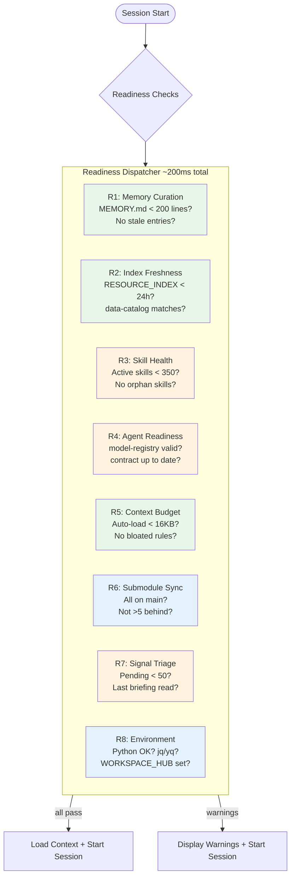
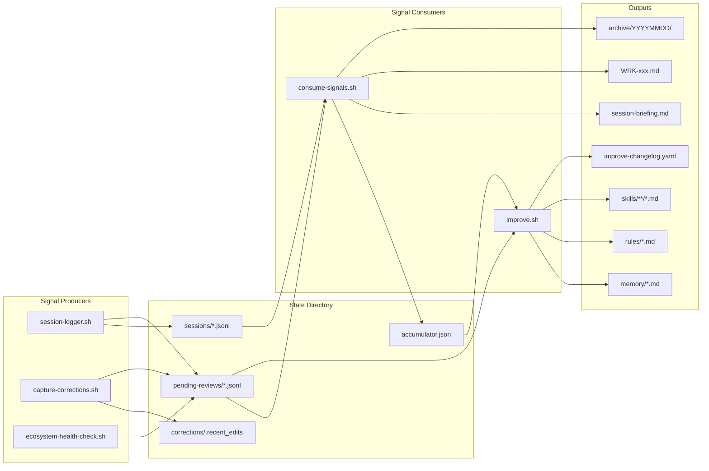
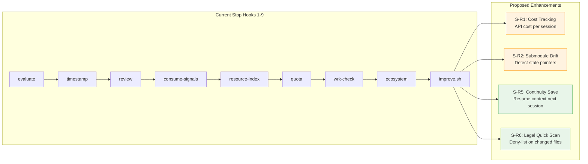
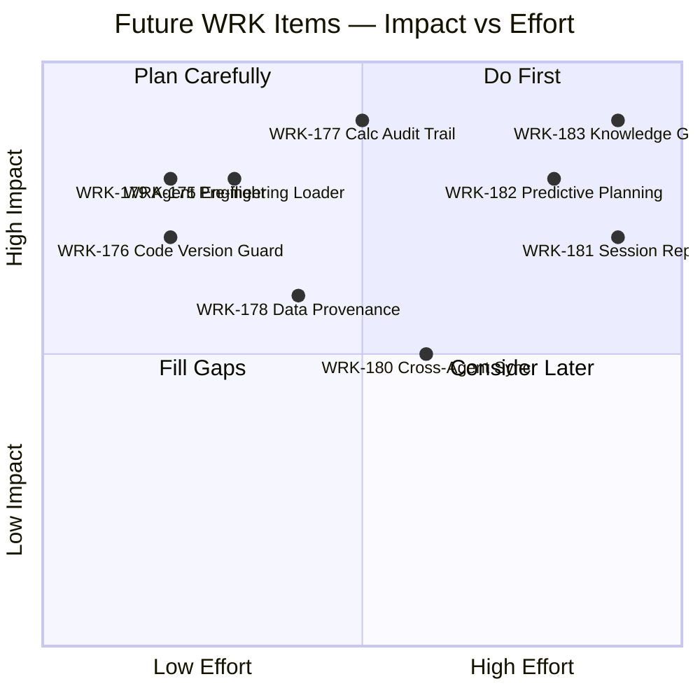

# Session Lifecycle Schematic

> Visual representation of the complete Claude Code session pipeline.

## Session Start Readiness (Proposed)



> **Color key**: Green = High priority, Orange = Medium, Blue = Low

## ASCII Schematic

```
Session Start
  │
  ├── [PROPOSED] Readiness Checks (~200ms)
  │   ├── R1: Memory curation (MEMORY.md < 200 lines)
  │   ├── R2: Index freshness (RESOURCE_INDEX < 24h)
  │   ├── R3: Skill health (active < 350, no orphans)
  │   ├── R4: Agent readiness (model-registry valid)
  │   ├── R5: Context budget audit (auto-load < 16KB)
  │   ├── R6: Submodule sync (all on main, not behind)
  │   ├── R7: Pending signal triage (< 50 queued)
  │   └── R8: Environment validation (python, jq, yq)
  │
  ├── Load: CLAUDE.md, rules/, memory/MEMORY.md
  ├── Init: statusline-command.sh
  │
  ▼
┌─────────────────────────────────────────────────────┐
│  ACTIVE SESSION                                     │
│                                                     │
│  ┌── PreToolUse (before EVERY tool call) ──────┐    │
│  │  1. session-logger.sh pre          (<5ms)   │    │
│  │  2. propagate-ecosystem-check.sh   (<10ms)  │    │
│  │  3. edit-notification [Write/Edit] (<1ms)   │    │
│  └─────────────────────────────────────────────┘    │
│                    │                                │
│              [Tool Executes]                        │
│                    │                                │
│  ┌── PostToolUse (after EVERY tool call) ──────┐    │
│  │  1. session-logger.sh post         (<5ms)   │    │
│  │  2. save-notification [Write/Edit] (<1ms)   │    │
│  │  3. capture-corrections.sh [W/E]   (<50ms)  │    │
│  └─────────────────────────────────────────────┘    │
│                    │                                │
│  ┌── PreCompact (on context compression) ──────┐    │
│  │  1. pre-compact-save.sh                     │    │
│  │  2. delegation reminder [manual]            │    │
│  │  3. auto-compact tips [auto]                │    │
│  └─────────────────────────────────────────────┘    │
│                                                     │
│  Signal Accumulation (continuous):                  │
│    state/sessions/*.jsonl        (tool logs)        │
│    state/corrections/.recent_edits (edit chains)    │
│    state/pending-reviews/*.jsonl (insights/errors)  │
└─────────────────────────────────────────────────────┘
  │
  ▼  /exit OR Ctrl+C OR timeout
┌─────────────────────────────────────────────────────┐
│  STOP HOOKS (sequential, ~45-75s total)             │
│                                                     │
│  1. session-end-evaluate.sh        (~2s)            │
│     └─→ state/sessions/ (delegation scores)         │
│  2. session timestamp              (<1ms)           │
│     └─→ terminal output                             │
│  3. post-task-review.sh            (~1s)            │
│     └─→ terminal output (learning checklist)        │
│  4. consume-signals.sh             (~3s)            │
│     ├─→ accumulator.json (cross-session totals)     │
│     ├─→ session-briefing.md (summary)               │
│     ├─→ pending-insights.md (append)                │
│     ├─→ WRK-xxx.md (if new files created)           │
│     └─→ archive/YYYYMMDD/ (processed signals)       │
│  5. generate-resource-index.sh     (~2s)            │
│     └─→ RESOURCE_INDEX.md                           │
│  6. query-quota.sh                 (~5s)            │
│     └─→ agent-quota-latest.json + usage log         │
│  7. wrk-traceability-check.sh      (<1s)            │
│     └─→ terminal warning (if no WRK touched)        │
│  8. ecosystem-health-check.sh      (~1s)            │
│     └─→ pending-reviews/ecosystem-review.jsonl      │
│  9. improve.sh                     (~30-60s)        │
│     ├── Phase 1: COLLECT (shell)                    │
│     │   └─→ merged signals from pending-reviews/    │
│     ├── Phase 2: CLASSIFY (API call)                │
│     │   └─→ improvement targets + routing           │
│     ├── Phase 3: ECOSYSTEM REVIEW (hybrid)          │
│     │   └─→ health metrics + recommendations        │
│     ├── Phase 4: GUARD (shell)                      │
│     │   └─→ size/dedup/no-clobber validation        │
│     ├── Phase 5: APPLY (API + write)                │
│     │   └─→ writes to memory/, rules/, skills/      │
│     ├── Phase 6: LOG (shell)                        │
│     │   └─→ state/improve-changelog.yaml            │
│     └── Phase 7: CLEANUP (shell)                    │
│         └─→ archive signals, truncate pending       │
└─────────────────────────────────────────────────────┘
  │
  ▼
Session End
  Outputs:
  ├── state/improve-changelog.yaml (updated)
  ├── state/session-briefing.md (generated)
  ├── state/archive/YYYYMMDD/ (archived signals)
  ├── RESOURCE_INDEX.md (refreshed)
  └── agent-quota-latest.json (snapshot)
```

## Mermaid Diagram

```mermaid
flowchart TD
    START([Session Start]) --> LOAD[Load CLAUDE.md + rules/ + memory/]
    LOAD --> STATUS[Init statusline-command.sh]
    STATUS --> SESSION

    subgraph SESSION [Active Session]
        direction TB
        PRE[PreToolUse<br/>1. session-logger pre<br/>2. ecosystem-check<br/>3. edit notification]
        TOOL[Tool Executes]
        POST[PostToolUse<br/>1. session-logger post<br/>2. save notification<br/>3. capture-corrections]
        COMPACT[PreCompact<br/>1. pre-compact-save<br/>2. delegation reminder<br/>3. auto-compact tips]

        PRE --> TOOL --> POST
        POST -.-> |on compaction| COMPACT
    end

    SESSION --> |/exit or Ctrl+C or timeout| STOP

    subgraph STOP [Stop Hooks - Sequential]
        direction TB
        S1[1. session-end-evaluate ~2s]
        S2[2. timestamp marker]
        S3[3. post-task-review ~1s]
        S4[4. consume-signals ~3s]
        S5[5. generate-resource-index ~2s]
        S6[6. query-quota ~5s]
        S7[7. wrk-traceability-check]
        S8[8. ecosystem-health-check ~1s]
        S9[9. improve.sh ~30-60s]

        S1 --> S2 --> S3 --> S4 --> S5 --> S6 --> S7 --> S8 --> S9
    end

    subgraph IMPROVE [improve.sh Phases]
        direction TB
        P1[Phase 1: COLLECT<br/>Shell - merge JSONL]
        P2[Phase 2: CLASSIFY<br/>API - route improvements]
        P3[Phase 3: ECOSYSTEM<br/>Hybrid - health review]
        P4[Phase 4: GUARD<br/>Shell - safety checks]
        P5[Phase 5: APPLY<br/>API+Shell - write files]
        P6[Phase 6: LOG<br/>Shell - changelog]
        P7[Phase 7: CLEANUP<br/>Shell - archive signals]

        P1 --> P2 --> P3 --> P4 --> P5 --> P6 --> P7
    end

    S9 --> IMPROVE
    STOP --> END([Session End])
```



## Signal Data Flow



## Timing Budget

| Phase | Typical | Worst Case | Notes |
|-------|---------|------------|-------|
| Stop hooks 1-3 | ~3s | ~5s | Pure shell, fast |
| consume-signals (#4) | ~3s | ~8s | Depends on signal volume |
| generate-resource-index (#5) | ~2s | ~4s | Filesystem scan |
| query-quota (#6) | ~5s | ~15s | Network call to Anthropic API |
| hooks 7-8 | ~2s | ~3s | Pure shell |
| improve.sh (#9) | ~30s | ~60s | 2-3 API calls dominate |
| **Total** | **~45s** | **~95s** | API latency is variable |

## Quick vs Full Mode

| Mode | Trigger | Phases Run | Time |
|------|---------|------------|------|
| Full | `/exit` | All 7 phases | ~30-60s |
| Quick (`--quick`) | Ctrl+C / `--quick` flag | Phases 1, 4, 6, 7 only (shell-only) | ~2-3s |
| Dry run (`--dry-run`) | Manual testing | All phases, no writes | ~30-60s |

## Stop Hook Enhancement Roadmap



---

## Future Work Items — SME Discussion Topics

These are potential WRK items spun off from this session's lifecycle analysis. Each requires SME input (naval architects, structural engineers, domain visionaries) to validate scope and priority.

### Engineering Workflow Integration

| WRK | Title | SME Domain | Description |
|-----|-------|-----------|-------------|
| **WRK-175** | Session Start: Engineering Context Loader | Naval Architecture | Auto-detect active engineering domain from WRK item tags (mooring, fatigue, riser, hull). Pre-load relevant skill catalog subset + domain-specific memory. Avoids loading 350+ skills when only ~20 are relevant to hull form analysis. |
| **WRK-176** | Session Start: Design Code Version Guard | Structural Engineering | On session start, verify design code editions in use (DNV-ST-F101 2021, API RP 2RD) match latest published. Alert if a code has been superseded since last session — critical for wall thickness and fatigue calculations. |
| **WRK-177** | Stop Hook: Engineering Calculation Audit Trail | Naval Architecture / Structural | After sessions involving `wall_thickness`, `fatigue`, or `metocean` modules, auto-generate a calculation audit summary: inputs, code used, edition, key results, warnings. Append to `state/engineering-audit/`. Required for project documentation and class society submissions. |
| **WRK-178** | Stop Hook: Data Provenance Snapshot | Data Engineering | At session end, snapshot which BSEE/metocean/cost data files were accessed (from session logs). Record data vintage, LFS status (stub vs materialized), and any transformations applied. Critical for reproducibility in engineering reports. |

### Multi-Agent Orchestration Improvements

| WRK | Title | SME Domain | Description |
|-----|-------|-----------|-------------|
| **WRK-179** | Start Hook: Agent Capacity Pre-flight | AI Operations | Before starting work, check all three providers (Claude/Codex/Gemini) quota status. If primary provider is >90% weekly utilization, suggest task routing to alternative provider. Prevents mid-session quota exhaustion. |
| **WRK-180** | Stop Hook: Cross-Agent Learning Sync | AI Operations | After multi-agent sessions (e.g., Codex did testing, Claude did architecture), consolidate learnings from all providers into a unified session summary. Currently each agent's insights are siloed. |

### Visionary / Long-term

| WRK | Title | SME Domain | Description |
|-----|-------|-----------|-------------|
| **WRK-181** | Session Replay & Time Travel | Platform Architecture | Record enough session state (tool calls, file diffs, WRK progress) to replay a session from any checkpoint. Enables: (a) debugging agent behavior, (b) "what if" exploration from mid-session, (c) training data for agent improvement. |
| **WRK-182** | Predictive Session Planning | AI/Engineering | Based on WRK item complexity, historical session durations, and available quota, predict optimal session plan: which phases to tackle, which agents to use, estimated completion probability. Surface as "Today's recommended plan" at session start. |
| **WRK-183** | Domain Knowledge Graph | Naval Architecture / Structural / Metocean | Build a knowledge graph linking engineering concepts (hull form → displacement → stability → mooring loads → fatigue). Use graph to auto-suggest relevant skills and memory when entering a domain area. Currently skill discovery is flat text search. |

### Implementation Priority Matrix



**Recommended discussion order with SMEs:**
1. **WRK-176 + WRK-177** — Structural engineers: code edition guard + calculation audit (direct safety impact)
2. **WRK-175 + WRK-183** — Naval architects: domain context loading + knowledge graph (workflow efficiency)
3. **WRK-178** — Data engineers: provenance tracking (reproducibility for class submissions)
4. **WRK-179** — AI operations: quota pre-flight (operational reliability)
5. **WRK-182** — Visionaries: predictive session planning (long-term competitive advantage)
