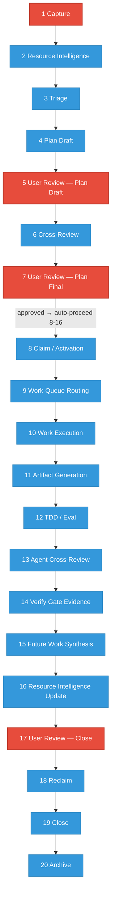

# WRK Lifecycle Stages — Visual Reference

## Stage Flow (Mermaid)

## Legend

| Color | Meaning |
|-------|---------|
| Red | **Hard gate** — agent MUST stop and wait for explicit user approval |
| Blue | Auto-proceed — agent continues without asking |

## Gate Details

| Hard Gate | Exit Artifact | Rule |
|-----------|--------------|------|
| Stage 1 | `user-review-capture.yaml` (`scope_approved: true`) | R-25 |
| Stage 5 | `user-review-plan-draft.yaml` | R-25 |
| Stage 7 | `plan-final-review.yaml` (`confirmed_by` human) | R-25 |
| Stage 17 | `user-review-close.yaml` | R-25 |

## Conditional Pause (R-27)

Any auto-proceed stage pauses if: P1 finding, scope change, or irreversible risk.

## Route Variants

- **Route A**: lighter execution (stages 10-12), one cross-review pass
- **Route B**: standard execution, multi-provider cross-review
- **Route C**: deeper execution/testing, stricter cross-review finding closure

All routes share the same 20-stage structure.

## Source Skills

- [`work-queue-workflow/SKILL.md`](../../skills/workspace-hub/work-queue-workflow/SKILL.md)
- [`workflow-gatepass/SKILL.md`](../../skills/workspace-hub/workflow-gatepass/SKILL.md)
