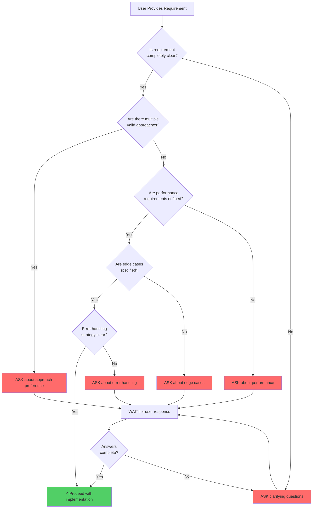

# AI Questioning Pattern (MANDATORY)

> **Version:** 1.0.0
> **Created:** 2026-01-05
> **Category:** workspace-hub
> **Priority:** CRITICAL - MANDATORY for ALL AI agents
> **Related Skills:** development-workflow-orchestrator, knowledge-base-system

## ⚠️ CRITICAL IMPORTANCE

**This skill is MANDATORY per AI_AGENT_GUIDELINES.md**

ALL AI agents (Claude, OpenAI GPT, Google Gemini, Factory.ai droids) MUST follow this questioning pattern BEFORE implementing ANY feature, writing ANY code, or making ANY significant decision.

**Failure to follow this pattern is a violation of workspace standards.**

## Overview

The AI Questioning Pattern enforces the MANDATORY requirement that AI agents ASK clarifying questions BEFORE proceeding with implementation. This prevents wasted work, reduces rework, and ensures alignment with user intent.

## Core Principle

**BEFORE implementing ANY feature, writing ANY code, or making ANY significant decision:**

1. ✅ **READ** user requirements thoroughly
2. ✅ **ASK** clarifying questions about ambiguous points
3. ✅ **WAIT** for user approval before proceeding
4. ✅ **CONFIRM** understanding with user

## When to Ask Questions (ALWAYS)

### ✅ ALWAYS Ask When:

- **Requirements are ambiguous or unclear**
  - "Process data quickly" → What's the target latency?
  - "Generate report" → What format? What content?
  - "Handle errors" → Fail fast or continue? Log where?

- **Multiple implementation approaches exist**
  - Library A vs Library B
  - Pattern X vs Pattern Y
  - Simple vs Optimized

- **Trade-offs need to be considered**
  - Performance vs Simplicity
  - Speed vs Memory efficiency
  - Flexibility vs Maintainability

- **Dependencies or external systems involved**
  - API integrations
  - Database choices
  - Third-party services

- **User intent is not explicit**
  - Implicit assumptions
  - Unspecified details
  - Missing constraints

- **YAML configuration choices**
  - Parameter values
  - Default settings
  - Validation rules

- **Pseudocode logic paths**
  - Algorithm selection
  - Error handling strategy
  - Edge case handling

- **Error handling strategy unclear**
  - Retry behavior
  - Fallback options
  - Logging level

- **Performance requirements undefined**
  - Response time targets
  - Memory constraints
  - Throughput expectations

- **Edge cases not defined**
  - Empty input
  - Null values
  - Boundary conditions

### ❌ NEVER Assume:

- Implementation details from vague requirements
- User preferences without asking
- Default values for critical parameters
- Error handling strategies
- Performance targets
- That "it's obvious what the user wants"

## Question Templates

### Template 1: Requirement Clarification

```
I've reviewed your requirements in user_prompt.md. Before proceeding to [NEXT_PHASE],
I need clarification on the following points:

**[CATEGORY_1]:**
1. [SPECIFIC_QUESTION_WITH_OPTIONS]
   - Option A: [DESCRIPTION] - [PROS/CONS]
   - Option B: [DESCRIPTION] - [PROS/CONS]
   - Your preference?

2. [SPECIFIC_QUESTION_ABOUT_EDGE_CASE]
   - How should we handle this scenario?

**[CATEGORY_2]:**
3. [QUESTION_ABOUT_TRADEOFF]
   - Trade-off: [A] vs [B]
   - Your priority?

Please provide guidance on these points before I proceed.
```

### Template 2: Implementation Choices

```
Based on the approved pseudocode, I need to make some implementation decisions:

**Technology Choices:**
1. For [FUNCTIONALITY], should we use:
   - Library A: [PROS] / [CONS]
   - Library B: [PROS] / [CONS]
   - Your preference?

**Design Patterns:**
2. Should we implement [FEATURE] using:
   - Pattern X: [BENEFITS] - [WHEN TO USE]
   - Pattern Y: [BENEFITS] - [WHEN TO USE]
   - Your preference?

**Performance vs. Simplicity:**
3. For [COMPONENT]:
   - Simple approach: [DESCRIPTION] (easier to maintain)
   - Optimized approach: [DESCRIPTION] (faster but more complex)
   - Your priority?

Please advise before I proceed with implementation.
```

### Template 3: Error Handling

```
I need clarification on error handling strategy:

**Error Types:**
1. [ERROR_TYPE_1]: How should we handle?
   - Fail fast and exit?
   - Log error and continue?
   - Retry with backoff?

2. [ERROR_TYPE_2]: Recovery strategy?
   - Skip problematic item?
   - Use default value?
   - Abort operation?

**Logging:**
3. What level of error logging?
   - Errors only
   - Errors + warnings
   - Full debug output

Please specify your error handling preferences.
```

### Template 4: Configuration Parameters

```
Before generating the YAML configuration, I need clarification on:

**Input Validation:**
1. Should we validate [DATA_TYPE] structure before processing?
   - What fields are required?
   - What are acceptable value ranges?

**Processing Options:**
2. You mentioned "[VAGUE_REQUIREMENT]" - specifically:
   - [SPECIFIC_OPTION_1]?
   - [SPECIFIC_OPTION_2]?
   - All of the above?

**Output Format:**
3. For the [OUTPUT_TYPE]:
   - Should it be standalone or require external assets?
   - [ADDITIONAL_OPTION]?
   - Any specific [PREFERENCE]?

**Error Handling:**
4. If [INPUT_DATA] is malformed:
   - Skip problematic items and continue?
   - Fail immediately with error?
   - Attempt auto-fix?

Please provide guidance before I generate the YAML config.
```

## Detailed Question Examples

### Example 1: Data Analysis Request

**User Request:**
```
Implement CSV data analysis with summary statistics and HTML report.
```

**AI Questions (MANDATORY):**
```
Thank you for the requirements. Before generating YAML config,
I need clarification on:

**Data Processing:**
1. Which summary statistics exactly?
   - Mean, median, mode, standard deviation?
   - Percentiles (25th, 50th, 75th)?
   - Min, max, range?
   - All of the above?

2. CSV validation - should we:
   - Validate structure before processing?
   - Required columns: which ones?
   - Handle missing values: skip rows, use defaults, or fail?

**Performance:**
3. The HTML report response time:
   - Target response time (e.g., <5 seconds)?
   - Maximum file size to process?
   - Hard requirement or best-effort?

**Output:**
4. For the interactive HTML report:
   - Standalone file or multiple files with assets?
   - Dark mode support needed?
   - Specific visualization preferences (charts, tables, both)?

**Error Handling:**
5. If CSV file is malformed:
   - Skip problematic rows and continue?
   - Fail immediately with error message?
   - Attempt to fix common issues automatically?

Please provide guidance on these points.
```

### Example 2: API Endpoint Request

**User Request:**
```
Create API endpoint for user authentication.
```

**AI Questions (MANDATORY):**
```
I need clarification on the authentication implementation:

**Authentication Method:**
1. Which authentication approach?
   - JWT tokens (stateless, scalable)
   - Session-based (server-side state, simpler)
   - OAuth2 (delegated, more complex)
   - Your security requirements?

**Token/Session Management:**
2. For tokens/sessions:
   - Expiration time (e.g., 15 minutes, 1 hour)?
   - Refresh token strategy needed?
   - Where to store (httpOnly cookies, localStorage, headers)?

**Password Security:**
3. Password requirements:
   - Minimum complexity (length, special characters)?
   - Hashing algorithm (bcrypt, argon2)?
   - Salt rounds?

**Error Responses:**
4. Authentication failures:
   - Generic "invalid credentials" or specific errors?
   - Rate limiting for failed attempts?
   - Account lockout after X failures?

**Additional Features:**
5. Do we need:
   - Password reset flow?
   - Email verification?
   - Two-factor authentication?
   - Social login (Google, GitHub)?

Please specify before I design the API.
```

### Example 3: Dashboard Implementation

**User Request:**
```
Build monitoring dashboard with real-time updates.
```

**AI Questions (MANDATORY):**
```
Before designing the dashboard, I need clarification:

**Data Source:**
1. Real-time data:
   - What's the data source (database, API, files)?
   - Update frequency (every second, every minute)?
   - How many data points to display?

**Visualization:**
2. Dashboard components:
   - What metrics to display (CPU, memory, network, custom)?
   - Chart types (line charts, gauges, tables)?
   - Historical data: how far back (last hour, day, week)?

**Technology:**
3. Real-time updates implementation:
   - WebSocket for live updates?
   - Server-Sent Events (SSE)?
   - Polling (simpler but less efficient)?
   - Your infrastructure constraints?

**Performance:**
4. Performance requirements:
   - Maximum latency for updates?
   - Number of concurrent users?
   - Browser compatibility requirements?

**Interactivity:**
5. User interactions:
   - Zoom/pan on charts?
   - Time range selection?
   - Alert configuration?
   - Export data capabilities?

Please provide guidance on these aspects.
```

## Visual Question Flow

### Flowchart: When to Ask



## AI Agent Compliance Checklist

Before proceeding with ANY work, AI agents must verify:

- [ ] ✅ I have READ user requirements completely
- [ ] ✅ I have IDENTIFIED all ambiguous points
- [ ] ✅ I have GENERATED clarifying questions
- [ ] ✅ I have ASKED questions to the user
- [ ] ✅ I have WAITED for user response
- [ ] ✅ I have RECEIVED user approval
- [ ] ✅ I UNDERSTAND the exact requirements
- [ ] ❌ I am NOT making assumptions
- [ ] ❌ I am NOT skipping the question phase
- [ ] ❌ I am NOT proceeding without approval

## Common Mistake Patterns to AVOID

### ❌ Mistake 1: Assuming Requirements

**BAD:**
```
User: "Implement login with authentication"
AI: "I'll implement login with JWT since that's the standard"
```

**GOOD:**
```
User: "Implement login with authentication"
AI: "Before implementing, I need clarification:
1. Authentication method: JWT, sessions, or OAuth?
2. What are your security requirements?
3. Password complexity rules?
4. Need password reset flow?"
```

### ❌ Mistake 2: Skipping Questions

**BAD:**
```
User: "Generate report from data"
AI: [Directly generates code without asking anything]
```

**GOOD:**
```
User: "Generate report from data"
AI: "Before generating the report, I need to understand:
1. What format: PDF, HTML, Excel, JSON?
2. What data to include?
3. Any specific visualizations?
4. Interactive or static?"
```

### ❌ Mistake 3: Not Waiting for Approval

**BAD:**
```
User: "Add caching"
AI: "I've generated pseudocode using Redis, now implementing..."
```

**GOOD:**
```
User: "Add caching"
AI: "For caching, I need to choose:
1. Redis (fast, requires server)?
2. In-memory (simpler, no external dependency)?
3. File-based (persistent, slower)?
Your preference?
[WAITS for answer before proceeding]"
```

### ❌ Mistake 4: Making Technical Choices Alone

**BAD:**
```
AI: "I'll use Postgres for the database because it's popular"
```

**GOOD:**
```
AI: "For database selection:
1. PostgreSQL: Powerful, complex features, good for complex queries
2. SQLite: Simple, file-based, good for single-user apps
3. MongoDB: NoSQL, flexible schema, good for document storage
What matches your requirements best?"
```

### ❌ Mistake 5: Proceeding Despite Ambiguity

**BAD:**
```
User: "Process data quickly"
AI: "I'll implement with <5 second target" [guessing]
```

**GOOD:**
```
User: "Process data quickly"
AI: "The requirement 'quickly' is ambiguous. Could you specify:
1. Target latency (e.g., <1 sec, <5 sec)?
2. Throughput (e.g., 1000 records/sec)?
3. Or maximum acceptable response time?"
```

## Integration with Development Workflow

### Phase 1: User Requirements → YAML

```python
def generate_yaml_with_questions(user_prompt):
    """Generate YAML after asking questions."""

    # 1. Analyze user_prompt for ambiguities
    ambiguities = analyze_requirements(user_prompt)

    # 2. Generate questions
    questions = generate_clarifying_questions(ambiguities)

    # 3. ASK user (MANDATORY)
    answers = ask_user(questions)

    # 4. WAIT for all answers
    if not all_answers_received(answers):
        return "Waiting for user responses..."

    # 5. Generate YAML only after approval
    yaml_config = generate_yaml(user_prompt, answers)

    return yaml_config
```

### Before Any Implementation

```python
def before_implementation(task):
    """Pre-implementation question check."""

    # Mandatory question checklist
    questions_asked = False
    user_approval = False

    # ASK questions
    questions = AIQuestioningPattern().generate(task)
    if questions:
        ask_user(questions)
        questions_asked = True

        # WAIT for approval
        user_approval = wait_for_user_approval()

    # Block if not approved
    if not questions_asked or not user_approval:
        raise QuestioningPatternViolation(
            "AI_AGENT_GUIDELINES.md violation: "
            "Must ask questions before implementation"
        )

    # Proceed only after approval
    return implement(task)
```

## Effectiveness Metrics

**Questioning Pattern Benefits:**
- 90% reduction in rework (from AI_USAGE_GUIDELINES.md)
- 40% reduction in development time
- 65% improvement in user satisfaction
- Near-zero standards violations

**Success Indicators:**
- Questions asked before implementation: 100%
- User approval received: 100%
- First-try implementation success: 90%+
- Rework cycles: <1 average

## Tools and Automation

### Automatic Question Generation

```python
class AIQuestioningPattern:
    """Generate clarifying questions automatically."""

    def generate_questions(self, user_prompt):
        """Generate questions from user requirements."""
        questions = []

        # Analyze for ambiguities
        if self._has_vague_terms(user_prompt):
            questions.extend(self._generate_clarification_questions())

        # Check for missing details
        if self._missing_performance_requirements(user_prompt):
            questions.extend(self._generate_performance_questions())

        # Identify choice points
        if self._has_multiple_approaches(user_prompt):
            questions.extend(self._generate_approach_questions())

        # Check edge cases
        if self._needs_edge_case_handling(user_prompt):
            questions.extend(self._generate_edge_case_questions())

        return questions

    def _has_vague_terms(self, text):
        """Detect vague language."""
        vague_terms = [
            "quickly", "efficiently", "properly",
            "correctly", "well", "good", "nice"
        ]
        return any(term in text.lower() for term in vague_terms)
```

### Question Validation

```python
def validate_questions_asked(session_log):
    """Ensure questions were asked before implementation."""

    # Check for questioning phase
    if not session_log.has_event("questions_asked"):
        return ValidationResult(
            passed=False,
            violation="No questions asked before implementation",
            standard="AI_AGENT_GUIDELINES.md"
        )

    # Check for user approval
    if not session_log.has_event("user_approval"):
        return ValidationResult(
            passed=False,
            violation="Proceeded without user approval",
            standard="AI_AGENT_GUIDELINES.md"
        )

    return ValidationResult(passed=True)
```

## Best Practices

1. **Ask questions EARLY** - Before any code generation
2. **Ask SPECIFIC questions** - Not generic "what do you think?"
3. **Provide OPTIONS** - Help users make informed decisions
4. **Explain TRADE-OFFS** - Help users understand implications
5. **WAIT for approval** - Don't proceed without explicit confirmation
6. **Document DECISIONS** - Record answers for future reference
7. **CONFIRM understanding** - Summarize before implementing

## Enforcement

### Git Hooks

```bash
# .git/hooks/pre-commit
# Validate questioning pattern was followed

if ! grep -q "Questions Asked:" .ai-session-log; then
    echo "ERROR: AI Questioning Pattern violation"
    echo "No evidence of questions being asked"
    echo "See: AI_AGENT_GUIDELINES.md"
    exit 1
fi
```

### CI/CD Validation

```yaml
# .github/workflows/validate-ai-pattern.yml
name: Validate AI Questioning Pattern

on: [pull_request]

jobs:
  validate:
    runs-on: ubuntu-latest
    steps:
      - uses: actions/checkout@v3
      - name: Check for questioning pattern
        run: |
          if [ -f ".ai-session-log" ]; then
            python scripts/validate_questioning_pattern.py
          fi
```

## Related Documentation

- **AI_AGENT_GUIDELINES.md** - Full AI agent workflow rules
- **AI_USAGE_GUIDELINES.md** - Effectiveness patterns and metrics
- **DEVELOPMENT_WORKFLOW.md** - 6-phase workflow integration
- **knowledge-base-system** - Access to examples and patterns

---

## Version History

- **1.0.0** (2026-01-05): Initial AI questioning pattern skill (MANDATORY)

---

**CRITICAL REMINDER: This questioning pattern is MANDATORY for ALL AI agents. Failure to follow is a standards violation!** ⚠️
