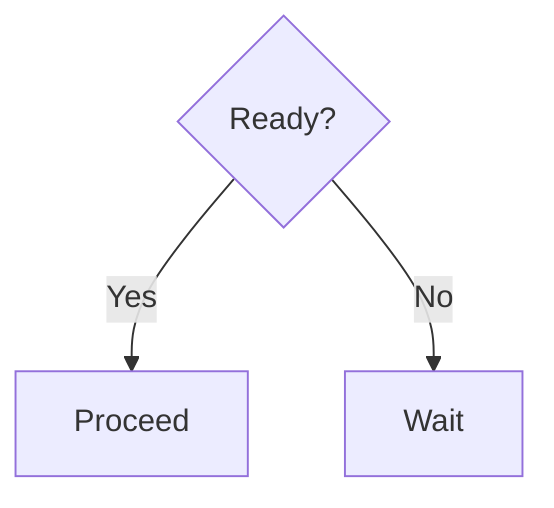
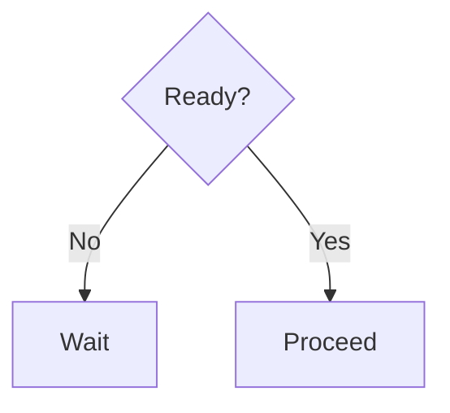
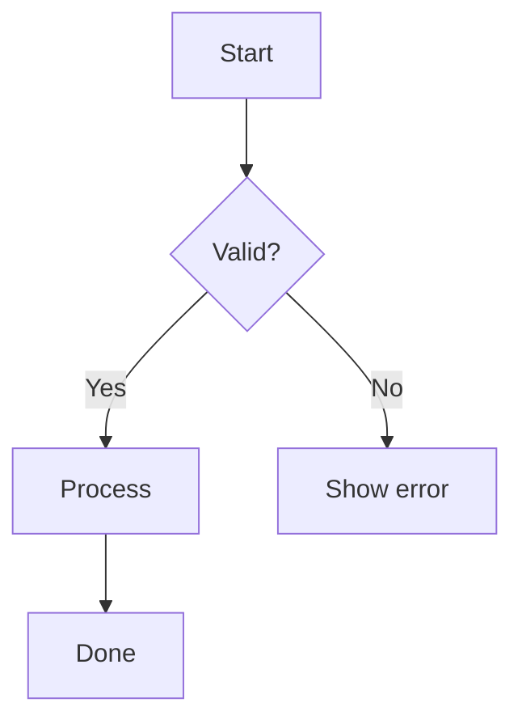

# Mermaid Diagram Conventions

## Decision Node Layout (Flowcharts)

When creating mermaid flowcharts with decision nodes (`{}`), follow these rules for edge ordering:

### Rule 1: Yes/positive path goes LEFT (list first)

The first edge from a decision node renders to the left in top-down (`TD`) flowcharts. Always list the positive/affirmative/happy-path edge first.

### Rule 2: Happy path stays in the main vertical flow

The positive/expected path should continue straight down the main trunk of the diagram. Error handling, fallbacks, and edge cases should branch off to the side.

### Rule 3: Negative/discouraging behavior appears later in hierarchy

Place blocking, error, and "don't do this" paths lower in the visual hierarchy:
- Positive outcomes are rendered first (visually prominent, left side)
- Negative outcomes are rendered second (visually subordinate, right side)
- Dead-ends and error states appear at the leaves, not near the root

### Rule 4: Edge ordering determines position

In mermaid, the order you list edges from a node controls layout:
- **First edge** → left (TD) or top (LR)
- **Second edge** → right (TD) or bottom (LR)

Use this to control which path gets visual prominence.

## Subgraph Ordering

List subgraphs in logical reading order:
1. Inputs/sources first (e.g., "Users", "Engineer Laptops")
2. Processing/infrastructure middle (e.g., "Network", "Servers")
3. Outputs/results last (e.g., "License Servers", "Results")

## Connection Styles

Use connection styles to convey meaning:
- `-->` solid arrow: active/primary connection
- `-.->` dotted arrow: blocked/inactive/secondary connection
- `-.-` dotted line (no arrow): association/relationship (not a flow)
- `---` solid line (no arrow): strong association

## PDF Rendering

When documents will be converted to PDF:
- Mermaid blocks render via mermaid.ink API as PNG images
- Keep diagrams simple enough to be readable at A4 scale
- Use `generate_pdfs.py` in the admin directory to regenerate PDFs after mermaid changes
- The script includes retry logic for mermaid.ink rate limits

## Checklist

Before committing a mermaid diagram:
- [ ] Yes/positive edges listed before No/negative edges at every decision node
- [ ] Happy path flows straight down the main trunk
- [ ] Error/blocking states branch to the side
- [ ] Subgraphs in logical reading order
- [ ] Connection styles match the relationship type
- [ ] Diagram readable at A4 print size
