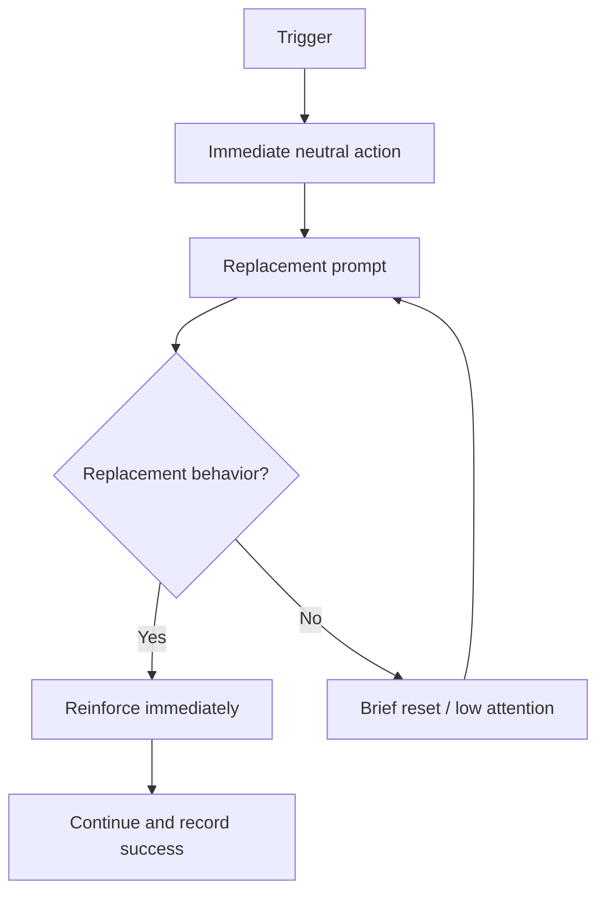

# Sanitized Process Flowchart Records

Use this reference when converting chat-derived operational guidance into a durable Mermaid record in a repo or wiki.

## When this applies

- The user asks to "save the data and flowcharts" or "maintain a good record."
- The source is a messaging conversation with potentially sensitive personal, family, health, client, or operational details.
- The deliverable is a Mermaid flowchart plus enough context for future readers to know what was captured and why.

## Record shape

Create a concise Markdown record with:

1. **Frontmatter**: posture/privacy, created date, updated date, and sanitized source label.
2. **Purpose statement**: one paragraph explaining what the flowchart standardizes.
3. **Record log**: date, topic, record type, and status.
4. **Mermaid diagrams**: one process per fenced `mermaid` block.
5. **Data-to-track table**: compact fields that let the user maintain records without preserving raw chat.
6. **Assumptions / sensitivity notes**: boundaries, escalation triggers, and what not to infer.
7. **Index link**: update the nearest README or navigation file so the artifact is discoverable.

## Sanitization rules

- Do not copy raw chat messages when a sanitized summary is enough.
- Avoid phone numbers, usernames, medical record details, client identifiers, and raw high-sensitivity facts.
- Prefer role-based labels such as `child`, `caregiver`, `therapist`, `adult`, `operator`, or `reviewer`.
- If the record concerns health, therapy, legal, tax, or safety decisions, include a non-substitution note and escalation caveat.

## Mermaid guidance

- Use one clear trigger node at the top.
- Keep the expected/reinforced behavior on the primary path.
- Put repeated/problem behavior behind a decision node and loop back to the replacement prompt.
- Label wait/step-back periods with exact durations only if the user provided them or they are operationally necessary.
- Use short node text; move nuance into bullets below the chart.

## Minimal template

```markdown
---
posture: private
created: YYYY-MM-DD
updated: YYYY-MM-DD
source: sanitized conversation summary
---

# <Process Family> Flowcharts

One-sentence purpose and non-substitution caveat if needed.

## Record Log

| Date | Topic | Record Type | Status |
|---|---|---|---|
| YYYY-MM-DD | <topic> | Mermaid flowchart | Drafted from sanitized discussion |

## <Flowchart Title>



## Data to Track

| Date | Setting | Trigger / Context | Replacement Prompt | Success Count | Notes |
|---|---|---|---|---:|---|
| YYYY-MM-DD |  |  |  | 0 |  |

## Assumptions & Sensitivity

- Keep this as process support, not diagnosis or professional advice.
- Escalate to the appropriate professional protocol if safety risk increases.
```
