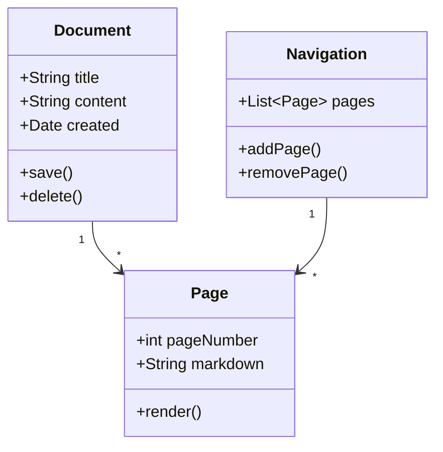

# Class Diagram

## Class Diagram

```mermaid
classDiagram
    class Document {
        +String title
        +String content
        +Date created
        +save()
        +delete()
    }
    class Page {
        +int pageNumber
        +String markdown
        +render()
    }
    class Navigation {
        +List~Page~ pages
        +addPage()
        +removePage()
    }
    Document "1" --> "*" Page
    Navigation "1" --> "*" Page
```
