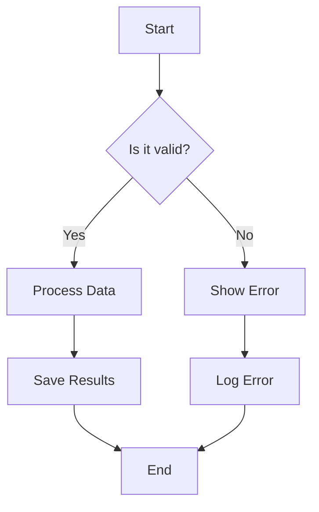

# Flowchart

## Flowchart

```mermaid
flowchart TD
    A[Start] --> B{Is it valid?}
    B -->|Yes| C[Process Data]
    B -->|No| D[Show Error]
    C --> E[Save Results]
    D --> F[Log Error]
    E --> G[End]
    F --> G
```
