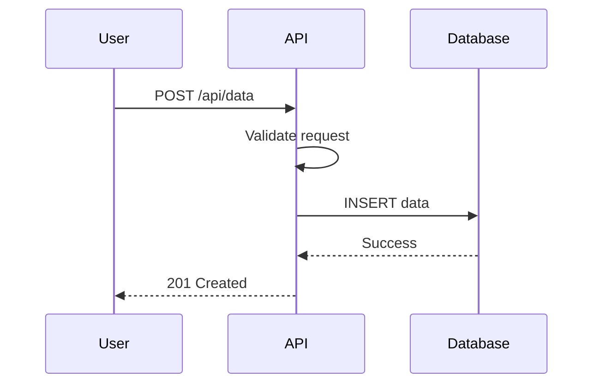

# Sequence Diagram

## Sequence Diagram

```mermaid
sequenceDiagram
    participant U as User
    participant A as API
    participant D as Database

    U->>A: POST /api/data
    A->>A: Validate request
    A->>D: INSERT data
    D-->>A: Success
    A-->>U: 201 Created
```
