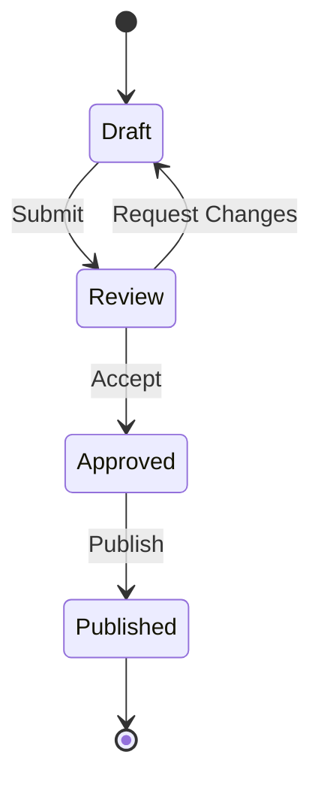

# State Diagram

## State Diagram

```mermaid
stateDiagram-v2
    [*] --> Draft
    Draft --> Review: Submit
    Review --> Approved: Accept
    Review --> Draft: Request Changes
    Approved --> Published: Publish
    Published --> [*]
```
