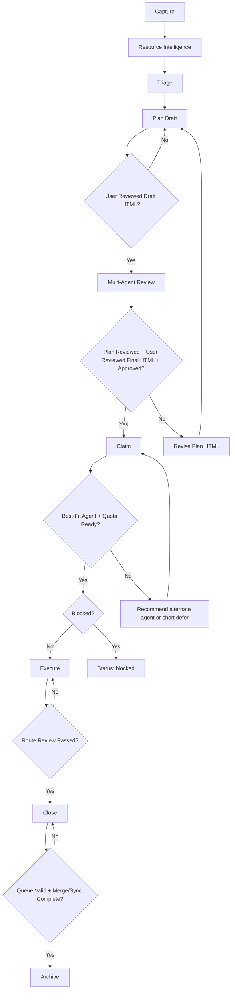

# Work Queue Skill

> Two-phase work queue system: **Capture** rapidly logs items, **Process** triages and delegates by complexity. Inspired by bladnman/do-work, adapted for multi-repo orchestration.

## Quick Start

```bash
# Initialize orchestrator for this session (session-started agent rule)
scripts/agents/session.sh init --provider claude

# Capture a work item
/work add Fix login redirect in aceengineer-website

# Process next item in queue
/work run

# List all pending items
/work list

# Check specific item
/work status WRK-001

# Queue health report
/work report
```

## Command Interface

| Command | Action | Description |
|---------|--------|-------------|
| `/work add <desc>` | Capture | Log one or more work items |
| `/work run` or `/work` | Process | Process next item in queue |
| `/work list` | Status | Read and display `.claude/work-queue/INDEX.md` |
| `/work status WRK-NNN` | Detail | Show specific item details |
| `/work prioritize` | Reorder | Interactive priority adjustment |
| `/work archive WRK-NNN` | Archive | Manually archive an item |
| `/work report` | Report | Queue health summary |

Smart routing: Action verbs (run, go, start) -> Process. Descriptive content -> Capture.

## Orchestration Wrappers (Required for /work run)

When `/work run` (or `/work`) enters processing, enforce wrappers in this order:

```bash
# 1) Orchestrator lock (once per session)
scripts/agents/session.sh init --provider <claude|codex|gemini>

# 2) Work orchestration handoff
scripts/agents/work.sh --provider <orchestrator> run

# 3) Plan gate for selected WRK item
scripts/agents/plan.sh --provider <orchestrator> WRK-NNN

# 4) Implementation stage (orchestrator and subagents)
scripts/agents/execute.sh --provider <orchestrator> WRK-NNN
scripts/agents/execute.sh --provider codex WRK-NNN
scripts/agents/execute.sh --provider gemini WRK-NNN

# 5) Review stage
scripts/agents/review.sh WRK-NNN --all-providers
```

Rules:
- Session-started provider is orchestrator for the session.
- Subagents cannot bypass plan gate or change orchestration state.
- Existing `.claude/work-queue/process.md` remains source of truth.

## Canonical Lifecycle



## Stage Contract

### 1. Capture
- Create WRK in `pending/`.
- Assign `orchestrator`, `provider`, `provider_alt`, and initial route.

### 2. Resource Intelligence
- Mandatory for every WRK before planning.
- Create modular artifact set in `assets/WRK-<id>/`.

### 3. Triage
- Minimum triage contract: `priority`, `complexity`, `route`, `computer`, `plan_workstations`, `execution_workstations`, `provider`, `orchestrator`.

### 4. Plan
- Route A/B: Inline. Route C: `specs/wrk/WRK-<id>/`.
- Must produce HTML review artifact.
- User reviews Draft HTML before multi-agent review.
- Multi-agent review (Claude, Codex, Gemini) for Route B/C.
- User reviews Final HTML and approves.

### 5. Claim
- Check unblocked and agent-capability.
- Quota check (`config/ai-tools/agent-quota-latest.json`).
- Write structured claim evidence.

### 6. Execute
- Implementation under claimed session.
- Define 5-10 real examples and variation tests.
- Generate HTML review artifact.

### 7. Close
- Script: `scripts/work-queue/close-item.sh WRK-NNN <commit-hash> [--commit]`
- Verify HTML output and record learning outputs.

### 8. Archive
- Script: `scripts/archive-item.sh WRK-NNN`
- Blocked until merge-to-main and sync complete.

## Complexity Routing

```
ALL routes: Triage -> Ensemble Gate (9 agents) -> Synthesis -> Plan Gate -> ...
Route A (Simple):  Implement -> Test -> Archive
Route B (Medium):  Explore -> Implement -> Test -> Archive
Route C (Complex): Explore -> Implement -> Test -> Review -> Archive
```

| Complexity | Criteria | Route |
|------------|----------|-------|
| Simple | Single config/value change, clear files, <50 words, 1 repo | A |
| Medium | Clear outcome, unknown files, 1-2 repos, 50-200 words | B |
| Complex | Architectural, 3+ repos, ambiguous scope, >200 words | C |

**All routes require a plan.** The plan depth scales with complexity (see Planning Requirement below).

## Cross-Review by Phase (Route B/C)

**Route B and C work items must be cross-reviewed after each implementation phase.** This catches issues early and prevents compounding errors across phases.

### Review Agents

All available AI agents must review. Minimum 3 reviewers:

| Agent | Method | Fallback |
|-------|--------|----------|
| Claude | Inline review by orchestrating agent | Always available |
| Codex CLI | `codex review --commit <sha>` or `scripts/review/submit-to-codex.sh --file <path>` | NO_OUTPUT acceptable |
| Gemini CLI | `scripts/review/submit-to-gemini.sh --file <path>` | NO_OUTPUT acceptable |

### Per-Phase Review Workflow

1. **Complete phase implementation** — all files created/modified, smoke tests pass
2. **Create review input** — write implementation summary to `scripts/review/results/wrk-NNN-phase-N-review-input.md`
3. **Submit to all agents in parallel** — Claude inline, Codex and Gemini via background Task agents
4. **Collect findings** — each agent returns a verdict (APPROVE / MINOR / MAJOR) and findings list
5. **Fix MAJOR findings** — address critical issues before proceeding to the next phase
6. **Accept or defer MINOR findings** — document rationale for deferred items
7. **Log results in spec** — update the Review Log table in the spec document with all verdicts and findings

### Review Log Format (in spec document)

```markdown
| Iter | Date | Reviewer | Verdict | Findings | Fixed |
|------|------|----------|---------|----------|-------|
| P1   | 2026-02-12 | Claude | MINOR | 4: description... | 4/4 |
| P1   | 2026-02-12 | Codex  | MAJOR | 6: description... | 4/6 |
| P1   | 2026-02-12 | Gemini | MAJOR | 9: description... | 4/9 |
```

### Route A Exception

Route A (simple) items do not require per-phase cross-review — a single post-implementation self-review is sufficient.

## Testing Tiers

When processing work items, use the appropriate test tier:

| Workflow | Script | When to Use |
|----------|--------|-------------|
| Pre-commit | `scripts/test/test-commit.sh` | After each commit — tests only changed files |
| Per-task | `scripts/test/test-task.sh <module>` | During implementation — tests the module being worked on |
| Full session | `scripts/test/test-session.sh` | Before push or session end — full regression |

The `--wrk WRK-NNN` flag on `test-task.sh` reads `target_repos` from the work item to auto-select modules.

## Planning Requirement

**Every work item must have an approved plan and HTML review before implementation begins.**

### Plan Depth and Gates

| Route | Plan Location | Plan Depth | Review |
|-------|--------------|------------|--------|
| A (Simple) | Inline (`## Plan`) | 3-5 bullet points | User Draft HTML -> User Final HTML |
| B (Standard) | Inline (`## Plan`) | Steps, paths, test strategy | User Draft HTML -> 3-Agent Review -> User Final HTML |
| C (Complex) | `specs/wrk/WRK-NNN/` | Full spec from template | User Draft HTML -> 3-Agent Review (per phase) -> User Final HTML |

### Plan Gate Workflow

1. **User Draft HTML Review**: Present draft plan HTML to user.
2. **Multi-Agent Review**: Submit to Claude, Codex, and Gemini for Route B/C.
3. **User Final HTML Review**: Present post-review plan HTML to user.
4. **User Approval**: Wait for explicit `plan_approved: true` after both HTML reviews.
5. **No implementation without approval**: Never begin coding until the plan is confirmed.

### Pre-Move-to-Working Checklist (HARD GATES — never skip)

Before setting `status: working` on any Route B/C item, verify ALL of the following:

| Gate | Field | Route | Rule |
|------|-------|-------|------|
| Plan approved | `plan_approved: true` | A/B/C | User must have explicitly said yes |
| Plan cross-reviewed | `plan_reviewed: true` | B/C | Set ONLY after Codex + Gemini verdict received — NOT at plan creation time |
| Spec exists | `spec_ref` non-empty | C | Spec must be in `specs/wrk/WRK-NNN/` before moving to working |
| Workstation assigned | `computer:` non-empty | A/B/C | Must be set at Capture; confirmed at Plan gate |
| Plan workstation access | `plan_workstations:` non-empty | A/B/C | Must list one or more allowed machines for plan stage |
| Execution workstation access | `execution_workstations:` non-empty | A/B/C | Must list one or more allowed machines for execution stage |

**Critical distinction:**
- `plan_approved` = user said "looks good, proceed"
- `plan_reviewed` = Codex and/or Gemini have reviewed the plan and returned a verdict

These are independent steps. Setting `plan_reviewed: true` at the same time as writing the plan is a workflow violation.

### Plan Content (Route A/B — Inline)

Add a `## Plan` section to the work item body:

```markdown
## Plan
- **Files**: `src/foo/bar.py` (edit), `tests/test_bar.py` (new)
- **Change**: Update the `process()` function to handle edge case X
- **Test**: Add unit test for edge case X, verify existing tests pass
- **Verify**: Run `pytest tests/test_bar.py -v`

*Approved by user: 2026-02-08*
```

### Plan Content (Route C — Spec File)

Create spec in `specs/wrk/WRK-NNN/plan.md` using existing plan templates. Link via `spec_ref` in frontmatter.

### Plan Naming Convention

**Plan documents must use descriptive, human-readable names** — not random codenames. The filename should make the plan's purpose immediately obvious for future retrieval.

Format: `wrk-NNN-<short-description>.md`

| Example | Good | Bad |
|---------|------|-----|
| Git cleanup plan | `wrk-098-git-history-cleanup.md` | `enumerated-conjuring-cake.md` |
| Benchmark plan | `wrk-031-diffraction-benchmark.md` | `mighty-gliding-lemur.md` |
| OrcaFlex converter | `wrk-064-orcaflex-format-converter.md` | `harmonic-knitting-gizmo.md` |

Rules:
- Prefix with `wrk-NNN-` to link back to the work item
- Use `kebab-case` for the description portion
- Keep the description to 3-5 words that capture the essence
- Existing randomly-named specs can be renamed incrementally as items are processed

### Compound Integration

Route C items with `compound: true` in frontmatter delegate to the compound engineering loop instead of the standard pipeline:

```
Route C (compound): /compound "<title>" → Plan → Work → Review → Compound → Archive
```

To create a compound work item:
```
/work add --compound "Add OAuth2 authentication to website"
```

This sets `compound: true` in the work item frontmatter, causing the process phase to delegate to `/compound` for the full 4-phase loop.

### Completion Checklist (Mandatory)

```markdown
## Completion Checklist
- [ ] Implementation committed: <hash>
- [ ] Tests pass: <command + output>
- [ ] 5-10 Examples defined: <path to example-pack.md>
- [ ] Variation tests passed: <path to variation-test-results.md>
- [ ] Cross-review passed: <synthesis result path>
- [ ] HTML review artifact verified: <path>
- [ ] WRK frontmatter updated: status=done, percent_complete=100, commit=<hash>
- [ ] Learning outputs captured: <path or WRK-ID>
- [ ] INDEX regenerated: python3 .claude/work-queue/scripts/generate-index.py
```

## Queue Directory Structure

### Master Queue (workspace-hub)
```
workspace-hub/.claude/work-queue/
  pending/          # Items awaiting processing
  working/          # Currently being processed (max 1-2)
  blocked/          # Awaiting dependencies
  archive/YYYY-MM/  # Completed items with audit trail
  assets/           # Screenshots, context files
  state.yaml        # Counters, stats, last processed
```

### Repo-Local Queue (each target repo)
```
<target-repo>/.claude/work-queue/
  pending/          # Items targeting this repo
  working/          # Currently being processed in this repo
  archive/YYYY-MM/  # Completed items
  state.yaml        # Repo-local counters
```

### Repo-Local Specs (all routes with external plans)
```
<target-repo>/specs/modules/<module>/
  plan.md           # Full plan synced from workspace-hub
```

**Source of truth**: workspace-hub is the master. Repo-local copies are synced mirrors for local visibility.

## Work Item Format

```yaml
---
id: WRK-001
title: Brief descriptive title
status: pending
priority: medium  # high | medium | low
complexity: simple  # simple | medium | complex
compound: false     # true = route via /compound instead of standard pipeline
created_at: 2026-01-28T10:00:00Z
target_repos:
  - aceengineer-website
commit:
spec_ref:
related: []
blocked_by: []
synced_to: []  # repos where this item has been mirrored
plan_ensemble: false   # true after 9-agent ensemble planning completes
ensemble_consensus_score: null # 0-100 score from synthesis
plan_reviewed: false   # true when plan has been cross-reviewed
plan_approved: false   # true when user has approved the plan
percent_complete: 0    # 0-100, auto-set to 100 on archive
brochure_status:       # pending | updated | synced | n/a
computer:              # ace-linux-1 | ace-linux-2 | acma-ansys05 | acma-ws014 | gali-linux-compute-1
plan_workstations:     # [ace-linux-1] or [ace-linux-1, acma-ansys05]
execution_workstations: # [ace-linux-1] or [acma-ansys05]
---

# Title

## What
[1-3 sentence description]

## Why
[Rationale]

## Acceptance Criteria
- [ ] Criterion 1
- [ ] Criterion 2

## Agentic AI Horizon

- Does this work boost agentic AI capability in this ecosystem?
- Will an agent handle this better in 3–4 months — if so: (a) wait, (b) invest differently now, (c) park it as a future WRK item to revisit in 1–2 months, or (d) do the groundwork now and park the rest for when capability catches up?
- How should this work be shaped to maximise future leverage, not just complete the task?

---
*Source: [verbatim original request]*
```

## Workstation Routing

Every WRK item **must** have a `computer:` field set at Capture time and confirmed at the Plan gate.
Every WRK item must also declare:
- `plan_workstations:` one or more machines allowed for planning work
- `execution_workstations:` one or more machines allowed for execution work

Both fields can contain multiple machines when cross-machine coordination is expected.
Reference: `.claude/skills/workspace-hub/workstations/SKILL.md`

### Quick Routing Table

| Keyword / Repo pattern | Machine |
|------------------------|---------|
| `orcaflex`, `ansys`, `aqwa`, `orcawave` | `acma-ansys05` |
| `openfoam`, `blender`, `gmsh`, `calculix`, `fenics`, `freecad`, `elmer` | `ace-linux-2` |
| `heavy-compute`, `cfd-hpc`, `fea-hpc`, `large-sim` | `gali-linux-compute-1` |
| `worldenergydata` repo | `ace-linux-1` |
| `workspace-hub`, hub docs, skills, queue meta | `ace-linux-1` |
| `digitalmodel`, `assetutilities`, `assethold`, `achantas-data` | `ace-linux-1` |
| `aceengineer-website`, `aceengineer-admin`, `aceengineer-strategy` | `ace-linux-1` |
| Windows-only tools (`solidworks`, `excel-macro`) | `acma-ws014` |
| Everything else | `ace-linux-1` |

### Bulk-assign script

To assign workstation fields to all active items lacking them (`computer`, `plan_workstations`, `execution_workstations`):
```bash
python3 scripts/work-queue/assign-workstations.py        # dry-run
python3 scripts/work-queue/assign-workstations.py --apply # write
```

## Multi-Repo Handling

- Each item has `target_repos` field listing affected repositories
- Pre-check via repo-readiness on each target repo before processing
- If repo has dirty state or failing tests -> item moves to `blocked/` with reason
- Route C items get cross-repo implementation sequence from Plan agent
- Commits per-repo with work item ID: `feat(work-queue): WRK-NNN - description`
- Workspace-hub submodule refs updated after all repos committed

## Repo-Local Sync

Work items and specs are **synced to target repos** for local visibility:

### On Capture
- Work item created in workspace-hub `pending/` (master)
- Copy synced to each `<target-repo>/.claude/work-queue/pending/`
- Work item `synced_to` field updated with repo list
- Repo-local `state.yaml` updated

### On Process (Route C — Plan Creation)
- Spec created in workspace-hub `specs/modules/<module>/plan.md`
- Spec also copied to `<target-repo>/specs/modules/<module>/plan.md`
- Both copies have `source_work_item: WRK-NNN` and cross-reference each other

### On Archive
- Workspace-hub master item archived to `archive/YYYY-MM/`
- Repo-local copy also moved to `<target-repo>/.claude/work-queue/archive/YYYY-MM/`

### On Status Change
- Any status change (pending → working → blocked → done) updates both master and repo-local copies

### Sync Direction
```
workspace-hub (master) ──sync──> target-repo (mirror)
       ↑                              │
       └──── status/commits ───────────┘
```

Workspace-hub is always the source of truth. If conflicts arise, master wins.

## Integration Points

| System | Integration |
|--------|-------------|
| claude-reflect | Checklist item: queue counts, stale item alerts (>7 days blocked) |
| skill-learner | Post-archive feedback: triage accuracy tracking |
| repo-readiness | Pre-check before processing each work item |
| specs/modules | All routes generate plans; Route C produces full spec files with bidirectional linking |
| aceengineer-website | Completion hook triggers brochure update + portfolio sync |

## Completion Hook — Marketing Brochure

When a work item is archived, the `on-complete-hook.sh` fires automatically:

1. **Reads target repos** from the archived work item
2. **Checks for existing brochures** at `<repo>/docs/marketing/*brochure*.md`
3. **Sets `brochure_status: pending`** on the work item
4. **Outputs recommended tasks**: update module brochure, sync to aceengineer-website

### Brochure Lifecycle

```
Work Item Completed → brochure_status: pending
  ↓
Module brochure updated with new capability → brochure_status: updated
  ↓
aceengineer-website portfolio synced → brochure_status: synced
```

### Brochure Status Values

| Status | Meaning |
|--------|---------|
| *(empty)* | Not yet evaluated |
| `pending` | Completion hook fired, brochure update needed |
| `updated` | Module brochure updated with this capability |
| `synced` | aceengineer-website portfolio reflects this capability |
| `n/a` | No marketing relevance (personal items, etc.) |

### Marketing Brochure Locations

Module brochures live at `<repo>/docs/marketing/` and are read by aceengineer-website to market capabilities. Each engineering module should have a brochure documenting its features, capabilities, and business value.

```
digitalmodel/docs/marketing/dynacard-ai-diagnostics-brochure.md
digitalmodel/docs/marketing/schematics/*.svg
aceengineer-website/docs/marketing/PORTFOLIO_CAPABILITIES.md
```

## Scripts

| Script | Purpose |
|--------|---------|
| `next-id.sh` | Scan queue dirs for max WRK-NNN, return next |
| `queue-status.sh` | Report counts per state |
| `archive-item.sh` | Move to `archive/YYYY-MM/` with metadata, runs completion hook |
| `on-complete-hook.sh` | Post-archive: check brochure status, set pending, recommend tasks |
| `queue-report.sh` | Generate summary for reflect integration |
| `generate-index.py` | Generate `INDEX.md` with multi-view lookup tables |

## Index Management

**INDEX.md is the source of truth for listing.** Never scan individual work item files for a list operation.

### `/work list` Behavior
1. Read `.claude/work-queue/INDEX.md`
2. For each WRK item in the relevant section, open the individual work item file and render it using the **Display Template** (see below)
3. If `--brief` flag is passed, output ID-only list (one per line, no file reads)
4. If INDEX.md is missing or empty, regenerate: `python3 .claude/work-queue/scripts/generate-index.py`

### Index Regeneration Triggers
After ANY mutation to work items, regenerate the index:
- `/work add` — after creating the new item file
- `/work archive` — after moving the item to archive/
- Status changes (pending → working, working → done, etc.)
- Priority or complexity changes

Regeneration command:
```
python3 .claude/work-queue/scripts/generate-index.py
```

This is fast (<2s for 100+ items) and ensures INDEX.md stays current.

## Archival Safety (Insights-Validated)

**Never archive or mark a work item as done until the user explicitly confirms completion.** This is the #1 friction point identified across 120 sessions.

- Always present a completion summary listing any remaining gaps before changing status
- Check all acceptance criteria are met — partial completion is NOT done
- Reports, documentation, and secondary deliverables count — don't archive when only code is done
- If uncertain, keep the item in `working/` and ask the user

## Error Handling

### Item Processing Failures
- 3 attempts before marking as failed
- Failed items stay in `working/` with `status: failed`
- Failure reason logged in frontmatter `failure_reason` field

### Blocked Items
- Auto-detect: dirty repo, failing tests, pending PR
- Moved to `blocked/` with `blocked_by` field
- Daily reflect checks for stale blocked items (>7 days)

### State Recovery
- `state.yaml` tracks counters and last processed
- Scripts are idempotent - safe to re-run
- Archive includes full audit trail

## Index Columns

The Master Table in INDEX.md includes these tracking columns:

| Column | Source | Auto-detected? |
|--------|--------|----------------|
| Ensemble?| `plan_ensemble` frontmatter | Yes |
| Plan? | `spec_ref` field or `## Plan` body section | Yes |
| Reviewed? | `plan_reviewed` frontmatter | No — set manually |
| Approved? | `plan_approved` frontmatter | No — set manually |
| % Done | `percent_complete` frontmatter (auto 100% on archive) | Partial |
| Brochure | `brochure_status` frontmatter | Set by completion hook |

## Display Template

When `/work list` or `/work status WRK-NNN` renders a work item, follow this template exactly.
Each item is rendered as a 4-line block. Do not add extra blank lines between fields.

### Output Format

```
WRK-NNN [PRIORITY] <title truncated to 80 chars>
  Goal: <first sentence of ## Goal, ## Context, or ## What — whichever exists first>
  Blockers: <blocked_by list, or "none">
  Recommended: <action derived from priority + blockers — see rules below>
```

### Field Extraction Rules

**ID and Priority** — read from frontmatter:
```yaml
id: WRK-NNN
priority: high  # high | medium | low  -> render as HIGH | MEDIUM | LOW
```

**Title** — read `title` from frontmatter; truncate at 80 characters with `…` if longer.

**Goal** — search body sections in priority order:
1. `## Goal` — use first sentence (up to first `.` or end of paragraph)
2. `## Context` — use first sentence
3. `## What` — use first sentence
4. Fallback: `(no summary)`

A "first sentence" ends at the first `.` character, or at 120 characters, whichever comes first.
Strip leading/trailing whitespace. Do not include the section heading.

**Blockers** — read `blocked_by` from frontmatter:
- Empty list `[]` or missing field → `none`
- Non-empty list → comma-separated IDs, e.g. `WRK-350, WRK-360`
- Also check item's current directory: if the file lives in `blocked/`, append ` — in blocked/`

**Recommended** — derive action from priority and blockers using this decision table:

| Priority | Blockers | Recommended text |
|----------|----------|-----------------|
| high | none | `implement next; tests first (TDD)` |
| high | present | `resolve blockers first: <ids>` |
| medium | none | `queue for implementation; TDD` |
| medium | present | `hold until blockers resolved: <ids>` |
| low | none | `low priority; implement when queue is clear` |
| low | present | `hold; blocked by <ids>` |

Override: if `percent_complete` > 0 and < 100, prepend `resume (${percent_complete}% done) — `.

### Example Output

```
WRK-123 [HIGH] feat(worldenergydata): add Arps decline curve API endpoint
  Goal: Expose decline curve forecasting via REST API for dashboard integration
  Blockers: none
  Recommended: implement next; tests first (TDD)

WRK-456 [LOW] chore: update assetutilities dependencies
  Goal: Bump pandas, numpy to latest compatible versions
  Blockers: WRK-350, WRK-360
  Recommended: hold; blocked by WRK-350, WRK-360
```

### Blank line between items

Separate consecutive item blocks with a single blank line. No blank line after the last item.

### `--brief` flag

When `--brief` is passed to `/work list`, skip Display Template rendering entirely.
Output one line per item: `WRK-NNN` (IDs only, sorted by priority then ID ascending).

### Performance

For lists of 50+ items, read files in batches of 10 and stream output as batches complete.
Target: under 2 seconds total for 50 items.

## Version History

- **1.5.0** (2026-02-24): Richer WRK item display template (WRK-390)
  - Display Template section: ID, priority, title (80-char), goal summary, blockers, recommended action
  - Goal extracted from first sentence of `## Goal`, `## Context`, or `## What`
  - Recommended action derived from priority + blocked_by decision table
  - `--brief` flag preserves ID-only output (backward compatible)
  - `/work list` behavior updated to render Display Template per item
- **1.4.0** (2026-02-12): Cross-review by phase, testing tiers
  - Route B/C items require per-phase cross-review by Claude, Codex, and Gemini
  - Review log format standardized in spec documents
  - Testing tier integration: `scripts/test/test-{commit,task,session}.sh`
  - `test-task.sh --wrk WRK-NNN` reads target repos from work item
- **1.3.0** (2026-02-09): Plan tracking, brochure lifecycle, completion hook
  - New INDEX.md columns: Plan?, Reviewed?, Approved?, % Done, Brochure
  - Auto-detect plan existence from `spec_ref` or `## Plan` body section
  - Completion hook (`on-complete-hook.sh`) fires on archive, sets `brochure_status: pending`
  - `archive-item.sh` script for full archive workflow with hook integration
  - Plan Tracking summary section in INDEX.md
  - aceengineer-website portfolio sync lifecycle
- **1.2.0** (2026-02-08): Mandatory planning for all routes
  - Plan gate required before implementation on ALL routes (A, B, C) — not just Route C
  - Plan depth scales by complexity: inline bullets (A), inline steps (B), full spec (C)
  - User must explicitly approve plan before implementation begins
  - Descriptive plan naming convention: `wrk-NNN-<short-description>.md` replaces random codenames
  - Existing random-named specs to be renamed incrementally
- **1.1.0** (2026-01-29): Repo-local sync
  - Work items synced to target repo `.claude/work-queue/`
  - Route C specs synced to target repo `specs/modules/`
  - Bidirectional status tracking (master → mirror)
  - `synced_to` frontmatter field added
- **1.0.0** (2026-01-28): Initial release
  - Two-phase capture/process system
  - Complexity routing (A/B/C)
  - Multi-repo coordination
  - Queue state management
  - Reflect integration
