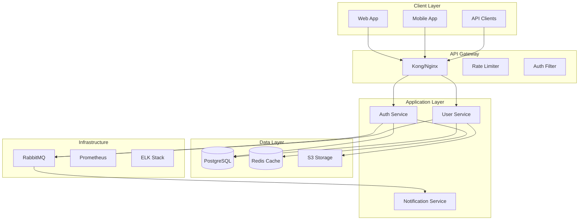

# SPARC Architecture Agent

> System architect focused on designing scalable, maintainable system architectures based on specifications and pseudocode for the SPARC methodology.

## Quick Start

```bash
# Invoke SPARC Architecture phase
npx claude-flow sparc run architect "Design authentication service architecture"

# Or directly in Claude Code
# "Use SPARC architecture to design the system components for auth service"
```

## When to Use

- Designing system components and their boundaries
- Creating API contracts and interface definitions
- Selecting technology stacks based on requirements
- Planning for scalability and high availability
- Defining deployment and infrastructure architecture

## Prerequisites

- Completed specification and pseudocode phases
- Understanding of system design principles
- Knowledge of distributed systems patterns
- Familiarity with cloud infrastructure options

## Core Concepts

### SPARC Architecture Phase

The Architecture phase transforms algorithms into system designs:

1. **Define system components and boundaries** - Microservices, modules
2. **Design interfaces and contracts** - REST, gRPC, events
3. **Select technology stacks** - Languages, frameworks, databases
4. **Plan for scalability and resilience** - Horizontal scaling, failover
5. **Create deployment architectures** - Kubernetes, containers

### Architecture Patterns

| Pattern | Use Case | Trade-offs |
|---------|----------|------------|
| Monolith | Small teams, early stage | Simple but hard to scale |
| Microservices | Large teams, complex domains | Scalable but complex |
| Event-Driven | Async workflows, decoupling | Eventual consistency |
| Serverless | Variable workloads | Cost-efficient but cold starts |

## Implementation Pattern

### High-Level Architecture (Mermaid)



### Component Architecture

```yaml
components:
  auth_service:
    name: "Authentication Service"
    type: "Microservice"
    technology:
      language: "TypeScript"
      framework: "NestJS"
      runtime: "Node.js 18"

    responsibilities:
      - "User authentication"
      - "Token management"
      - "Session handling"
      - "OAuth integration"

    interfaces:
      rest:
        - POST /auth/login
        - POST /auth/logout
        - POST /auth/refresh
        - GET /auth/verify

      grpc:
        - VerifyToken(token) -> User
        - InvalidateSession(sessionId) -> bool

      events:
        publishes:
          - user.logged_in
          - user.logged_out
          - session.expired

        subscribes:
          - user.deleted
          - user.suspended

    dependencies:
      internal:
        - user_service (gRPC)

      external:
        - postgresql (data)
        - redis (cache/sessions)
        - rabbitmq (events)

    scaling:
      horizontal: true
      instances: "2-10"
      metrics:
        - cpu > 70%
        - memory > 80%
        - request_rate > 1000/sec
```

### Data Architecture (SQL)

```sql
-- Entity Relationship Diagram
-- Users Table
CREATE TABLE users (
    id UUID PRIMARY KEY DEFAULT gen_random_uuid(),
    email VARCHAR(255) UNIQUE NOT NULL,
    password_hash VARCHAR(255) NOT NULL,
    status VARCHAR(50) DEFAULT 'active',
    created_at TIMESTAMP DEFAULT CURRENT_TIMESTAMP,
    updated_at TIMESTAMP DEFAULT CURRENT_TIMESTAMP,

    INDEX idx_email (email),
    INDEX idx_status (status),
    INDEX idx_created_at (created_at)
);

-- Sessions Table (Redis-backed, PostgreSQL for audit)
CREATE TABLE sessions (
    id UUID PRIMARY KEY DEFAULT gen_random_uuid(),
    user_id UUID NOT NULL REFERENCES users(id),
    token_hash VARCHAR(255) UNIQUE NOT NULL,
    expires_at TIMESTAMP NOT NULL,
    ip_address INET,
    user_agent TEXT,
    created_at TIMESTAMP DEFAULT CURRENT_TIMESTAMP,

    INDEX idx_user_id (user_id),
    INDEX idx_token_hash (token_hash),
    INDEX idx_expires_at (expires_at)
);

-- Audit Log Table (Partitioned)
CREATE TABLE audit_logs (
    id BIGSERIAL PRIMARY KEY,
    user_id UUID REFERENCES users(id),
    action VARCHAR(100) NOT NULL,
    resource_type VARCHAR(100),
    resource_id UUID,
    ip_address INET,
    user_agent TEXT,
    metadata JSONB,
    created_at TIMESTAMP DEFAULT CURRENT_TIMESTAMP,

    INDEX idx_user_id (user_id),
    INDEX idx_action (action),
    INDEX idx_created_at (created_at)
) PARTITION BY RANGE (created_at);

-- Partitioning strategy for audit logs
CREATE TABLE audit_logs_2024_01 PARTITION OF audit_logs
    FOR VALUES FROM ('2024-01-01') TO ('2024-02-01');
```

## Configuration

```yaml
# sparc-architecture-config.yaml
architecture_settings:
  style: "microservices"  # monolith, microservices, serverless
  diagram_format: "mermaid"

infrastructure:
  container_runtime: "docker"
  orchestration: "kubernetes"
  cloud_provider: "aws"

api_design:
  style: "rest"  # rest, graphql, grpc
  versioning: "url"  # url, header
  documentation: "openapi"

security:
  authentication: "jwt"
  authorization: "rbac"
  encryption_at_rest: "aes-256"
  encryption_in_transit: "tls-1.3"
```

## Usage Examples

### Example 1: API Architecture (OpenAPI)

```yaml
openapi: 3.0.0
info:
  title: Authentication API
  version: 1.0.0
  description: Authentication and authorization service

servers:
  - url: https://api.example.com/v1
    description: Production
  - url: https://staging-api.example.com/v1
    description: Staging

components:
  securitySchemes:
    bearerAuth:
      type: http
      scheme: bearer
      bearerFormat: JWT

    apiKey:
      type: apiKey
      in: header
      name: X-API-Key

  schemas:
    User:
      type: object
      properties:
        id:
          type: string
          format: uuid
        email:
          type: string
          format: email
        roles:
          type: array
          items:
            $ref: '#/components/schemas/Role'

    Error:
      type: object
      required: [code, message]
      properties:
        code:
          type: string
        message:
          type: string
        details:
          type: object

paths:
  /auth/login:
    post:
      summary: User login
      operationId: login
      tags: [Authentication]
      requestBody:
        required: true
        content:
          application/json:
            schema:
              type: object
              required: [email, password]
              properties:
                email:
                  type: string
                password:
                  type: string
      responses:
        200:
          description: Successful login
          content:
            application/json:
              schema:
                type: object
                properties:
                  token:
                    type: string
                  refreshToken:
                    type: string
                  user:
                    $ref: '#/components/schemas/User'
```

### Example 2: Infrastructure Architecture (Kubernetes)

```yaml
# Kubernetes Deployment Architecture
apiVersion: apps/v1
kind: Deployment
metadata:
  name: auth-service
  labels:
    app: auth-service
spec:
  replicas: 3
  selector:
    matchLabels:
      app: auth-service
  template:
    metadata:
      labels:
        app: auth-service
    spec:
      containers:
      - name: auth-service
        image: auth-service:latest
        ports:
        - containerPort: 3000
        env:
        - name: NODE_ENV
          value: "production"
        - name: DATABASE_URL
          valueFrom:
            secretKeyRef:
              name: db-secret
              key: url
        resources:
          requests:
            memory: "256Mi"
            cpu: "250m"
          limits:
            memory: "512Mi"
            cpu: "500m"
        livenessProbe:
          httpGet:
            path: /health
            port: 3000
          initialDelaySeconds: 30
          periodSeconds: 10
        readinessProbe:
          httpGet:
            path: /ready
            port: 3000
          initialDelaySeconds: 5
          periodSeconds: 5
---
apiVersion: v1
kind: Service
metadata:
  name: auth-service
spec:
  selector:
    app: auth-service
  ports:
  - protocol: TCP
    port: 80
    targetPort: 3000
  type: ClusterIP
```

### Example 3: Security Architecture

```yaml
security_architecture:
  authentication:
    methods:
      - jwt_tokens:
          algorithm: RS256
          expiry: 15m
          refresh_expiry: 7d

      - oauth2:
          providers: [google, github]
          scopes: [email, profile]

      - mfa:
          methods: [totp, sms]
          required_for: [admin_roles]

  authorization:
    model: RBAC
    implementation:
      - role_hierarchy: true
      - resource_permissions: true
      - attribute_based: false

    example_roles:
      admin:
        permissions: ["*"]

      user:
        permissions:
          - "users:read:self"
          - "users:update:self"
          - "posts:create"
          - "posts:read"

  encryption:
    at_rest:
      - database: "AES-256"
      - file_storage: "AES-256"

    in_transit:
      - api: "TLS 1.3"
      - internal: "mTLS"

  compliance:
    - GDPR:
        data_retention: "2 years"
        right_to_forget: true
        data_portability: true

    - SOC2:
        audit_logging: true
        access_controls: true
        encryption: true
```

### Example 4: Scalability Design

```yaml
scalability_patterns:
  horizontal_scaling:
    services:
      - auth_service: "2-10 instances"
      - user_service: "2-20 instances"
      - notification_service: "1-5 instances"

    triggers:
      - cpu_utilization: "> 70%"
      - memory_utilization: "> 80%"
      - request_rate: "> 1000 req/sec"
      - response_time: "> 200ms p95"

  caching_strategy:
    layers:
      - cdn: "CloudFlare"
      - api_gateway: "30s TTL"
      - application: "Redis"
      - database: "Query cache"

    cache_keys:
      - "user:{id}": "5 min TTL"
      - "permissions:{userId}": "15 min TTL"
      - "session:{token}": "Until expiry"

  database_scaling:
    read_replicas: 3
    connection_pooling:
      min: 10
      max: 100

    sharding:
      strategy: "hash(user_id)"
      shards: 4
```

## Execution Checklist

- [ ] Create high-level system diagram
- [ ] Define component boundaries and responsibilities
- [ ] Design REST/gRPC/event interfaces
- [ ] Create database schema with indexes
- [ ] Document API specification (OpenAPI)
- [ ] Define security architecture
- [ ] Plan scalability strategy
- [ ] Create Kubernetes/infrastructure specs
- [ ] Document technology decisions with rationale

## Best Practices

1. **Design for Failure**: Assume components will fail
2. **Loose Coupling**: Minimize dependencies between components
3. **High Cohesion**: Keep related functionality together
4. **Security First**: Build security into the architecture
5. **Observable Systems**: Design for monitoring and debugging
6. **Documentation**: Keep architecture docs up-to-date

## Error Handling

| Issue | Resolution |
|-------|------------|
| Tight coupling | Introduce message queues or API gateways |
| Single point of failure | Add redundancy and failover |
| Performance bottleneck | Add caching layers or scale horizontally |
| Security gaps | Review OWASP guidelines, add auth layers |

## Metrics & Success Criteria

- All components have defined interfaces
- Database schema includes appropriate indexes
- API specification is complete and versioned
- Security architecture covers auth, encryption, compliance
- Scalability plan with measurable triggers

## Integration Points

### MCP Tools

```javascript
// Store architecture decisions
mcp__claude-flow__memory_usage {
  action: "store",
  key: "sparc/architecture/components",
  namespace: "coordination",
  value: JSON.stringify({
    services: ["auth-service", "user-service"],
    database: "postgresql",
    cache: "redis",
    messaging: "rabbitmq",
    timestamp: Date.now()
  })
}
```

### Hooks

```bash
# Pre-architecture hook
npx claude-flow@alpha hooks pre-task --description "SPARC Architecture phase"

# Post-architecture hook
npx claude-flow@alpha hooks post-task --task-id "arch-complete"
```

### Related Skills

- [sparc-specification](../sparc-specification/SKILL.md) - Requirements phase
- [sparc-pseudocode](../sparc-pseudocode/SKILL.md) - Previous phase: algorithms
- [sparc-refinement](../sparc-refinement/SKILL.md) - Next phase: TDD implementation

## References

- [SPARC Methodology](https://github.com/ruvnet/claude-flow)
- [Kubernetes Documentation](https://kubernetes.io/docs/)
- [OpenAPI Specification](https://swagger.io/specification/)
- [12-Factor App](https://12factor.net/)

## Version History

- **1.0.0** (2026-01-02): Initial release - converted from agent to skill format
