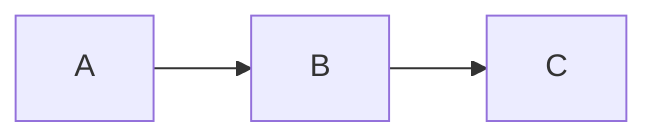

# llm-wiki page templates

Concrete templates for each page type. Drop into `wikis/<domain>/<type>/<slug>.md`
and fill in the bracketed fields. Length targets and required frontmatter are
enforced by `SKILL.md` rules 1 and 4.

---

## Concept page (`wikis/<domain>/concepts/<slug>.md`)

Length: 400–1200 words. Hard ceiling 1200 (split into folder if more).

```markdown
---
title: <Concept name>
type: concept
created: YYYY-MM-DD
updated: YYYY-MM-DD
sources: [<source-slug-1>, <source-slug-2>]
tags: [<domain-tag>, <subtopic-tag>]
---

# <Concept name>

<One-sentence definition or core idea.>

## What it is

<150–300 words. Assume technically-literate reader unfamiliar with this
specific topic.>

## How it works

<Mechanism / process / structure. Mermaid for any flow, sequence, hierarchy,
or state diagram. KaTeX for any formula.>



## Key properties / tradeoffs

<Bullet list or short paragraphs.>

## Relationship to other concepts

- [[<Related Concept A>]] — how they relate
- [[<Related Concept B>]] — contrast or connection

## Open questions

<What this wiki doesn't yet know. Drives future ingest.>

## Sources

- [[summaries/<source-slug-1>]] — (YYYY-MM-DD) <one-line description>
- [[summaries/<source-slug-2>]] — (YYYY-MM-DD) <one-line description>
```

---

## Folder-split concept (when concept would exceed 1200 words)

Layout:
```
wikis/<domain>/concepts/<topic>/
├── index.md                    ← 150–400 words: definition + sub-page map
├── <aspect-1>.md               ← 400–1200 words
├── <aspect-2>.md               ← 400–1200 words
└── <aspect-N>.md               ← 400–1200 words
```

### `index.md`

```markdown
---
title: <Topic>
type: concept
created: YYYY-MM-DD
updated: YYYY-MM-DD
sources: [<source-slug-1>]
tags: [<domain-tag>]
---

# <Topic>

<One-sentence definition.>

## What it is

<150–300 words of overview.>

## Sub-pages

- [[<topic>/<aspect-1>]] — <one-line summary>
- [[<topic>/<aspect-2>]] — <one-line summary>
- [[<topic>/<aspect-N>]] — <one-line summary>

## Sources

- [[summaries/<source-slug-1>]]
```

---

## Entity page (`wikis/<domain>/entities/<slug>.md`)

Length: 200–500 words.

```markdown
---
title: <Entity name>
type: entity
entity_type: person | tool | paper | organization | standard-body
created: YYYY-MM-DD
updated: YYYY-MM-DD
sources: [<source-slug>]
tags: [<tag>]
---

# <Entity name>

<One-sentence description.>

## Key contributions / features

<What this entity is known for in the context of this wiki's domain.>

## Related concepts

- [[<Concept A>]] — connection

## Sources

- [[summaries/<source-slug>]]
```

---

## Summary page (`wikis/<domain>/summaries/<slug>.md`)

Length: 150–400 words. NOT a rewrite — distilled takeaways.

```markdown
---
title: summaries/<slug>
type: summary
source_url: https://...
source_type: article | paper | gist | video | podcast | ref | report | handoff
date: YYYY-MM-DD                  # original publication date
ingested: YYYY-MM-DD               # when added to this wiki
extraction_yield: 0.95             # if extracted from a binary doc (see llm-wiki-source-extraction-coverage)
tags: [<tag>]
---

# <Source Title>

**Source**: [<Author / Org>](<URL>) · <YYYY-MM-DD>

## Key takeaways

- <Most important insight 1>
- <Most important insight 2>
- <Most important insight 3>

## Core claims

<2–4 sentences on the main argument or findings.>

## Notable quotes

> "<exact quote>" — <attribution; page/timestamp anchor if extracted from PDF/audio>

## Concepts introduced / referenced

- [[<Concept A>]]
- [[<Entity B>]]
```

---

## Standards page (`wikis/<domain>/standards/<code-id>.md`)

Length: 300–1200 words. Required frontmatter triple per [#2471](https://github.com/vamseeachanta/workspace-hub/issues/2471)
so the calc citation contract resolves.

```markdown
---
title: <Standard short title>
type: standards
code_id: <e.g., DNV-OS-E301>
publisher: <e.g., DNV>
revision: <e.g., 2023>
created: YYYY-MM-DD
updated: YYYY-MM-DD
sources: [<source-slug>]
tags: [standard, <domain-tag>]
---

# <Standard short title> — <Full title>

**Publisher**: <Publisher> · **Revision**: <year> · **Code ID**: `<code-id>`

## Scope

<What this standard covers. Boundary conditions.>

## Key requirements

### <Section reference> — <topic>

<Quote or paraphrase, with section/table/row anchor.>

## Edition history

| Edition | Year | Key changes |
|---|---|---|
| <e.g., 2023> | 2023 | <changes vs 2018> |
| <e.g., 2018> | 2018 | <baseline> |

## Citing this standard

<Constants/formulas used in calc modules. Cross-reference to the citation
registry at `digitalmodel/src/digitalmodel/citations/registry.py`.>

## Sources

- [[summaries/<source-slug>]]
```

---

## Methodology page (`wikis/<domain>/methodology/<slug>.md`)

Length: 400–1200 words.

```markdown
---
title: <Methodology name>
type: methodology
created: YYYY-MM-DD
updated: YYYY-MM-DD
sources: [<source-slug>]
tags: [methodology, <domain-tag>]
---

# <Methodology name>

<One-sentence overview.>

## When to use

<Decision criteria. Anti-patterns.>

## Steps

1. <Step>
2. <Step>
3. <Step>

## Inputs / outputs

| Input | Source | Validation |
|---|---|---|
| <input> | <source> | <how validated> |

## Worked example

<Concrete example with anchored source references.>

## Related methodologies

- [[<methodology/other>]] — when to use this instead
- [[<concepts/related>]] — underlying concept

## Sources

- [[summaries/<source-slug>]]
```

---

## Ref pointer (`wikis/<domain>/sources/refs/<slug>.md`)

For large binaries (PDF >10 MB, datasets, model weights). Pointer file
only — never copy the binary itself into the wiki.

```markdown
---
title: refs/<slug>
type: ref
kind: ref
external_path: /mnt/ace/<repo>/data/<file>
size: <e.g., ~140 GB>
acquired: YYYY-MM-DD
license: <e.g., CC-BY-4.0 | proprietary | unknown>
tags: [<tag>]
---

# <Source title>

**External path**: `<external_path>`
**Size**: <size>
**License / access**: <terms>

## Why this matters

<Short description of relevance to this wiki domain.>

## How to access

<Specific instructions — mount point, decryption, account, etc.>

## Citing this source

<Anchor format for wiki pages that reference it: page number, paragraph,
section anchor.>
```

---

## Frontmatter cheat sheet

| Field | Required for | Format |
|---|---|---|
| `title` | all | exact page title |
| `type` | all | concept / entity / summary / standards / methodology / ref |
| `created` | all | ISO date `YYYY-MM-DD` |
| `updated` | all | ISO date; bump on every material change |
| `sources` | all | list of source slugs |
| `tags` | all | list of lowercase kebab-case tags |
| `entity_type` | entity pages | person / tool / paper / organization / standard-body |
| `source_url` | summary pages | original URL |
| `source_type` | summary pages | article / paper / gist / video / podcast / ref / report / handoff |
| `date` | summary pages | original publication date |
| `ingested` | summary pages | date added to wiki |
| `extraction_yield` | summary pages from binary docs | float 0.0–1.0; see `llm-wiki-source-extraction-coverage` |
| `code_id` | standards pages | required by [#2471](https://github.com/vamseeachanta/workspace-hub/issues/2471) |
| `publisher` | standards pages | required by [#2471](https://github.com/vamseeachanta/workspace-hub/issues/2471) |
| `revision` | standards pages | required by [#2471](https://github.com/vamseeachanta/workspace-hub/issues/2471) |
| `external_path` | ref pointer pages | absolute path or URL |
| `size` | ref pointer pages | human-readable size |
| `license` | ref pointer pages | license shorthand |
