# WRK-1316: Stage Objectives & Agent Flowcharts (First Pass)

> Each stage has: **Objective**, **Agent Flowchart**, **Mandatory Checklist**, **Skills/Tools Activated**, **Transition Hooks**.
> These will be refined during execution. Flowcharts use Mermaid syntax.

---

## Stage 1 — Capture

**Objective**: Rapidly log a work item with enough context for triage. Get explicit user approval on scope before any further investment.

**Gate**: HARD (human must approve)

**Skills Activated**: `work-queue` (command interface), `ecosystem-terminology`

**Tools**: Write, Bash (validate-wrk-frontmatter.sh)

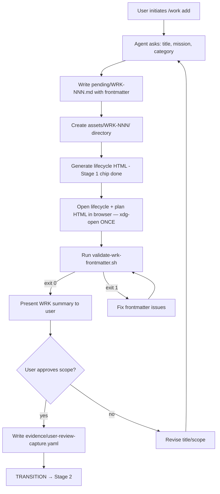

**Mandatory Checklist**:
- [ ] WRK title, category, mission captured
- [ ] `pending/WRK-NNN.md` written with valid frontmatter
- [ ] `assets/WRK-NNN/` directory created
- [ ] Lifecycle HTML generated (Stage 1 chip done)
- [ ] `validate-wrk-frontmatter.sh` exits 0
- [ ] User explicitly approved scope
- [ ] `evidence/user-review-capture.yaml` written (`scope_approved: true`)

**pre_exit hook**: `validate-wrk-frontmatter.sh WRK-NNN` exit 0 + `user-review-capture.yaml` exists with `scope_approved: true`

**pre_enter hook (Stage 1)**: Open BOTH lifecycle HTML + plan HTML in browser (`xdg-open`) — the ONE open for the entire WRK lifecycle

**pre_enter hook (Stage 2)**: Load resource-intelligence skill

---

## Stage 2 — Resource Intelligence

**Objective**: Deeply research the domain — identify existing infrastructure, skills, constraints, prior art, and **external references**. Save discovered documents to docu-intel index. Determine complexity.

**Gate**: None (auto-proceed)

**Skills Activated**: `resource-intelligence`, `document-index-pipeline`, `knowledge`

**Tools**: Read, Grep, Glob, Bash, WebSearch, WebFetch, Write

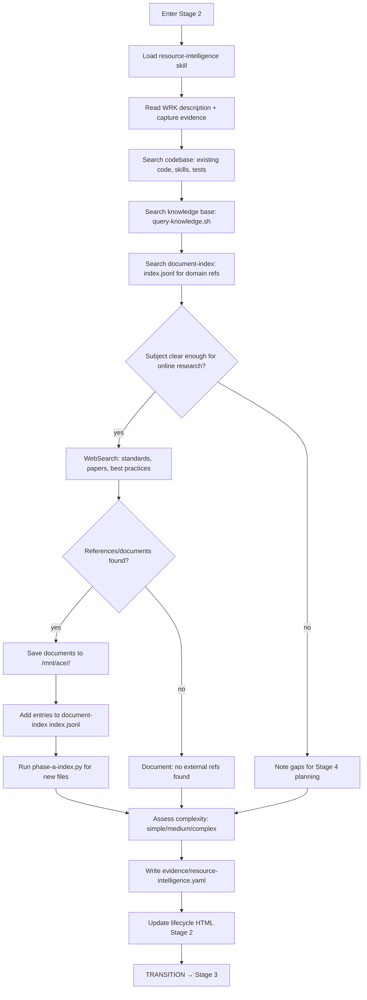

**Mandatory Checklist**:
- [ ] Codebase search completed (existing code, skills, tests in target repos)
- [ ] Knowledge base queried (`query-knowledge.sh --category <domain>`)
- [ ] Document-index searched for relevant prior art
- [ ] **Online research performed** (WebSearch for standards, papers, tools, best practices)
- [ ] **Discovered documents saved to `/mnt/ace/<repo>/`** with context
- [ ] **Document-index updated** (new entries added to index.jsonl via phase-a pipeline)
- [ ] Complexity assessed (simple/medium/complex)
- [ ] `evidence/resource-intelligence.yaml` written (`completion_status`, `skills.core_used` ≥ 3)
- [ ] Lifecycle HTML Stage 2 section updated

**pre_exit hook**: `resource-intelligence.yaml` exists with `completion_status` and `skills.core_used` ≥ 3

**pre_enter hook (Stage 3)**: Regenerate lifecycle HTML

---

## Stage 3 — Triage

**Objective**: Classify the work item by route (A/B/C), assign workstations and orchestrator, surface open questions before planning begins.

**Gate**: None (auto-proceed)

**Skills Activated**: `complexity-routing`, `work-queue` (triage rules)

**Tools**: Read, Edit, Write

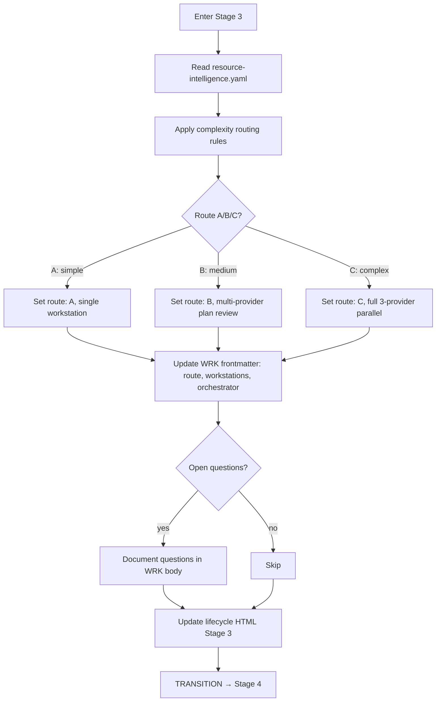

**Mandatory Checklist**:
- [ ] Resource intelligence evidence read
- [ ] Route (A/B/C) determined and justified
- [ ] Workstation(s) assigned
- [ ] Orchestrator provider assigned
- [ ] WRK frontmatter updated (route, workstations, orchestrator)
- [ ] Open questions documented (or noted as none)
- [ ] Lifecycle HTML Stage 3 updated

**pre_exit hook**: WRK frontmatter has `route`, `workstations`, `orchestrator` fields

---

## Stage 4 — Plan Draft (4a: Ideation, 4b: Artifact Write)

**Objective**: Think through the implementation before writing anything. Draft acceptance criteria, pseudocode, test plan, and scripts-to-create list. Two sub-stages force ideation before artifacts.

**Gate**: None (auto-proceed to Stage 5)

**Skills Activated**: `brainstorming`, `writing-plans`, `scope-discipline`

**Tools**: EnterPlanMode, ExitPlanMode, Write, Read

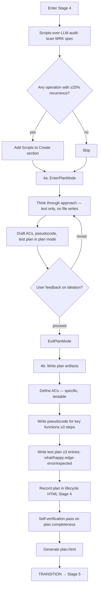

**Mandatory Checklist**:
- [ ] Scripts-over-LLM audit performed (≥25% recurrence check)
- [ ] `Scripts to Create` section added if applicable
- [ ] 4a: `EnterPlanMode` entered, ideation completed as text
- [ ] 4a: `ExitPlanMode` after ideation
- [ ] 4b: ACs defined (specific, testable)
- [ ] 4b: Pseudocode written (≥3 steps or N/A+reason)
- [ ] 4b: Test plan written (≥3 entries or N/A+reason)
- [ ] Plan recorded in lifecycle HTML Stage 4
- [ ] Self-verification pass completed
- [ ] `plan.html` generated

**pre_exit hook**: Lifecycle HTML has Stage 4 section; ACs present; test plan present

---

## Stage 5 — User Review: Plan Draft

**Objective**: Present the plan to the user section-by-section. Get explicit approval on every AC, pseudocode block, and test strategy. Silence is NOT approval.

**Gate**: HARD (user must respond with `approved`)

**Skills Activated**: `work-queue-workflow` (R-25 rule)

**Tools**: Read, Write

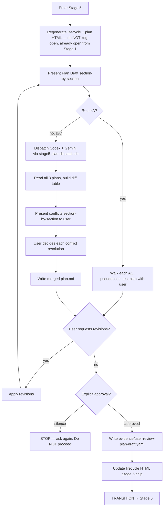

**Mandatory Checklist**:
- [ ] Lifecycle + plan HTML regenerated (already open from Stage 1)
- [ ] Every AC walked through with user
- [ ] Every pseudocode block reviewed
- [ ] Test plan reviewed
- [ ] All requested revisions applied
- [ ] **Explicit** user approval received (not inferred)
- [ ] `evidence/user-review-plan-draft.yaml` written (`decision: approved`)
- [ ] Lifecycle HTML Stage 5 chip flipped to done

**pre_exit hook**: `user-review-plan-draft.yaml` exists with `decision: approved`; `gate-check.py` confirms

**IMPORTANT**: HTML was opened at Stage 1. Do NOT `xdg-open` at any stage after 1 — 30s auto-refresh handles updates

---

## Stage 6 — Cross-Review

**Objective**: Get independent review of the plan from all 3 AI providers. Identify P1/P2 findings before the user makes a final decision. No self-skip.

**Gate**: None (but Codex is hard requirement)

**Skills Activated**: `cross-review-route-bc`, `workflow-gatepass`

**Tools**: Bash (cross-review.sh), Write, EnterPlanMode

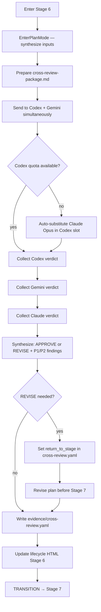

**Mandatory Checklist**:
- [ ] `EnterPlanMode` before any verdict writing
- [ ] Cross-review package sent to all 3 providers
- [ ] All 3 verdicts collected (APPROVE/REVISE)
- [ ] P1 and P2 findings documented
- [ ] If REVISE: `return_to_stage` set, plan revised
- [ ] `evidence/cross-review.yaml` written (all 3 providers listed)
- [ ] Lifecycle HTML Stage 6 updated

**pre_exit hook**: `cross-review.yaml` exists with 3 `reviewers[]` entries

---

## Stage 7 — User Review: Plan Final

**Objective**: Present cross-review findings to user. Get final plan approval with all P1 findings resolved. This is the last gate before execution begins.

**Gate**: HARD (R-25 — user must explicitly confirm)

**Skills Activated**: `work-queue-workflow` (R-25), `workflow-gatepass`

**Tools**: Read, Write, Bash (claim-item.sh --stage7-check)

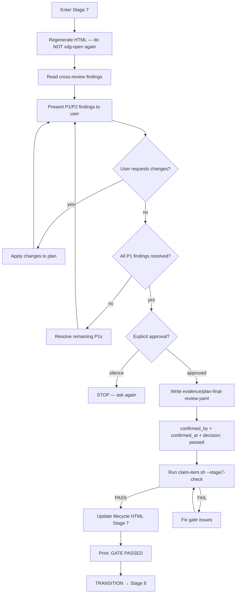

**Mandatory Checklist**:
- [ ] Cross-review findings presented to user
- [ ] All P1 findings resolved
- [ ] All user-requested changes applied
- [ ] **Explicit** user approval received
- [ ] `evidence/plan-final-review.yaml` written (`confirmed_by`, `confirmed_at`, `decision: passed`)
- [ ] `claim-item.sh --stage7-check` exits 0
- [ ] Lifecycle HTML Stage 7 chip done
- [ ] GATE PASSED message printed

**pre_exit hook**: `plan-final-review.yaml` exists with `decision: passed`; `claim-item.sh --stage7-check` exit 0

**POST-GATE**: Stages 8–16 auto-proceed. Do NOT ask "shall I proceed?" (R-26)

---

## Stage 8 — Claim / Activation

**Objective**: Lock the WRK for execution. Check agent quota, move to working status, write activation evidence. Prevent concurrent session collision.

**Gate**: HARD (R-26 — auto-proceed after Stage 7, but claim must succeed)

**Skills Activated**: `work-queue-workflow`

**Tools**: Read, Write, Bash (claim-item.sh)

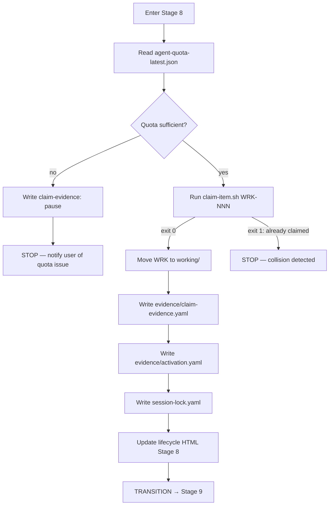

**Mandatory Checklist**:
- [ ] Agent quota checked
- [ ] `claim-item.sh` exits 0 (no collision)
- [ ] `working/WRK-NNN.md` exists (status: working)
- [ ] `evidence/claim-evidence.yaml` written
- [ ] `evidence/activation.yaml` written (activated_at, gates_confirmed)
- [ ] `session-lock.yaml` written (session_pid, hostname)
- [ ] Lifecycle HTML Stage 8 updated

**pre_exit hook**: `claim-evidence.yaml` + `activation.yaml` both exist

---

## Stage 9 — Work-Queue Routing

**Objective**: Load all required skills for execution. Confirm delivery order. Set up the execution environment.

**Gate**: None (auto-proceed)

**Skills Activated**: Domain-specific skills per WRK, `work-queue-workflow`, `workflow-gatepass`

**Tools**: Read, Write, Bash (skill loading)

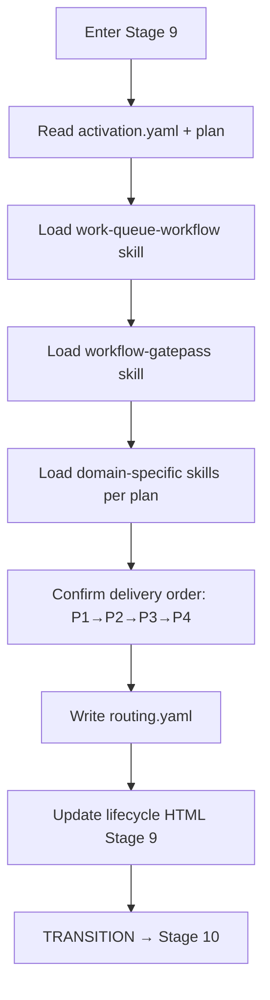

**Mandatory Checklist**:
- [ ] All required skills loaded
- [ ] Delivery order confirmed
- [ ] `routing.yaml` written (`work_queue_skill: loaded`, `work_wrapper_complete: true`)
- [ ] Lifecycle HTML Stage 9 updated

**pre_exit hook**: `routing.yaml` exists with `work_queue_skill: loaded`

---

## Stage 10 — Work Execution

**Objective**: Implement the plan using TDD. Write failing tests first, then minimal implementation, then refactor. Follow scripts-over-LLM principle. Add execution notes for visibility.

**Gate**: None (auto-proceed)

**Skills Activated**: `test-driven-development`, `systematic-debugging`, `executing-plans`, domain skills

**Tools**: Read, Write, Edit, Bash (uv run, pytest), EnterPlanMode

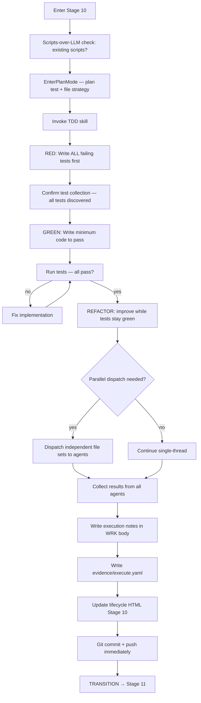

**Mandatory Checklist**:
- [ ] Scripts-over-LLM audit performed
- [ ] `EnterPlanMode` for test/file strategy
- [ ] TDD skill invoked
- [ ] All tests written BEFORE implementation (Red)
- [ ] Tests confirmed collecting
- [ ] Minimum code to pass (Green)
- [ ] Refactor while green
- [ ] Execution notes added to WRK body
- [ ] `evidence/execute.yaml` written (`integrated_repo_tests` ≥ 3)
- [ ] Lifecycle HTML Stage 10 updated
- [ ] Git committed and pushed

**pre_exit hook**: `execute.yaml` exists with `integrated_repo_tests` ≥ 3 entries

---

## Stage 11 — Artifact Generation

**Objective**: Regenerate lifecycle HTML from all evidence files. Verify all 20 stage sections present. Confirm execution content visible.

**Gate**: None (auto-proceed)

**Skills Activated**: `work-queue-workflow`

**Tools**: Bash (generate-html-review.py), Read

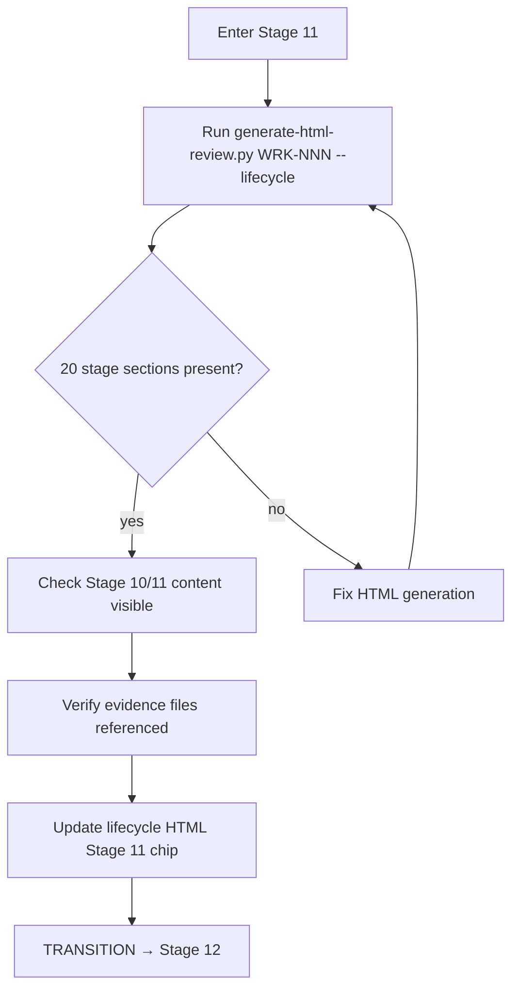

**Mandatory Checklist**:
- [ ] `generate-html-review.py WRK-NNN --lifecycle` run
- [ ] All 20 stage sections present in HTML
- [ ] Stage 10/11 content visible and correct
- [ ] Evidence files properly referenced
- [ ] Lifecycle HTML Stage 11 chip done

**pre_exit hook**: Lifecycle HTML has all 20 sections; file modification time within last 5 minutes

---

## Stage 12 — TDD / Eval

**Objective**: Run full test suite. Map every AC to a test result (PASS/FAIL/N/A+reason). No partial passes — fix all failures before writing the matrix.

**Gate**: None (auto-proceed)

**Skills Activated**: `test-driven-development`, `verification-before-completion`

**Tools**: Bash (pytest), Write, Read

```mermaid
flowchart TD
    A[Enter Stage 12] --> B[Run full test suite]
    B --> C{All tests pass?}
    C -->|no| D[Fix failures — do NOT skip]
    D --> B
    C -->|yes| E[Map each AC to test result]
    E --> F[Build AC-test matrix: AC | test | PASS/FAIL/N/A]
    F --> G{Any FAIL in matrix?}
    G -->|yes| H[Fix or reclassify] --> E
    G -->|no| I[Write ac-test-matrix.md]
    I --> J[Update lifecycle HTML Stage 12]
    J --> K[TRANSITION → Stage 13]
```

**Mandatory Checklist**:
- [ ] Full test suite run
- [ ] All tests pass (zero failures)
- [ ] Every AC mapped to test result
- [ ] AC-test matrix: all PASS or N/A+reason, no FAIL
- [ ] `ac-test-matrix.md` written
- [ ] Lifecycle HTML Stage 12 updated
- [ ] `execute.yaml` has ≥ 3 `integrated_repo_tests` entries (heavy check)

**pre_exit hook**: `ac-test-matrix.md` exists; no `FAIL` entries; `execute.yaml` has ≥ 3 test entries

---

## Stage 13 — Agent Cross-Review

**Objective**: Get 3-provider review of the implementation and tests. Identify security, correctness, and quality issues before gate verification.

**Gate**: None (but all 3 providers required)

**Skills Activated**: `cross-review-route-bc`, `workflow-gatepass`

**Tools**: Bash (cross-review.sh), Write, EnterPlanMode

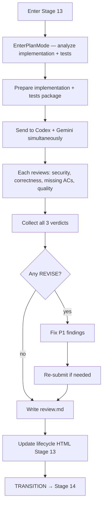

**Mandatory Checklist**:
- [ ] `EnterPlanMode` before verdict
- [ ] Implementation + tests sent to all 3 providers
- [ ] All 3 verdicts collected
- [ ] P1/P2 findings documented
- [ ] All P1 findings fixed
- [ ] `review.md` written (all 3 providers listed)
- [ ] Lifecycle HTML Stage 13 updated

**pre_exit hook**: `review.md` exists with 3 `reviewers[]` entries

---

## Stage 14 — Verify Gate Evidence

**Objective**: Run the deterministic gate verifier. Fix ALL failures — no skipping. Every gate must PASS before proceeding.

**Gate**: None (auto-proceed, but script must exit 0)

**Skills Activated**: `workflow-gatepass`

**Tools**: Bash (verify-gate-evidence.py), Write

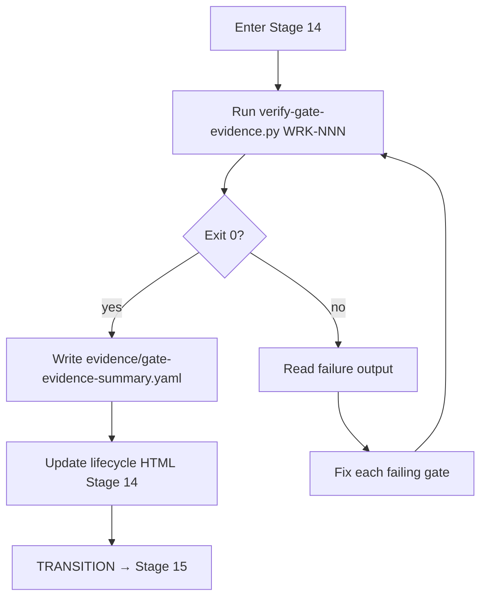

**Mandatory Checklist**:
- [ ] `verify-gate-evidence.py WRK-NNN` run
- [ ] Exit 0 (all gates PASS)
- [ ] `evidence/gate-evidence-summary.yaml` written
- [ ] Lifecycle HTML Stage 14 updated

**pre_exit hook**: `verify-gate-evidence.py` exit 0; `gate-evidence-summary.yaml` exists

---

## Stage 15 — Future Work Synthesis

**Objective**: Capture deferred ideas, scope-creep items, and follow-up work discovered during execution. Every item either captured as a new WRK or explicitly deferred with reason.

**Gate**: None (auto-proceed)

**Skills Activated**: `work-queue` (capture), `scope-discipline`

**Tools**: Write, Bash (/work add)

```mermaid
flowchart TD
    A[Enter Stage 15] --> B[Review execution notes + review.md]
    B --> C[Identify deferred ideas, scope creep, follow-ups]
    C --> D{Items found?}
    D -->|yes| E[For each item: capture or defer]
    E --> F{Already in queue?}
    F -->|yes| G[Note as existing WRK-NNN]
    F -->|no| H[/work add — create new WRK]
    G --> I[Write evidence/future-work.yaml]
    H --> I
    D -->|no| I
    I --> J[All spun-off-new items: captured: true]
    J --> K[Update lifecycle HTML Stage 15]
    K --> L[TRANSITION → Stage 16]
```

**Mandatory Checklist**:
- [ ] Execution notes reviewed for deferred items
- [ ] Review.md reviewed for follow-up suggestions
- [ ] Each item: captured as new WRK or deferred with reason
- [ ] `evidence/future-work.yaml` written (all spun-off-new: `captured: true`)
- [ ] Lifecycle HTML Stage 15 updated

**pre_exit hook**: `future-work.yaml` exists; all `spun-off-new` items have `captured: true`

---

## Stage 16 — Resource Intelligence Update

**Objective**: Capture lessons learned, new patterns, tools, and constraints discovered during this WRK. Feed back into the knowledge system for future WRKs.

**Gate**: None (auto-proceed)

**Skills Activated**: `knowledge`, `resource-intelligence`, `comprehensive-learning`

**Tools**: Write, Bash (capture-wrk-summary.sh)

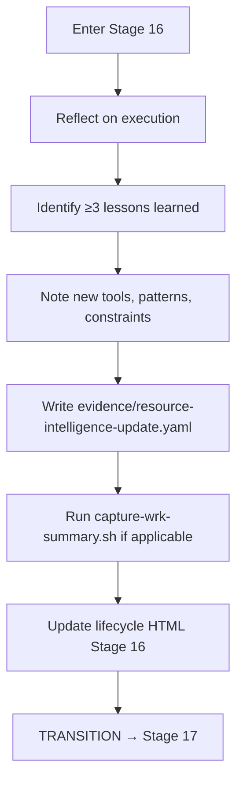

**Mandatory Checklist**:
- [ ] ≥ 3 lessons learned identified
- [ ] New tools/patterns/constraints documented
- [ ] `evidence/resource-intelligence-update.yaml` written (`lessons[]` ≥ 3)
- [ ] Lifecycle HTML Stage 16 updated

**pre_exit hook**: `resource-intelligence-update.yaml` exists with `lessons[]` ≥ 3 entries

---

## Stage 17 — User Review: Implementation

**Objective**: Present the complete implementation to the user. Walk through Stages 10-16 evidence. Answer questions, apply fixes. Get explicit closure approval.

**Gate**: HARD (R-27 — user must explicitly approve)

**Skills Activated**: `work-queue-workflow` (R-27), `verification-before-completion`

**Tools**: Read, Write (do NOT xdg-open — HTML auto-refreshes)

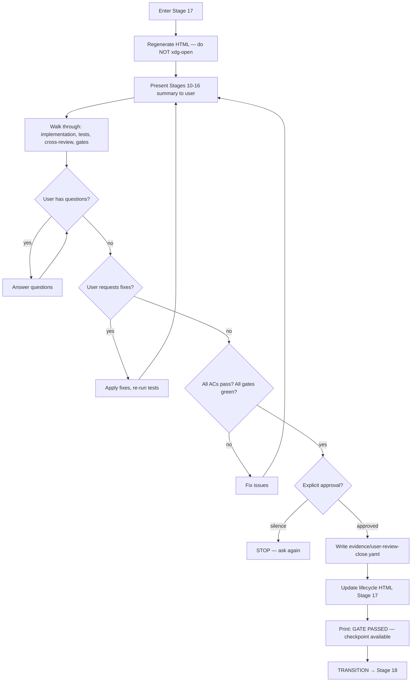

**Mandatory Checklist**:
- [ ] HTML regenerated (NOT re-opened — auto-refresh handles it)
- [ ] Stages 10-16 walked through with user
- [ ] All user questions answered
- [ ] All user-requested fixes applied
- [ ] All ACs confirmed passing
- [ ] All gates confirmed green
- [ ] **Explicit** user approval received
- [ ] `evidence/user-review-close.yaml` written (`decision: approved`, `reviewer` in allowlist)
- [ ] Lifecycle HTML Stage 17 chip done
- [ ] GATE PASSED message printed

**pre_exit hook**: `user-review-close.yaml` exists with `decision: approved`; `close-item.sh --stage17-check` exit 0

---

## Stage 18 — Reclaim

**Objective**: Check for checkpoint continuity. If the session broke between stages, re-orient from checkpoint. Otherwise mark N/A.

**Gate**: None (auto-proceed)

**Skills Activated**: `checkpoint-resume`

**Tools**: Read, Write

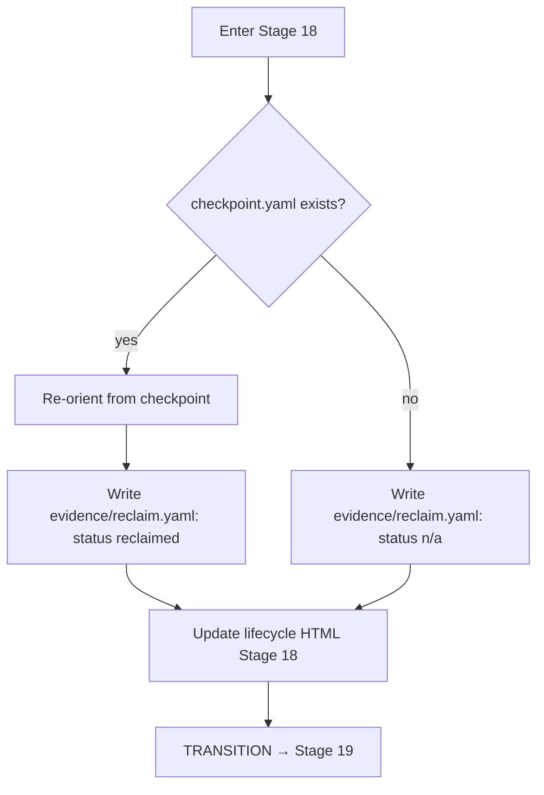

**Mandatory Checklist**:
- [ ] Checkpoint presence checked
- [ ] `evidence/reclaim.yaml` written (`status: n/a` or `status: reclaimed`)
- [ ] Lifecycle HTML Stage 18 updated

**pre_exit hook**: `reclaim.yaml` exists

---

## Stage 19 — Close

**Objective**: Run final gate verification. Execute close-item.sh. Move WRK to done/ with 100% completion.

**Gate**: None (auto-proceed)

**Skills Activated**: `workflow-gatepass`

**Tools**: Bash (verify-gate-evidence.py, close-item.sh), Read

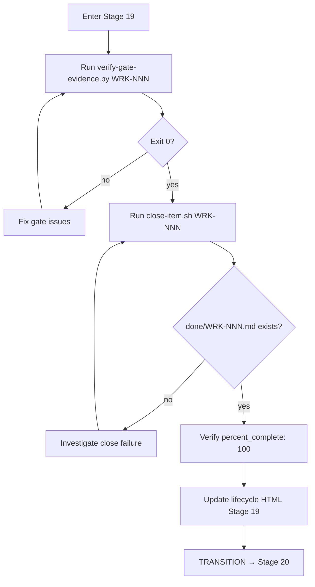

**Mandatory Checklist**:
- [ ] `verify-gate-evidence.py WRK-NNN` exits 0
- [ ] `close-item.sh WRK-NNN` executed
- [ ] `done/WRK-NNN.md` exists
- [ ] `percent_complete: 100` confirmed
- [ ] Lifecycle HTML Stage 19 updated

**pre_exit hook**: `done/WRK-NNN.md` exists with `percent_complete: 100`

---

## Stage 20 — Archive

**Objective**: Move WRK to archive. Regenerate INDEX.md. Clear active-wrk state. Final git commit of lifecycle HTML.

**Gate**: None (auto-proceed)

**Skills Activated**: `archival-safety`

**Tools**: Bash (archive-item.sh, clear-active-wrk.sh, git), Write

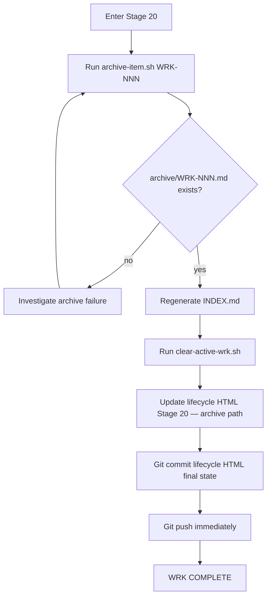

**Mandatory Checklist**:
- [ ] `archive-item.sh WRK-NNN` executed
- [ ] `archive/WRK-NNN.md` exists
- [ ] INDEX.md regenerated
- [ ] `clear-active-wrk.sh` executed
- [ ] Lifecycle HTML Stage 20 updated with archive path
- [ ] Git committed + pushed

**pre_exit hook**: `archive/WRK-NNN.md` exists; active-wrk cleared; INDEX.md updated

---

## Cross-Cutting Rules

### HTML Behavior
- **Stage 1**: `xdg-open` BOTH lifecycle + plan HTML — **the ONE and only open**
- **All other stages (2–20)**: Regenerate HTML file only — 30s auto-refresh picks up changes
- **Never** call `xdg-open` after Stage 1

### Human Gate Protocol
- Stages 1, 5, 7, 17 are HARD gates
- Agent MUST STOP and wait for explicit human response
- Silence ≠ approval — ask again if no response
- Log `gate_wait_start` and `gate_approved_at` timestamps

### Post-Stage-7 Auto-Proceed (R-26)
- Stages 8–16 execute without asking "shall I proceed?"
- Exception (R-27): P1 finding, scope change, or irreversible risk → pause and describe

### Enforcement Gradient Target
- Every checklist item should be at L2 (script) minimum
- L3 (hook) for must-never-miss items (human gates, git push, legal scan)
