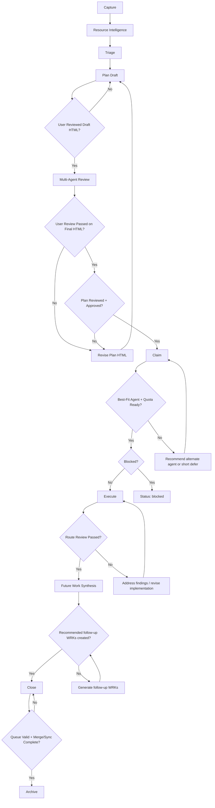

# Work Queue Process

> Operational reference for the two-phase work queue system.
> For the full skill definition, see `../.claude/skills/coordination/workspace/work-queue/SKILL.md`.

## Overview

The work queue tracks features, bugs, and tasks across all workspace-hub repositories. Items flow through a nine-stage lifecycle: **Capture, Resource Intelligence, Triage, Plan, Claim, Execute, Future Work Synthesis, Close, Archive**. The workspace-hub queue is the master; repo-local WRK copies are deprecated and should not be created.

State is tracked in `state.yaml` (counters), individual `WRK-NNN.md` files (item detail), and `INDEX.md` (generated listing).

## Canonical Lifecycle



## Stage Contract

### 1. Capture
- Create WRK in `pending/`.
- Record problem statement, criteria, and scope.
- Assign `orchestrator`, `provider`, `provider_alt`, and initial route.

### 2. Resource Intelligence
- Mandatory for every WRK before planning.
- Create modular artifact set in `assets/WRK-<id>/`: `resource-pack.md`, `sources.md`, `constraints.md`, `domain-notes.md`, `open-questions.md`, `resources.yaml`.

### 3. Triage
- Assign `priority`, `complexity`, `route`, `computer`, `plan_workstations`, `execution_workstations`, `resource_needs`.
- `plan_workstations` and `execution_workstations` must be non-empty and may include multiple machines.

### 4. Plan
- Route A/B: Inline in body. Route C: `specs/wrk/WRK-<id>/`.
- Must produce HTML review artifact.
- User reviews Draft HTML before multi-agent review.
- Multi-agent review (Claude, Codex, Gemini) for Route B/C.
- User reviews Final HTML and records a pass/fail decision.
- Only a passed final HTML review may proceed to plan approval and claim.

### 5. Claim
- Check unblocked.
- Agent-capability check.
- Quota check (`config/ai-tools/agent-quota-latest.json`).
- Write structured claim evidence.

### 6. Execute
- Implementation under claimed session.
- Define 5-10 real examples.
- Include variation tests.
- Generate HTML review artifact.

### 7. Future Work Synthesis
- Triggered after execution review passes and before close.
- Generate recommended follow-up WRKs automatically from:
  - unresolved review findings
  - deferred improvements
  - tooling/automation gaps discovered during execution
  - learning outputs that require independent backlog delivery
- Record outputs in close evidence as `followup_wrks`.
- Close is blocked until required follow-up WRKs exist.

### 8. Close
**Trigger**: Implementation complete and verified.
- Script: `scripts/work-queue/close-item.sh WRK-NNN <commit-hash> [--html-output <path>] [--html-verification <path>] [--commit]`
- Updates frontmatter, moves to `done/`, regenerates INDEX.
- Enforces HTML review evidence for WRK items using the hardened workflow contract.
- Record merge/sync status and follow-up/learning outputs where applicable.

### 9. Archive
- Script: `scripts/archive-item.sh WRK-NNN`
- Blocked until merge-to-main and sync complete.
- Moves to `archive/YYYY-MM/`.

## Directory Structure

```
.claude/work-queue/
  INDEX.md              # Auto-generated listing (do not edit)
  process.md            # This file
  state.yaml            # Counters: last_id, last_processed, stats
  pending/              # Items awaiting processing
  working/              # Items currently being executed (max 1-2)
  blocked/              # Items awaiting dependencies
  archive/              # Completed items
    YYYY-MM/            #   Organized by month
  assets/               # Context files, screenshots
  scripts/
    generate-index.py   # Regenerate INDEX.md from all items
    archive-item.sh     # Move item to archive with hooks
    on-complete-hook.sh # Post-archive brochure tracking
```

## State Management

**`state.yaml`** tracks:
- `last_id`: Highest WRK-NNN assigned (monotonically increasing).
- `last_processed`: Most recently processed item ID.
- `stats.total_captured`, `stats.total_processed`, `stats.total_archived`.

**`INDEX.md`** is regenerated (not edited) after every mutation:
```bash
python3 .claude/work-queue/scripts/generate-index.py
```
This scans all directories, parses frontmatter, and produces multi-view tables (by status, priority, complexity, repository, dependencies). Runs in <2 seconds for 100+ items.

**Resync**: If INDEX.md drifts from reality, delete it and regenerate. The script is idempotent.

## Commands

| Command | Action |
|---------|--------|
| `/work add <desc>` | Capture one or more items |
| `/work run` or `/work` | Process next item by priority |
| `/work list` | Display INDEX.md (filter by repo/status/priority) |
| `/work status WRK-NNN` | Show specific item details |
| `/work prioritize` | Interactive priority adjustment |
| `/work archive WRK-NNN` | Manually archive an item |
| `/work report` | Queue health summary |
| `python3 .claude/work-queue/scripts/generate-index.py` | Regenerate INDEX.md |
| `scripts/work-queue/archive-item.sh WRK-NNN` | Archive with hooks |
| `scripts/operations/compliance/audit_wrk_location.sh` | Detect WRK files outside canonical queue |
| `scripts/operations/compliance/validate_work_queue_schema.sh` | Validate WRK frontmatter schema |
| `scripts/operations/compliance/audit_skill_symlink_policy.sh` | Enforce child-repo skills are propagated links only |

## Conventions

### Completion Checklist (Mandatory)

Add this block to the WRK item body before marking done:

```markdown
## Completion Checklist
- [ ] Implementation committed: <hash>
- [ ] Tests pass: <command + output>
- [ ] 5-10 Examples defined: <path to example-pack.md>
- [ ] Variation tests passed: <path to variation-test-results.md>
- [ ] Cross-review passed: <synthesis result path>
- [ ] HTML review artifact verified: <path>
- [ ] WRK frontmatter updated: status=done, percent_complete=100, commit=<hash>
- [ ] Learning outputs captured: <path or WRK-ID>
- [ ] INDEX regenerated: python3 .claude/work-queue/scripts/generate-index.py
```

### Frontmatter (required fields)

```yaml
---
id: WRK-NNN
title: Brief descriptive title
status: pending          # pending | working | done | blocked | archived | failed
priority: medium         # high | medium | low
complexity: medium       # simple | medium | complex
route:                   # A | B | C
orchestrator:            # claude | codex | gemini
created_at: 2026-02-27T00:00:00Z
target_repos:
  - repo-name
target_module:           # module within repo
commit:                  # SHA after implementation
spec_ref:                # path to Route C spec
resource_pack_ref:       # path to assets/WRK-NNN/resource-pack.md
plan_html_review_draft_ref: # path to draft plan HTML review evidence
plan_html_review_final_ref: # path to final plan HTML review evidence
claim_routing_ref:       # path to claim evidence
claim_quota_snapshot_ref: # path to quota snapshot
example_pack_ref:        # path to 5-10 examples
variation_test_ref:      # path to variation tests
html_output_ref:         # path to final HTML review artifact
html_verification_ref:   # path to HTML verification result
learning_outputs: []     # list of paths or WRK IDs
followup: []             # WRK IDs of follow-up items
plan_reviewed: false     # true after multi-agent cross-review
plan_approved: false     # true after user approval
percent_complete: 0      # 0-100
provider:                # primary executor
provider_alt:            # secondary executor
computer:                # machine nickname
plan_workstations:       # machine list for planning stage
execution_workstations:  # machine list for execution stage
---
```

### Body structure

```markdown
# Title

## What
[1-3 sentence description]

## Why
[Rationale]

## Acceptance Criteria
- [ ] Criterion 1
- [ ] Criterion 2

## Plan
[Added during Plan stage]

## Execution Brief

### Provider
- **Executor**: <provider> — <one-line rationale>
- **Alt**: <provider_alt or "none">

### Task for Executor
<!-- Self-contained description sent to the executing agent. Include file paths, constraints, expected output. -->

### Done When
- [ ] <specific, verifiable criterion>
- [ ] <test command that must pass>

### For User Review
<!-- What to look at when you come back -->

---
*Source: [verbatim original request]*
```

### Commit messages for work items

```
feat(scope): WRK-NNN — description    # WRK ref REQUIRED (enforced by commit-msg hook)
fix(scope): WRK-NNN — description     # WRK ref REQUIRED
refactor(scope): WRK-NNN — description # WRK ref REQUIRED
docs(scope): WRK-NNN — description    # WRK ref recommended (warning only)
chore(scope): description              # WRK ref optional (exempt)
style(scope): description              # WRK ref optional (exempt)
```

### Cross-review log format (in spec or item body)

```markdown
| Iter | Date | Reviewer | Verdict | Findings | Fixed |
|------|------|----------|---------|----------|-------|
| P1   | 2026-02-12 | Claude | MINOR | 4: ... | 4/4 |
```
