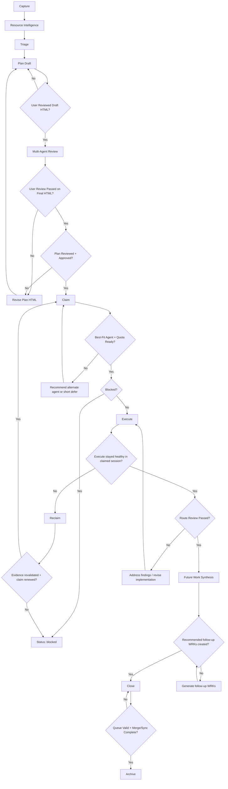

# Work Queue Process

> Operational reference for the two-phase work queue system.
> For the full skill definition, see `../.claude/skills/coordination/workspace/work-queue/SKILL.md`.

## Overview

The work queue tracks features, bugs, and tasks across all workspace-hub repositories. Items flow through a **twenty-stage lifecycle**:

1. Capture → 2. Resource Intelligence → 3. Triage → 4. Plan Draft → 5. User Review (Plan Draft) → 6. Cross-Review → 7. User Review (Plan Final) → 8. Claim / Activation → 9. Work-Queue Routing → 10. Work Execution → 11. Artifact Generation → 12. TDD / Eval → 13. Agent Cross-Review → 14. Verify Gate Evidence → 15. Future Work Synthesis → 16. Resource Intelligence Update → 17. User Review (Implementation) → 18. Reclaim → 19. Close → 20. Archive

The workspace-hub queue is the master; repo-local WRK copies are deprecated and should not be created.

**Stage invocation types**: `task_agent` (automated), `human_session` (interactive gate, requires explicit approval), `chained_agent` (single agent handles multiple sequential stages). Stages 5, 7, and 17 are human gates; stages 2-4 and 8-9 may be chained.

**Parallelism tiers**: `parallel` (multiple providers simultaneously — stages 5, 6, 13), `parallel-optional` (agent swarm for independent subtasks — stages 10, 12), `single-thread` (all others).

**Per-stage contracts**: `scripts/work-queue/stages/stage-NN-*.yaml` | **Per-stage micro-skills**: `.claude/skills/workspace-hub/stages/stage-NN-*.md`

State is tracked in `state.yaml` (counters), individual `WRK-NNN.md` files (item detail), and `INDEX.md` (generated listing).

## Canonical Lifecycle


```mermaid
flowchart TD
    A[Capture] --> B[Resource Intelligence]
    B --> C[Triage]
    C --> D[Plan Draft]
    D --> E{User Reviewed Draft HTML?}
    E -- Yes --> F[Multi-Agent Review]
    E -- No --> D
    F --> G{User Review Passed on Final HTML?}
    G -- Yes --> H{Plan Reviewed + Approved?}
    G -- No --> F1[Revise Plan HTML]
    F1 --> D
    H -- Yes --> I[Claim]
    H -- No --> F1
    I --> J{Best-Fit Agent + Quota Ready?}
    J -- Yes --> K{Blocked?}
    J -- No --> I1[Recommend alternate agent or short defer]
    I1 --> I
    K -- No --> L[Execute]
    K -- Yes --> M[Status: blocked]
    L --> L0{Execute stayed healthy in claimed session?}
    L0 -- Yes --> N{Route Review Passed?}
    L0 -- No --> S[Reclaim]
    S --> S1{Evidence revalidated + claim renewed?}
    S1 -- Yes --> I
    S1 -- No --> M
    N -- Yes --> R[Future Work Synthesis]
    R --> R1{Recommended follow-up WRKs created?}
    R1 -- Yes --> O[Close]
    R1 -- No --> R2[Generate follow-up WRKs]
    R2 --> R1
    N -- No --> N1[Address findings / revise implementation]
    N1 --> L
    O --> P{Queue Valid + Merge/Sync Complete?}
    P -- Yes --> Q[Archive]
    P -- No --> O
```

## Stage Contract

Operating principle: **humans steer, agents execute**.
Use mechanical checks (scripts/linters/tests) as primary enforcement.

For the full contract fields (weight, parallelism, entry_reads, exit_artifacts, blocking_condition), see `scripts/work-queue/stages/stage-NN-*.yaml`. For per-stage guidance, invoke the micro-skill `.claude/skills/workspace-hub/stages/stage-NN-*.md`.

### Stage 1. Capture
- Create WRK in `pending/`.
- Record problem statement, criteria, and scope.
- Assign `orchestrator`, `provider`, `provider_alt`, and initial route.

### Stage 2. Resource Intelligence
- Mandatory for every WRK before planning.
- Create modular artifact set in `assets/WRK-<id>/`: `resource-pack.md`, `sources.md`, `constraints.md`, `domain-notes.md`, `open-questions.md`, `resources.yaml`.
- Use minimum viable core skills by default: `work-queue`, `engineering-context-loader`, `document-inventory`, `legal-sanity`.
- Optional extensions (only when needed): `document-rag-pipeline`, `knowledge-manager`, `agent-router`, `agent-usage-optimizer`, `comprehensive-learning`.
- Record machine-checkable stage evidence in `assets/WRK-<id>/evidence/resource-intelligence.yaml`.

### Stage 3. Triage
- Assign `priority`, `complexity`, `route`, `computer`, `plan_workstations`, `execution_workstations`, `resource_needs`.
- `plan_workstations` and `execution_workstations` must be non-empty and may include multiple machines.

### Stage 4. Plan Draft
- Route A/B: Inline in body. Route C: `specs/wrk/WRK-<id>/`.
- Must produce HTML review artifact.
- Every generated HTML review artifact must include a `Test Summary` section showing example-pack and variation-test presence.
- Plan artifacts must include the Skill Manifest for user review (`mandatory`, `supporting`,
  `domain`, and `repo_governance` skill sets), sourced from
  `assets/WRK-<id>/evidence/skill-manifest.yaml`.
- User reviews Draft HTML before multi-agent review as an interactive plan session:
  - ask tough clarifying questions,
  - challenge weak assumptions and surface tradeoffs,
  - think hard and research hard before finalizing the draft plan,
  - research tests/evals from available Resource Intelligence and Document
    Intelligence artifacts,
  - seek user review of proposed tests/evals and ask user to add/adjust
    tests/evals before progression.
- At each user-review stage (draft/final/implementation), review the HTML
  `Gate-Pass Stage Status` section (table + summary) before presenting a recommendation.
- Record stage-5 interactive review details in:
  `assets/WRK-<id>/evidence/user-review-plan-draft.yaml`
  (template: `specs/templates/user-review-plan-draft-template.yaml`).
- Multi-agent review (Claude, Codex, Gemini) for Route B/C.
- User reviews Final HTML and records a pass/fail decision.
- Only a passed final HTML review may proceed to plan approval and claim.

### Stage 5. User Review — Plan Draft
- **Human gate** (`human_session`). Interactive review of plan HTML section-by-section.
- HARD GATE: Stage 6 blocked until `evidence/user-review-plan-draft.yaml` has `decision: approved`.
- Write evidence via Write tool only — never Bash echo/sed/cat.

### Stage 6. Cross-Review
- ALL three providers (Claude + Codex + Gemini) independently review the plan.
- Verdict: APPROVE or REVISE. If REVISE, return to Stage 4.
- Exit artifact: `evidence/cross-review.yaml`.

### Stage 7. User Review — Plan Final
- **Human gate** (`human_session`). Review revised plan after cross-review findings resolved.
- HARD GATE: Stage 8 blocked until `evidence/plan-final-review.yaml` has `decision: passed`.
- Exit artifact: `evidence/plan-final-review.yaml` with `confirmed_by` + `confirmed_at`.

### Stage 8. Claim / Activation
- Check unblocked. Agent-capability and quota check.
- Write `evidence/claim-evidence.yaml` + `evidence/activation.yaml`.
- Chained with Stage 9.

### Stage 9. Work-Queue Routing
- Load skills, select route (A/B/C), write `routing.yaml`.
- Chained with Stage 8.

### Stage 10. Work Execution (formerly Stage 6 Execute)
- Check unblocked.
- Agent-capability check.
- Quota check (`config/ai-tools/agent-quota-latest.json`).
- Write structured claim evidence.
- Record claim expiry and reclaim policy in `assets/WRK-<id>/evidence/claim.yaml` (legacy `claim-evidence.yaml` tolerated during migration).

- Implementation under claimed session.
- TDD MANDATORY: write failing tests before implementation.
- Define 5-10 real examples. Include variation tests. Generate HTML review artifact.
- Record execute-stage evidence in `assets/WRK-<id>/evidence/execute.yaml`.
- Execute evidence must include `integrated_repo_tests` with `3-5` passing entries (`scope: integrated|repo`) before close can pass.
- Exit enforced by `exit_stage.py WRK-NNN 10` (heavy check: execute.yaml required).

### Stage 11. Artifact Generation
- Generate lifecycle HTML review sections for stages 10 onward.
- Exit artifact: updated `WRK-NNN-lifecycle.html`.

### Stage 12. TDD / Eval
- Verify TDD coverage: all ACs must pass. Exit artifact: `ac-test-matrix.md`.
- Heavy exit check: ac-test-matrix.md must have ≥3 PASS entries, no FAIL.
- Exit enforced by `exit_stage.py WRK-NNN 12`.

### Stage 13. Agent Cross-Review
- All three providers independently review implementation. Record findings in `evidence/impl-cross-review.yaml`.

### Stage 14. Verify Gate Evidence
- Run `verify-gate-evidence.py WRK-NNN`. All 16 gates must PASS.

### Stage 15. Future Work Synthesis
- Capture deferred work in `evidence/future-work.yaml`. All spun-off-new items must have `captured: true`.

### Stage 16. Resource Intelligence Update
- Update `evidence/resource-intelligence-update.yaml` with new sources/tools discovered during execution.

### Stage 17. User Review — Implementation
- **Human gate** (`human_session`). Review full lifecycle HTML (stages 10-16).
- HARD GATE: Stage 18 blocked until `evidence/user-review-close.yaml` has `decision: approved`.

### Stage 18. Reclaim (formerly Stage 7)
- Trigger when execute continuity breaks (session loss, claim expiry, invalidated evidence).
- Revalidate claim freshness, blockers, and prior stage evidence.
- Write `assets/WRK-<id>/evidence/reclaim.yaml`.
- Resume flow only after successful reclaim, then return to Stage 8 (Claim).

### Stage 19. Close (formerly Stage 9)
**Trigger**: Implementation complete and verified.
- Script: `scripts/work-queue/close-item.sh WRK-NNN <commit-hash> [--html-output <path>] [--html-verification <path>] [--commit]`
- `close-item.sh` auto-generates `assets/WRK-NNN/workflow-final-review.html` when `--html-output` is omitted.
- Updates frontmatter, moves to `done/`, regenerates INDEX.
- Enforces HTML review evidence for WRK items using the hardened workflow contract.
- HTML artifacts are expected to include `Test Summary` details for auditability.
- Close is blocked unless execute evidence records `3-5` passing integrated/repo tests.
- Record merge/sync status and follow-up/learning outputs where applicable.
- Canonical stage evidence file: `assets/WRK-<id>/evidence/close.yaml`.

### Stage 20. Archive (formerly Stage 10)
- Script: `scripts/work-queue/archive-item.sh WRK-NNN`
- Blocked until merge-to-main and sync complete.
- Moves to `archive/YYYY-MM/`.
- Canonical stage evidence file: `assets/WRK-<id>/evidence/archive.yaml`.

## Stage Orchestration Scripts

| Script | Purpose |
|--------|---------|
| `scripts/work-queue/start_stage.py WRK-NNN N` | Build stage-N-prompt.md; route task_agent/human_session/chained_agent |
| `scripts/work-queue/exit_stage.py WRK-NNN N` | Validate stage exit artifacts + human gate; SystemExit(1) on failure |
| `scripts/work-queue/gate_check.py` | PreToolUse hook: block Write if stage gate not met (supplemental; canonical = verify-gate-evidence.py) |

## Evidence Contract

Stage evidence should be normalized under one directory:

```
assets/WRK-<id>/evidence/
  resource-intelligence.yaml
  skill-manifest.yaml
  skill-invocation-log.yaml
  user-review-publish.yaml
  user-review-plan-draft.yaml
  claim.yaml
  execute.yaml
  reclaim.yaml
  future-work.yaml
  close.yaml
  archive.yaml
```

## Directory Structure

```
.claude/work-queue/
  INDEX.md              # Auto-generated listing (do not edit)
  process.md            # This file
  state.yaml            # Counters: last_id, last_processed, stats
  pending/              # Items awaiting processing
  working/              # Items currently being executed (max 1-2)
  blocked/              # Items awaiting dependencies
  archive/              # Completed items
    YYYY-MM/            #   Organized by month
  assets/               # Context files, screenshots
  scripts/
    generate-index.py   # Regenerate INDEX.md from all items
    archive-item.sh     # Move item to archive with hooks
    on-complete-hook.sh # Post-archive brochure tracking
```

## State Management

**`state.yaml`** tracks:
- `last_id`: Highest WRK-NNN assigned (monotonically increasing).
- `last_processed`: Most recently processed item ID.
- `stats.total_captured`, `stats.total_processed`, `stats.total_archived`.

**`INDEX.md`** is regenerated (not edited) after every mutation:
```bash
python3 .claude/work-queue/scripts/generate-index.py
```
This scans all directories, parses frontmatter, and produces multi-view tables (by status, priority, complexity, repository, dependencies). Runs in <2 seconds for 100+ items.

**Resync**: If INDEX.md drifts from reality, delete it and regenerate. The script is idempotent.

## Commands

| Command | Action |
|---------|--------|
| `/work add <desc>` | Capture one or more items |
| `/work run` or `/work` | Process next item by priority |
| `/work list` | Display INDEX.md (filter by repo/status/priority) |
| `/work status WRK-NNN` | Show specific item details |
| `/work prioritize` | Interactive priority adjustment |
| `/work archive WRK-NNN` | Manually archive an item |
| `/work report` | Queue health summary |
| `python3 .claude/work-queue/scripts/generate-index.py` | Regenerate INDEX.md |
| `scripts/work-queue/archive-item.sh WRK-NNN` | Archive with hooks |
| `scripts/operations/compliance/audit_wrk_location.sh` | Detect WRK files outside canonical queue |
| `scripts/operations/compliance/validate_work_queue_schema.sh` | Validate WRK frontmatter schema |
| `scripts/operations/compliance/audit_skill_symlink_policy.sh` | Enforce child-repo skills are propagated links only |

## Conventions

### Multi-Agent Side Effects (Persistent Rule)

When multiple agents work in parallel, unrelated file changes may appear during a WRK.
If those changes are outside the active WRK scope:

- Do not treat them as a blocker.
- Do not revert them unless explicitly directed.
- Continue the assigned WRK workflow gates.
- Record the observation in the active WRK under `## Out-of-Scope Side Effects`
  (include affected paths and decision to leave untouched).

### Scope Control (First Pass)

- Orchestrator can check out one or more WRK items for coordinated parallel tasks.
- Planning edits are limited to WRK planning locations:
  - Route A/B: WRK body
  - Route C: `specs/wrk/WRK-<id>/`
  - WRK evidence under `.claude/work-queue/assets/WRK-<id>/`
- If planning needs edits in another WRK item, pause and request explicit user permission naming that WRK id.
- Execution can touch the repository as needed for the active WRK deliverable.
- If execution extends into another domain/module family beyond active WRK scope, pause and request explicit user permission.

### Completion Checklist (Mandatory)

Add this block to the WRK item body before marking done:

```markdown
## Completion Checklist
- [ ] Implementation committed: <hash>
- [ ] Tests pass: <command + output>
- [ ] 5-10 Examples defined: <path to example-pack.md>
- [ ] Variation tests passed: <path to variation-test-results.md>
- [ ] Integrated/repo tests passed (3-5): <path to evidence/execute.yaml>
- [ ] Cross-review passed: <synthesis result path>
- [ ] HTML review artifact verified: <path>
- [ ] WRK frontmatter updated: status=done, percent_complete=100, commit=<hash>
- [ ] Learning outputs captured: <path or WRK-ID>
- [ ] INDEX regenerated: python3 .claude/work-queue/scripts/generate-index.py
```

### Frontmatter (required fields)

```yaml
---
id: WRK-NNN
title: Brief descriptive title
status: pending          # pending | working | done | blocked | archived | failed
priority: medium         # high | medium | low
complexity: medium       # simple | medium | complex
route:                   # A | B | C
orchestrator:            # claude | codex | gemini
orchestrator_history:    # ordered list when orchestration ownership changes
created_at: 2026-02-27T00:00:00Z
target_repos:
  - repo-name
target_module:           # module within repo
commit:                  # SHA after implementation
spec_ref:                # path to Route C spec
resource_pack_ref:       # path to assets/WRK-NNN/resource-pack.md
plan_html_review_draft_ref: # path to draft plan HTML review evidence
plan_html_review_final_ref: # path to final plan HTML review evidence
claim_routing_ref:       # path to claim evidence
claim_quota_snapshot_ref: # path to quota snapshot
example_pack_ref:        # path to 5-10 examples
variation_test_ref:      # path to variation tests
html_output_ref:         # path to final HTML review artifact
html_verification_ref:   # path to HTML verification result
learning_outputs: []     # list of paths or WRK IDs
followup: []             # WRK IDs of follow-up items
plan_reviewed: false     # true after multi-agent cross-review
plan_approved: false     # true after user approval
percent_complete: 0      # 0-100
provider:                # primary executor
provider_alt:            # secondary executor
computer:                # machine nickname
plan_workstations:       # machine list for planning stage
execution_workstations:  # machine list for execution stage
skills_manifest_ref:     # path to assets/WRK-NNN/evidence/skill-manifest.yaml
skill_invocation_ref:    # path to assets/WRK-NNN/evidence/skill-invocation-log.yaml
---
```

Orchestrator/provider normalization rule:
- `orchestrator` stores the current canonical orchestrator for reporting.
- `provider` stores the primary execution provider.
- If orchestration ownership changes over time, preserve prior values in `orchestrator_history` (oldest to newest) rather than keeping conflicting `orchestrator`/`provider` values.

### Body structure

```markdown
# Title

## What
[1-3 sentence description]

## Why
[Rationale]

## Acceptance Criteria
- [ ] Criterion 1
- [ ] Criterion 2

## Plan
[Added during Plan stage]

## Execution Brief

### Provider
- **Executor**: <provider> — <one-line rationale>
- **Alt**: <provider_alt or "none">

### Task for Executor
<!-- Self-contained description sent to the executing agent. Include file paths, constraints, expected output. -->

### Done When
- [ ] <specific, verifiable criterion>
- [ ] <test command that must pass>

### For User Review
<!-- What to look at when you come back -->

---
*Source: [verbatim original request]*
```

### Commit messages for work items

```
feat(scope): WRK-NNN — description    # WRK ref REQUIRED (enforced by commit-msg hook)
fix(scope): WRK-NNN — description     # WRK ref REQUIRED
refactor(scope): WRK-NNN — description # WRK ref REQUIRED
docs(scope): WRK-NNN — description    # WRK ref recommended (warning only)
chore(scope): description              # WRK ref optional (exempt)
style(scope): description              # WRK ref optional (exempt)
```

### Cross-review log format (in spec or item body)

```markdown
| Iter | Date | Reviewer | Verdict | Findings | Fixed |
|------|------|----------|---------|----------|-------|
| P1   | 2026-02-12 | Claude | MINOR | 4: ... | 4/4 |
```
