# System Architecture

## Overview

The Test Framework Integrations system is designed as a modular, extensible platform that provides unified test execution, baseline tracking, and performance monitoring across multiple testing frameworks. This document describes the system's architecture, core components, and design patterns.

## High-Level Architecture

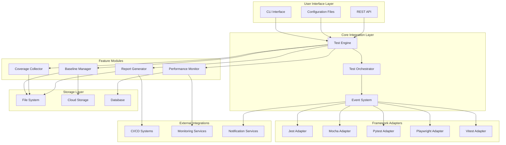
```mermaid
graph TB
    subgraph "User Interface Layer"
        CLI[CLI Interface]
        Config[Configuration Files]
        API[REST API]
    end

    subgraph "Core Integration Layer"
        Engine[Test Engine]
        Orchestrator[Test Orchestrator]
        Events[Event System]
    end

    subgraph "Framework Adapters"
        JestAdapter[Jest Adapter]
        MochaAdapter[Mocha Adapter]
        PytestAdapter[Pytest Adapter]
        PlaywrightAdapter[Playwright Adapter]
        VitestAdapter[Vitest Adapter]
    end

    subgraph "Feature Modules"
        Baseline[Baseline Manager]
        Performance[Performance Monitor]
        Coverage[Coverage Collector]
        Reports[Report Generator]
    end

    subgraph "Storage Layer"
        FileSystem[File System]
        Cloud[Cloud Storage]
        Database[Database]
    end

    subgraph "External Integrations"
        CI[CI/CD Systems]
        Monitoring[Monitoring Services]
        Notifications[Notification Services]
    end

    CLI --> Engine
    Config --> Engine
    API --> Engine

    Engine --> Orchestrator
    Orchestrator --> Events

    Events --> JestAdapter
    Events --> MochaAdapter
    Events --> PytestAdapter
    Events --> PlaywrightAdapter
    Events --> VitestAdapter

    Engine --> Baseline
    Engine --> Performance
    Engine --> Coverage
    Engine --> Reports

    Baseline --> FileSystem
    Baseline --> Cloud
    Performance --> Database
    Coverage --> FileSystem
    Reports --> FileSystem

    Reports --> CI
    Performance --> Monitoring
    Events --> Notifications
```

## Core Components

### Test Engine

The Test Engine is the central orchestrator that coordinates all testing activities.

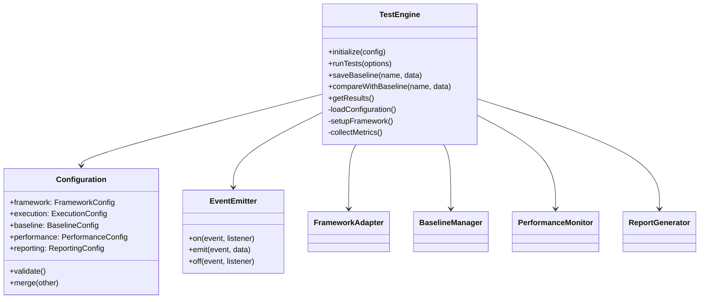
```mermaid
classDiagram
    class TestEngine {
        +initialize(config)
        +runTests(options)
        +saveBaseline(name, data)
        +compareWithBaseline(name, data)
        +getResults()
        -loadConfiguration()
        -setupFramework()
        -collectMetrics()
    }

    class Configuration {
        +framework: FrameworkConfig
        +execution: ExecutionConfig
        +baseline: BaselineConfig
        +performance: PerformanceConfig
        +reporting: ReportingConfig
        +validate()
        +merge(other)
    }

    class EventEmitter {
        +on(event, listener)
        +emit(event, data)
        +off(event, listener)
    }

    TestEngine --> Configuration
    TestEngine --> EventEmitter
    TestEngine --> FrameworkAdapter
    TestEngine --> BaselineManager
    TestEngine --> PerformanceMonitor
    TestEngine --> ReportGenerator
```

### Framework Detection and Adaptation

The system automatically detects and adapts to different testing frameworks through a plugin-based architecture.

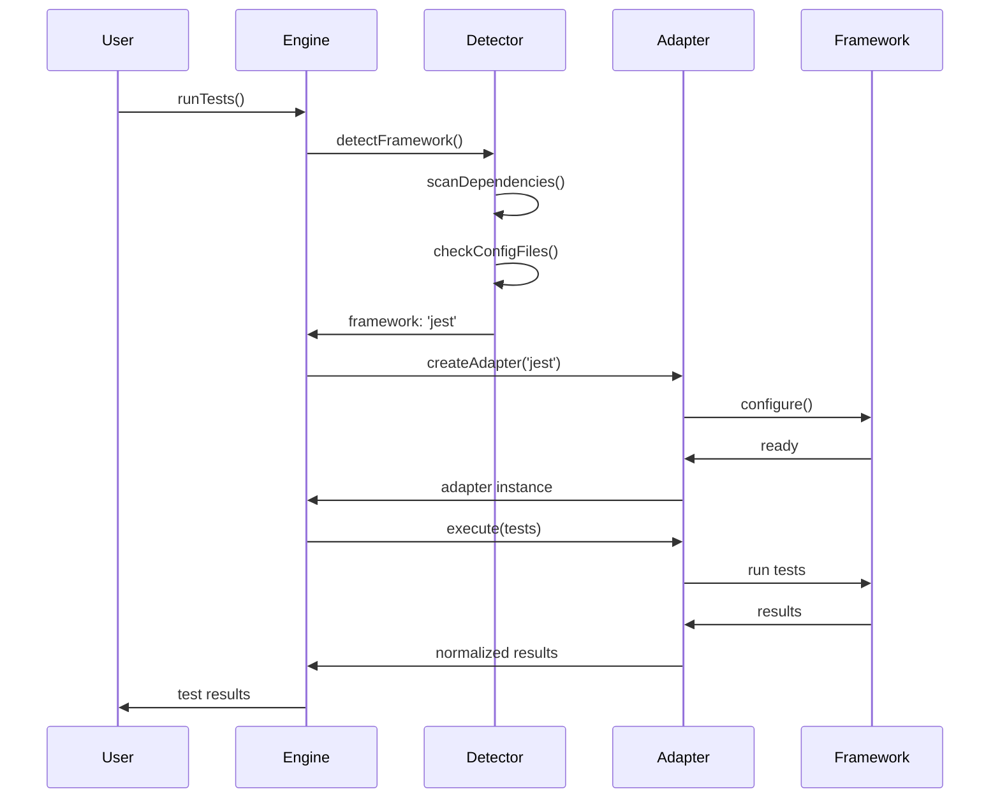
```mermaid
sequenceDiagram
    participant User
    participant Engine
    participant Detector
    participant Adapter
    participant Framework

    User->>Engine: runTests()
    Engine->>Detector: detectFramework()
    Detector->>Detector: scanDependencies()
    Detector->>Detector: checkConfigFiles()
    Detector->>Engine: framework: 'jest'
    Engine->>Adapter: createAdapter('jest')
    Adapter->>Framework: configure()
    Framework->>Adapter: ready
    Adapter->>Engine: adapter instance
    Engine->>Adapter: execute(tests)
    Adapter->>Framework: run tests
    Framework->>Adapter: results
    Adapter->>Engine: normalized results
    Engine->>User: test results
```

### Event-Driven Architecture

The system uses an event-driven architecture to maintain loose coupling between components.

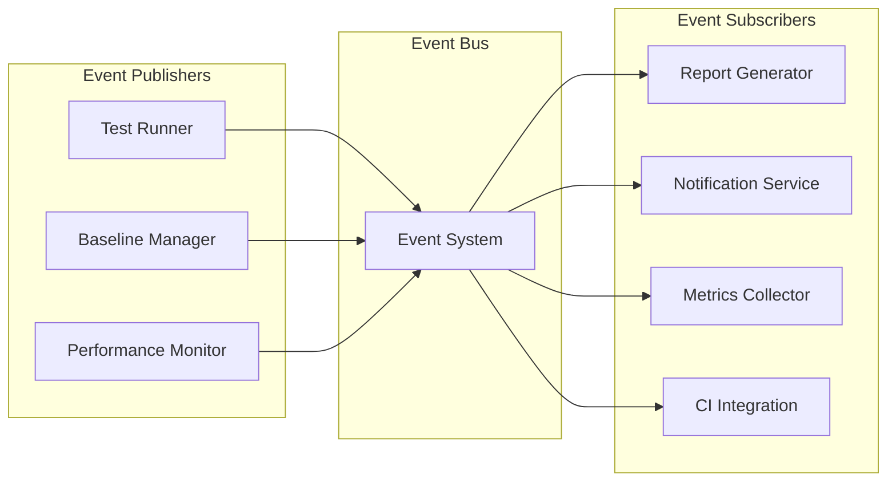
```mermaid
graph LR
    subgraph "Event Publishers"
        TestRunner[Test Runner]
        BaselineManager[Baseline Manager]
        PerformanceMonitor[Performance Monitor]
    end

    subgraph "Event Bus"
        EventSystem[Event System]
    end

    subgraph "Event Subscribers"
        Reporter[Report Generator]
        Notifier[Notification Service]
        MetricsCollector[Metrics Collector]
        CIIntegration[CI Integration]
    end

    TestRunner --> EventSystem
    BaselineManager --> EventSystem
    PerformanceMonitor --> EventSystem

    EventSystem --> Reporter
    EventSystem --> Notifier
    EventSystem --> MetricsCollector
    EventSystem --> CIIntegration
```

#### Event Types

| Event | Description | Payload |
|-------|-------------|---------|
| `test:start` | Test execution begins | `{ framework, config, timestamp }` |
| `test:complete` | Test execution completes | `{ results, duration, framework }` |
| `test:failed` | Test execution fails | `{ error, framework, context }` |
| `baseline:created` | New baseline saved | `{ name, data, timestamp }` |
| `baseline:compared` | Baseline comparison done | `{ name, current, baseline, diff }` |
| `performance:warning` | Performance threshold exceeded | `{ metric, threshold, actual }` |
| `coverage:collected` | Coverage data collected | `{ coverage, thresholds }` |
| `report:generated` | Report generation complete | `{ format, path, size }` |

## Framework Adapters

Each testing framework has a dedicated adapter that translates between the framework's native API and the unified integration API.

### Base Adapter Interface

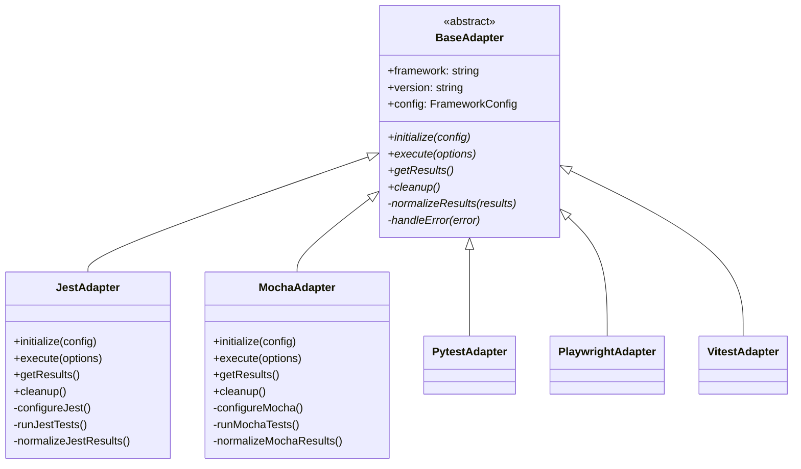
```mermaid
classDiagram
    class BaseAdapter {
        <<abstract>>
        +framework: string
        +version: string
        +config: FrameworkConfig
        +initialize(config)*
        +execute(options)*
        +getResults()*
        +cleanup()*
        -normalizeResults(results)*
        -handleError(error)*
    }

    class JestAdapter {
        +initialize(config)
        +execute(options)
        +getResults()
        +cleanup()
        -configureJest()
        -runJestTests()
        -normalizeJestResults()
    }

    class MochaAdapter {
        +initialize(config)
        +execute(options)
        +getResults()
        +cleanup()
        -configureMocha()
        -runMochaTests()
        -normalizeMochaResults()
    }

    BaseAdapter <|-- JestAdapter
    BaseAdapter <|-- MochaAdapter
    BaseAdapter <|-- PytestAdapter
    BaseAdapter <|-- PlaywrightAdapter
    BaseAdapter <|-- VitestAdapter
```

### Adapter Lifecycle

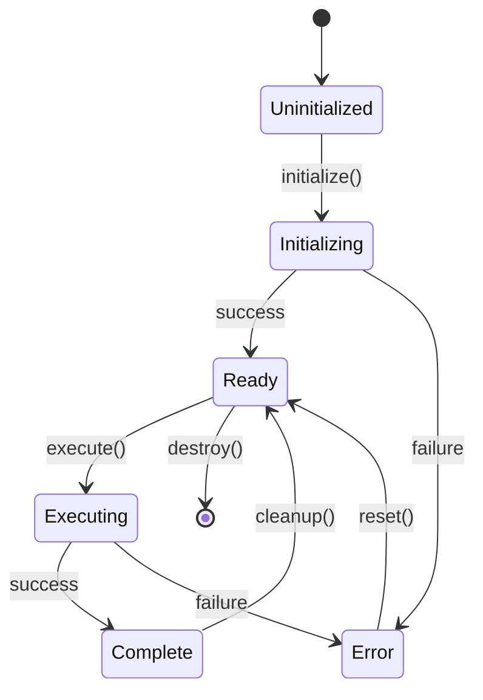
```mermaid
stateDiagram-v2
    [*] --> Uninitialized
    Uninitialized --> Initializing: initialize()
    Initializing --> Ready: success
    Initializing --> Error: failure
    Ready --> Executing: execute()
    Executing --> Complete: success
    Executing --> Error: failure
    Complete --> Ready: cleanup()
    Error --> Ready: reset()
    Ready --> [*]: destroy()
```

## Data Flow

### Test Execution Flow

```mermaid
flowchart TD
    Start([Start Test Run]) --> LoadConfig[Load Configuration]
    LoadConfig --> DetectFramework[Detect Framework]
    DetectFramework --> CreateAdapter[Create Framework Adapter]
    CreateAdapter --> InitBaseline[Initialize Baseline Manager]
    InitBaseline --> InitPerformance[Initialize Performance Monitor]
    InitPerformance --> StartMonitoring[Start Performance Monitoring]
    StartMonitoring --> ExecuteTests[Execute Tests]

    ExecuteTests --> CollectResults[Collect Test Results]
    CollectResults --> CollectCoverage[Collect Coverage Data]
    CollectCoverage --> CollectMetrics[Collect Performance Metrics]
    CollectMetrics --> CompareBaseline{Compare with Baseline?}

    CompareBaseline -->|Yes| LoadBaseline[Load Baseline Data]
    CompareBaseline -->|No| GenerateReports[Generate Reports]
    LoadBaseline --> PerformComparison[Perform Comparison]
    PerformComparison --> CheckRegression{Regression Detected?}

    CheckRegression -->|Yes| HandleRegression[Handle Regression]
    CheckRegression -->|No| GenerateReports
    HandleRegression --> GenerateReports

    GenerateReports --> SaveBaseline{Save New Baseline?}
    SaveBaseline -->|Yes| StoreBaseline[Store Baseline Data]
    SaveBaseline -->|No| NotifyResults[Notify Results]
    StoreBaseline --> NotifyResults

    NotifyResults --> Cleanup[Cleanup Resources]
    Cleanup --> End([End Test Run])
```

### Baseline Management Flow

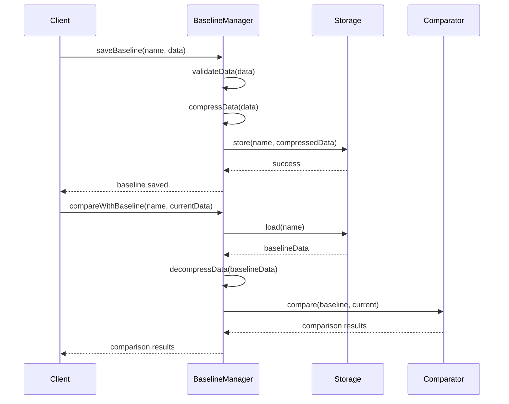
```mermaid
sequenceDiagram
    participant Client
    participant BaselineManager
    participant Storage
    participant Comparator

    Client->>BaselineManager: saveBaseline(name, data)
    BaselineManager->>BaselineManager: validateData(data)
    BaselineManager->>BaselineManager: compressData(data)
    BaselineManager->>Storage: store(name, compressedData)
    Storage-->>BaselineManager: success
    BaselineManager-->>Client: baseline saved

    Client->>BaselineManager: compareWithBaseline(name, currentData)
    BaselineManager->>Storage: load(name)
    Storage-->>BaselineManager: baselineData
    BaselineManager->>BaselineManager: decompressData(baselineData)
    BaselineManager->>Comparator: compare(baseline, current)
    Comparator-->>BaselineManager: comparison results
    BaselineManager-->>Client: comparison results
```

## Storage Architecture

### Storage Abstraction Layer

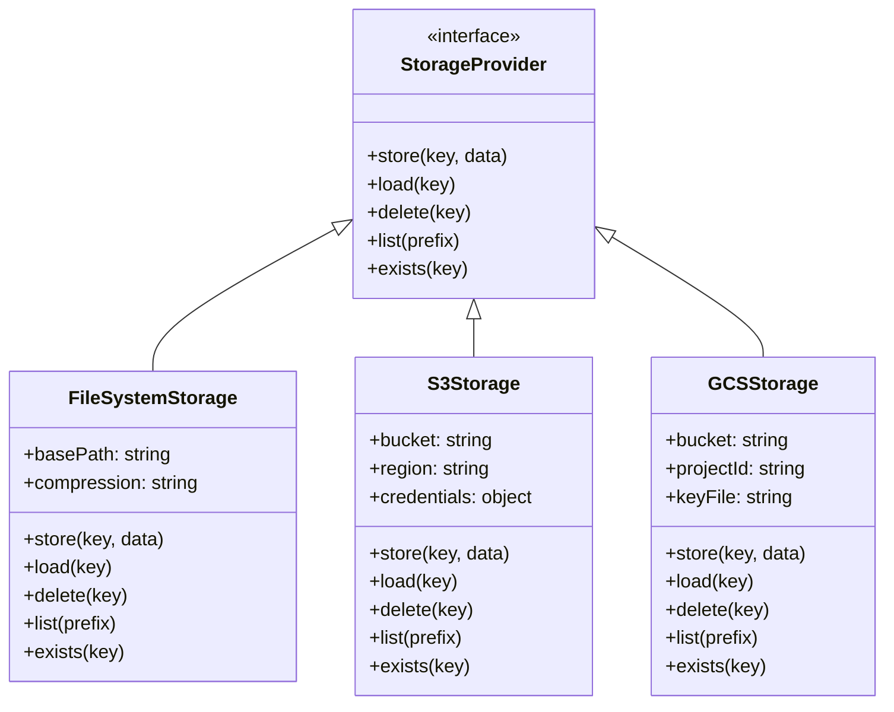
```mermaid
classDiagram
    class StorageProvider {
        <<interface>>
        +store(key, data)
        +load(key)
        +delete(key)
        +list(prefix)
        +exists(key)
    }

    class FileSystemStorage {
        +basePath: string
        +compression: string
        +store(key, data)
        +load(key)
        +delete(key)
        +list(prefix)
        +exists(key)
    }

    class S3Storage {
        +bucket: string
        +region: string
        +credentials: object
        +store(key, data)
        +load(key)
        +delete(key)
        +list(prefix)
        +exists(key)
    }

    class GCSStorage {
        +bucket: string
        +projectId: string
        +keyFile: string
        +store(key, data)
        +load(key)
        +delete(key)
        +list(prefix)
        +exists(key)
    }

    StorageProvider <|-- FileSystemStorage
    StorageProvider <|-- S3Storage
    StorageProvider <|-- GCSStorage
```

### Data Serialization

```mermaid
graph LR
    subgraph "Input Data"
        TestResults[Test Results]
        Coverage[Coverage Data]
        Performance[Performance Metrics]
    end

    subgraph "Processing Pipeline"
        Normalize[Normalize Data]
        Validate[Validate Schema]
        Compress[Compress Data]
        Encrypt[Encrypt (Optional)]
    end

    subgraph "Storage Formats"
        JSON[JSON Format]
        Binary[Binary Format]
        Archive[Compressed Archive]
    end

    TestResults --> Normalize
    Coverage --> Normalize
    Performance --> Normalize

    Normalize --> Validate
    Validate --> Compress
    Compress --> Encrypt

    Encrypt --> JSON
    Encrypt --> Binary
    Encrypt --> Archive
```

## Performance Monitoring

### Metrics Collection Architecture

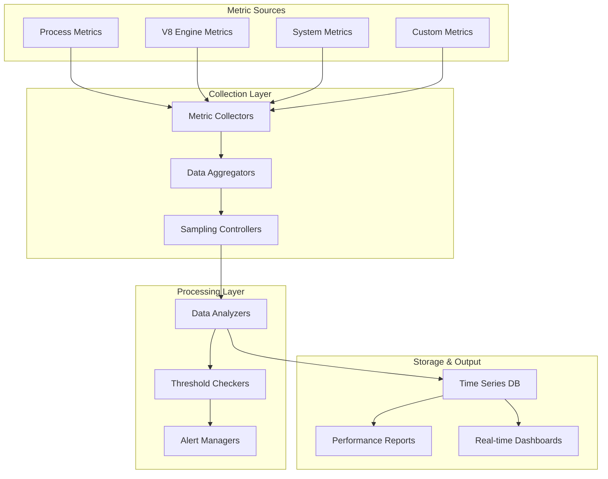
```mermaid
graph TB
    subgraph "Metric Sources"
        ProcessMetrics[Process Metrics]
        V8Metrics[V8 Engine Metrics]
        SystemMetrics[System Metrics]
        CustomMetrics[Custom Metrics]
    end

    subgraph "Collection Layer"
        Collectors[Metric Collectors]
        Aggregators[Data Aggregators]
        Samplers[Sampling Controllers]
    end

    subgraph "Processing Layer"
        Analyzers[Data Analyzers]
        Thresholds[Threshold Checkers]
        Alerts[Alert Managers]
    end

    subgraph "Storage & Output"
        TimeSeries[Time Series DB]
        Reports[Performance Reports]
        Dashboards[Real-time Dashboards]
    end

    ProcessMetrics --> Collectors
    V8Metrics --> Collectors
    SystemMetrics --> Collectors
    CustomMetrics --> Collectors

    Collectors --> Aggregators
    Aggregators --> Samplers

    Samplers --> Analyzers
    Analyzers --> Thresholds
    Thresholds --> Alerts

    Analyzers --> TimeSeries
    TimeSeries --> Reports
    TimeSeries --> Dashboards
```

### Performance Data Model

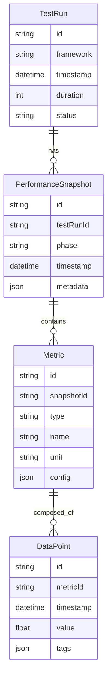
```mermaid
erDiagram
    TestRun ||--o{ PerformanceSnapshot : has
    PerformanceSnapshot ||--o{ Metric : contains
    Metric ||--o{ DataPoint : composed_of

    TestRun {
        string id
        string framework
        datetime timestamp
        int duration
        string status
    }

    PerformanceSnapshot {
        string id
        string testRunId
        string phase
        datetime timestamp
        json metadata
    }

    Metric {
        string id
        string snapshotId
        string type
        string name
        string unit
        json config
    }

    DataPoint {
        string id
        string metricId
        datetime timestamp
        float value
        json tags
    }
```

## Security Architecture

### Data Protection

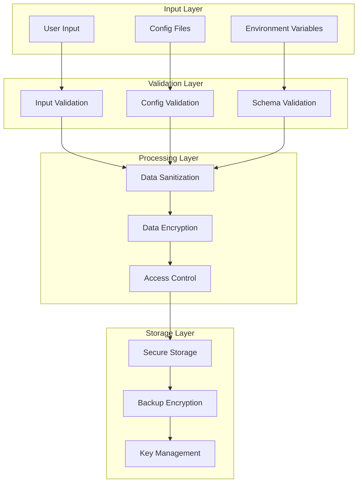
```mermaid
graph TB
    subgraph "Input Layer"
        UserInput[User Input]
        ConfigFiles[Config Files]
        EnvVars[Environment Variables]
    end

    subgraph "Validation Layer"
        InputValidation[Input Validation]
        ConfigValidation[Config Validation]
        SchemaValidation[Schema Validation]
    end

    subgraph "Processing Layer"
        Sanitization[Data Sanitization]
        Encryption[Data Encryption]
        AccessControl[Access Control]
    end

    subgraph "Storage Layer"
        SecureStorage[Secure Storage]
        BackupEncryption[Backup Encryption]
        KeyManagement[Key Management]
    end

    UserInput --> InputValidation
    ConfigFiles --> ConfigValidation
    EnvVars --> SchemaValidation

    InputValidation --> Sanitization
    ConfigValidation --> Sanitization
    SchemaValidation --> Sanitization

    Sanitization --> Encryption
    Encryption --> AccessControl

    AccessControl --> SecureStorage
    SecureStorage --> BackupEncryption
    BackupEncryption --> KeyManagement
```

### Authentication and Authorization

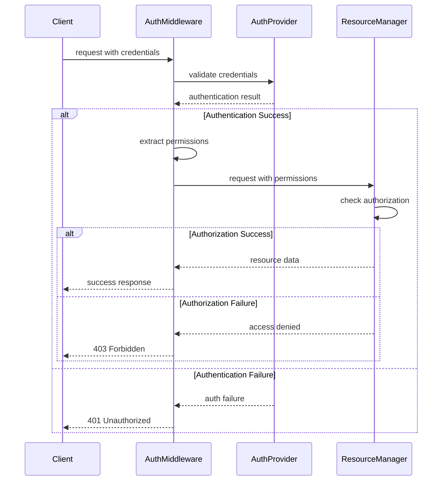
```mermaid
sequenceDiagram
    participant Client
    participant AuthMiddleware
    participant AuthProvider
    participant ResourceManager

    Client->>AuthMiddleware: request with credentials
    AuthMiddleware->>AuthProvider: validate credentials
    AuthProvider-->>AuthMiddleware: authentication result

    alt Authentication Success
        AuthMiddleware->>AuthMiddleware: extract permissions
        AuthMiddleware->>ResourceManager: request with permissions
        ResourceManager->>ResourceManager: check authorization

        alt Authorization Success
            ResourceManager-->>AuthMiddleware: resource data
            AuthMiddleware-->>Client: success response
        else Authorization Failure
            ResourceManager-->>AuthMiddleware: access denied
            AuthMiddleware-->>Client: 403 Forbidden
        end
    else Authentication Failure
        AuthProvider-->>AuthMiddleware: auth failure
        AuthMiddleware-->>Client: 401 Unauthorized
    end
```

## Scalability and Performance

### Horizontal Scaling

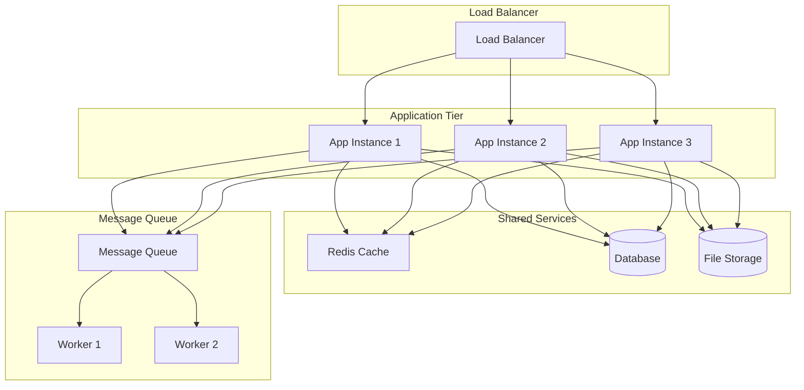
```mermaid
graph TB
    subgraph "Load Balancer"
        LB[Load Balancer]
    end

    subgraph "Application Tier"
        App1[App Instance 1]
        App2[App Instance 2]
        App3[App Instance 3]
    end

    subgraph "Shared Services"
        Redis[Redis Cache]
        Database[(Database)]
        Storage[(File Storage)]
    end

    subgraph "Message Queue"
        Queue[Message Queue]
        Worker1[Worker 1]
        Worker2[Worker 2]
    end

    LB --> App1
    LB --> App2
    LB --> App3

    App1 --> Redis
    App2 --> Redis
    App3 --> Redis

    App1 --> Database
    App2 --> Database
    App3 --> Database

    App1 --> Storage
    App2 --> Storage
    App3 --> Storage

    App1 --> Queue
    App2 --> Queue
    App3 --> Queue

    Queue --> Worker1
    Queue --> Worker2
```

### Caching Strategy

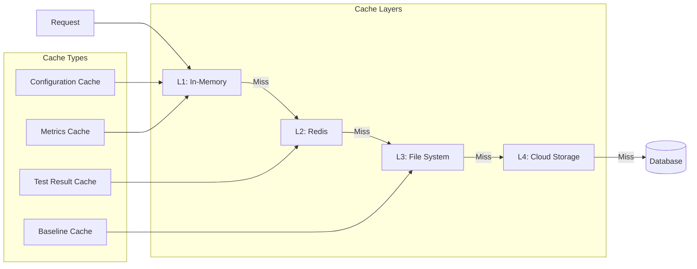
```mermaid
graph LR
    subgraph "Cache Layers"
        L1[L1: In-Memory]
        L2[L2: Redis]
        L3[L3: File System]
        L4[L4: Cloud Storage]
    end

    subgraph "Cache Types"
        ConfigCache[Configuration Cache]
        ResultCache[Test Result Cache]
        BaselineCache[Baseline Cache]
        MetricCache[Metrics Cache]
    end

    Request --> L1
    L1 -->|Miss| L2
    L2 -->|Miss| L3
    L3 -->|Miss| L4
    L4 -->|Miss| Database[(Database)]

    ConfigCache --> L1
    ResultCache --> L2
    BaselineCache --> L3
    MetricCache --> L1
```

## Plugin Architecture

### Plugin System Design

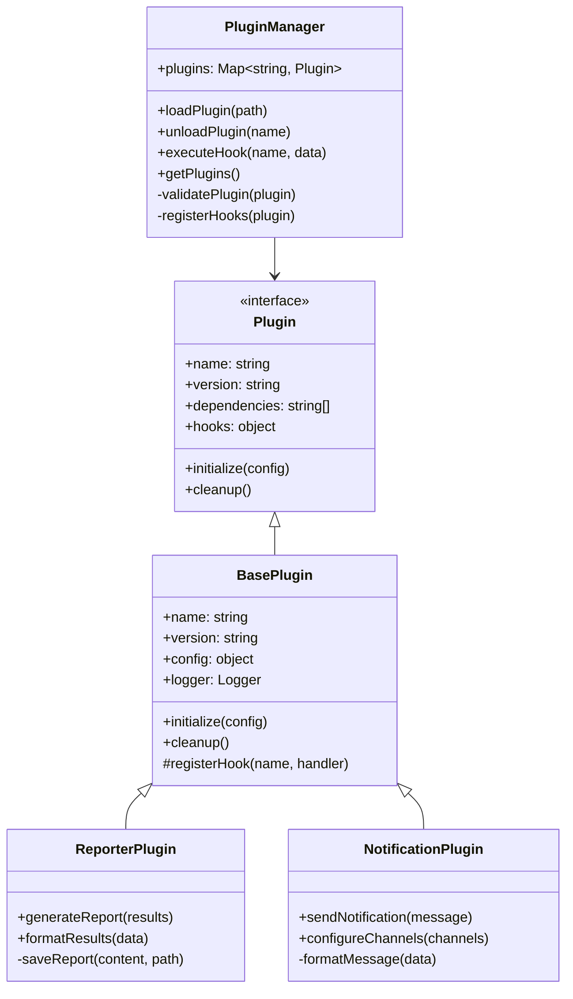
```mermaid
classDiagram
    class PluginManager {
        +plugins: Map~string, Plugin~
        +loadPlugin(path)
        +unloadPlugin(name)
        +executeHook(name, data)
        +getPlugins()
        -validatePlugin(plugin)
        -registerHooks(plugin)
    }

    class Plugin {
        <<interface>>
        +name: string
        +version: string
        +dependencies: string[]
        +hooks: object
        +initialize(config)
        +cleanup()
    }

    class BasePlugin {
        +name: string
        +version: string
        +config: object
        +logger: Logger
        +initialize(config)
        +cleanup()
        #registerHook(name, handler)
    }

    class ReporterPlugin {
        +generateReport(results)
        +formatResults(data)
        -saveReport(content, path)
    }

    class NotificationPlugin {
        +sendNotification(message)
        +configureChannels(channels)
        -formatMessage(data)
    }

    PluginManager --> Plugin
    Plugin <|-- BasePlugin
    BasePlugin <|-- ReporterPlugin
    BasePlugin <|-- NotificationPlugin
```

### Plugin Lifecycle

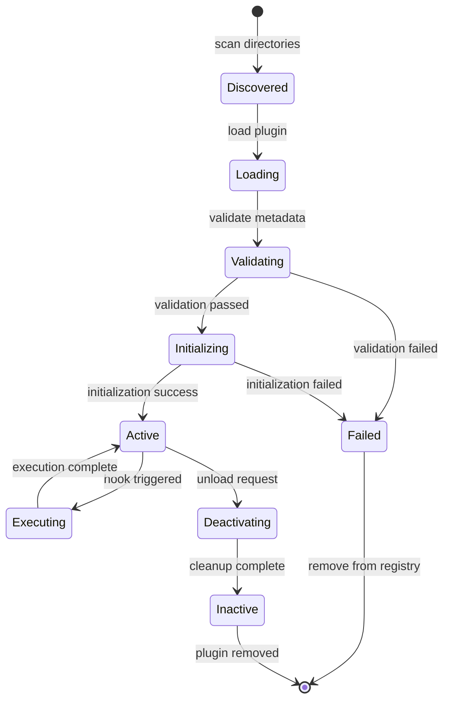
```mermaid
stateDiagram-v2
    [*] --> Discovered: scan directories
    Discovered --> Loading: load plugin
    Loading --> Validating: validate metadata
    Validating --> Initializing: validation passed
    Validating --> Failed: validation failed
    Initializing --> Active: initialization success
    Initializing --> Failed: initialization failed
    Active --> Executing: hook triggered
    Executing --> Active: execution complete
    Active --> Deactivating: unload request
    Deactivating --> Inactive: cleanup complete
    Failed --> [*]: remove from registry
    Inactive --> [*]: plugin removed
```

## API Design

### REST API Architecture

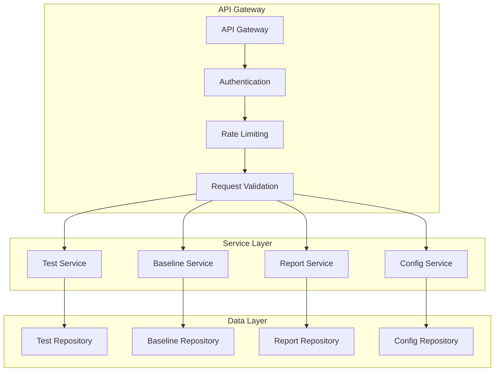
```mermaid
graph TB
    subgraph "API Gateway"
        Gateway[API Gateway]
        Auth[Authentication]
        RateLimit[Rate Limiting]
        Validation[Request Validation]
    end

    subgraph "Service Layer"
        TestService[Test Service]
        BaselineService[Baseline Service]
        ReportService[Report Service]
        ConfigService[Config Service]
    end

    subgraph "Data Layer"
        TestRepo[Test Repository]
        BaselineRepo[Baseline Repository]
        ReportRepo[Report Repository]
        ConfigRepo[Config Repository]
    end

    Gateway --> Auth
    Auth --> RateLimit
    RateLimit --> Validation

    Validation --> TestService
    Validation --> BaselineService
    Validation --> ReportService
    Validation --> ConfigService

    TestService --> TestRepo
    BaselineService --> BaselineRepo
    ReportService --> ReportRepo
    ConfigService --> ConfigRepo
```

### WebSocket Event Streaming

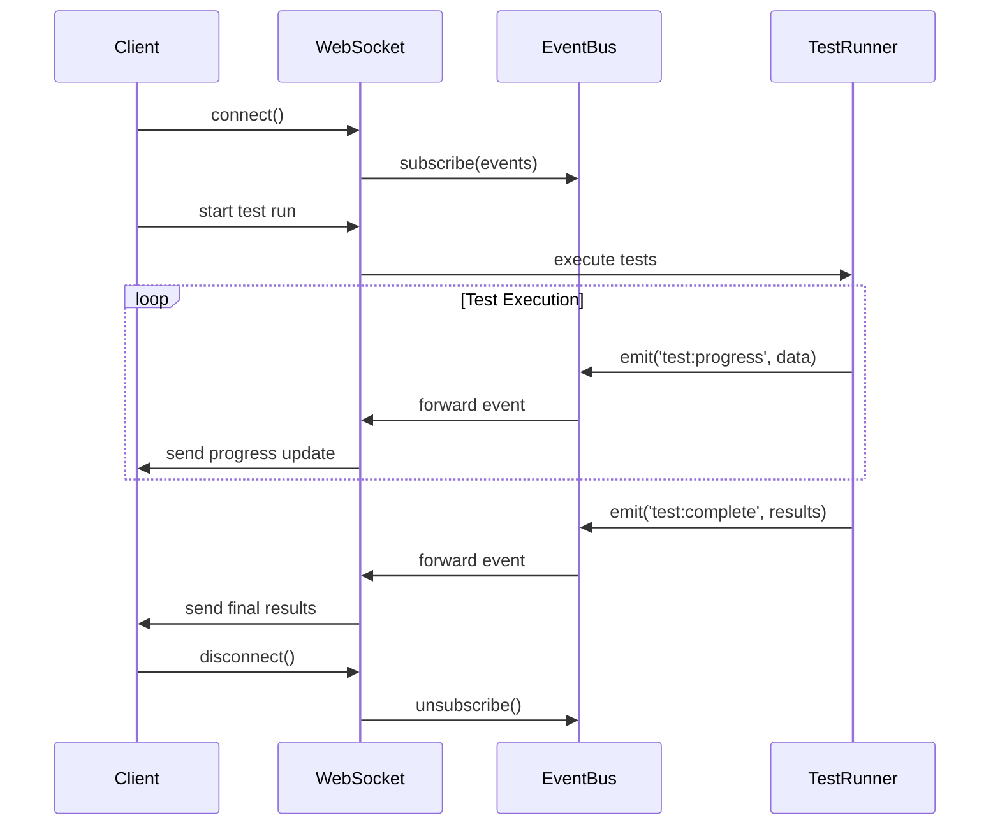
```mermaid
sequenceDiagram
    participant Client
    participant WebSocket
    participant EventBus
    participant TestRunner

    Client->>WebSocket: connect()
    WebSocket->>EventBus: subscribe(events)

    Client->>WebSocket: start test run
    WebSocket->>TestRunner: execute tests

    loop Test Execution
        TestRunner->>EventBus: emit('test:progress', data)
        EventBus->>WebSocket: forward event
        WebSocket->>Client: send progress update
    end

    TestRunner->>EventBus: emit('test:complete', results)
    EventBus->>WebSocket: forward event
    WebSocket->>Client: send final results

    Client->>WebSocket: disconnect()
    WebSocket->>EventBus: unsubscribe()
```

## Deployment Architecture

### Container Deployment

```mermaid
graph TB
    subgraph "Kubernetes Cluster"
        subgraph "Application Pods"
            App1[App Pod 1]
            App2[App Pod 2]
            App3[App Pod 3]
        end

        subgraph "Storage"
            PVC[Persistent Volume]
            ConfigMap[Config Map]
            Secret[Secrets]
        end

        subgraph "Services"
            Service[ClusterIP Service]
            Ingress[Ingress Controller]
        end

        subgraph "Monitoring"
            Prometheus[Prometheus]
            Grafana[Grafana]
        end
    end

    subgraph "External Services"
        Database[(External Database)]
        CloudStorage[(Cloud Storage)]
        Redis[(Redis Cache)]
    end

    Ingress --> Service
    Service --> App1
    Service --> App2
    Service --> App3

    App1 --> PVC
    App2 --> PVC
    App3 --> PVC

    App1 --> ConfigMap
    App2 --> ConfigMap
    App3 --> ConfigMap

    App1 --> Secret
    App2 --> Secret
    App3 --> Secret

    App1 --> Database
    App2 --> Database
    App3 --> Database

    App1 --> CloudStorage
    App2 --> CloudStorage
    App3 --> CloudStorage

    App1 --> Redis
    App2 --> Redis
    App3 --> Redis

    Prometheus --> App1
    Prometheus --> App2
    Prometheus --> App3

    Grafana --> Prometheus
```

## Design Patterns and Principles

### Design Patterns Used

1. **Strategy Pattern** - Framework adapters
2. **Observer Pattern** - Event system
3. **Factory Pattern** - Plugin creation
4. **Singleton Pattern** - Configuration management
5. **Command Pattern** - Test execution
6. **Template Method** - Report generation
7. **Decorator Pattern** - Middleware layers
8. **Repository Pattern** - Data access

### SOLID Principles

- **Single Responsibility** - Each component has one reason to change
- **Open/Closed** - Open for extension via plugins, closed for modification
- **Liskov Substitution** - Framework adapters are interchangeable
- **Interface Segregation** - Small, focused interfaces
- **Dependency Inversion** - Depend on abstractions, not concretions

This architecture provides a robust, scalable, and maintainable foundation for the Test Framework Integrations system, supporting multiple testing frameworks while maintaining consistency and extensibility.