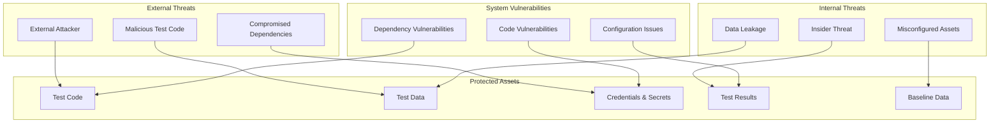
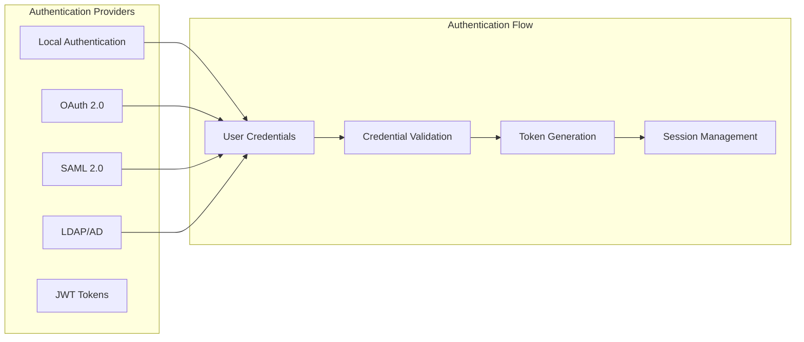
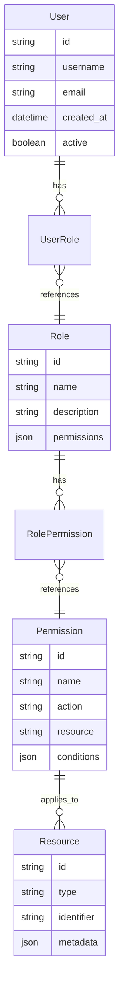
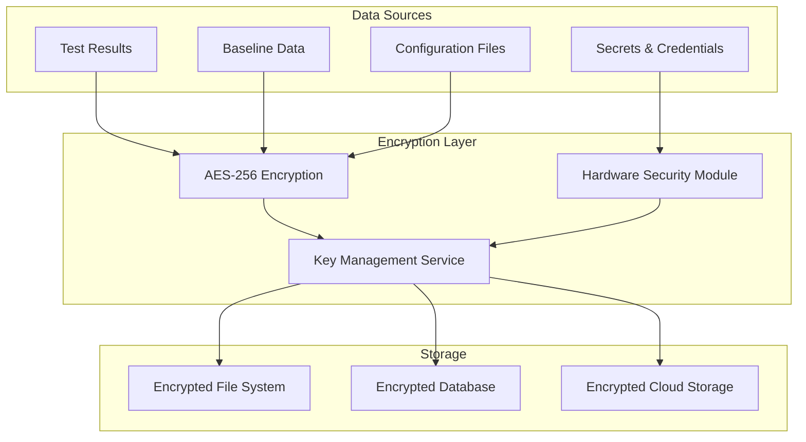
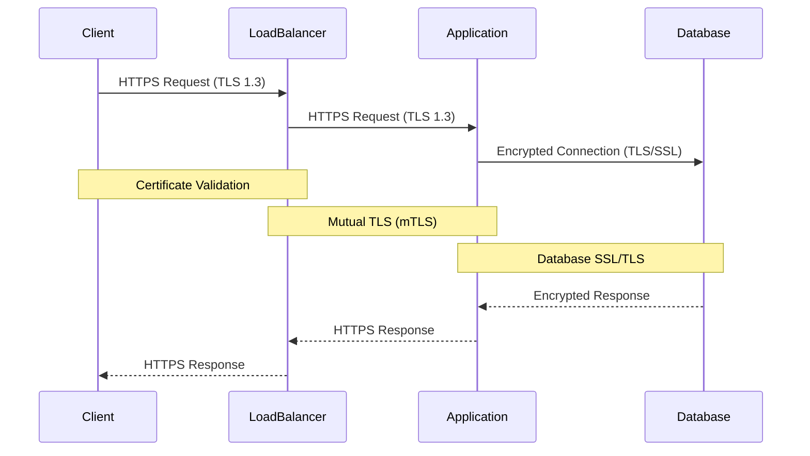
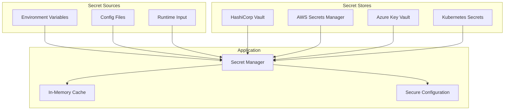
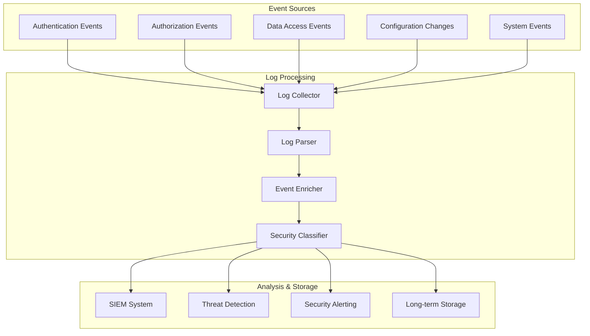
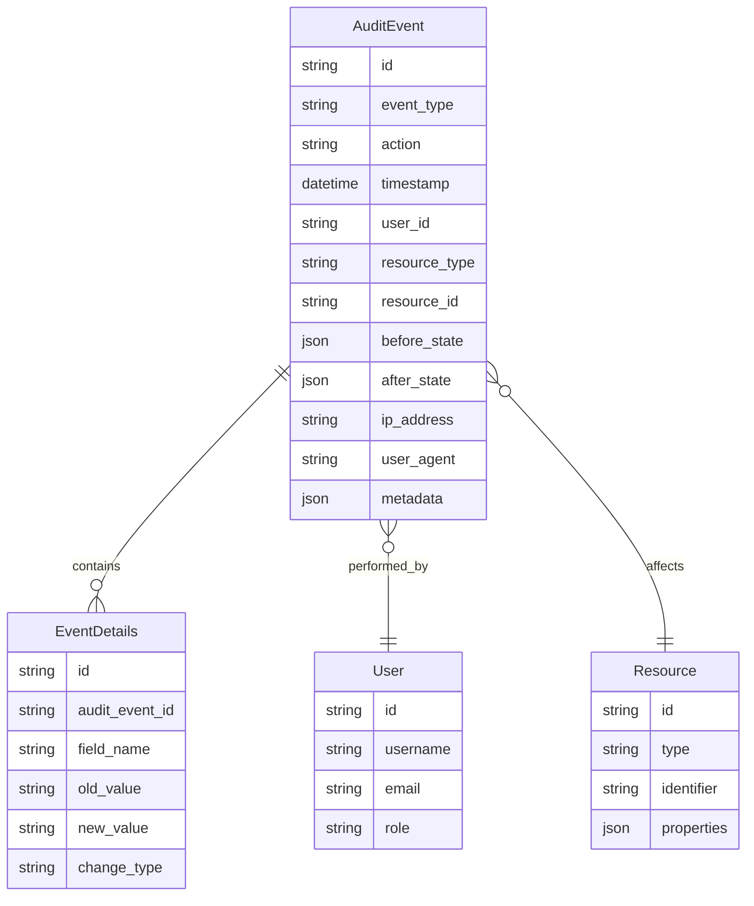
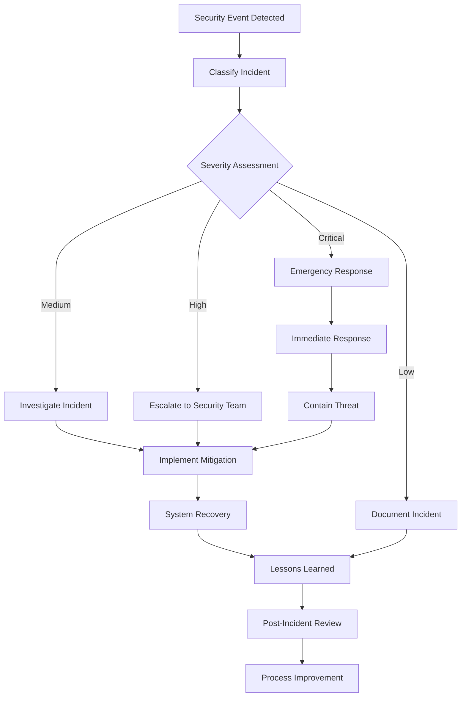

# Security Architecture

## Overview

The Test Framework Integrations system implements a comprehensive security model to protect sensitive test data, configuration, and execution environments. This document outlines the security architecture, threat model, and protective measures implemented throughout the system.

## Security Principles

### Core Security Principles

1. **Defense in Depth** - Multiple layers of security controls
2. **Least Privilege** - Minimal required permissions
3. **Zero Trust** - Verify all requests and access
4. **Data Protection** - Encrypt data at rest and in transit
5. **Audit Trail** - Log all security-relevant events
6. **Secure by Default** - Secure configuration out of the box

### Threat Model



## Authentication and Authorization

### Authentication Methods



### API Authentication

```javascript
// API Key Authentication
const apiKeyAuth = {
  type: 'apiKey',
  in: 'header',
  name: 'X-API-Key',
  description: 'API key for authentication'
};

// JWT Bearer Token
const jwtAuth = {
  type: 'http',
  scheme: 'bearer',
  bearerFormat: 'JWT',
  description: 'JWT token for authentication'
};

// OAuth 2.0
const oauth2Auth = {
  type: 'oauth2',
  flows: {
    authorizationCode: {
      authorizationUrl: 'https://auth.example.com/oauth/authorize',
      tokenUrl: 'https://auth.example.com/oauth/token',
      scopes: {
        'read': 'Read access to test data',
        'write': 'Write access to test data',
        'admin': 'Administrative access'
      }
    }
  }
};
```

### Role-Based Access Control (RBAC)



### Permission Matrix

| Role | Read Tests | Write Tests | Execute Tests | Manage Baselines | Admin Config |
|------|------------|-------------|---------------|------------------|--------------|
| **Viewer** | ✅ | ❌ | ❌ | ❌ | ❌ |
| **Developer** | ✅ | ✅ | ✅ | ❌ | ❌ |
| **Test Lead** | ✅ | ✅ | ✅ | ✅ | ❌ |
| **Admin** | ✅ | ✅ | ✅ | ✅ | ✅ |

## Data Protection

### Encryption at Rest



### Encryption in Transit



### Key Management

```javascript
// Key management configuration
const keyManagement = {
  provider: 'vault', // or 'aws-kms', 'azure-key-vault', 'gcp-kms'

  vault: {
    address: process.env.VAULT_ADDR,
    token: process.env.VAULT_TOKEN,
    transitPath: 'transit',
    keyName: 'test-integration-key'
  },

  encryption: {
    algorithm: 'aes-256-gcm',
    keyRotation: {
      enabled: true,
      interval: '30d',
      retainVersions: 3
    }
  },

  keyDerivation: {
    algorithm: 'pbkdf2',
    iterations: 100000,
    saltLength: 32
  }
};

// Example encryption/decryption
class DataProtection {
  async encrypt(data, context = {}) {
    const key = await this.getEncryptionKey(context);
    const cipher = crypto.createCipher('aes-256-gcm', key);

    let encrypted = cipher.update(JSON.stringify(data), 'utf8', 'hex');
    encrypted += cipher.final('hex');

    const authTag = cipher.getAuthTag();

    return {
      data: encrypted,
      authTag: authTag.toString('hex'),
      algorithm: 'aes-256-gcm',
      timestamp: new Date().toISOString()
    };
  }

  async decrypt(encryptedData, context = {}) {
    const key = await this.getEncryptionKey(context);
    const decipher = crypto.createDecipher('aes-256-gcm', key);

    decipher.setAuthTag(Buffer.from(encryptedData.authTag, 'hex'));

    let decrypted = decipher.update(encryptedData.data, 'hex', 'utf8');
    decrypted += decipher.final('utf8');

    return JSON.parse(decrypted);
  }
}
```

## Secrets Management

### Secrets Storage



### Secret Types and Handling

```javascript
// Secret type definitions
const SecretTypes = {
  API_KEY: 'api_key',
  DATABASE_PASSWORD: 'database_password',
  ENCRYPTION_KEY: 'encryption_key',
  CERTIFICATE: 'certificate',
  OAUTH_SECRET: 'oauth_secret'
};

// Secret configuration
const secretsConfig = {
  providers: [
    {
      name: 'vault',
      type: 'hashicorp-vault',
      config: {
        address: process.env.VAULT_ADDR,
        token: process.env.VAULT_TOKEN,
        mount: 'secret'
      }
    },
    {
      name: 'env',
      type: 'environment',
      config: {
        prefix: 'TEST_INTEGRATION_'
      }
    }
  ],

  secrets: {
    [SecretTypes.API_KEY]: {
      provider: 'vault',
      path: 'api-keys/integration',
      ttl: 3600, // 1 hour cache
      rotation: {
        enabled: true,
        interval: '7d'
      }
    },
    [SecretTypes.DATABASE_PASSWORD]: {
      provider: 'vault',
      path: 'database/postgres',
      ttl: 1800, // 30 minutes cache
      rotation: {
        enabled: true,
        interval: '30d'
      }
    }
  }
};

// Secret manager implementation
class SecretManager {
  constructor(config) {
    this.config = config;
    this.cache = new Map();
    this.providers = new Map();
  }

  async getSecret(type, context = {}) {
    const secretConfig = this.config.secrets[type];
    if (!secretConfig) {
      throw new Error(`Unknown secret type: ${type}`);
    }

    const cacheKey = this.getCacheKey(type, context);
    const cached = this.cache.get(cacheKey);

    if (cached && !this.isExpired(cached)) {
      return cached.value;
    }

    const provider = this.providers.get(secretConfig.provider);
    const secret = await provider.getSecret(secretConfig.path, context);

    this.cache.set(cacheKey, {
      value: secret,
      expires: Date.now() + (secretConfig.ttl * 1000)
    });

    return secret;
  }

  async rotateSecret(type) {
    const secretConfig = this.config.secrets[type];
    if (!secretConfig.rotation?.enabled) {
      return false;
    }

    const provider = this.providers.get(secretConfig.provider);
    await provider.rotateSecret(secretConfig.path);

    // Clear cache to force reload
    this.clearSecretFromCache(type);

    return true;
  }
}
```

## Input Validation and Sanitization

### Input Validation Framework

```javascript
const Joi = require('joi');

// Validation schemas
const schemas = {
  configuration: Joi.object({
    framework: Joi.object({
      type: Joi.string().valid('jest', 'mocha', 'pytest', 'playwright', 'vitest').required(),
      version: Joi.string().pattern(/^\^?\d+\.\d+\.\d+$/),
      configFile: Joi.string().pattern(/^[a-zA-Z0-9._/-]+$/)
    }).required(),

    execution: Joi.object({
      timeout: Joi.number().integer().min(1000).max(600000),
      retries: Joi.number().integer().min(0).max(5),
      maxWorkers: Joi.number().integer().min(1).max(16)
    }),

    baseline: Joi.object({
      enabled: Joi.boolean(),
      directory: Joi.string().pattern(/^[a-zA-Z0-9._/-]+$/),
      compareThreshold: Joi.number().min(0).max(1)
    })
  }),

  testRun: Joi.object({
    framework: Joi.string().required(),
    testPaths: Joi.array().items(Joi.string().pattern(/^[a-zA-Z0-9._/-]+$/)),
    options: Joi.object({
      coverage: Joi.boolean(),
      watch: Joi.boolean(),
      updateSnapshots: Joi.boolean()
    })
  }),

  baseline: Joi.object({
    name: Joi.string().alphanum().min(1).max(50).required(),
    data: Joi.object().required(),
    metadata: Joi.object({
      framework: Joi.string().required(),
      timestamp: Joi.date().iso().required(),
      version: Joi.string().required()
    })
  })
};

// Validation middleware
class ValidationMiddleware {
  static validate(schema, options = {}) {
    return (req, res, next) => {
      const { error, value } = schema.validate(req.body, {
        abortEarly: false,
        stripUnknown: true,
        ...options
      });

      if (error) {
        const details = error.details.map(detail => ({
          field: detail.path.join('.'),
          message: detail.message,
          type: detail.type
        }));

        return res.status(400).json({
          error: 'Validation failed',
          details
        });
      }

      req.validatedBody = value;
      next();
    };
  }
}
```

### Data Sanitization

```javascript
const DOMPurify = require('dompurify');
const { JSDOM } = require('jsdom');

class DataSanitizer {
  constructor() {
    const window = new JSDOM('').window;
    this.purify = DOMPurify(window);
  }

  sanitizeHtml(html) {
    return this.purify.sanitize(html, {
      ALLOWED_TAGS: ['b', 'i', 'em', 'strong', 'p', 'br'],
      ALLOWED_ATTR: []
    });
  }

  sanitizeString(str) {
    if (typeof str !== 'string') return str;

    return str
      .replace(/[<>]/g, '') // Remove potential HTML tags
      .replace(/javascript:/gi, '') // Remove javascript: protocols
      .replace(/on\w+\s*=/gi, '') // Remove event handlers
      .trim();
  }

  sanitizeObject(obj, depth = 0) {
    if (depth > 10) return {}; // Prevent deep recursion
    if (obj === null || typeof obj !== 'object') return obj;

    if (Array.isArray(obj)) {
      return obj.map(item => this.sanitizeObject(item, depth + 1));
    }

    const sanitized = {};
    for (const [key, value] of Object.entries(obj)) {
      const sanitizedKey = this.sanitizeString(key);
      if (typeof value === 'string') {
        sanitized[sanitizedKey] = this.sanitizeString(value);
      } else {
        sanitized[sanitizedKey] = this.sanitizeObject(value, depth + 1);
      }
    }

    return sanitized;
  }

  sanitizeFilePath(filePath) {
    // Prevent directory traversal
    const normalized = path.normalize(filePath);
    if (normalized.includes('..')) {
      throw new Error('Invalid file path: directory traversal detected');
    }

    // Only allow alphanumeric, dash, underscore, dot, and forward slash
    if (!/^[a-zA-Z0-9._/-]+$/.test(normalized)) {
      throw new Error('Invalid file path: contains forbidden characters');
    }

    return normalized;
  }
}
```

## Security Monitoring and Logging

### Security Event Logging



### Security Metrics

```javascript
// Security metrics collection
class SecurityMetrics {
  constructor() {
    this.metrics = {
      authenticationAttempts: new Map(),
      authorizationFailures: new Map(),
      suspiciousActivity: new Map(),
      dataAccessPatterns: new Map()
    };
  }

  recordAuthenticationAttempt(userId, success, metadata = {}) {
    const key = `${userId}:${new Date().getHours()}`;
    const attempts = this.metrics.authenticationAttempts.get(key) || [];

    attempts.push({
      timestamp: new Date(),
      success,
      ip: metadata.ip,
      userAgent: metadata.userAgent
    });

    this.metrics.authenticationAttempts.set(key, attempts);

    // Check for brute force attempts
    this.checkBruteForce(userId, attempts);
  }

  recordDataAccess(userId, resource, action, metadata = {}) {
    const pattern = `${userId}:${resource}:${action}`;
    const accesses = this.metrics.dataAccessPatterns.get(pattern) || [];

    accesses.push({
      timestamp: new Date(),
      metadata
    });

    this.metrics.dataAccessPatterns.set(pattern, accesses);

    // Check for unusual access patterns
    this.checkAccessAnomalies(userId, resource, accesses);
  }

  checkBruteForce(userId, attempts) {
    const recentFailures = attempts
      .filter(attempt => !attempt.success)
      .filter(attempt => Date.now() - attempt.timestamp.getTime() < 300000); // 5 minutes

    if (recentFailures.length >= 5) {
      this.alertSecurityEvent('brute_force_attempt', {
        userId,
        failureCount: recentFailures.length,
        timeWindow: '5 minutes'
      });
    }
  }

  checkAccessAnomalies(userId, resource, accesses) {
    const recentAccesses = accesses
      .filter(access => Date.now() - access.timestamp.getTime() < 3600000); // 1 hour

    if (recentAccesses.length > 100) {
      this.alertSecurityEvent('excessive_data_access', {
        userId,
        resource,
        accessCount: recentAccesses.length,
        timeWindow: '1 hour'
      });
    }
  }

  alertSecurityEvent(type, details) {
    const event = {
      type,
      timestamp: new Date(),
      details,
      severity: this.calculateSeverity(type)
    };

    // Send to security monitoring system
    this.sendSecurityAlert(event);
  }
}
```

## Compliance and Auditing

### Audit Trail



### Compliance Controls

```javascript
// Compliance configuration
const complianceConfig = {
  standards: ['SOC2', 'ISO27001', 'GDPR'],

  controls: {
    SOC2: {
      CC6_1: {
        name: 'Logical Access Controls',
        requirements: [
          'Multi-factor authentication',
          'Role-based access control',
          'Regular access reviews'
        ],
        implementation: 'rbac_system'
      },
      CC6_2: {
        name: 'Authentication',
        requirements: [
          'Strong password policies',
          'Account lockout policies',
          'Session management'
        ],
        implementation: 'auth_system'
      }
    },

    GDPR: {
      Article_25: {
        name: 'Data Protection by Design',
        requirements: [
          'Privacy by default',
          'Data minimization',
          'Purpose limitation'
        ],
        implementation: 'privacy_controls'
      },
      Article_32: {
        name: 'Security of Processing',
        requirements: [
          'Encryption in transit and at rest',
          'Regular security testing',
          'Incident response procedures'
        ],
        implementation: 'security_controls'
      }
    }
  },

  reporting: {
    frequency: 'quarterly',
    recipients: ['security-team@company.com', 'compliance@company.com'],
    format: 'pdf'
  }
};

// Compliance monitoring
class ComplianceMonitor {
  constructor(config) {
    this.config = config;
    this.violations = [];
  }

  async checkCompliance(standard) {
    const controls = this.config.controls[standard];
    const results = {};

    for (const [controlId, control] of Object.entries(controls)) {
      results[controlId] = await this.evaluateControl(control);
    }

    return results;
  }

  async evaluateControl(control) {
    const implementation = this.getImplementation(control.implementation);
    const status = await implementation.evaluate();

    if (!status.compliant) {
      this.violations.push({
        control: control.name,
        violation: status.violation,
        timestamp: new Date(),
        severity: status.severity
      });
    }

    return status;
  }

  generateComplianceReport(standard) {
    return {
      standard,
      timestamp: new Date(),
      status: this.getOverallStatus(standard),
      controls: this.getControlStatus(standard),
      violations: this.getViolations(standard),
      recommendations: this.getRecommendations(standard)
    };
  }
}
```

## Incident Response

### Security Incident Workflow



### Automated Response Actions

```javascript
// Incident response automation
class IncidentResponseSystem {
  constructor() {
    this.responseActions = new Map();
    this.activeIncidents = new Map();
  }

  registerResponseAction(eventType, action) {
    const actions = this.responseActions.get(eventType) || [];
    actions.push(action);
    this.responseActions.set(eventType, actions);
  }

  async handleSecurityEvent(event) {
    const incident = {
      id: this.generateIncidentId(),
      event,
      timestamp: new Date(),
      status: 'open',
      severity: this.calculateSeverity(event),
      actions: []
    };

    this.activeIncidents.set(incident.id, incident);

    // Execute automated response actions
    const actions = this.responseActions.get(event.type) || [];
    for (const action of actions) {
      try {
        const result = await action.execute(incident);
        incident.actions.push({
          action: action.name,
          result,
          timestamp: new Date()
        });
      } catch (error) {
        console.error(`Failed to execute response action ${action.name}:`, error);
      }
    }

    // Notify security team for high/critical incidents
    if (incident.severity >= 3) {
      await this.notifySecurityTeam(incident);
    }

    return incident;
  }

  // Predefined response actions
  createResponseActions() {
    // Block suspicious IP
    this.registerResponseAction('brute_force_attempt', {
      name: 'block_ip',
      execute: async (incident) => {
        const ip = incident.event.details.ip;
        await this.firewallService.blockIP(ip, 3600); // 1 hour
        return `Blocked IP ${ip} for 1 hour`;
      }
    });

    // Disable compromised account
    this.registerResponseAction('account_compromise', {
      name: 'disable_account',
      execute: async (incident) => {
        const userId = incident.event.details.userId;
        await this.authService.disableAccount(userId);
        return `Disabled account ${userId}`;
      }
    });

    // Quarantine malicious files
    this.registerResponseAction('malware_detected', {
      name: 'quarantine_file',
      execute: async (incident) => {
        const filePath = incident.event.details.filePath;
        await this.fileService.quarantineFile(filePath);
        return `Quarantined file ${filePath}`;
      }
    });
  }
}
```

## Security Testing and Validation

### Security Test Suite

```javascript
// Security test configuration
const securityTests = {
  authentication: [
    {
      name: 'Test weak password rejection',
      test: async () => {
        const weakPasswords = ['123456', 'password', 'admin'];
        for (const password of weakPasswords) {
          const result = await authService.validatePassword(password);
          assert(!result.valid, `Weak password ${password} should be rejected`);
        }
      }
    },
    {
      name: 'Test account lockout after failed attempts',
      test: async () => {
        const userId = 'test-user';
        for (let i = 0; i < 5; i++) {
          await authService.authenticate(userId, 'wrong-password');
        }
        const account = await authService.getAccount(userId);
        assert(account.locked, 'Account should be locked after 5 failed attempts');
      }
    }
  ],

  authorization: [
    {
      name: 'Test unauthorized access prevention',
      test: async () => {
        const normalUser = createTestUser('normal');
        const adminResource = '/admin/config';

        const response = await request(app)
          .get(adminResource)
          .set('Authorization', `Bearer ${normalUser.token}`)
          .expect(403);
      }
    }
  ],

  dataProtection: [
    {
      name: 'Test data encryption at rest',
      test: async () => {
        const sensitiveData = { secret: 'confidential-data' };
        const encrypted = await dataProtection.encrypt(sensitiveData);

        assert(encrypted.data !== sensitiveData.secret);
        assert(encrypted.authTag);
        assert(encrypted.algorithm === 'aes-256-gcm');
      }
    }
  ],

  inputValidation: [
    {
      name: 'Test SQL injection prevention',
      test: async () => {
        const maliciousInput = "'; DROP TABLE users; --";

        try {
          await testService.searchTests(maliciousInput);
          // Should not reach here if properly handled
          assert(false, 'SQL injection attempt should be blocked');
        } catch (error) {
          assert(error.message.includes('Invalid input'));
        }
      }
    }
  ]
};

// Security test runner
class SecurityTestRunner {
  async runSecurityTests() {
    const results = {};

    for (const [category, tests] of Object.entries(securityTests)) {
      results[category] = [];

      for (const test of tests) {
        try {
          await test.test();
          results[category].push({
            name: test.name,
            status: 'passed'
          });
        } catch (error) {
          results[category].push({
            name: test.name,
            status: 'failed',
            error: error.message
          });
        }
      }
    }

    return results;
  }
}
```

## Security Configuration

### Secure Defaults

```javascript
// Security configuration with secure defaults
const securityDefaults = {
  authentication: {
    sessionTimeout: 3600, // 1 hour
    maxLoginAttempts: 5,
    lockoutDuration: 900, // 15 minutes
    passwordPolicy: {
      minLength: 12,
      requireUppercase: true,
      requireLowercase: true,
      requireNumbers: true,
      requireSpecialChars: true,
      preventReuse: 5
    },
    mfaRequired: false, // Should be enabled in production
    tokenExpiry: 3600
  },

  encryption: {
    algorithm: 'aes-256-gcm',
    keyLength: 256,
    ivLength: 16,
    tagLength: 16,
    keyRotationInterval: 30 * 24 * 3600 // 30 days
  },

  headers: {
    'Strict-Transport-Security': 'max-age=31536000; includeSubDomains',
    'X-Content-Type-Options': 'nosniff',
    'X-Frame-Options': 'DENY',
    'X-XSS-Protection': '1; mode=block',
    'Content-Security-Policy': "default-src 'self'; script-src 'self' 'unsafe-inline'; style-src 'self' 'unsafe-inline'",
    'Referrer-Policy': 'strict-origin-when-cross-origin'
  },

  cors: {
    origin: false, // Disable CORS by default
    credentials: false,
    optionsSuccessStatus: 204
  },

  rateLimit: {
    windowMs: 15 * 60 * 1000, // 15 minutes
    max: 100, // Limit each IP to 100 requests per windowMs
    standardHeaders: true,
    legacyHeaders: false
  }
};

// Apply security middleware
function applySecurityMiddleware(app) {
  // Security headers
  app.use(helmet(securityDefaults.headers));

  // Rate limiting
  app.use(rateLimit(securityDefaults.rateLimit));

  // CORS configuration
  app.use(cors(securityDefaults.cors));

  // Body parsing limits
  app.use(express.json({ limit: '10mb' }));
  app.use(express.urlencoded({ extended: true, limit: '10mb' }));

  // Request validation
  app.use(requestValidation);

  // Authentication middleware
  app.use(authenticationMiddleware);

  // Authorization middleware
  app.use(authorizationMiddleware);
}
```

This comprehensive security architecture ensures that the Test Framework Integrations system maintains strong security posture while providing flexibility for different deployment scenarios and compliance requirements.