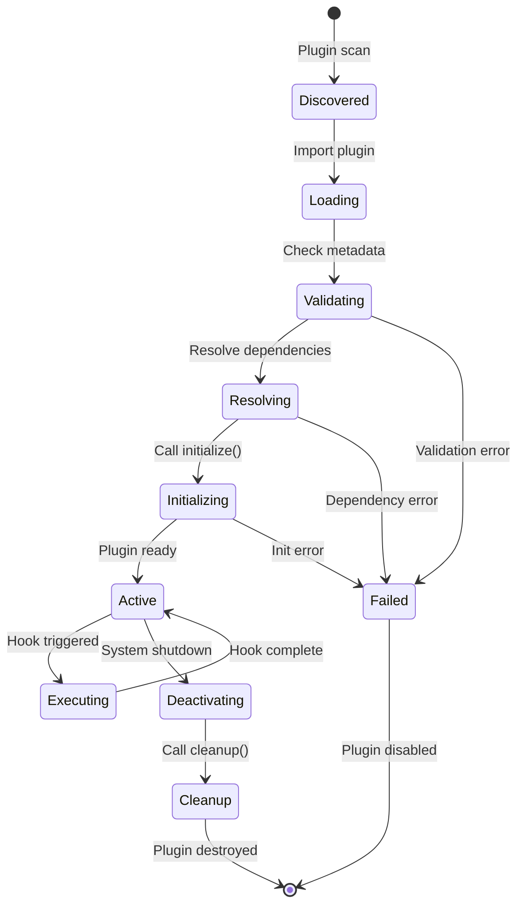

# Plugin Development Guide

## Overview

The Test Framework Integrations system provides a powerful plugin architecture that allows developers to extend functionality, integrate with external services, and customize behavior. This guide covers everything you need to know to develop, test, and distribute plugins.

## Plugin Architecture

### Plugin Types

The system supports several types of plugins:

1. **Reporter Plugins** - Custom output formats and reporting
2. **Notification Plugins** - Integration with messaging and alerting systems
3. **Storage Plugins** - Custom baseline and result storage backends
4. **Analyzer Plugins** - Custom analysis and metrics collection
5. **Framework Plugins** - Support for additional testing frameworks
6. **Middleware Plugins** - Request/response processing
7. **Utility Plugins** - Helper functions and tools

### Plugin Lifecycle



## Plugin Interface

### Base Plugin Structure

```typescript
// src/types/plugin.ts
export interface Plugin {
  // Plugin metadata
  readonly name: string;
  readonly version: string;
  readonly description?: string;
  readonly author?: string;
  readonly license?: string;
  readonly homepage?: string;
  readonly repository?: string;

  // Plugin dependencies
  readonly dependencies?: PluginDependency[];
  readonly peerDependencies?: PluginDependency[];

  // Plugin configuration schema
  readonly configSchema?: JSONSchema7;

  // Lifecycle methods
  initialize(context: PluginContext): Promise<void>;
  cleanup?(): Promise<void>;

  // Optional hooks
  hooks?: PluginHooks;
}

export interface PluginDependency {
  name: string;
  version: string;
  optional?: boolean;
}

export interface PluginContext {
  config: Configuration;
  pluginConfig: any;
  eventBus: EventBus;
  logger: Logger;
  storage: StorageProvider;

  // Plugin registration methods
  registerHook(name: string, handler: HookHandler): void;
  registerCommand(name: string, command: Command): void;
  registerReporter(name: string, reporter: Reporter): void;
  registerStorage(name: string, storage: StorageProvider): void;
}

export interface PluginHooks {
  beforeTestRun?(data: BeforeTestRunData): Promise<BeforeTestRunData>;
  afterTestRun?(data: AfterTestRunData): Promise<AfterTestRunData>;
  beforeBaselineCompare?(data: BeforeBaselineCompareData): Promise<BeforeBaselineCompareData>;
  afterBaselineCompare?(data: AfterBaselineCompareData): Promise<AfterBaselineCompareData>;
  onTestComplete?(data: TestCompleteData): Promise<void>;
  onTestFailure?(data: TestFailureData): Promise<void>;
  onPerformanceAlert?(data: PerformanceAlertData): Promise<void>;
}
```

### Plugin Metadata

```typescript
// plugin.json
{
  "name": "my-awesome-plugin",
  "version": "1.0.0",
  "description": "An awesome plugin for test integrations",
  "author": "Your Name <your.email@example.com>",
  "license": "MIT",
  "homepage": "https://github.com/yourusername/my-awesome-plugin",
  "repository": {
    "type": "git",
    "url": "https://github.com/yourusername/my-awesome-plugin.git"
  },
  "keywords": ["testing", "integration", "plugin"],
  "engines": {
    "node": ">=16.0.0",
    "test-framework-integrations": ">=2.0.0"
  },
  "dependencies": {
    "lodash": "^4.17.21"
  },
  "peerDependencies": {
    "test-framework-integrations": ">=2.0.0"
  }
}
```

## Creating Your First Plugin

### Project Setup

```bash
# Create plugin directory
mkdir my-awesome-plugin
cd my-awesome-plugin

# Initialize package.json
npm init -y

# Install development dependencies
npm install --save-dev typescript @types/node jest ts-jest

# Install peer dependencies
npm install --peer test-framework-integrations

# Create basic structure
mkdir src tests docs
touch src/index.ts tests/index.test.ts
```

### Basic Plugin Implementation

```typescript
// src/index.ts
import { Plugin, PluginContext, TestCompleteData } from 'test-framework-integrations';

export class MyAwesomePlugin implements Plugin {
  readonly name = 'my-awesome-plugin';
  readonly version = '1.0.0';
  readonly description = 'An awesome plugin that does amazing things';
  readonly author = 'Your Name <your.email@example.com>';

  private context: PluginContext;
  private enabled: boolean = true;

  async initialize(context: PluginContext): Promise<void> {
    this.context = context;

    // Get plugin configuration
    const config = context.pluginConfig || {};
    this.enabled = config.enabled !== false;

    if (!this.enabled) {
      context.logger.info('MyAwesome plugin is disabled');
      return;
    }

    // Register event handlers
    context.eventBus.on('test:complete', this.handleTestComplete.bind(this));

    // Register custom commands
    context.registerCommand('awesome', {
      description: 'Run awesome command',
      handler: this.awesomeCommand.bind(this)
    });

    context.logger.info('MyAwesome plugin initialized successfully');
  }

  async cleanup(): Promise<void> {
    if (this.context) {
      this.context.eventBus.off('test:complete', this.handleTestComplete);
    }
  }

  private async handleTestComplete(data: TestCompleteData): Promise<void> {
    const { results } = data;

    this.context.logger.info(`Test completed with ${results.summary.total} tests`);

    // Perform custom analysis
    await this.analyzeResults(results);

    // Send notifications if configured
    await this.sendNotifications(results);
  }

  private async analyzeResults(results: TestResults): Promise<void> {
    // Custom analysis logic
    const failureRate = results.summary.failed / results.summary.total;

    if (failureRate > 0.1) { // 10% failure rate threshold
      this.context.logger.warn(`High failure rate detected: ${(failureRate * 100).toFixed(1)}%`);

      // Emit custom event
      this.context.eventBus.emit('awesome:high-failure-rate', {
        failureRate,
        results
      });
    }
  }

  private async sendNotifications(results: TestResults): Promise<void> {
    const config = this.context.pluginConfig;

    if (config.notifications?.enabled) {
      // Send notification logic
      await this.sendSlackNotification(results);
    }
  }

  private async sendSlackNotification(results: TestResults): Promise<void> {
    const config = this.context.pluginConfig.notifications.slack;

    if (!config?.webhookUrl) {
      return;
    }

    try {
      const message = this.formatSlackMessage(results);

      const response = await fetch(config.webhookUrl, {
        method: 'POST',
        headers: { 'Content-Type': 'application/json' },
        body: JSON.stringify(message)
      });

      if (!response.ok) {
        throw new Error(`Slack API error: ${response.statusText}`);
      }

      this.context.logger.info('Slack notification sent successfully');
    } catch (error) {
      this.context.logger.error('Failed to send Slack notification:', error);
    }
  }

  private formatSlackMessage(results: TestResults): any {
    const { summary } = results;
    const color = summary.failed > 0 ? 'danger' : 'good';

    return {
      attachments: [{
        color,
        title: '🧪 Test Results',
        fields: [
          { title: 'Total', value: summary.total.toString(), short: true },
          { title: 'Passed', value: summary.passed.toString(), short: true },
          { title: 'Failed', value: summary.failed.toString(), short: true },
          { title: 'Duration', value: `${results.duration}ms`, short: true }
        ],
        footer: 'Test Framework Integrations',
        ts: Math.floor(Date.now() / 1000)
      }]
    };
  }

  private async awesomeCommand(args: string[]): Promise<void> {
    this.context.logger.info('Running awesome command with args:', args);

    // Command implementation
    if (args.includes('--analyze')) {
      await this.runAnalysis();
    }

    if (args.includes('--report')) {
      await this.generateReport();
    }
  }

  private async runAnalysis(): Promise<void> {
    this.context.logger.info('Running awesome analysis...');
    // Analysis implementation
  }

  private async generateReport(): Promise<void> {
    this.context.logger.info('Generating awesome report...');
    // Report generation implementation
  }
}

// Export plugin instance
export default new MyAwesomePlugin();
```

### Plugin Configuration Schema

```typescript
// src/config-schema.ts
import { JSONSchema7 } from 'json-schema';

export const configSchema: JSONSchema7 = {
  type: 'object',
  properties: {
    enabled: {
      type: 'boolean',
      default: true,
      description: 'Enable or disable the plugin'
    },
    notifications: {
      type: 'object',
      properties: {
        enabled: {
          type: 'boolean',
          default: false,
          description: 'Enable notifications'
        },
        slack: {
          type: 'object',
          properties: {
            webhookUrl: {
              type: 'string',
              format: 'uri',
              description: 'Slack webhook URL for notifications'
            },
            channel: {
              type: 'string',
              description: 'Slack channel to send notifications to'
            }
          },
          required: ['webhookUrl']
        }
      }
    },
    analysis: {
      type: 'object',
      properties: {
        failureThreshold: {
          type: 'number',
          minimum: 0,
          maximum: 1,
          default: 0.1,
          description: 'Failure rate threshold for alerts'
        },
        performanceThreshold: {
          type: 'number',
          minimum: 0,
          default: 5000,
          description: 'Performance threshold in milliseconds'
        }
      }
    }
  }
};

// Add schema to plugin
export class MyAwesomePlugin implements Plugin {
  readonly configSchema = configSchema;
  // ... rest of implementation
}
```

## Advanced Plugin Examples

### Reporter Plugin

```typescript
// src/reporters/custom-reporter.ts
import { Plugin, PluginContext, TestResults } from 'test-framework-integrations';
import * as fs from 'fs/promises';
import * as path from 'path';

export class CustomReporterPlugin implements Plugin {
  readonly name = 'custom-reporter';
  readonly version = '1.0.0';
  readonly description = 'Custom test results reporter';

  private context: PluginContext;

  async initialize(context: PluginContext): Promise<void> {
    this.context = context;

    // Register as a reporter
    context.registerReporter('custom', {
      generate: this.generateReport.bind(this),
      supports: ['json', 'html', 'pdf']
    });

    // Listen for test completion
    context.eventBus.on('test:complete', this.handleTestComplete.bind(this));
  }

  private async handleTestComplete(data: { results: TestResults }): Promise<void> {
    const config = this.context.pluginConfig;

    if (config.autoGenerate !== false) {
      await this.generateReport(data.results, config.format || 'html');
    }
  }

  private async generateReport(results: TestResults, format: string): Promise<string> {
    const outputDir = this.context.pluginConfig.outputDir || 'reports';
    await fs.mkdir(outputDir, { recursive: true });

    const timestamp = new Date().toISOString().replace(/[:.]/g, '-');
    const filename = `test-report-${timestamp}.${format}`;
    const filepath = path.join(outputDir, filename);

    switch (format) {
      case 'json':
        await this.generateJsonReport(results, filepath);
        break;
      case 'html':
        await this.generateHtmlReport(results, filepath);
        break;
      case 'pdf':
        await this.generatePdfReport(results, filepath);
        break;
      default:
        throw new Error(`Unsupported format: ${format}`);
    }

    this.context.logger.info(`Custom report generated: ${filepath}`);
    return filepath;
  }

  private async generateJsonReport(results: TestResults, filepath: string): Promise<void> {
    const report = {
      metadata: {
        generated: new Date().toISOString(),
        generator: 'custom-reporter',
        version: this.version
      },
      results,
      summary: this.calculateSummary(results),
      insights: this.generateInsights(results)
    };

    await fs.writeFile(filepath, JSON.stringify(report, null, 2));
  }

  private async generateHtmlReport(results: TestResults, filepath: string): Promise<void> {
    const template = await this.loadHtmlTemplate();
    const summary = this.calculateSummary(results);
    const insights = this.generateInsights(results);

    const html = template
      .replace('{{TITLE}}', 'Custom Test Report')
      .replace('{{SUMMARY}}', this.renderSummaryHtml(summary))
      .replace('{{RESULTS}}', this.renderResultsHtml(results))
      .replace('{{INSIGHTS}}', this.renderInsightsHtml(insights))
      .replace('{{GENERATED}}', new Date().toISOString());

    await fs.writeFile(filepath, html);
  }

  private async generatePdfReport(results: TestResults, filepath: string): Promise<void> {
    // Generate HTML first
    const htmlPath = filepath.replace('.pdf', '.html');
    await this.generateHtmlReport(results, htmlPath);

    // Convert HTML to PDF (requires puppeteer or similar)
    const puppeteer = require('puppeteer');
    const browser = await puppeteer.launch();
    const page = await browser.newPage();

    await page.goto(`file://${path.resolve(htmlPath)}`);
    await page.pdf({
      path: filepath,
      format: 'A4',
      printBackground: true
    });

    await browser.close();

    // Clean up temporary HTML file
    await fs.unlink(htmlPath);
  }

  private calculateSummary(results: TestResults): any {
    const { summary } = results;

    return {
      ...summary,
      successRate: summary.total > 0 ? summary.passed / summary.total : 0,
      failureRate: summary.total > 0 ? summary.failed / summary.total : 0,
      averageDuration: this.calculateAverageDuration(results.tests),
      slowestTest: this.findSlowestTest(results.tests),
      fastestTest: this.findFastestTest(results.tests)
    };
  }

  private generateInsights(results: TestResults): any {
    const insights = [];

    // Analyze failure patterns
    const failedTests = results.tests.filter(test => test.status === 'failed');
    if (failedTests.length > 0) {
      const errorPatterns = this.analyzeErrorPatterns(failedTests);
      insights.push({
        type: 'error-patterns',
        title: 'Common Error Patterns',
        data: errorPatterns
      });
    }

    // Analyze performance
    const slowTests = results.tests
      .filter(test => test.duration > 1000)
      .sort((a, b) => b.duration - a.duration)
      .slice(0, 10);

    if (slowTests.length > 0) {
      insights.push({
        type: 'performance',
        title: 'Slowest Tests',
        data: slowTests
      });
    }

    // Analyze test distribution
    const fileDistribution = this.analyzeFileDistribution(results.tests);
    insights.push({
      type: 'distribution',
      title: 'Test Distribution by File',
      data: fileDistribution
    });

    return insights;
  }

  private analyzeErrorPatterns(failedTests: any[]): any[] {
    const patterns = new Map();

    failedTests.forEach(test => {
      if (test.error?.message) {
        const pattern = this.extractErrorPattern(test.error.message);
        const count = patterns.get(pattern) || 0;
        patterns.set(pattern, count + 1);
      }
    });

    return Array.from(patterns.entries())
      .sort((a, b) => b[1] - a[1])
      .slice(0, 5)
      .map(([pattern, count]) => ({ pattern, count }));
  }

  private extractErrorPattern(message: string): string {
    // Extract common error patterns
    if (message.includes('timeout')) return 'Timeout';
    if (message.includes('assertion')) return 'Assertion Error';
    if (message.includes('reference')) return 'Reference Error';
    if (message.includes('type')) return 'Type Error';
    return 'Other';
  }

  private async loadHtmlTemplate(): Promise<string> {
    const templatePath = path.join(__dirname, 'templates', 'report.html');
    return await fs.readFile(templatePath, 'utf-8');
  }

  // Additional helper methods...
}
```

### Storage Plugin

```typescript
// src/storage/s3-storage.ts
import { Plugin, PluginContext, StorageProvider } from 'test-framework-integrations';
import { S3Client, PutObjectCommand, GetObjectCommand, DeleteObjectCommand } from '@aws-sdk/client-s3';

export class S3StoragePlugin implements Plugin {
  readonly name = 's3-storage';
  readonly version = '1.0.0';
  readonly description = 'AWS S3 storage provider for baselines and results';

  private context: PluginContext;
  private s3Client: S3Client;

  async initialize(context: PluginContext): Promise<void> {
    this.context = context;

    const config = context.pluginConfig;

    // Initialize S3 client
    this.s3Client = new S3Client({
      region: config.region || 'us-east-1',
      credentials: {
        accessKeyId: config.accessKeyId,
        secretAccessKey: config.secretAccessKey
      }
    });

    // Register storage provider
    context.registerStorage('s3', new S3StorageProvider(this.s3Client, config));

    context.logger.info('S3 storage plugin initialized');
  }
}

class S3StorageProvider implements StorageProvider {
  constructor(
    private s3Client: S3Client,
    private config: any
  ) {}

  async store(key: string, data: any): Promise<void> {
    const command = new PutObjectCommand({
      Bucket: this.config.bucket,
      Key: this.buildKey(key),
      Body: JSON.stringify(data),
      ContentType: 'application/json',
      ServerSideEncryption: 'AES256'
    });

    await this.s3Client.send(command);
  }

  async load(key: string): Promise<any> {
    try {
      const command = new GetObjectCommand({
        Bucket: this.config.bucket,
        Key: this.buildKey(key)
      });

      const response = await this.s3Client.send(command);
      const data = await this.streamToString(response.Body);
      return JSON.parse(data);
    } catch (error) {
      if (error.name === 'NoSuchKey') {
        return null;
      }
      throw error;
    }
  }

  async delete(key: string): Promise<boolean> {
    try {
      const command = new DeleteObjectCommand({
        Bucket: this.config.bucket,
        Key: this.buildKey(key)
      });

      await this.s3Client.send(command);
      return true;
    } catch (error) {
      return false;
    }
  }

  async exists(key: string): Promise<boolean> {
    try {
      const data = await this.load(key);
      return data !== null;
    } catch {
      return false;
    }
  }

  async list(prefix: string = ''): Promise<string[]> {
    // Implementation for listing objects with prefix
    // Returns array of keys
    return [];
  }

  private buildKey(key: string): string {
    const prefix = this.config.prefix || 'test-integrations';
    return `${prefix}/${key}`;
  }

  private async streamToString(stream: any): Promise<string> {
    const chunks = [];
    for await (const chunk of stream) {
      chunks.push(chunk);
    }
    return Buffer.concat(chunks).toString('utf-8');
  }
}

export default new S3StoragePlugin();
```

### Framework Adapter Plugin

```typescript
// src/adapters/custom-framework.ts
import { Plugin, PluginContext, FrameworkAdapter } from 'test-framework-integrations';

export class CustomFrameworkPlugin implements Plugin {
  readonly name = 'custom-framework-adapter';
  readonly version = '1.0.0';
  readonly description = 'Adapter for custom testing framework';

  async initialize(context: PluginContext): Promise<void> {
    // Register framework adapter
    context.registerFrameworkAdapter('custom', CustomFrameworkAdapter);

    context.logger.info('Custom framework adapter registered');
  }
}

class CustomFrameworkAdapter implements FrameworkAdapter {
  readonly framework = 'custom';
  readonly version = '1.0.0';

  constructor(
    private config: any,
    private logger: any
  ) {}

  async initialize(): Promise<void> {
    this.validateConfig();
    await this.setupFramework();
  }

  async execute(options: any): Promise<any> {
    const results = await this.runTests(options);
    return this.normalizeResults(results);
  }

  async cleanup(): Promise<void> {
    // Cleanup framework resources
  }

  private validateConfig(): void {
    if (!this.config.testDir) {
      throw new Error('Test directory is required');
    }
  }

  private async setupFramework(): Promise<void> {
    // Setup framework-specific configuration
  }

  private async runTests(options: any): Promise<any> {
    // Execute tests using custom framework
    return {};
  }

  private normalizeResults(results: any): any {
    // Convert framework results to standard format
    return {
      framework: this.framework,
      summary: {
        total: 0,
        passed: 0,
        failed: 0,
        skipped: 0
      },
      tests: [],
      duration: 0,
      timestamp: new Date().toISOString()
    };
  }
}

export default new CustomFrameworkPlugin();
```

## Plugin Testing

### Unit Testing

```typescript
// tests/index.test.ts
import { MyAwesomePlugin } from '../src/index';
import { createMockContext } from './helpers/mock-context';

describe('MyAwesomePlugin', () => {
  let plugin: MyAwesomePlugin;
  let mockContext: PluginContext;

  beforeEach(() => {
    plugin = new MyAwesomePlugin();
    mockContext = createMockContext({
      pluginConfig: {
        enabled: true,
        notifications: {
          enabled: true,
          slack: {
            webhookUrl: 'https://hooks.slack.com/test'
          }
        }
      }
    });
  });

  describe('initialization', () => {
    it('should initialize successfully', async () => {
      await expect(plugin.initialize(mockContext)).resolves.not.toThrow();
      expect(mockContext.logger.info).toHaveBeenCalledWith(
        'MyAwesome plugin initialized successfully'
      );
    });

    it('should skip initialization when disabled', async () => {
      mockContext.pluginConfig.enabled = false;

      await plugin.initialize(mockContext);

      expect(mockContext.logger.info).toHaveBeenCalledWith(
        'MyAwesome plugin is disabled'
      );
    });
  });

  describe('test completion handling', () => {
    beforeEach(async () => {
      await plugin.initialize(mockContext);
    });

    it('should handle test completion', async () => {
      const testResults = createMockTestResults({
        summary: { total: 10, passed: 8, failed: 2, skipped: 0 }
      });

      mockContext.eventBus.emit('test:complete', { results: testResults });

      expect(mockContext.logger.info).toHaveBeenCalledWith(
        'Test completed with 10 tests'
      );
    });

    it('should emit high failure rate event', async () => {
      const testResults = createMockTestResults({
        summary: { total: 10, passed: 5, failed: 5, skipped: 0 }
      });

      const emitSpy = jest.spyOn(mockContext.eventBus, 'emit');

      mockContext.eventBus.emit('test:complete', { results: testResults });

      expect(emitSpy).toHaveBeenCalledWith(
        'awesome:high-failure-rate',
        expect.objectContaining({
          failureRate: 0.5,
          results: testResults
        })
      );
    });
  });
});
```

### Integration Testing

```typescript
// tests/integration.test.ts
import { TestEngine } from 'test-framework-integrations';
import { MyAwesomePlugin } from '../src/index';

describe('MyAwesome Plugin Integration', () => {
  let engine: TestEngine;

  beforeEach(async () => {
    const config = {
      framework: { type: 'jest' },
      plugins: {
        enabled: ['my-awesome-plugin'],
        'my-awesome-plugin': {
          enabled: true,
          notifications: { enabled: false } // Disable for testing
        }
      }
    };

    engine = new TestEngine(config);
    await engine.initialize();
  });

  it('should integrate with test engine', async () => {
    const results = await engine.runTests({
      framework: 'jest',
      testPaths: ['tests/fixtures/sample.test.js']
    });

    expect(results).toBeDefined();
    expect(results.summary.total).toBeGreaterThan(0);
  });

  it('should register custom commands', async () => {
    const commands = engine.getRegisteredCommands();
    expect(commands).toContain('awesome');
  });
});
```

## Plugin Distribution

### Package Configuration

```json
{
  "name": "test-integration-plugin-awesome",
  "version": "1.0.0",
  "description": "An awesome plugin for test framework integrations",
  "main": "dist/index.js",
  "types": "dist/index.d.ts",
  "files": [
    "dist/",
    "README.md",
    "LICENSE"
  ],
  "scripts": {
    "build": "tsc",
    "test": "jest",
    "prepublishOnly": "npm run build && npm test"
  },
  "keywords": [
    "test-framework-integrations",
    "plugin",
    "testing"
  ],
  "peerDependencies": {
    "test-framework-integrations": ">=2.0.0"
  },
  "engines": {
    "node": ">=16.0.0"
  }
}
```

### Publishing to npm

```bash
# Build the plugin
npm run build

# Test the plugin
npm test

# Publish to npm
npm publish

# Or publish with tag
npm publish --tag beta
```

### Plugin Registry

Create a plugin entry for the official registry:

```yaml
# plugins/my-awesome-plugin.yaml
name: my-awesome-plugin
displayName: My Awesome Plugin
description: An awesome plugin that does amazing things
version: 1.0.0
author: Your Name
category: reporting
tags:
  - slack
  - notifications
  - reporting
repository: https://github.com/yourusername/my-awesome-plugin
npm: test-integration-plugin-awesome
license: MIT
documentation: https://github.com/yourusername/my-awesome-plugin#readme
examples:
  - name: Basic Usage
    config:
      enabled: true
      notifications:
        enabled: true
        slack:
          webhookUrl: "https://hooks.slack.com/services/YOUR/WEBHOOK/URL"
  - name: Advanced Configuration
    config:
      enabled: true
      notifications:
        enabled: true
        slack:
          webhookUrl: "https://hooks.slack.com/services/YOUR/WEBHOOK/URL"
          channel: "#testing"
      analysis:
        failureThreshold: 0.05
        performanceThreshold: 3000
```

## Plugin Discovery and Loading

### Plugin Manager

```typescript
// src/core/plugin-manager.ts
export class PluginManager {
  private plugins: Map<string, Plugin> = new Map();
  private hooks: Map<string, HookHandler[]> = new Map();

  async discoverPlugins(searchPaths: string[]): Promise<string[]> {
    const pluginPaths = [];

    for (const searchPath of searchPaths) {
      const files = await this.scanDirectory(searchPath);
      pluginPaths.push(...files);
    }

    return pluginPaths;
  }

  async loadPlugin(pluginPath: string): Promise<void> {
    try {
      const plugin = await this.importPlugin(pluginPath);

      // Validate plugin
      this.validatePlugin(plugin);

      // Check dependencies
      await this.resolveDependencies(plugin);

      // Initialize plugin
      const context = this.createPluginContext(plugin);
      await plugin.initialize(context);

      this.plugins.set(plugin.name, plugin);

    } catch (error) {
      throw new PluginLoadError(`Failed to load plugin ${pluginPath}: ${error.message}`);
    }
  }

  private async importPlugin(pluginPath: string): Promise<Plugin> {
    const module = await import(pluginPath);
    return module.default || module;
  }

  private validatePlugin(plugin: any): void {
    if (!plugin.name || !plugin.version) {
      throw new Error('Plugin must have name and version');
    }

    if (typeof plugin.initialize !== 'function') {
      throw new Error('Plugin must implement initialize method');
    }
  }

  private async resolveDependencies(plugin: Plugin): Promise<void> {
    if (!plugin.dependencies) return;

    for (const dep of plugin.dependencies) {
      const isAvailable = await this.checkDependency(dep);

      if (!isAvailable && !dep.optional) {
        throw new Error(`Required dependency not found: ${dep.name}@${dep.version}`);
      }
    }
  }

  private createPluginContext(plugin: Plugin): PluginContext {
    return {
      config: this.config,
      pluginConfig: this.config.plugins?.[plugin.name] || {},
      eventBus: this.eventBus,
      logger: this.logger.child({ plugin: plugin.name }),
      storage: this.storage,
      registerHook: this.registerHook.bind(this),
      registerCommand: this.registerCommand.bind(this),
      registerReporter: this.registerReporter.bind(this),
      registerStorage: this.registerStorage.bind(this)
    };
  }
}
```

## Best Practices

### Plugin Development

1. **Keep plugins focused** - Each plugin should have a single responsibility
2. **Handle errors gracefully** - Don't crash the entire system
3. **Provide clear configuration** - Use JSON schemas for validation
4. **Document thoroughly** - Include examples and API documentation
5. **Test comprehensively** - Unit tests, integration tests, and edge cases
6. **Follow semantic versioning** - Breaking changes require major version bump

### Performance Considerations

1. **Lazy loading** - Only load plugins when needed
2. **Async operations** - Use promises for I/O operations
3. **Memory management** - Clean up resources in cleanup method
4. **Caching** - Cache expensive operations when appropriate
5. **Batching** - Batch operations when possible

### Security Guidelines

1. **Validate inputs** - Never trust external data
2. **Sanitize outputs** - Prevent injection attacks
3. **Use secure defaults** - Fail securely
4. **Audit dependencies** - Regularly check for vulnerabilities
5. **Principle of least privilege** - Request minimal permissions

### Documentation Standards

```markdown
# Plugin Name

Brief description of what the plugin does.

## Installation

```bash
npm install test-integration-plugin-name
```

## Configuration

```javascript
{
  "plugins": {
    "enabled": ["plugin-name"],
    "plugin-name": {
      "option1": "value1",
      "option2": "value2"
    }
  }
}
```

## API

### Options

- `option1` (string): Description of option1
- `option2` (boolean): Description of option2

### Events

- `plugin:event-name`: Emitted when something happens

### Commands

- `plugin-command`: Description of command

## Examples

### Basic Usage

```javascript
// Example configuration
```

### Advanced Usage

```javascript
// Advanced example
```

## License

MIT
```

This comprehensive plugin development guide provides everything needed to create powerful, maintainable plugins for the Test Framework Integrations system.