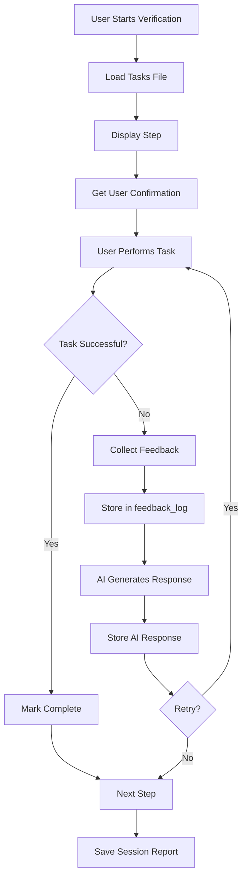

# 📊 Verify AI Work - Data Structure & Storage Guide

## 🚨 MANDATORY: Spec Folder Requirement

**CRITICAL**: `/verify-ai-work` MUST be executed from within a spec folder. Reports are saved to the `verification_report/` subdirectory.

## 📍 Where Feedback is Saved

### Primary Storage Location
```
Spec Folder (e.g., .agent-os/specs/2025-01-15-feature/)
├── spec.md                              # Specification document
├── tasks.md                             # Task breakdown
├── sample_verification_tasks.json       # Task definitions (input)
└── verification_report/                 # All reports saved here
    ├── 20250115_143022.json            # Session from 14:30:22
    ├── 20250115_153045.json            # Session from 15:30:45
    └── 20250115_163012.json            # Session from 16:30:12
```

## 📄 Complete Report Structure

### Main Session Report: `verification_report/YYYYMMDD_HHMMSS.json`
**Location**: `<spec-folder>/verification_report/YYYYMMDD_HHMMSS.json`

```json
{
  "session_id": "20250813_143022",
  "timestamp": "2025-08-13T14:30:22.123456",
  "total_steps": 5,
  "completed": 3,
  "total_time": 245.3,
  
  "steps": [
    {
      "number": 1,
      "title": "Check if the website loads",
      "description": "We need to make sure the website opens in your browser without any errors",
      "instructions": [
        "Open your web browser (Chrome, Firefox, or Safari)",
        "Type the website address in the address bar",
        "Press Enter to load the website",
        "Wait for the page to fully load"
      ],
      "expected_outcome": "The website should load completely with all images and text visible",
      
      // USER FEEDBACK STORED HERE
      "actual_outcome": "The page loaded but some images are missing",
      "status": "🔧 Needs Revision",
      "user_feedback": "The images in the gallery section didn't load.\nI saw broken image icons instead.\nAll images should be visible.",
      
      // AI RESPONSE STORED HERE
      "ai_response": "Based on your feedback, here's what I'll adjust:\n\n1. Issue identified: The page loaded but some images are missing\n\n2. Proposed fix:\n   - Check image file paths and URLs\n   - Verify image server is running\n   - Add fallback images for missing ones\n\n3. New approach:\n   • Add better error handling\n   • Provide clearer error messages\n   • Include recovery steps",
      
      // METRICS
      "attempts": 2,
      "time_spent": 87.5
    },
    {
      "number": 2,
      "title": "Test the login button",
      "description": "Let's check if the login button works properly",
      "instructions": [
        "Find the 'Login' button on the page",
        "Click on the Login button",
        "Check if a login form appears"
      ],
      "expected_outcome": "A login form with username and password fields should appear",
      "actual_outcome": "",
      "status": "✅ Completed",
      "user_feedback": "",
      "ai_response": "",
      "attempts": 1,
      "time_spent": 45.2
    }
  ],
  
  "feedback_log": [
    {
      "timestamp": "2025-08-13T14:32:15.456789",
      "step": 1,
      "feedback": "The images in the gallery section didn't load.\nI saw broken image icons instead.\nAll images should be visible.",
      "attempt": 1
    },
    {
      "timestamp": "2025-08-13T14:35:42.789012",
      "step": 1,
      "feedback": "After the fix, images now load but they're very slow",
      "attempt": 2
    },
    {
      "timestamp": "2025-08-13T14:38:20.123456",
      "step": 3,
      "feedback": "Search returns no results for common terms",
      "attempt": 1
    }
  ],
  
  "summary": {
    "success_rate": 60.0,
    "average_attempts": 1.4,
    "total_feedback_entries": 3,
    "revision_requests": 2,
    "performance_rating": "GOOD EFFORT"
  }
}
```

## 🗂️ Data Categories & Storage

### 1. **Step-Level Data** (stored in `steps[]` array)

| Field | Description | Example |
|-------|-------------|---------|
| `actual_outcome` | What user observed | "Page loaded but images missing" |
| `user_feedback` | Detailed feedback text | "Images broken, need fallback" |
| `ai_response` | AI's suggested fix | "Check paths, add error handling" |
| `status` | Final step status | "✅ Completed", "🔧 Needs Revision" |
| `attempts` | Number of tries | 2 |
| `time_spent` | Seconds on this step | 87.5 |

### 2. **Feedback Log** (stored in `feedback_log[]` array)

Chronological record of ALL feedback entries:
```json
{
  "timestamp": "ISO 8601 timestamp",
  "step": "Step number",
  "feedback": "Raw feedback text",
  "attempt": "Attempt number"
}
```

### 3. **Session Metadata** (top-level fields)

| Field | Description |
|-------|-------------|
| `session_id` | Unique session identifier |
| `timestamp` | Session start time |
| `total_time` | Total seconds spent |
| `completed` | Number of completed steps |

## 📝 Input Task File Structure

### Task Definition: `sample_verification_tasks.json`

```json
{
  "steps": [
    {
      "number": 1,
      "title": "Short descriptive title",
      "description": "Detailed explanation for users",
      "instructions": [
        "Step-by-step",
        "Instructions",
        "To follow"
      ],
      "expected_outcome": "What should happen"
    }
  ]
}
```

## 🔄 Real-Time Data Flow



## 💾 Storage Locations by Data Type

### User Feedback Locations
1. **Immediate Storage**: `steps[].user_feedback`
2. **Historical Log**: `feedback_log[]`
3. **Outcome Record**: `steps[].actual_outcome`

### AI Response Locations
1. **Step Response**: `steps[].ai_response`
2. **Revision History**: Stored in `attempts` counter

### Metrics Storage
1. **Per-Step Metrics**: `steps[].time_spent`, `steps[].attempts`
2. **Session Metrics**: `total_time`, `completed`, `summary`

## 📊 Advanced Storage Options

### 1. **Continuous Logging Mode** (Optional)
```python
# Enable with environment variable
export VERIFY_AI_CONTINUOUS_LOG=true

# Creates append-only log file
verification_feedback_log.jsonl
```

Each line is a JSON object:
```jsonl
{"timestamp": "2025-08-13T14:32:15", "event": "feedback", "step": 1, "data": "..."}
{"timestamp": "2025-08-13T14:32:45", "event": "ai_response", "step": 1, "data": "..."}
{"timestamp": "2025-08-13T14:33:10", "event": "step_complete", "step": 1, "status": "completed"}
```

### 2. **Database Storage** (Future Enhancement)
```python
# SQLite schema for persistent storage
CREATE TABLE verification_sessions (
    session_id TEXT PRIMARY KEY,
    timestamp DATETIME,
    total_steps INTEGER,
    completed INTEGER,
    total_time REAL
);

CREATE TABLE step_feedback (
    id INTEGER PRIMARY KEY,
    session_id TEXT,
    step_number INTEGER,
    user_feedback TEXT,
    ai_response TEXT,
    actual_outcome TEXT,
    status TEXT,
    attempts INTEGER,
    time_spent REAL,
    FOREIGN KEY(session_id) REFERENCES verification_sessions(session_id)
);

CREATE TABLE feedback_log (
    id INTEGER PRIMARY KEY,
    session_id TEXT,
    timestamp DATETIME,
    step_number INTEGER,
    feedback TEXT,
    attempt INTEGER,
    FOREIGN KEY(session_id) REFERENCES verification_sessions(session_id)
);
```

## 🔍 Accessing Stored Data

### Reading Session Reports
```python
import json
from pathlib import Path

# Find all session reports
reports = list(Path('.').glob('verification_report_*.json'))

# Load and analyze
for report_file in reports:
    with open(report_file) as f:
        data = json.load(f)
    
    # Access user feedback
    for step in data['steps']:
        if step['user_feedback']:
            print(f"Step {step['number']}: {step['user_feedback']}")
    
    # Access feedback log
    for entry in data['feedback_log']:
        print(f"{entry['timestamp']}: {entry['feedback']}")
```

### Aggregate Analysis
```python
# Combine multiple sessions
all_feedback = []
for report_file in reports:
    with open(report_file) as f:
        data = json.load(f)
        all_feedback.extend(data['feedback_log'])

# Analyze patterns
import pandas as pd
df = pd.DataFrame(all_feedback)
common_issues = df['feedback'].value_counts()
```

## 📈 Report Analytics

### Key Metrics Tracked
```json
{
  "summary": {
    "success_rate": 75.0,           // % of steps completed
    "average_attempts": 1.5,        // Avg tries per step
    "total_feedback_entries": 8,    // Total feedback given
    "revision_requests": 3,         // AI revision requests
    "performance_rating": "EXCELLENT", // Overall rating
    "common_issues": [              // Pattern analysis
      "Image loading problems",
      "Form validation errors"
    ],
    "improvement_areas": [          // Suggested focus areas
      "Better error messages",
      "Clearer instructions"
    ]
  }
}
```

## 🗄️ File Organization Best Practices

### Recommended Directory Structure
```
project/
└── .agent-os/
    └── specs/
        ├── 2025-01-15-user-auth/
        │   ├── spec.md
        │   ├── tasks.md
        │   ├── ui_verification_tasks.json
        │   └── verification_report/
        │       ├── 20250115_143022.json
        │       └── 20250115_153045.json
        ├── 2025-01-14-api-endpoints/
        │   ├── spec.md
        │   ├── tasks.md
        │   ├── api_verification_tasks.json
        │   └── verification_report/
        │       └── 20250114_163012.json
        └── 2025-01-13-database-schema/
            ├── spec.md
            ├── tasks.md
            └── verification_report/
                └── 20250113_143022.json
```

### Archival Strategy
```bash
# Archive reports from a spec folder
cd .agent-os/specs/2025-01-15-feature/
tar -czf verification_reports_202501.tar.gz verification_report/

# Query specific feedback across all specs
find .agent-os/specs -name "*.json" -path "*/verification_report/*" | \
  xargs jq '.feedback_log[] | select(.feedback | contains("error"))'

# Collect all reports for analysis
find .agent-os/specs -type f -path "*/verification_report/*.json" \
  -exec cp {} ./all_reports/ \;
```

## 🔐 Privacy & Security

### Sensitive Data Handling
- User feedback may contain sensitive information
- Reports should be stored securely
- Consider encryption for production use
- Implement access controls for shared environments

### Data Retention Policy
```python
# Auto-cleanup old reports (30 days)
import os
from datetime import datetime, timedelta

cutoff = datetime.now() - timedelta(days=30)
for report in Path('.').glob('verification_report_*.json'):
    if datetime.fromtimestamp(report.stat().st_mtime) < cutoff:
        report.unlink()  # Delete old report
```

## 📊 Summary

**All detailed feedback is saved in:**
1. **Primary**: `<spec-folder>/verification_report/YYYYMMDD_HHMMSS.json`
2. **Spec Context**: Reports are organized within their specification folders
3. **Step Feedback**: `steps[].user_feedback` and `steps[].actual_outcome`
4. **AI Responses**: `steps[].ai_response`
5. **Chronological Log**: `feedback_log[]` array with timestamps
6. **Session Metrics**: Top-level summary statistics

**MANDATORY**: Always navigate to a spec folder before running `/verify-ai-work`

This comprehensive storage ensures complete traceability and enables continuous improvement of AI systems based on user feedback!