# Architecture Report: digitalmodel

Auto-generated by `repo-architecture-scanner.py`.

## Summary

- **Packages**: 30
- **Total .py files**: 1587
- **Total classes**: 2085
- **Total functions**: 1956
- **Packages with tests**: 24/30

## Package Listing

| Package | Files | Classes | Functions | Has `__all__` | Has Tests |
|---------|------:|--------:|----------:|:-------------:|:---------:|
| ansys | 5 | 8 | 0 | ✓ | ✓ |
| asset_integrity | 52 | 49 | 63 | ✗ | ✓ |
| benchmarks | 4 | 7 | 7 | ✗ | ✓ |
| cathodic_protection | 5 | 4 | 30 | ✓ | ✓ |
| data_systems | 58 | 50 | 33 | ✗ | ✓ |
| drilling_riser | 5 | 0 | 13 | ✓ | ✓ |
| fatigue | 7 | 0 | 21 | ✓ | ✓ |
| field_development | 11 | 3 | 15 | ✓ | ✗ |
| geotechnical | 5 | 13 | 18 | ✗ | ✗ |
| gis | 26 | 23 | 23 | ✓ | ✓ |
| hydrodynamics | 173 | 291 | 382 | ✓ | ✓ |
| infrastructure | 165 | 141 | 96 | ✗ | ✓ |
| marine_ops | 117 | 210 | 177 | ✗ | ✓ |
| naval_architecture | 21 | 1 | 114 | ✓ | ✓ |
| nde | 3 | 1 | 0 | ✗ | ✗ |
| orcaflex | 14 | 11 | 16 | ✓ | ✓ |
| orcawave | 13 | 11 | 22 | ✗ | ✗ |
| power | 19 | 40 | 15 | ✓ | ✓ |
| production_engineering | 8 | 27 | 9 | ✓ | ✓ |
| reservoir | 2 | 0 | 0 | ✗ | ✗ |
| signal_processing | 27 | 23 | 17 | ✗ | ✓ |
| solvers | 309 | 477 | 254 | ✗ | ✓ |
| specialized | 56 | 21 | 7 | ✗ | ✓ |
| specs | 2 | 3 | 1 | ✓ | ✓ |
| structural | 191 | 249 | 264 | ✗ | ✓ |
| subsea | 65 | 76 | 129 | ✗ | ✓ |
| visualization | 56 | 119 | 52 | ✓ | ✓ |
| web | 69 | 37 | 104 | ✗ | ✗ |
| well | 7 | 11 | 6 | ✓ | ✓ |
| workflows | 92 | 179 | 68 | ✗ | ✓ |

## Top 10 Largest Packages (by file count)

1. **solvers** — 309 files, 477 classes, 254 functions
2. **structural** — 191 files, 249 classes, 264 functions
3. **hydrodynamics** — 173 files, 291 classes, 382 functions
4. **infrastructure** — 165 files, 141 classes, 96 functions
5. **marine_ops** — 117 files, 210 classes, 177 functions
6. **workflows** — 92 files, 179 classes, 68 functions
7. **web** — 69 files, 37 classes, 104 functions
8. **subsea** — 65 files, 76 classes, 129 functions
9. **data_systems** — 58 files, 50 classes, 33 functions
10. **specialized** — 56 files, 21 classes, 7 functions

## Entry Points

- `/mnt/local-analysis/workspace-hub/digitalmodel/pyproject.toml [project.scripts]`
- `/mnt/local-analysis/workspace-hub/digitalmodel/scripts/_seed_eq_mock.py`
- `/mnt/local-analysis/workspace-hub/digitalmodel/scripts/_seed_eq_report.py`
- `/mnt/local-analysis/workspace-hub/digitalmodel/scripts/_seed_eq_solver.py`
- `/mnt/local-analysis/workspace-hub/digitalmodel/scripts/add_headers_properly.py`
- `/mnt/local-analysis/workspace-hub/digitalmodel/scripts/add_section_headers.py`
- `/mnt/local-analysis/workspace-hub/digitalmodel/scripts/agent_dashboard_cli.py`
- `/mnt/local-analysis/workspace-hub/digitalmodel/scripts/analyze_operability_results.py`
- `/mnt/local-analysis/workspace-hub/digitalmodel/scripts/audit_spec_library.py`
- `/mnt/local-analysis/workspace-hub/digitalmodel/scripts/batch_rao_check.py`
- `/mnt/local-analysis/workspace-hub/digitalmodel/scripts/batch_rao_check_v2.py`
- `/mnt/local-analysis/workspace-hub/digitalmodel/scripts/benchmark/audit_solver_inputs.py`
- `/mnt/local-analysis/workspace-hub/digitalmodel/scripts/benchmark/compare_hydro_properties.py`
- `/mnt/local-analysis/workspace-hub/digitalmodel/scripts/benchmark/convert_rhino_gdf.py`
- `/mnt/local-analysis/workspace-hub/digitalmodel/scripts/benchmark/digitize_validation_plots.py`
- `/mnt/local-analysis/workspace-hub/digitalmodel/scripts/benchmark/extract_chart_data.py`
- `/mnt/local-analysis/workspace-hub/digitalmodel/scripts/benchmark/extract_pdf_plots.py`
- `/mnt/local-analysis/workspace-hub/digitalmodel/scripts/benchmark/generate_barge_mesh.py`
- `/mnt/local-analysis/workspace-hub/digitalmodel/scripts/benchmark/generate_owd_ymls.py`
- `/mnt/local-analysis/workspace-hub/digitalmodel/scripts/benchmark/probe_owd_content.py`
- `/mnt/local-analysis/workspace-hub/digitalmodel/scripts/benchmark/qtf_postprocessing.py`
- `/mnt/local-analysis/workspace-hub/digitalmodel/scripts/benchmark/regenerate_barge_benchmark.py`
- `/mnt/local-analysis/workspace-hub/digitalmodel/scripts/benchmark/regenerate_ship_benchmark.py`
- `/mnt/local-analysis/workspace-hub/digitalmodel/scripts/benchmark/rerun_benchmarks_with_fidp.py`
- `/mnt/local-analysis/workspace-hub/digitalmodel/scripts/benchmark/run_3way_benchmark.py`
- `/mnt/local-analysis/workspace-hub/digitalmodel/scripts/benchmark/run_spar_benchmark.py`
- `/mnt/local-analysis/workspace-hub/digitalmodel/scripts/benchmark/run_validation_benchmark.py`
- `/mnt/local-analysis/workspace-hub/digitalmodel/scripts/benchmark/solve_owd_extract.py`
- `/mnt/local-analysis/workspace-hub/digitalmodel/scripts/benchmark/solver_metadata.py`
- `/mnt/local-analysis/workspace-hub/digitalmodel/scripts/benchmark/validate_owd_vs_spec.py`
- `/mnt/local-analysis/workspace-hub/digitalmodel/scripts/benchmark_model_library.py`
- `/mnt/local-analysis/workspace-hub/digitalmodel/scripts/benchmark_riser_library.py`
- `/mnt/local-analysis/workspace-hub/digitalmodel/scripts/build_import_map.py`
- `/mnt/local-analysis/workspace-hub/digitalmodel/scripts/build_sme_report.py`
- `/mnt/local-analysis/workspace-hub/digitalmodel/scripts/capture_riser_views.py`
- `/mnt/local-analysis/workspace-hub/digitalmodel/scripts/checkpoint_cli.py`
- `/mnt/local-analysis/workspace-hub/digitalmodel/scripts/compare_return_periods.py`
- `/mnt/local-analysis/workspace-hub/digitalmodel/scripts/consolidate_agent_registry.py`
- `/mnt/local-analysis/workspace-hub/digitalmodel/scripts/consolidate_docs.py`
- `/mnt/local-analysis/workspace-hub/digitalmodel/scripts/consolidate_panels.py`
- `/mnt/local-analysis/workspace-hub/digitalmodel/scripts/conversion/yaml_to_include.py`
- `/mnt/local-analysis/workspace-hub/digitalmodel/scripts/convert_orcaflex_to_yml.py`
- `/mnt/local-analysis/workspace-hub/digitalmodel/scripts/convert_yaml_format.py`
- `/mnt/local-analysis/workspace-hub/digitalmodel/scripts/create_catalog.py`
- `/mnt/local-analysis/workspace-hub/digitalmodel/scripts/create_flattened_models.py`
- `/mnt/local-analysis/workspace-hub/digitalmodel/scripts/create_test_report.py`
- `/mnt/local-analysis/workspace-hub/digitalmodel/scripts/cross_repo_change_propagator.py`
- `/mnt/local-analysis/workspace-hub/digitalmodel/scripts/cross_repo_test_runner.py`
- `/mnt/local-analysis/workspace-hub/digitalmodel/scripts/debug_html_report.py`
- `/mnt/local-analysis/workspace-hub/digitalmodel/scripts/demo_skill_resolver.py`
- `/mnt/local-analysis/workspace-hub/digitalmodel/scripts/example_catalog_usage.py`
- `/mnt/local-analysis/workspace-hub/digitalmodel/scripts/example_memory_lifecycle.py`
- `/mnt/local-analysis/workspace-hub/digitalmodel/scripts/example_migration.py`
- `/mnt/local-analysis/workspace-hub/digitalmodel/scripts/example_reporting.py`
- `/mnt/local-analysis/workspace-hub/digitalmodel/scripts/excel_to_csv_converter.py`
- `/mnt/local-analysis/workspace-hub/digitalmodel/scripts/extract_library_validation.py`
- `/mnt/local-analysis/workspace-hub/digitalmodel/scripts/extract_property_inventory.py`
- `/mnt/local-analysis/workspace-hub/digitalmodel/scripts/extract_riser_validation.py`
- `/mnt/local-analysis/workspace-hub/digitalmodel/scripts/extract_s7_specs.py`
- `/mnt/local-analysis/workspace-hub/digitalmodel/scripts/fix_indentation.py`
- `/mnt/local-analysis/workspace-hub/digitalmodel/scripts/fix_orcaflex_structure.py`
- `/mnt/local-analysis/workspace-hub/digitalmodel/scripts/fix_yaml_structure.py`
- `/mnt/local-analysis/workspace-hub/digitalmodel/scripts/generate_24in_statics_sim.py`
- `/mnt/local-analysis/workspace-hub/digitalmodel/scripts/generate_all_specs.py`
- `/mnt/local-analysis/workspace-hub/digitalmodel/scripts/generate_analysis_files.py`
- `/mnt/local-analysis/workspace-hub/digitalmodel/scripts/generate_calm_buoy_project.py`
- `/mnt/local-analysis/workspace-hub/digitalmodel/scripts/generate_coating_comparison_report.py`
- `/mnt/local-analysis/workspace-hub/digitalmodel/scripts/generate_cp_report.py`
- `/mnt/local-analysis/workspace-hub/digitalmodel/scripts/generate_env_files.py`
- `/mnt/local-analysis/workspace-hub/digitalmodel/scripts/generate_hull_catalog_report.py`
- `/mnt/local-analysis/workspace-hub/digitalmodel/scripts/generate_hull_library_meshes.py`
- `/mnt/local-analysis/workspace-hub/digitalmodel/scripts/generate_integration_report.py`
- `/mnt/local-analysis/workspace-hub/digitalmodel/scripts/generate_sample_metrics.py`
- `/mnt/local-analysis/workspace-hub/digitalmodel/scripts/generate_schematic.py`
- `/mnt/local-analysis/workspace-hub/digitalmodel/scripts/git/git_manager.py`
- `/mnt/local-analysis/workspace-hub/digitalmodel/scripts/git/slash_commands.py`
- `/mnt/local-analysis/workspace-hub/digitalmodel/scripts/hooks/check-no-windows-paths.py`
- `/mnt/local-analysis/workspace-hub/digitalmodel/scripts/initialize_skill_metadata.py`
- `/mnt/local-analysis/workspace-hub/digitalmodel/scripts/integrations/aisc_section_lookup.py`
- `/mnt/local-analysis/workspace-hub/digitalmodel/scripts/integrations/aisc_validation.py`
- `/mnt/local-analysis/workspace-hub/digitalmodel/scripts/integrations/fluids_evaluation.py`
- `/mnt/local-analysis/workspace-hub/digitalmodel/scripts/integrations/meshio_evaluation.py`
- `/mnt/local-analysis/workspace-hub/digitalmodel/scripts/integrations/pint_benchmark.py`
- `/mnt/local-analysis/workspace-hub/digitalmodel/scripts/integrations/pint_poc.py`
- `/mnt/local-analysis/workspace-hub/digitalmodel/scripts/integrations/pygmt_evaluation.py`
- `/mnt/local-analysis/workspace-hub/digitalmodel/scripts/integrations/pylife_poc.py`
- `/mnt/local-analysis/workspace-hub/digitalmodel/scripts/integrations/sectionproperties_composite_poc.py`
- `/mnt/local-analysis/workspace-hub/digitalmodel/scripts/integrations/sectionproperties_evaluation.py`
- `/mnt/local-analysis/workspace-hub/digitalmodel/scripts/integrations/sectionproperties_poc.py`
- `/mnt/local-analysis/workspace-hub/digitalmodel/scripts/integrations/sections_module_demo.py`
- `/mnt/local-analysis/workspace-hub/digitalmodel/scripts/inventory/orcaflex_legacy_inventory.py`
- `/mnt/local-analysis/workspace-hub/digitalmodel/scripts/memory_cleanup_hook.py`
- `/mnt/local-analysis/workspace-hub/digitalmodel/scripts/mesh_sensitivity_riser.py`
- `/mnt/local-analysis/workspace-hub/digitalmodel/scripts/metocean/clean_api_rp_2met.py`
- `/mnt/local-analysis/workspace-hub/digitalmodel/scripts/metocean/extract_api_rp_2met.py`
- `/mnt/local-analysis/workspace-hub/digitalmodel/scripts/metocean/rank_metocean_tables.py`
- `/mnt/local-analysis/workspace-hub/digitalmodel/scripts/metocean/select_metocean_tables.py`
- `/mnt/local-analysis/workspace-hub/digitalmodel/scripts/metocean/standardize_from_ranked.py`
- `/mnt/local-analysis/workspace-hub/digitalmodel/scripts/python/digitalmodel/analysis/02_s04_hr_ext_force.py`
- `/mnt/local-analysis/workspace-hub/digitalmodel/scripts/python/digitalmodel/analysis/2058095_HydFilePostSolve.py`
- `/mnt/local-analysis/workspace-hub/digitalmodel/scripts/python/digitalmodel/analysis/2058095_HydFilePreSolve.py`
- `/mnt/local-analysis/workspace-hub/digitalmodel/scripts/python/digitalmodel/analysis/6inRiserTsjThick_Normal.py`
- `/mnt/local-analysis/workspace-hub/digitalmodel/scripts/python/digitalmodel/analysis/6inRiserTsjThick_Sur.py`
- `/mnt/local-analysis/workspace-hub/digitalmodel/scripts/python/digitalmodel/analysis/6inRiserTsjThin_Normal.py`
- `/mnt/local-analysis/workspace-hub/digitalmodel/scripts/python/digitalmodel/analysis/6inRiserTsjThin_Sur.py`
- `/mnt/local-analysis/workspace-hub/digitalmodel/scripts/python/digitalmodel/analysis/9inRiserTsjThick_Normal.py`
- `/mnt/local-analysis/workspace-hub/digitalmodel/scripts/python/digitalmodel/analysis/9inRiserTsjThick_Sur.py`
- `/mnt/local-analysis/workspace-hub/digitalmodel/scripts/python/digitalmodel/analysis/9inRiserTsjThin_Normal.py`
- `/mnt/local-analysis/workspace-hub/digitalmodel/scripts/python/digitalmodel/analysis/9inRiserTsjThin_Sur.py`
- `/mnt/local-analysis/workspace-hub/digitalmodel/scripts/python/digitalmodel/analysis/APIRP2RD-VA.py`
- `/mnt/local-analysis/workspace-hub/digitalmodel/scripts/python/digitalmodel/analysis/APIRP2RD.py`
- `/mnt/local-analysis/workspace-hub/digitalmodel/scripts/python/digitalmodel/analysis/APIRP2RDAnalysis.py`
- `/mnt/local-analysis/workspace-hub/digitalmodel/scripts/python/digitalmodel/analysis/APIRP2RDPipe.py`
- `/mnt/local-analysis/workspace-hub/digitalmodel/scripts/python/digitalmodel/analysis/APIRP2RD_Calculations.py`
- `/mnt/local-analysis/workspace-hub/digitalmodel/scripts/python/digitalmodel/analysis/APIRP2RD_equationFunctionFile.py`
- `/mnt/local-analysis/workspace-hub/digitalmodel/scripts/python/digitalmodel/analysis/APIST2RD_Burst_ID.py`
- `/mnt/local-analysis/workspace-hub/digitalmodel/scripts/python/digitalmodel/analysis/APIST2RD_Burst_OD.py`
- `/mnt/local-analysis/workspace-hub/digitalmodel/scripts/python/digitalmodel/analysis/APIST2RD_Collapse_ID.py`
- `/mnt/local-analysis/workspace-hub/digitalmodel/scripts/python/digitalmodel/analysis/APIST2RD_Collapse_OD.py`
- `/mnt/local-analysis/workspace-hub/digitalmodel/scripts/python/digitalmodel/analysis/APIST2RD_Methods.py`
- `/mnt/local-analysis/workspace-hub/digitalmodel/scripts/python/digitalmodel/analysis/APISTD2RD.py`
- `/mnt/local-analysis/workspace-hub/digitalmodel/scripts/python/digitalmodel/analysis/APISTD2RDMethods.py`
- `/mnt/local-analysis/workspace-hub/digitalmodel/scripts/python/digitalmodel/analysis/AQWAVesselTypeImport.py`
- `/mnt/local-analysis/workspace-hub/digitalmodel/scripts/python/digitalmodel/analysis/AqwaServerMgr.py`
- `/mnt/local-analysis/workspace-hub/digitalmodel/scripts/python/digitalmodel/analysis/AqwaSocketUserForceExample.py`
- `/mnt/local-analysis/workspace-hub/digitalmodel/scripts/python/digitalmodel/analysis/AttributeDict.py`
- `/mnt/local-analysis/workspace-hub/digitalmodel/scripts/python/digitalmodel/analysis/CodeChecks_a_b.py`
- `/mnt/local-analysis/workspace-hub/digitalmodel/scripts/python/digitalmodel/analysis/ConfigurationManager.py`
- `/mnt/local-analysis/workspace-hub/digitalmodel/scripts/python/digitalmodel/analysis/DNVOSF101Analysis.py`
- `/mnt/local-analysis/workspace-hub/digitalmodel/scripts/python/digitalmodel/analysis/FinalRollerClearance.py`
- `/mnt/local-analysis/workspace-hub/digitalmodel/scripts/python/digitalmodel/analysis/Max_Hs_JONSWAP_Generator.py`
- `/mnt/local-analysis/workspace-hub/digitalmodel/scripts/python/digitalmodel/analysis/Ovality.py`
- `/mnt/local-analysis/workspace-hub/digitalmodel/scripts/python/digitalmodel/analysis/Ovality_01.py`
- `/mnt/local-analysis/workspace-hub/digitalmodel/scripts/python/digitalmodel/analysis/PostSolve.py`
- `/mnt/local-analysis/workspace-hub/digitalmodel/scripts/python/digitalmodel/analysis/PreProcessing.py`
- `/mnt/local-analysis/workspace-hub/digitalmodel/scripts/python/digitalmodel/analysis/Presolve.py`
- `/mnt/local-analysis/workspace-hub/digitalmodel/scripts/python/digitalmodel/analysis/RelativeVelocity.py`
- `/mnt/local-analysis/workspace-hub/digitalmodel/scripts/python/digitalmodel/analysis/RelativeVelocityToSheet.py`
- `/mnt/local-analysis/workspace-hub/digitalmodel/scripts/python/digitalmodel/analysis/RigidPipe.py`
- `/mnt/local-analysis/workspace-hub/digitalmodel/scripts/python/digitalmodel/analysis/RiserStackUP_Excel.py`
- `/mnt/local-analysis/workspace-hub/digitalmodel/scripts/python/digitalmodel/analysis/RiserStackUp_Figure.py`
- `/mnt/local-analysis/workspace-hub/digitalmodel/scripts/python/digitalmodel/analysis/RiserStackUp_Figure_R1_D1.py`
- `/mnt/local-analysis/workspace-hub/digitalmodel/scripts/python/digitalmodel/analysis/RiserStackUp_Schematics.py`
- `/mnt/local-analysis/workspace-hub/digitalmodel/scripts/python/digitalmodel/analysis/RiserStackup.py`
- `/mnt/local-analysis/workspace-hub/digitalmodel/scripts/python/digitalmodel/analysis/StackUp_3000Ft.py`
- `/mnt/local-analysis/workspace-hub/digitalmodel/scripts/python/digitalmodel/analysis/StackUp_9500Ft.py`
- `/mnt/local-analysis/workspace-hub/digitalmodel/scripts/python/digitalmodel/analysis/Summary.py`
- `/mnt/local-analysis/workspace-hub/digitalmodel/scripts/python/digitalmodel/analysis/TowedFish.py`
- `/mnt/local-analysis/workspace-hub/digitalmodel/scripts/python/digitalmodel/analysis/VMCalculation.py`
- `/mnt/local-analysis/workspace-hub/digitalmodel/scripts/python/digitalmodel/analysis/VMCalculationsFunctionFile.py`
- `/mnt/local-analysis/workspace-hub/digitalmodel/scripts/python/digitalmodel/analysis/VMCalculationsFunctionFile_R2.py`
- `/mnt/local-analysis/workspace-hub/digitalmodel/scripts/python/digitalmodel/analysis/VMCalculationsFunctionFile_R3.py`
- `/mnt/local-analysis/workspace-hub/digitalmodel/scripts/python/digitalmodel/analysis/VMCalculationsFunctionFile_R4.py`
- `/mnt/local-analysis/workspace-hub/digitalmodel/scripts/python/digitalmodel/analysis/VMCalculationsFunctionFile_R5.py`
- `/mnt/local-analysis/workspace-hub/digitalmodel/scripts/python/digitalmodel/analysis/VMCalculationsFunctionFile_R6.py`
- `/mnt/local-analysis/workspace-hub/digitalmodel/scripts/python/digitalmodel/analysis/VMCalculationsFunctionFile_R7.py`
- `/mnt/local-analysis/workspace-hub/digitalmodel/scripts/python/digitalmodel/analysis/VMCalculationsFunctionFile_R8.py`
- `/mnt/local-analysis/workspace-hub/digitalmodel/scripts/python/digitalmodel/analysis/VMCalculationsFunctionFile_R9.py`
- `/mnt/local-analysis/workspace-hub/digitalmodel/scripts/python/digitalmodel/analysis/VMStress.py`
- `/mnt/local-analysis/workspace-hub/digitalmodel/scripts/python/digitalmodel/analysis/VMStressCalculations_R10.py`
- `/mnt/local-analysis/workspace-hub/digitalmodel/scripts/python/digitalmodel/analysis/VMStressCalculations_R11.py`
- `/mnt/local-analysis/workspace-hub/digitalmodel/scripts/python/digitalmodel/analysis/VMStressCalculations_R12.py`
- `/mnt/local-analysis/workspace-hub/digitalmodel/scripts/python/digitalmodel/analysis/VMStressCalculations_R13.py`
- `/mnt/local-analysis/workspace-hub/digitalmodel/scripts/python/digitalmodel/analysis/VMStressCalculations_R14.py`
- `/mnt/local-analysis/workspace-hub/digitalmodel/scripts/python/digitalmodel/analysis/VMStressCalculations_R7.py`
- `/mnt/local-analysis/workspace-hub/digitalmodel/scripts/python/digitalmodel/analysis/VMStressCalculations_R8.py`
- `/mnt/local-analysis/workspace-hub/digitalmodel/scripts/python/digitalmodel/analysis/VMStressCalculations_R9.py`
- `/mnt/local-analysis/workspace-hub/digitalmodel/scripts/python/digitalmodel/analysis/__init__.py`
- `/mnt/local-analysis/workspace-hub/digitalmodel/scripts/python/digitalmodel/analysis/adapt_mesh.py`
- `/mnt/local-analysis/workspace-hub/digitalmodel/scripts/python/digitalmodel/analysis/aneurysm.py`
- `/mnt/local-analysis/workspace-hub/digitalmodel/scripts/python/digitalmodel/analysis/argumentParseFunction.py`
- `/mnt/local-analysis/workspace-hub/digitalmodel/scripts/python/digitalmodel/analysis/boolean.py`
- `/mnt/local-analysis/workspace-hub/digitalmodel/scripts/python/digitalmodel/analysis/bspline_bezier_patches.py`
- `/mnt/local-analysis/workspace-hub/digitalmodel/scripts/python/digitalmodel/analysis/bspline_bezier_trimmed.py`
- `/mnt/local-analysis/workspace-hub/digitalmodel/scripts/python/digitalmodel/analysis/bspline_filling.py`
- `/mnt/local-analysis/workspace-hub/digitalmodel/scripts/python/digitalmodel/analysis/burst.py`
- `/mnt/local-analysis/workspace-hub/digitalmodel/scripts/python/digitalmodel/analysis/catenary_equation.py`
- `/mnt/local-analysis/workspace-hub/digitalmodel/scripts/python/digitalmodel/analysis/catenary_moorpy.py`
- `/mnt/local-analysis/workspace-hub/digitalmodel/scripts/python/digitalmodel/analysis/catenary_solver.py`
- `/mnt/local-analysis/workspace-hub/digitalmodel/scripts/python/digitalmodel/analysis/checkPythonEnvironment.py`
- `/mnt/local-analysis/workspace-hub/digitalmodel/scripts/python/digitalmodel/analysis/circle_arc.py`
- `/mnt/local-analysis/workspace-hub/digitalmodel/scripts/python/digitalmodel/analysis/closest_point.py`
- `/mnt/local-analysis/workspace-hub/digitalmodel/scripts/python/digitalmodel/analysis/collapse.py`
- `/mnt/local-analysis/workspace-hub/digitalmodel/scripts/python/digitalmodel/analysis/colors.py`
- `/mnt/local-analysis/workspace-hub/digitalmodel/scripts/python/digitalmodel/analysis/copy_mesh.py`
- `/mnt/local-analysis/workspace-hub/digitalmodel/scripts/python/digitalmodel/analysis/crack.py`
- `/mnt/local-analysis/workspace-hub/digitalmodel/scripts/python/digitalmodel/analysis/crack3d.py`
- `/mnt/local-analysis/workspace-hub/digitalmodel/scripts/python/digitalmodel/analysis/create_orcawave_meshes.py`
- `/mnt/local-analysis/workspace-hub/digitalmodel/scripts/python/digitalmodel/analysis/customUpdate.py`
- `/mnt/local-analysis/workspace-hub/digitalmodel/scripts/python/digitalmodel/analysis/custom_gui.py`
- `/mnt/local-analysis/workspace-hub/digitalmodel/scripts/python/digitalmodel/analysis/cylinderFFD.py`
- `/mnt/local-analysis/workspace-hub/digitalmodel/scripts/python/digitalmodel/analysis/discrete.py`
- `/mnt/local-analysis/workspace-hub/digitalmodel/scripts/python/digitalmodel/analysis/explore.py`
- `/mnt/local-analysis/workspace-hub/digitalmodel/scripts/python/digitalmodel/analysis/extend_field.py`
- `/mnt/local-analysis/workspace-hub/digitalmodel/scripts/python/digitalmodel/analysis/extractData.py`
- `/mnt/local-analysis/workspace-hub/digitalmodel/scripts/python/digitalmodel/analysis/fileList.py`
- `/mnt/local-analysis/workspace-hub/digitalmodel/scripts/python/digitalmodel/analysis/flatten.py`
- `/mnt/local-analysis/workspace-hub/digitalmodel/scripts/python/digitalmodel/analysis/flatten2.py`
- `/mnt/local-analysis/workspace-hub/digitalmodel/scripts/python/digitalmodel/analysis/fractures.py`
- `/mnt/local-analysis/workspace-hub/digitalmodel/scripts/python/digitalmodel/analysis/generate_wave_yaml_cases.py`
- `/mnt/local-analysis/workspace-hub/digitalmodel/scripts/python/digitalmodel/analysis/get_data_perf.py`
- `/mnt/local-analysis/workspace-hub/digitalmodel/scripts/python/digitalmodel/analysis/glue_and_remesh_stl.py`
- `/mnt/local-analysis/workspace-hub/digitalmodel/scripts/python/digitalmodel/analysis/gui.py`
- `/mnt/local-analysis/workspace-hub/digitalmodel/scripts/python/digitalmodel/analysis/heal.py`
- `/mnt/local-analysis/workspace-hub/digitalmodel/scripts/python/digitalmodel/analysis/helloWorld.py`
- `/mnt/local-analysis/workspace-hub/digitalmodel/scripts/python/digitalmodel/analysis/hex.py`
- `/mnt/local-analysis/workspace-hub/digitalmodel/scripts/python/digitalmodel/analysis/hybrid_order.py`
- `/mnt/local-analysis/workspace-hub/digitalmodel/scripts/python/digitalmodel/analysis/import_perf.py`
- `/mnt/local-analysis/workspace-hub/digitalmodel/scripts/python/digitalmodel/analysis/loadConfiguration.py`
- `/mnt/local-analysis/workspace-hub/digitalmodel/scripts/python/digitalmodel/analysis/load_dxf_layer.py`
- `/mnt/local-analysis/workspace-hub/digitalmodel/scripts/python/digitalmodel/analysis/load_file.py`
- `/mnt/local-analysis/workspace-hub/digitalmodel/scripts/python/digitalmodel/analysis/load_lakach_lines.py`
- `/mnt/local-analysis/workspace-hub/digitalmodel/scripts/python/digitalmodel/analysis/mehacnial_for_mesh.py`
- `/mnt/local-analysis/workspace-hub/digitalmodel/scripts/python/digitalmodel/analysis/mesh_from_discrete_curve.py`
- `/mnt/local-analysis/workspace-hub/digitalmodel/scripts/python/digitalmodel/analysis/mesh_quality.py`
- `/mnt/local-analysis/workspace-hub/digitalmodel/scripts/python/digitalmodel/analysis/min_edge.py`
- `/mnt/local-analysis/workspace-hub/digitalmodel/scripts/python/digitalmodel/analysis/mirror_mesh.py`
- `/mnt/local-analysis/workspace-hub/digitalmodel/scripts/python/digitalmodel/analysis/msh_attributes.py`
- `/mnt/local-analysis/workspace-hub/digitalmodel/scripts/python/digitalmodel/analysis/multi_process.py`
- `/mnt/local-analysis/workspace-hub/digitalmodel/scripts/python/digitalmodel/analysis/multi_thread.py`
- `/mnt/local-analysis/workspace-hub/digitalmodel/scripts/python/digitalmodel/analysis/naca_boundary_layer_2d.py`
- `/mnt/local-analysis/workspace-hub/digitalmodel/scripts/python/digitalmodel/analysis/naca_boundary_layer_3d.py`
- `/mnt/local-analysis/workspace-hub/digitalmodel/scripts/python/digitalmodel/analysis/neighbors.py`
- `/mnt/local-analysis/workspace-hub/digitalmodel/scripts/python/digitalmodel/analysis/normals.py`
- `/mnt/local-analysis/workspace-hub/digitalmodel/scripts/python/digitalmodel/analysis/ocean.py`
- `/mnt/local-analysis/workspace-hub/digitalmodel/scripts/python/digitalmodel/analysis/onelab_run.py`
- `/mnt/local-analysis/workspace-hub/digitalmodel/scripts/python/digitalmodel/analysis/onelab_run_auto.py`
- `/mnt/local-analysis/workspace-hub/digitalmodel/scripts/python/digitalmodel/analysis/onelab_test.py`
- `/mnt/local-analysis/workspace-hub/digitalmodel/scripts/python/digitalmodel/analysis/open.py`
- `/mnt/local-analysis/workspace-hub/digitalmodel/scripts/python/digitalmodel/analysis/opt.py`
- `/mnt/local-analysis/workspace-hub/digitalmodel/scripts/python/digitalmodel/analysis/parameters.py`
- `/mnt/local-analysis/workspace-hub/digitalmodel/scripts/python/digitalmodel/analysis/parametric_surface.py`
- `/mnt/local-analysis/workspace-hub/digitalmodel/scripts/python/digitalmodel/analysis/part_dimensions.py`
- `/mnt/local-analysis/workspace-hub/digitalmodel/scripts/python/digitalmodel/analysis/partition.py`
- `/mnt/local-analysis/workspace-hub/digitalmodel/scripts/python/digitalmodel/analysis/pb_draft_macro.py`
- `/mnt/local-analysis/workspace-hub/digitalmodel/scripts/python/digitalmodel/analysis/periodic.py`
- `/mnt/local-analysis/workspace-hub/digitalmodel/scripts/python/digitalmodel/analysis/pipe.py`
- `/mnt/local-analysis/workspace-hub/digitalmodel/scripts/python/digitalmodel/analysis/pipeProperties.py`
- `/mnt/local-analysis/workspace-hub/digitalmodel/scripts/python/digitalmodel/analysis/plotDefault.py`
- `/mnt/local-analysis/workspace-hub/digitalmodel/scripts/python/digitalmodel/analysis/plotDefaultM1.py`
- `/mnt/local-analysis/workspace-hub/digitalmodel/scripts/python/digitalmodel/analysis/plugin.py`
- `/mnt/local-analysis/workspace-hub/digitalmodel/scripts/python/digitalmodel/analysis/poisson.py`
- `/mnt/local-analysis/workspace-hub/digitalmodel/scripts/python/digitalmodel/analysis/prepro.py`
- `/mnt/local-analysis/workspace-hub/digitalmodel/scripts/python/digitalmodel/analysis/prim_axis.py`
- `/mnt/local-analysis/workspace-hub/digitalmodel/scripts/python/digitalmodel/analysis/pycatenary_simple.py`
- `/mnt/local-analysis/workspace-hub/digitalmodel/scripts/python/digitalmodel/analysis/pycatenary_simple2.py`
- `/mnt/local-analysis/workspace-hub/digitalmodel/scripts/python/digitalmodel/analysis/raw_tetrahedralization.py`
- `/mnt/local-analysis/workspace-hub/digitalmodel/scripts/python/digitalmodel/analysis/raw_triangulation.py`
- `/mnt/local-analysis/workspace-hub/digitalmodel/scripts/python/digitalmodel/analysis/relocate_nodes.py`
- `/mnt/local-analysis/workspace-hub/digitalmodel/scripts/python/digitalmodel/analysis/remesh_cavity.py`
- `/mnt/local-analysis/workspace-hub/digitalmodel/scripts/python/digitalmodel/analysis/remesh_partial_move.py`
- `/mnt/local-analysis/workspace-hub/digitalmodel/scripts/python/digitalmodel/analysis/remesh_stl.py`
- `/mnt/local-analysis/workspace-hub/digitalmodel/scripts/python/digitalmodel/analysis/remove_elements.py`
- `/mnt/local-analysis/workspace-hub/digitalmodel/scripts/python/digitalmodel/analysis/renumbering.py`
- `/mnt/local-analysis/workspace-hub/digitalmodel/scripts/python/digitalmodel/analysis/reparamOnFace.py`
- `/mnt/local-analysis/workspace-hub/digitalmodel/scripts/python/digitalmodel/analysis/run_orcawave_damping_sweep.py`
- `/mnt/local-analysis/workspace-hub/digitalmodel/scripts/python/digitalmodel/analysis/saveData.py`
- `/mnt/local-analysis/workspace-hub/digitalmodel/scripts/python/digitalmodel/analysis/select_elements.py`
- `/mnt/local-analysis/workspace-hub/digitalmodel/scripts/python/digitalmodel/analysis/setLogging.py`
- `/mnt/local-analysis/workspace-hub/digitalmodel/scripts/python/digitalmodel/analysis/simple.py`
- `/mnt/local-analysis/workspace-hub/digitalmodel/scripts/python/digitalmodel/analysis/simple_catenary_equation.py`
- `/mnt/local-analysis/workspace-hub/digitalmodel/scripts/python/digitalmodel/analysis/simple_catenary_x1y1_x2y2.py`
- `/mnt/local-analysis/workspace-hub/digitalmodel/scripts/python/digitalmodel/analysis/simple_user_input.py`
- `/mnt/local-analysis/workspace-hub/digitalmodel/scripts/python/digitalmodel/analysis/solvePolynomialEquation.py`
- `/mnt/local-analysis/workspace-hub/digitalmodel/scripts/python/digitalmodel/analysis/spherical_surf.py`
- `/mnt/local-analysis/workspace-hub/digitalmodel/scripts/python/digitalmodel/analysis/spline.py`
- `/mnt/local-analysis/workspace-hub/digitalmodel/scripts/python/digitalmodel/analysis/split_window.py`
- `/mnt/local-analysis/workspace-hub/digitalmodel/scripts/python/digitalmodel/analysis/stackUpDrawing.py`
- `/mnt/local-analysis/workspace-hub/digitalmodel/scripts/python/digitalmodel/analysis/stackUpDrawing_01.py`
- `/mnt/local-analysis/workspace-hub/digitalmodel/scripts/python/digitalmodel/analysis/step_assembly.py`
- `/mnt/local-analysis/workspace-hub/digitalmodel/scripts/python/digitalmodel/analysis/step_boundary_colors.py`
- `/mnt/local-analysis/workspace-hub/digitalmodel/scripts/python/digitalmodel/analysis/step_header_data.py`
- `/mnt/local-analysis/workspace-hub/digitalmodel/scripts/python/digitalmodel/analysis/stl_to_brep.py`
- `/mnt/local-analysis/workspace-hub/digitalmodel/scripts/python/digitalmodel/analysis/stl_to_mesh.py`
- `/mnt/local-analysis/workspace-hub/digitalmodel/scripts/python/digitalmodel/analysis/surface_filling.py`
- `/mnt/local-analysis/workspace-hub/digitalmodel/scripts/python/digitalmodel/analysis/sympyPolynomial.py`
- `/mnt/local-analysis/workspace-hub/digitalmodel/scripts/python/digitalmodel/analysis/t1.py`
- `/mnt/local-analysis/workspace-hub/digitalmodel/scripts/python/digitalmodel/analysis/t10.py`
- `/mnt/local-analysis/workspace-hub/digitalmodel/scripts/python/digitalmodel/analysis/t11.py`
- `/mnt/local-analysis/workspace-hub/digitalmodel/scripts/python/digitalmodel/analysis/t12.py`
- `/mnt/local-analysis/workspace-hub/digitalmodel/scripts/python/digitalmodel/analysis/t13.py`
- `/mnt/local-analysis/workspace-hub/digitalmodel/scripts/python/digitalmodel/analysis/t14.py`
- `/mnt/local-analysis/workspace-hub/digitalmodel/scripts/python/digitalmodel/analysis/t15.py`
- `/mnt/local-analysis/workspace-hub/digitalmodel/scripts/python/digitalmodel/analysis/t16.py`
- `/mnt/local-analysis/workspace-hub/digitalmodel/scripts/python/digitalmodel/analysis/t17.py`
- `/mnt/local-analysis/workspace-hub/digitalmodel/scripts/python/digitalmodel/analysis/t18.py`
- `/mnt/local-analysis/workspace-hub/digitalmodel/scripts/python/digitalmodel/analysis/t19.py`
- `/mnt/local-analysis/workspace-hub/digitalmodel/scripts/python/digitalmodel/analysis/t2.py`
- `/mnt/local-analysis/workspace-hub/digitalmodel/scripts/python/digitalmodel/analysis/t20.py`
- `/mnt/local-analysis/workspace-hub/digitalmodel/scripts/python/digitalmodel/analysis/t21.py`
- `/mnt/local-analysis/workspace-hub/digitalmodel/scripts/python/digitalmodel/analysis/t3.py`
- `/mnt/local-analysis/workspace-hub/digitalmodel/scripts/python/digitalmodel/analysis/t4.py`
- `/mnt/local-analysis/workspace-hub/digitalmodel/scripts/python/digitalmodel/analysis/t5.py`
- `/mnt/local-analysis/workspace-hub/digitalmodel/scripts/python/digitalmodel/analysis/t6.py`
- `/mnt/local-analysis/workspace-hub/digitalmodel/scripts/python/digitalmodel/analysis/t7.py`
- `/mnt/local-analysis/workspace-hub/digitalmodel/scripts/python/digitalmodel/analysis/t8.py`
- `/mnt/local-analysis/workspace-hub/digitalmodel/scripts/python/digitalmodel/analysis/t9.py`
- `/mnt/local-analysis/workspace-hub/digitalmodel/scripts/python/digitalmodel/analysis/temperatureDerating.py`
- `/mnt/local-analysis/workspace-hub/digitalmodel/scripts/python/digitalmodel/analysis/terrain.py`
- `/mnt/local-analysis/workspace-hub/digitalmodel/scripts/python/digitalmodel/analysis/terrain_bspline.py`
- `/mnt/local-analysis/workspace-hub/digitalmodel/scripts/python/digitalmodel/analysis/terrain_stl.py`
- `/mnt/local-analysis/workspace-hub/digitalmodel/scripts/python/digitalmodel/analysis/test.py`
- `/mnt/local-analysis/workspace-hub/digitalmodel/scripts/python/digitalmodel/analysis/test_aqwa_aqr_raos.py`
- `/mnt/local-analysis/workspace-hub/digitalmodel/scripts/python/digitalmodel/analysis/test_file_edit.py`
- `/mnt/local-analysis/workspace-hub/digitalmodel/scripts/python/digitalmodel/analysis/test_raos.py`
- `/mnt/local-analysis/workspace-hub/digitalmodel/scripts/python/digitalmodel/analysis/test_stl_to_gdf_converters.py`
- `/mnt/local-analysis/workspace-hub/digitalmodel/scripts/python/digitalmodel/analysis/test_viz.py`
- `/mnt/local-analysis/workspace-hub/digitalmodel/scripts/python/digitalmodel/analysis/torus_bspline.py`
- `/mnt/local-analysis/workspace-hub/digitalmodel/scripts/python/digitalmodel/analysis/trimmed.py`
- `/mnt/local-analysis/workspace-hub/digitalmodel/scripts/python/digitalmodel/analysis/tube_boundary_layer.py`
- `/mnt/local-analysis/workspace-hub/digitalmodel/scripts/python/digitalmodel/analysis/view.py`
- `/mnt/local-analysis/workspace-hub/digitalmodel/scripts/python/digitalmodel/analysis/view_adaptive_to_mesh.py`
- `/mnt/local-analysis/workspace-hub/digitalmodel/scripts/python/digitalmodel/analysis/view_combine.py`
- `/mnt/local-analysis/workspace-hub/digitalmodel/scripts/python/digitalmodel/analysis/view_element_size.py`
- `/mnt/local-analysis/workspace-hub/digitalmodel/scripts/python/digitalmodel/analysis/view_list_isoparametric.py`
- `/mnt/local-analysis/workspace-hub/digitalmodel/scripts/python/digitalmodel/analysis/view_list_subparametric.py`
- `/mnt/local-analysis/workspace-hub/digitalmodel/scripts/python/digitalmodel/analysis/view_list_superparametric.py`
- `/mnt/local-analysis/workspace-hub/digitalmodel/scripts/python/digitalmodel/analysis/view_renumbering.py`
- `/mnt/local-analysis/workspace-hub/digitalmodel/scripts/python/digitalmodel/analysis/viewlist.py`
- `/mnt/local-analysis/workspace-hub/digitalmodel/scripts/python/digitalmodel/analysis/volume.py`
- `/mnt/local-analysis/workspace-hub/digitalmodel/scripts/python/digitalmodel/analysis/writeOutput.py`
- `/mnt/local-analysis/workspace-hub/digitalmodel/scripts/python/digitalmodel/analysis/x1.py`
- `/mnt/local-analysis/workspace-hub/digitalmodel/scripts/python/digitalmodel/analysis/x2.py`
- `/mnt/local-analysis/workspace-hub/digitalmodel/scripts/python/digitalmodel/analysis/x3.py`
- `/mnt/local-analysis/workspace-hub/digitalmodel/scripts/python/digitalmodel/analysis/x3d_export.py`
- `/mnt/local-analysis/workspace-hub/digitalmodel/scripts/python/digitalmodel/analysis/x4.py`
- `/mnt/local-analysis/workspace-hub/digitalmodel/scripts/python/digitalmodel/analysis/x5.py`
- `/mnt/local-analysis/workspace-hub/digitalmodel/scripts/python/digitalmodel/analysis/x6.py`
- `/mnt/local-analysis/workspace-hub/digitalmodel/scripts/python/digitalmodel/analysis/x7.py`
- `/mnt/local-analysis/workspace-hub/digitalmodel/scripts/python/digitalmodel/analysis/ymlInput.py`
- `/mnt/local-analysis/workspace-hub/digitalmodel/scripts/python/digitalmodel/create_standards_index.py`
- `/mnt/local-analysis/workspace-hub/digitalmodel/scripts/python/digitalmodel/dev_tools/example_2.py`
- `/mnt/local-analysis/workspace-hub/digitalmodel/scripts/python/digitalmodel/doc_tools/content_categorization_analyzer.py`
- `/mnt/local-analysis/workspace-hub/digitalmodel/scripts/python/digitalmodel/doc_tools/content_migrator.py`
- `/mnt/local-analysis/workspace-hub/digitalmodel/scripts/python/digitalmodel/doc_tools/create_domain_structure.py`
- `/mnt/local-analysis/workspace-hub/digitalmodel/scripts/python/digitalmodel/doc_tools/frontmatter_generator.py`
- `/mnt/local-analysis/workspace-hub/digitalmodel/scripts/python/digitalmodel/doc_tools/link_validator.py`
- `/mnt/local-analysis/workspace-hub/digitalmodel/scripts/python/digitalmodel/doc_tools/navigation_generator.py`
- `/mnt/local-analysis/workspace-hub/digitalmodel/scripts/python/digitalmodel/doc_tools/test_migration_execution.py`
- `/mnt/local-analysis/workspace-hub/digitalmodel/scripts/python/digitalmodel/doc_tools/test_migration_metadata.py`
- `/mnt/local-analysis/workspace-hub/digitalmodel/scripts/python/digitalmodel/doc_tools/test_navigation_system.py`
- `/mnt/local-analysis/workspace-hub/digitalmodel/scripts/python/digitalmodel/doc_tools/test_structure_creation.py`
- `/mnt/local-analysis/workspace-hub/digitalmodel/scripts/python/digitalmodel/index_assets.py`
- `/mnt/local-analysis/workspace-hub/digitalmodel/scripts/python/digitalmodel/legacy/10_-_IndexedDataAccess.py`
- `/mnt/local-analysis/workspace-hub/digitalmodel/scripts/python/digitalmodel/legacy/11_-_LineTypeDataIsNonIndexed.py`
- `/mnt/local-analysis/workspace-hub/digitalmodel/scripts/python/digitalmodel/legacy/12_-_WaveTrainSelection.py`
- `/mnt/local-analysis/workspace-hub/digitalmodel/scripts/python/digitalmodel/legacy/13_-_CurrentSelection.py`
- `/mnt/local-analysis/workspace-hub/digitalmodel/scripts/python/digitalmodel/legacy/14_-_WaveTrainSelectionByIndex.py`
- `/mnt/local-analysis/workspace-hub/digitalmodel/scripts/python/digitalmodel/legacy/15_-_Analyses.py`
- `/mnt/local-analysis/workspace-hub/digitalmodel/scripts/python/digitalmodel/legacy/16_-_TimeHistoryResultsPeriod.py`
- `/mnt/local-analysis/workspace-hub/digitalmodel/scripts/python/digitalmodel/legacy/17_-_SampleTimes.py`
- `/mnt/local-analysis/workspace-hub/digitalmodel/scripts/python/digitalmodel/legacy/18_-_TimeHistoryMultipleVariables.py`
- `/mnt/local-analysis/workspace-hub/digitalmodel/scripts/python/digitalmodel/legacy/19_-_DistanceBetweenTwoVessels.py`
- `/mnt/local-analysis/workspace-hub/digitalmodel/scripts/python/digitalmodel/legacy/1_-_FirstProgram.py`
- `/mnt/local-analysis/workspace-hub/digitalmodel/scripts/python/digitalmodel/legacy/20_-_ObjectExtra.py`
- `/mnt/local-analysis/workspace-hub/digitalmodel/scripts/python/digitalmodel/legacy/21_-_StaticResult.py`
- `/mnt/local-analysis/workspace-hub/digitalmodel/scripts/python/digitalmodel/legacy/22_-_RangeGraphDynamics.py`
- `/mnt/local-analysis/workspace-hub/digitalmodel/scripts/python/digitalmodel/legacy/23_-_RangeGraphStaticState.py`
- `/mnt/local-analysis/workspace-hub/digitalmodel/scripts/python/digitalmodel/legacy/24_-_RangeGraphObjectExtra.py`
- `/mnt/local-analysis/workspace-hub/digitalmodel/scripts/python/digitalmodel/legacy/25_-_RangeGraphArclengthRange.py`
- `/mnt/local-analysis/workspace-hub/digitalmodel/scripts/python/digitalmodel/legacy/26_-_LinkedStatistics.py`
- `/mnt/local-analysis/workspace-hub/digitalmodel/scripts/python/digitalmodel/legacy/27_-_RainflowHalfCycles.py`
- `/mnt/local-analysis/workspace-hub/digitalmodel/scripts/python/digitalmodel/legacy/28_-_RainflowHalfCyclesForHarmonicOscillator.py`
- `/mnt/local-analysis/workspace-hub/digitalmodel/scripts/python/digitalmodel/legacy/29_-_ExtremeStatisticsRayleigh.py`
- `/mnt/local-analysis/workspace-hub/digitalmodel/scripts/python/digitalmodel/legacy/2_-_ShowObjects.py`
- `/mnt/local-analysis/workspace-hub/digitalmodel/scripts/python/digitalmodel/legacy/30_-_ExtremeStatisticsLikelihood.py`
- `/mnt/local-analysis/workspace-hub/digitalmodel/scripts/python/digitalmodel/legacy/31_-_ExtremeStatisticsAggregation.py`
- `/mnt/local-analysis/workspace-hub/digitalmodel/scripts/python/digitalmodel/legacy/32_-_FrequencyDomainResults.py`
- `/mnt/local-analysis/workspace-hub/digitalmodel/scripts/python/digitalmodel/legacy/33_-_FrequencyDomainMPM.py`
- `/mnt/local-analysis/workspace-hub/digitalmodel/scripts/python/digitalmodel/legacy/34_-_FrequencyDomainRangeGraph.py`
- `/mnt/local-analysis/workspace-hub/digitalmodel/scripts/python/digitalmodel/legacy/35_-_FrequencyDomainSpectralDensitySpectralResponse.py`
- `/mnt/local-analysis/workspace-hub/digitalmodel/scripts/python/digitalmodel/legacy/36_-_FrequencyDomainTimeHistorySynthesis.py`
- `/mnt/local-analysis/workspace-hub/digitalmodel/scripts/python/digitalmodel/legacy/37_-_SingleLineModePeriods.py`
- `/mnt/local-analysis/workspace-hub/digitalmodel/scripts/python/digitalmodel/legacy/38_-_WholeSystemModePeriods.py`
- `/mnt/local-analysis/workspace-hub/digitalmodel/scripts/python/digitalmodel/legacy/39_-_ModalAnalysisSpecification.py`
- `/mnt/local-analysis/workspace-hub/digitalmodel/scripts/python/digitalmodel/legacy/3_-_DeleteObjects.py`
- `/mnt/local-analysis/workspace-hub/digitalmodel/scripts/python/digitalmodel/legacy/40_-_ModeDetails.py`
- `/mnt/local-analysis/workspace-hub/digitalmodel/scripts/python/digitalmodel/legacy/41_-_ModeShapeComponentIdentification.py`
- `/mnt/local-analysis/workspace-hub/digitalmodel/scripts/python/digitalmodel/legacy/42_-_DiffractionResultsNumpyArrays.py`
- `/mnt/local-analysis/workspace-hub/digitalmodel/scripts/python/digitalmodel/legacy/43_-_DiffractionResultsStructured.py`
- `/mnt/local-analysis/workspace-hub/digitalmodel/scripts/python/digitalmodel/legacy/44_-_FatigueResultsNumpyArrays.py`
- `/mnt/local-analysis/workspace-hub/digitalmodel/scripts/python/digitalmodel/legacy/45_-_ExcelInteropWrite.py`
- `/mnt/local-analysis/workspace-hub/digitalmodel/scripts/python/digitalmodel/legacy/46_-_ExcelInteropRead.py`
- `/mnt/local-analysis/workspace-hub/digitalmodel/scripts/python/digitalmodel/legacy/47_-_ExcelInteropChartOpenPyXL.py`
- `/mnt/local-analysis/workspace-hub/digitalmodel/scripts/python/digitalmodel/legacy/48_-_ExcelInteropChartXlsxWriter.py`
- `/mnt/local-analysis/workspace-hub/digitalmodel/scripts/python/digitalmodel/legacy/49_-_SerializationJSONPart1.py`
- `/mnt/local-analysis/workspace-hub/digitalmodel/scripts/python/digitalmodel/legacy/4_-_NamedObjects.py`
- `/mnt/local-analysis/workspace-hub/digitalmodel/scripts/python/digitalmodel/legacy/50_-_SerializationJSONPart2.py`
- `/mnt/local-analysis/workspace-hub/digitalmodel/scripts/python/digitalmodel/legacy/51_-_SerializationYAMLPart1.py`
- `/mnt/local-analysis/workspace-hub/digitalmodel/scripts/python/digitalmodel/legacy/52_-_SerializationYAMLPart2.py`
- `/mnt/local-analysis/workspace-hub/digitalmodel/scripts/python/digitalmodel/legacy/53_-_SerializationHDF5Part1.py`
- `/mnt/local-analysis/workspace-hub/digitalmodel/scripts/python/digitalmodel/legacy/54_-_SerializationHDF5Part2.py`
- `/mnt/local-analysis/workspace-hub/digitalmodel/scripts/python/digitalmodel/legacy/55_-_SerializationHDF5AdvancedPart1.py`
- `/mnt/local-analysis/workspace-hub/digitalmodel/scripts/python/digitalmodel/legacy/56_-_SerializationHDF5AdvancedPart2.py`
- `/mnt/local-analysis/workspace-hub/digitalmodel/scripts/python/digitalmodel/legacy/57_-_ScipyInterpolation.py`
- `/mnt/local-analysis/workspace-hub/digitalmodel/scripts/python/digitalmodel/legacy/58_-_ScipyRootFinding.py`
- `/mnt/local-analysis/workspace-hub/digitalmodel/scripts/python/digitalmodel/legacy/5_-_GeneralEnvironmentDirectAccess.py`
- `/mnt/local-analysis/workspace-hub/digitalmodel/scripts/python/digitalmodel/legacy/6_-_ModelMapping.py`
- `/mnt/local-analysis/workspace-hub/digitalmodel/scripts/python/digitalmodel/legacy/7_-_ObjectType.py`
- `/mnt/local-analysis/workspace-hub/digitalmodel/scripts/python/digitalmodel/legacy/8_-_GetDataSetData.py`
- `/mnt/local-analysis/workspace-hub/digitalmodel/scripts/python/digitalmodel/legacy/9_-_DynamicDataAccess.py`
- `/mnt/local-analysis/workspace-hub/digitalmodel/scripts/python/digitalmodel/legacy/Ellipsoid_convergence_study.py`
- `/mnt/local-analysis/workspace-hub/digitalmodel/scripts/python/digitalmodel/legacy/Hemisphere_convergence_study.py`
- `/mnt/local-analysis/workspace-hub/digitalmodel/scripts/python/digitalmodel/legacy/L05_Panel_pressures_1.py`
- `/mnt/local-analysis/workspace-hub/digitalmodel/scripts/python/digitalmodel/legacy/L05_Panel_pressures_2.py`
- `/mnt/local-analysis/workspace-hub/digitalmodel/scripts/python/digitalmodel/legacy/PCA_code_check.py`
- `/mnt/local-analysis/workspace-hub/digitalmodel/scripts/python/digitalmodel/legacy/PCA_collate_results.py`
- `/mnt/local-analysis/workspace-hub/digitalmodel/scripts/python/digitalmodel/legacy/Pyramid_convergence_study.py`
- `/mnt/local-analysis/workspace-hub/digitalmodel/scripts/python/digitalmodel/legacy/analyze_marine_excel.py`
- `/mnt/local-analysis/workspace-hub/digitalmodel/scripts/python/digitalmodel/legacy/aqwa_data_helper.py`
- `/mnt/local-analysis/workspace-hub/digitalmodel/scripts/python/digitalmodel/legacy/check_doc_coverage.py`
- `/mnt/local-analysis/workspace-hub/digitalmodel/scripts/python/digitalmodel/legacy/check_performance_regression.py`
- `/mnt/local-analysis/workspace-hub/digitalmodel/scripts/python/digitalmodel/legacy/diagnose_rao_parsing.py`
- `/mnt/local-analysis/workspace-hub/digitalmodel/scripts/python/digitalmodel/legacy/direct_rao_plot.py`
- `/mnt/local-analysis/workspace-hub/digitalmodel/scripts/python/digitalmodel/legacy/example_hydro_usage.py`
- `/mnt/local-analysis/workspace-hub/digitalmodel/scripts/python/digitalmodel/legacy/extract_hydro_coefficients.py`
- `/mnt/local-analysis/workspace-hub/digitalmodel/scripts/python/digitalmodel/legacy/extract_mooring_components.py`
- `/mnt/local-analysis/workspace-hub/digitalmodel/scripts/python/digitalmodel/legacy/extract_ocimf_database.py`
- `/mnt/local-analysis/workspace-hub/digitalmodel/scripts/python/digitalmodel/legacy/fix_rao_plots.py`
- `/mnt/local-analysis/workspace-hub/digitalmodel/scripts/python/digitalmodel/legacy/fix_rao_plots_standalone.py`
- `/mnt/local-analysis/workspace-hub/digitalmodel/scripts/python/digitalmodel/legacy/generate_integration_charts.py`
- `/mnt/local-analysis/workspace-hub/digitalmodel/scripts/python/digitalmodel/legacy/generate_ocimf_report.py`
- `/mnt/local-analysis/workspace-hub/digitalmodel/scripts/python/digitalmodel/legacy/generate_optimization_report.py`
- `/mnt/local-analysis/workspace-hub/digitalmodel/scripts/python/digitalmodel/legacy/generate_performance_charts.py`
- `/mnt/local-analysis/workspace-hub/digitalmodel/scripts/python/digitalmodel/legacy/generate_rao_qa_report.py`
- `/mnt/local-analysis/workspace-hub/digitalmodel/scripts/python/digitalmodel/legacy/profile_marine_modules.py`
- `/mnt/local-analysis/workspace-hub/digitalmodel/scripts/python/digitalmodel/legacy/regenerate_rao_plots.py`
- `/mnt/local-analysis/workspace-hub/digitalmodel/scripts/python/digitalmodel/legacy/run_hydro_extraction.py`
- `/mnt/local-analysis/workspace-hub/digitalmodel/scripts/python/digitalmodel/legacy/run_performance_analysis.py`
- `/mnt/local-analysis/workspace-hub/digitalmodel/scripts/python/digitalmodel/legacy/run_with_workers.py`
- `/mnt/local-analysis/workspace-hub/digitalmodel/scripts/python/digitalmodel/legacy/simple_rao_plot.py`
- `/mnt/local-analysis/workspace-hub/digitalmodel/scripts/python/digitalmodel/legacy/test_aqwa_heading_fix.py`
- `/mnt/local-analysis/workspace-hub/digitalmodel/scripts/python/digitalmodel/legacy/test_aqwa_parser_fix.py`
- `/mnt/local-analysis/workspace-hub/digitalmodel/scripts/python/digitalmodel/legacy/validate_catenary_solver.py`
- `/mnt/local-analysis/workspace-hub/digitalmodel/scripts/python/digitalmodel/legacy/validate_phase2.py`
- `/mnt/local-analysis/workspace-hub/digitalmodel/scripts/python/digitalmodel/legacy/verify_parser_extraction.py`
- `/mnt/local-analysis/workspace-hub/digitalmodel/scripts/python/digitalmodel/legacy/visualize_ocimf_data.py`
- `/mnt/local-analysis/workspace-hub/digitalmodel/scripts/python/digitalmodel/orcawave/analyze_sea_cypress.py`
- `/mnt/local-analysis/workspace-hub/digitalmodel/scripts/python/digitalmodel/orcawave/create_gdf_consistent.py`
- `/mnt/local-analysis/workspace-hub/digitalmodel/scripts/python/digitalmodel/orcawave/create_orcawave_owd.py`
- `/mnt/local-analysis/workspace-hub/digitalmodel/scripts/python/digitalmodel/orcawave/create_working_examples.py`
- `/mnt/local-analysis/workspace-hub/digitalmodel/scripts/python/digitalmodel/orcawave/final_working_config.py`
- `/mnt/local-analysis/workspace-hub/digitalmodel/scripts/python/digitalmodel/orcawave/fix_orcawave_yaml.py`
- `/mnt/local-analysis/workspace-hub/digitalmodel/scripts/python/digitalmodel/orcawave/fix_sea_cypress_errors.py`
- `/mnt/local-analysis/workspace-hub/digitalmodel/scripts/python/digitalmodel/orcawave/fix_working_model.py`
- `/mnt/local-analysis/workspace-hub/digitalmodel/scripts/python/digitalmodel/orcawave/mcp_orcawave.py`
- `/mnt/local-analysis/workspace-hub/digitalmodel/scripts/python/digitalmodel/orcawave/orcawave_diagnostic.py`
- `/mnt/local-analysis/workspace-hub/digitalmodel/scripts/python/digitalmodel/orcawave/test_orcawave_integration.py`
- `/mnt/local-analysis/workspace-hub/digitalmodel/scripts/python/digitalmodel/orcawave/test_orcawave_validation.py`
- `/mnt/local-analysis/workspace-hub/digitalmodel/scripts/python/digitalmodel/orcawave/validate_orcawave_configs.py`
- `/mnt/local-analysis/workspace-hub/digitalmodel/scripts/python/digitalmodel/tools/add_orcaflex_test_configs.py`
- `/mnt/local-analysis/workspace-hub/digitalmodel/scripts/python/digitalmodel/tools/cleanup-root.py`
- `/mnt/local-analysis/workspace-hub/digitalmodel/scripts/python/digitalmodel/tools/cleanup_stale_branches.py`
- `/mnt/local-analysis/workspace-hub/digitalmodel/scripts/python/digitalmodel/tools/create-module-agent.py`
- `/mnt/local-analysis/workspace-hub/digitalmodel/scripts/python/digitalmodel/tools/create-spec-enhanced.py`
- `/mnt/local-analysis/workspace-hub/digitalmodel/scripts/python/digitalmodel/tools/create-spec.py`
- `/mnt/local-analysis/workspace-hub/digitalmodel/scripts/python/digitalmodel/tools/deploy-web-contextualization.py`
- `/mnt/local-analysis/workspace-hub/digitalmodel/scripts/python/digitalmodel/tools/execute-tasks.py`
- `/mnt/local-analysis/workspace-hub/digitalmodel/scripts/python/digitalmodel/tools/file-organization-checker.py`
- `/mnt/local-analysis/workspace-hub/digitalmodel/scripts/python/digitalmodel/tools/git_repo_analyzer.py`
- `/mnt/local-analysis/workspace-hub/digitalmodel/scripts/python/digitalmodel/tools/git_repo_optimizer.py`
- `/mnt/local-analysis/workspace-hub/digitalmodel/scripts/python/digitalmodel/tools/implement-web-resources.py`
- `/mnt/local-analysis/workspace-hub/digitalmodel/scripts/python/digitalmodel/tools/manage-agent-resources.py`
- `/mnt/local-analysis/workspace-hub/digitalmodel/scripts/python/digitalmodel/tools/migrate_to_signal_analysis.py`
- `/mnt/local-analysis/workspace-hub/digitalmodel/scripts/python/digitalmodel/tools/migrate_yaml_configs.py`
- `/mnt/local-analysis/workspace-hub/digitalmodel/scripts/python/digitalmodel/tools/mooring_analysis.py`
- `/mnt/local-analysis/workspace-hub/digitalmodel/scripts/python/digitalmodel/tools/process_fatigue_data.py`
- `/mnt/local-analysis/workspace-hub/digitalmodel/scripts/python/digitalmodel/tools/process_fatigue_final.py`
- `/mnt/local-analysis/workspace-hub/digitalmodel/scripts/python/digitalmodel/tools/process_fatigue_simplified_rainflow.py`
- `/mnt/local-analysis/workspace-hub/digitalmodel/scripts/python/digitalmodel/tools/process_fatigue_simplified_standalone.py`
- `/mnt/local-analysis/workspace-hub/digitalmodel/scripts/python/digitalmodel/tools/process_fatigue_single_test.py`
- `/mnt/local-analysis/workspace-hub/digitalmodel/scripts/python/digitalmodel/tools/process_fatigue_single_test_v2.py`
- `/mnt/local-analysis/workspace-hub/digitalmodel/scripts/python/digitalmodel/tools/process_fatigue_single_test_v3.py`
- `/mnt/local-analysis/workspace-hub/digitalmodel/scripts/python/digitalmodel/tools/process_fatigue_single_test_v4.py`
- `/mnt/local-analysis/workspace-hub/digitalmodel/scripts/python/digitalmodel/tools/process_fatigue_single_test_v5.py`
- `/mnt/local-analysis/workspace-hub/digitalmodel/scripts/python/digitalmodel/tools/process_fatigue_single_test_v6.py`
- `/mnt/local-analysis/workspace-hub/digitalmodel/scripts/python/digitalmodel/tools/standardize_orcaflex_tests.py`
- `/mnt/local-analysis/workspace-hub/digitalmodel/scripts/python/digitalmodel/tools/stl_to_aqwa_converter.py`
- `/mnt/local-analysis/workspace-hub/digitalmodel/scripts/python/digitalmodel/tools/test_baseline_comparison.py`
- `/mnt/local-analysis/workspace-hub/digitalmodel/scripts/python/digitalmodel/tools/test_git_repo_analysis.py`
- `/mnt/local-analysis/workspace-hub/digitalmodel/scripts/python/digitalmodel/tools/test_git_repo_optimization.py`
- `/mnt/local-analysis/workspace-hub/digitalmodel/scripts/python/digitalmodel/tools/test_stability_analysis.py`
- `/mnt/local-analysis/workspace-hub/digitalmodel/scripts/python/digitalmodel/tools/verify_aqwa_mesh.py`
- `/mnt/local-analysis/workspace-hub/digitalmodel/scripts/rao_quality_check.py`
- `/mnt/local-analysis/workspace-hub/digitalmodel/scripts/run_benchmark_ship_raos.py`
- `/mnt/local-analysis/workspace-hub/digitalmodel/scripts/run_benchmarks.py`
- `/mnt/local-analysis/workspace-hub/digitalmodel/scripts/run_cp_test.py`
- `/mnt/local-analysis/workspace-hub/digitalmodel/scripts/run_quality_gates.py`
- `/mnt/local-analysis/workspace-hub/digitalmodel/scripts/run_riser_analysis.py`
- `/mnt/local-analysis/workspace-hub/digitalmodel/scripts/run_semisub_quality_check.py`
- `/mnt/local-analysis/workspace-hub/digitalmodel/scripts/run_validation.py`
- `/mnt/local-analysis/workspace-hub/digitalmodel/scripts/sanitize_s7_models.py`
- `/mnt/local-analysis/workspace-hub/digitalmodel/scripts/scheduled_memory_cleanup.py`
- `/mnt/local-analysis/workspace-hub/digitalmodel/scripts/seed_equivalence.py`
- `/mnt/local-analysis/workspace-hub/digitalmodel/scripts/semantic_validate.py`
- `/mnt/local-analysis/workspace-hub/digitalmodel/scripts/sync_monolithic_yml.py`
- `/mnt/local-analysis/workspace-hub/digitalmodel/scripts/test_calm_data_loader.py`
- `/mnt/local-analysis/workspace-hub/digitalmodel/scripts/test_config_manual.py`
- `/mnt/local-analysis/workspace-hub/digitalmodel/scripts/test_orcaflex_agent_cli.py`
- `/mnt/local-analysis/workspace-hub/digitalmodel/scripts/test_orcaflex_loading.py`
- `/mnt/local-analysis/workspace-hub/digitalmodel/scripts/test_phase_convention.py`
- `/mnt/local-analysis/workspace-hub/digitalmodel/scripts/testing/test_complete_workflow.py`
- `/mnt/local-analysis/workspace-hub/digitalmodel/scripts/testing/test_converter_advanced.py`
- `/mnt/local-analysis/workspace-hub/digitalmodel/scripts/testing/test_converter_live.py`
- `/mnt/local-analysis/workspace-hub/digitalmodel/scripts/testing/test_model_generator_basic.py`
- `/mnt/local-analysis/workspace-hub/digitalmodel/scripts/update_analysis_models.py`
- `/mnt/local-analysis/workspace-hub/digitalmodel/scripts/update_baltic_moorings_10m.py`
- `/mnt/local-analysis/workspace-hub/digitalmodel/scripts/update_baltic_moorings_10m_catenary.py`
- `/mnt/local-analysis/workspace-hub/digitalmodel/scripts/update_env_files.py`
- `/mnt/local-analysis/workspace-hub/digitalmodel/scripts/update_imports_after_rename.py`
- `/mnt/local-analysis/workspace-hub/digitalmodel/scripts/update_orcaflex_examples.py`
- `/mnt/local-analysis/workspace-hub/digitalmodel/scripts/update_skill_versions.py`
- `/mnt/local-analysis/workspace-hub/digitalmodel/scripts/validate_agent_registry.py`
- `/mnt/local-analysis/workspace-hub/digitalmodel/scripts/validate_baltic_base_file.py`
- `/mnt/local-analysis/workspace-hub/digitalmodel/scripts/validate_calm_buoy_files.py`
- `/mnt/local-analysis/workspace-hub/digitalmodel/scripts/validate_cross_repo_setup.py`
- `/mnt/local-analysis/workspace-hub/digitalmodel/scripts/validate_manifests.py`
- `/mnt/local-analysis/workspace-hub/digitalmodel/scripts/validate_orcaflex_model.py`
- `/mnt/local-analysis/workspace-hub/digitalmodel/scripts/verify_excel_csv_conversion.py`
- `/mnt/local-analysis/workspace-hub/digitalmodel/scripts/visualize_load_cases.py`
- `/mnt/local-analysis/workspace-hub/digitalmodel/scripts/yaml_key_mapper.py`
- `/mnt/local-analysis/workspace-hub/digitalmodel/src/digitalmodel/__main__.py`
- `/mnt/local-analysis/workspace-hub/digitalmodel/src/digitalmodel/asset_integrity/__main__.py`
- `/mnt/local-analysis/workspace-hub/digitalmodel/src/digitalmodel/data_systems/data/__main__.py`
- `/mnt/local-analysis/workspace-hub/digitalmodel/src/digitalmodel/hydrodynamics/passing_ship/__main__.py`
- `/mnt/local-analysis/workspace-hub/digitalmodel/src/digitalmodel/marine_ops/marine_analysis/__main__.py`
- `/mnt/local-analysis/workspace-hub/digitalmodel/src/digitalmodel/signal_processing/signal_analysis/orcaflex/__main__.py`
- `/mnt/local-analysis/workspace-hub/digitalmodel/src/digitalmodel/solvers/orcaflex/analysis/__main__.py`
- `/mnt/local-analysis/workspace-hub/digitalmodel/src/digitalmodel/solvers/orcaflex/format_converter/__main__.py`
- `/mnt/local-analysis/workspace-hub/digitalmodel/src/digitalmodel/solvers/orcaflex/modular_generator/__main__.py`
- `/mnt/local-analysis/workspace-hub/digitalmodel/src/digitalmodel/solvers/orcaflex/universal/__main__.py`
- `/mnt/local-analysis/workspace-hub/digitalmodel/src/digitalmodel/structural/fatigue_apps/__main__.py`
- `/mnt/local-analysis/workspace-hub/digitalmodel/src/digitalmodel/workflows/automation/go_by_folder/__main__.py`
- `/mnt/local-analysis/workspace-hub/digitalmodel/src/digitalmodel/workflows/mcp_server/orcawave/__main__.py`
- `/mnt/local-analysis/workspace-hub/digitalmodel/tests/test_automation/__main__.py`

### CLI Commands
- `digital_model`
- `run-to-sim`
- `orcaflex-universal`
- `orcaflex-sim`
- `orcaflex-convert`
- `create-go-by`
- `aqwa`
- `diffraction`
- `structural-analysis`
- `wall-thickness`
- `mooring-analysis`
- `viv-analysis`
- `catenary-riser`
- `signal-analysis`
- `hydrodynamics`
- `gmsh-meshing`
- `workflow-automation`
- `bemrosetta`
- `dynacard`

## Package Structure

```mermaid
graph TD
    ROOT[digitalmodel]
    ROOT --> ansys["ansys<br/>5 files"]
    style ansys fill:#4CAF50,color:#fff
    ROOT --> asset_integrity["asset_integrity<br/>52 files"]
    style asset_integrity fill:#4CAF50,color:#fff
    ROOT --> benchmarks["benchmarks<br/>4 files"]
    style benchmarks fill:#4CAF50,color:#fff
    ROOT --> cathodic_protection["cathodic_protection<br/>5 files"]
    style cathodic_protection fill:#4CAF50,color:#fff
    ROOT --> data_systems["data_systems<br/>58 files"]
    style data_systems fill:#4CAF50,color:#fff
    ROOT --> drilling_riser["drilling_riser<br/>5 files"]
    style drilling_riser fill:#4CAF50,color:#fff
    ROOT --> fatigue["fatigue<br/>7 files"]
    style fatigue fill:#4CAF50,color:#fff
    ROOT --> field_development["field_development<br/>11 files"]
    ROOT --> geotechnical["geotechnical<br/>5 files"]
    ROOT --> gis["gis<br/>26 files"]
    style gis fill:#4CAF50,color:#fff
    ROOT --> hydrodynamics["hydrodynamics<br/>173 files"]
    style hydrodynamics fill:#4CAF50,color:#fff
    ROOT --> infrastructure["infrastructure<br/>165 files"]
    style infrastructure fill:#4CAF50,color:#fff
    ROOT --> marine_ops["marine_ops<br/>117 files"]
    style marine_ops fill:#4CAF50,color:#fff
    ROOT --> naval_architecture["naval_architecture<br/>21 files"]
    style naval_architecture fill:#4CAF50,color:#fff
    ROOT --> nde["nde<br/>3 files"]
    ROOT --> orcaflex["orcaflex<br/>14 files"]
    style orcaflex fill:#4CAF50,color:#fff
    ROOT --> orcawave["orcawave<br/>13 files"]
    ROOT --> power["power<br/>19 files"]
    style power fill:#4CAF50,color:#fff
    ROOT --> production_engineering["production_engineering<br/>8 files"]
    style production_engineering fill:#4CAF50,color:#fff
    ROOT --> reservoir["reservoir<br/>2 files"]
    ROOT --> signal_processing["signal_processing<br/>27 files"]
    style signal_processing fill:#4CAF50,color:#fff
    ROOT --> solvers["solvers<br/>309 files"]
    style solvers fill:#4CAF50,color:#fff
    ROOT --> specialized["specialized<br/>56 files"]
    style specialized fill:#4CAF50,color:#fff
    ROOT --> specs["specs<br/>2 files"]
    style specs fill:#4CAF50,color:#fff
    ROOT --> structural["structural<br/>191 files"]
    style structural fill:#4CAF50,color:#fff
    ROOT --> subsea["subsea<br/>65 files"]
    style subsea fill:#4CAF50,color:#fff
    ROOT --> visualization["visualization<br/>56 files"]
    style visualization fill:#4CAF50,color:#fff
    ROOT --> web["web<br/>69 files"]
    ROOT --> well["well<br/>7 files"]
    style well fill:#4CAF50,color:#fff
    ROOT --> workflows["workflows<br/>92 files"]
    style workflows fill:#4CAF50,color:#fff
```

