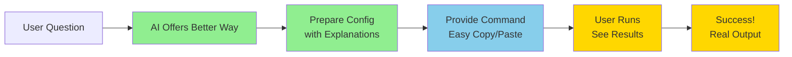
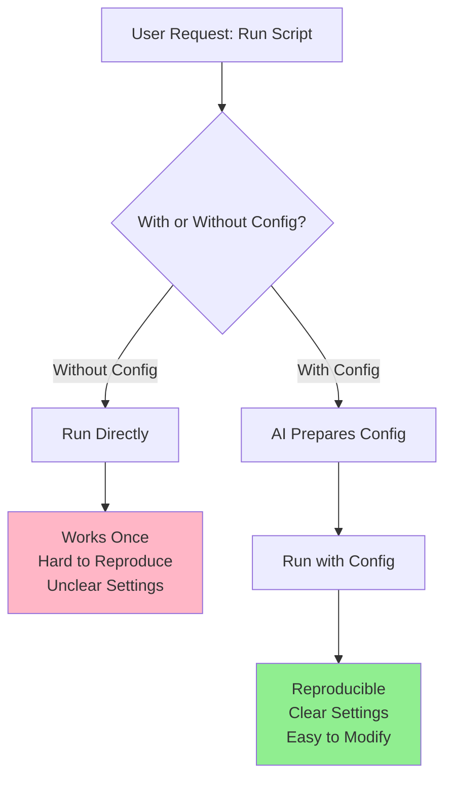
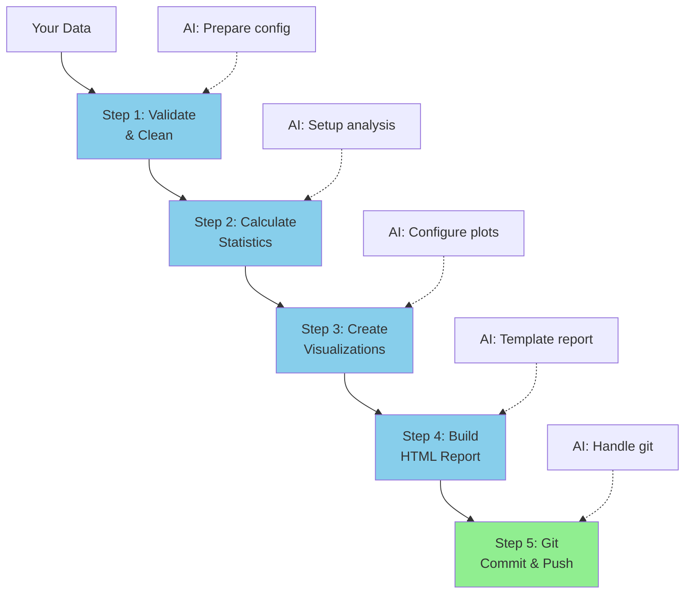
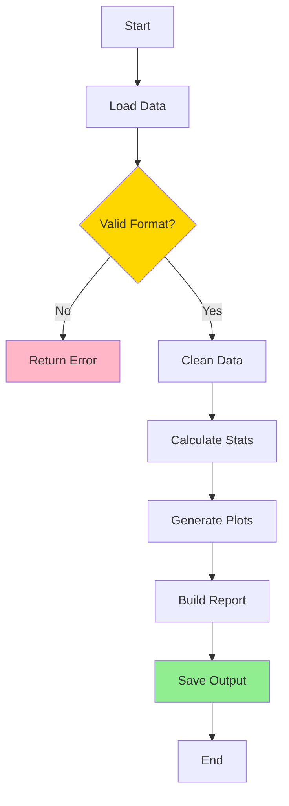
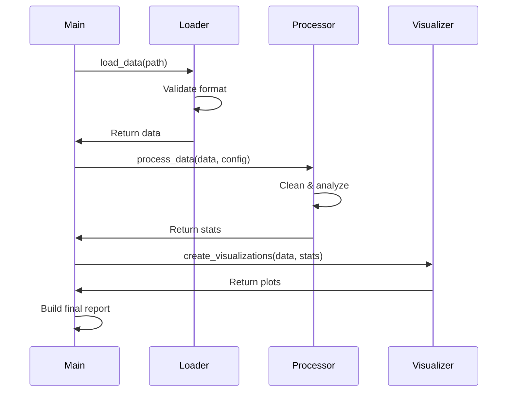
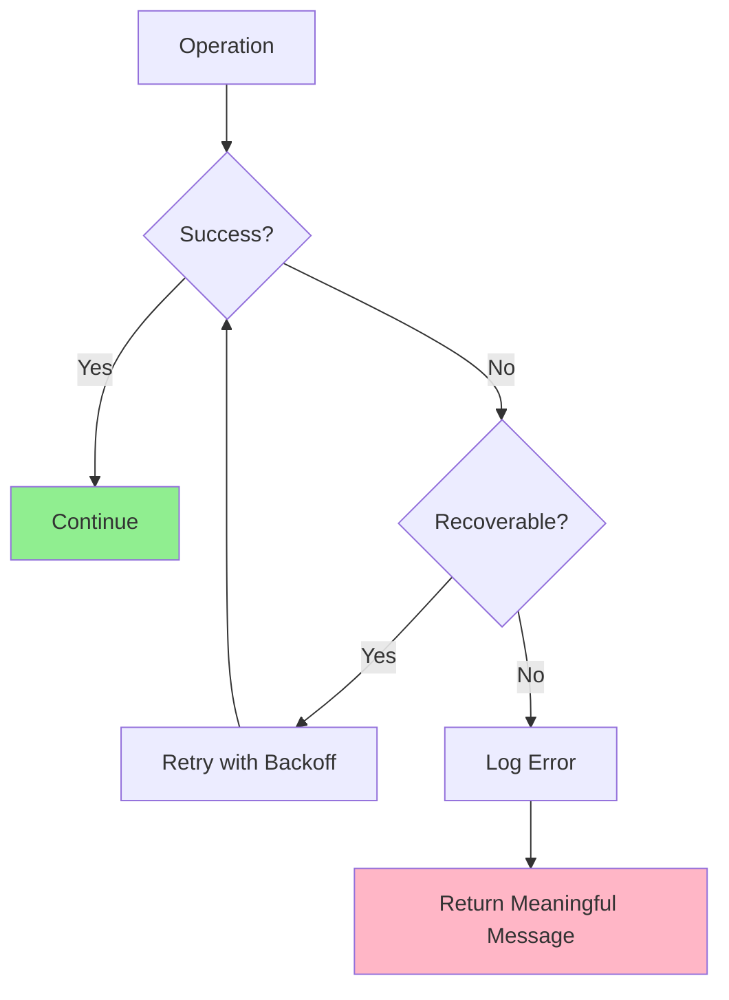

# AI Helper Examples: How AI Agents Guide You to Success

> **Purpose:** Concrete examples of how AI agents help users through workflows
> **Audience:** Both AI agents (as reference) and users (to understand what to expect)
> **Approach:** Gentle guidance, not strict enforcement

---

## 🎯 Core Principle

**AI agents are your productivity partners**, not rule enforcers. When you ask for something, AI will:
1. ✅ Understand what you want
2. ✅ Suggest a more effective approach (if available)
3. ✅ Show you concrete steps
4. ✅ Respect your final choice

---

## 📋 Complete Example Workflows

### Example 1: User Wants to Understand a Script

**Scenario:** User asks "What does `analyze_production.sh` do?"

**❌ Less Helpful Response:**
```
The script loads production data from CSV files, calculates statistics
including mean and median, generates plots, and creates an HTML report...
[Long theoretical description continues]
```

**✅ Helpful AI Response:**

```
I'd love to help you understand this script! Even better—let me help you
RUN it so you can see exactly what it produces. Here's what I'll do:

┌─────────────────────────────────────────┐
│ Step 1: Prepare Your Configuration     │
└─────────────────────────────────────────┘

I'll create: config/input/production_analysis.yaml

```yaml
metadata:
  feature: "production-analysis"
  created: "2025-10-24"

input:
  source:
    path: "data/raw/production_data.csv"
    # Point this to your production data file
    # Example: Q3_production.csv

processing:
  statistics:
    - "mean"
    - "median"
    - "percentiles"
    # These will be calculated for your data

output:
  format: "html"
  interactive: true
  # You'll get an interactive dashboard with Plotly
```

┌─────────────────────────────────────────┐
│ Step 2: Run Simple Command              │
└─────────────────────────────────────────┘

Just copy and paste this:

```bash
./scripts/analyze_production.sh reports/Q3_production
```

This will:
✅ Load your production data
✅ Calculate all statistics
✅ Generate interactive charts
✅ Create HTML dashboard
✅ Export results to JSON

Estimated time: 5-10 seconds

┌─────────────────────────────────────────┐
│ Step 3: See Real Results                │
└─────────────────────────────────────────┘

You'll get:
📊 Interactive HTML dashboard (reports/Q3_production/report.html)
📁 JSON export of all statistics
🎨 Plotly visualizations you can interact with

┌─────────────────────────────────────────┐
│ Why This Approach?                      │
└─────────────────────────────────────────┘

⏱️  Saves 90% of your time vs reading descriptions
📊 You see ACTUAL results, not theories
📁 Creates reproducible configuration
✅ Very low error rate
🔄 Easy to run again with different data

Would you like me to prepare this for you?

(I can still provide a description if you prefer, just let me know!)
```

**Visual Flow:**



---

### Example 2: User Wants to Run Without Config

**Scenario:** User says "Just run `./scripts/analyze.sh` for me"

**❌ Less Helpful Response:**
```
Running script...
[Script runs with defaults, results unclear]
```

**✅ Helpful AI Response:**

```
I can definitely help you run that script! To make this more useful and
reproducible, let me quickly prepare a configuration file first. This takes
just a moment and gives you much better results.

Here's what I'll do in the next 10 seconds:

┌─────────────────────────────────────────┐
│ Quick Setup (AI does this for you)     │
└─────────────────────────────────────────┘

1. Create config/input/analysis.yaml
   - Set sensible defaults
   - Add clear comments
   - Make it easy to modify later

2. Provide the enhanced command
   - Point to your config
   - Show where results go
   - Include progress output

┌─────────────────────────────────────────┐
│ What You Get                            │
└─────────────────────────────────────────┘

Instead of:
  ./scripts/analyze.sh
  [Unclear what happens, hard to reproduce]

You get:
  ./scripts/analyze.sh --config config/input/analysis.yaml \
    --output reports/analysis_$(date +%Y%m%d)
  [Clear inputs, clear outputs, reproducible]

Benefits:
✅ Reproducible: Run again anytime with same settings
✅ Modifiable: Easy to change parameters
✅ Traceable: Git tracks your configuration
✅ Documented: Comments explain each setting

This takes 10 extra seconds now but saves hours later when you need to:
- Run it again
- Modify parameters
- Share with teammates
- Remember what you did

Shall I prepare this for you?
(Or I can just run the script directly if you prefer!)
```

**Visual Comparison:**



---

### Example 3: Complex Multi-Step Workflow

**Scenario:** User needs to process data, generate visualizations, and create a report

**✅ AI Helper Response with Visual Guide:**

```
Great! I'll help you through this multi-step workflow. Let me break it down
and handle the complex parts for you.

┌─────────────────────────────────────────┐
│ Complete Workflow Overview              │
└─────────────────────────────────────────┘
```



```
┌─────────────────────────────────────────┐
│ What I'll Prepare For You               │
└─────────────────────────────────────────┘

📝 Configuration File: config/input/complete_workflow.yaml
```yaml
workflow:
  steps:
    - name: "validate"
      input: "data/raw/your_data.csv"
      output: "data/processed/clean_data.csv"

    - name: "analyze"
      input: "data/processed/clean_data.csv"
      statistics: ["mean", "std", "percentiles"]

    - name: "visualize"
      charts:
        - type: "histogram"
          interactive: true
        - type: "scatter"
          interactive: true

    - name: "report"
      template: "templates/analysis_report.html"
      output: "reports/analysis_report_{{date}}.html"
```
```

🔧 Single Command to Run Everything:
```bash
./scripts/run_complete_workflow.sh

# This will:
# 1. Validate your data (5 sec)
# 2. Run statistical analysis (10 sec)
# 3. Generate interactive charts (15 sec)
# 4. Build HTML report (5 sec)
# 5. Commit to git with good message (auto)
#
# Total time: ~35 seconds
# You can grab coffee while it runs!
```

┌─────────────────────────────────────────┐
│ Progress Tracking                       │
└─────────────────────────────────────────┘

You'll see:
```bash
[1/5] ✓ Data validation complete (5.2s)
[2/5] ✓ Statistical analysis complete (9.8s)
[3/5] ✓ Visualizations generated (14.3s)
[4/5] ✓ HTML report built (4.7s)
[5/5] ✓ Changes committed to git (1.2s)

🎉 All done! Report: reports/analysis_report_20251024.html
```

Ready to proceed? I'll set everything up for you!
```

---

### Example 4: User Wants Pseudocode

**Scenario:** User asks "Can you write pseudocode for the algorithm?"

**✅ AI Helper Response with Visuals:**

```
Absolutely! I'll create comprehensive pseudocode with visual diagrams to make
the algorithm crystal clear. Here's what I'll prepare:

┌─────────────────────────────────────────┐
│ Pseudocode with Visual Flow             │
└─────────────────────────────────────────┘

I'll create: docs/pseudocode/your_algorithm.md
```

```markdown
# Pseudocode: Data Analysis Algorithm

## High-Level Flow



## Detailed Algorithm

### Phase 1: Data Loading
```
FUNCTION load_data(file_path):
    INPUT: file_path (string)
    OUTPUT: data (DataFrame) or error

    // Validate path exists
    IF NOT file_exists(file_path):
        RETURN error("File not found")

    // Load and validate
    TRY:
        data = read_csv(file_path)
        IF data.is_empty():
            RETURN error("Empty file")
        RETURN data
    CATCH exception:
        RETURN error("Invalid format: " + exception)
```

### Phase 2: Data Processing
```
FUNCTION process_data(data, config):
    // Clean data
    cleaned = remove_nulls(data)
    cleaned = handle_outliers(cleaned, config.threshold)

    // Calculate statistics
    statistics = {}
    statistics['mean'] = calculate_mean(cleaned)
    statistics['median'] = calculate_median(cleaned)
    statistics['std'] = calculate_std(cleaned)

    RETURN cleaned, statistics
```

## Sequence Diagram


## Error Handling Flow

```
```

This pseudocode includes:
✅ High-level flow diagram
✅ Detailed algorithm steps
✅ Sequence diagram for interactions
✅ Error handling visualization
✅ Clear comments and explanations

Saved to: docs/pseudocode/your_algorithm.md

Would you like me to generate this?
```

---

## 🎓 Teaching Moments: When to Use Each Approach

```mermaid
graph TD
    A[Your Goal] --> B{What do you need?}

    B -->|Understanding| C[⭐⭐⭐⭐⭐ Run it<br/>See real results]
    B -->|Quick Test| D[⭐⭐⭐⭐ Config + Run<br/>Reproducible]
    B -->|Algorithm Design| E[⭐⭐⭐⭐ Pseudocode<br/>With diagrams]
    B -->|Production Use| F[⭐⭐⭐⭐⭐ Full workflow<br/>Git integrated]

    C --> G[AI prepares everything<br/>You run & learn]
    D --> H[AI creates config<br/>You customize]
    E --> I[AI writes pseudocode<br/>With visuals]
    F --> J[AI handles it all<br/>End to end]

    style C fill:#90EE90
    style D fill:#90EE90
    style E fill:#90EE90
    style F fill:#90EE90
```



---

## 🤝 How AI Respects Your Choices

**AI always gives you control:**

```mermaid
graph TD
    A[AI Suggests Better Approach] --> B{Your Response}

    B -->|"Yes, do it!"| C[AI: Proceeds with ⭐⭐⭐⭐⭐]
    B -->|"Let me think"| D[AI: Explains more benefits]
    B -->|"No, original way"| E[AI: Assists with your choice]
    B -->|"Show me both"| F[AI: Demonstrates both options]

    C --> G[Great Results!]
    D --> H[More info provided]
    E --> I[Helps your way]
    F --> J[You decide after seeing]

    style C fill:#90EE90
    style E fill:#87CEEB
    style F fill:#FFD700
```



---

## 💡 Key Takeaways for Users

**What to Expect from Your AI Partner:**

1. ✅ **Helpful Suggestions** - AI will suggest better ways
2. ✅ **Clear Examples** - Visual diagrams and step-by-step guides
3. ✅ **Concrete Preparation** - AI does setup work for you
4. ✅ **Respectful Guidance** - Your choice is always respected
5. ✅ **Educational Approach** - Learn better patterns as you work

**What AI Will NOT Do:**

- ❌ Block you from your chosen approach
- ❌ Force you to use specific methods
- ❌ Judge your decisions
- ❌ Be rigid about workflows

---

## 🎯 For AI Agents: Implementation Guide

**When user requests less effective approach:**

```python
# Pseudo-implementation for AI agents

def handle_user_request(request):
    # 1. Understand the request
    user_intent = analyze_request(request)

    # 2. Check if better approach exists
    better_approach = find_better_approach(user_intent)

    if better_approach:
        # 3. Gentle guidance
        response = f"""
        I understand you want {user_intent}! I have an even better way
        that will {better_approach.benefits}.

        Here's what I'll do:
        {generate_step_by_step_plan(better_approach)}

        Visual guide:
        {generate_mermaid_diagram(better_approach)}

        This approach {better_approach.stats} (vs {current_approach.stats})

        Would you like me to proceed this way?
        (I can still {user_intent} if you prefer!)
        """
        return response

    else:
        # 4. Proceed with original request
        return execute_request(request)
```

**Key Principles:**
- 🎯 Always acknowledge user's intent
- 📊 Show visual comparisons
- 🛠️ Prepare concrete examples
- 🤝 Respect final decision
- 🎓 Educate through doing

---

**Remember:** AI agents are helpers, not enforcers. Guide users to success with kindness, clarity, and concrete examples.
