# AI Usage Guidelines for Repository Work

> **Applicable to**: All workspace-hub repositories (MANDATORY)
>
> Version: 2.0.0
> Last Updated: 2025-10-24
> Status: Living Document (continuously updated)
> **Enforcement**: CRITICAL - Violations will be immediately redirected

## 💡 Helpful Guidance: AI Agents as Your Productivity Partners

**THIS DOCUMENT HELPS AI AGENTS GUIDE YOU TO MORE EFFECTIVE WORKFLOWS**

When AI agents notice you're about to use a less effective approach, they'll gently guide you toward better methods that save time and reduce errors. Think of your AI as a helpful coach, not a strict enforcer!

---

## ✅ Foundational Skills (Use With Any AI Tool)

### 4. Context Engineering

**Concept:** The more high-quality information and context about your situation, goals, what you've tried, what didn't work, data, and constraints you provide, the higher-quality answers you get.

**Template (context-first over "perfect prompts"):**

```text
You are a top 0.1% expert in FIELD, helping me with TASK

CONTEXT:
- bullet list of relevant info, data, attempts, and outcomes

CONSTRAINTS:
- bullet list of limits, preferences, deadlines, tools, etc.

Ask me clarifying questions, one at a time, until you are 95% confident you can complete the task successfully.
```

**AI agent notes:**
- Ask for missing context before acting.
- Use one question at a time, stop when confidence is >= 95%.

### 5. Sparring Partners

**Concept:** Stop using AI for surface-level answers. Use AI to understand what questions you should have been asking.

**Action:** Ask the AI to act as a critic or skeptic.

**Example request:**

```text
Tear my idea apart and find my blind spots.
```

**AI agent notes:**
- Encourage counter-arguments, edge cases, and failure modes.
- Compare answers across multiple models and look for convergence and divergence.

### 🎯 How AI Agents Help You

AI agents will use this gentle, educational approach:

1. ✅ **Acknowledge your request** - Show understanding
2. ✅ **Suggest a better way** - Offer more effective approach
3. ✅ **Explain the benefits** - Share why it's better
4. ✅ **Provide concrete steps** - Show exactly what will happen
5. ✅ **Respect your choice** - You decide which way to proceed

### 📋 Example: Helpful Guidance in Action

**Scenario:** User asks for a description instead of execution

❓ **USER:** "Can you describe what `run_analysis.sh` does?"

💡 **AI GENTLE RESPONSE:**

```
I'd be happy to help you understand this script! I have an even better idea that
will give you real results instead of just a description.

Instead of describing what it does theoretically, let me help you run it and
see actual results. Here's what I'll do:

📝 Step 1: Prepare Your Input File
   I'll create: config/input/analysis_config.yaml
   This will include:
   - All parameters with clear explanations
   - Default values that make sense
   - Comments so you understand each setting

🔧 Step 2: Provide the Exact Command
   You'll get a simple copy-paste command:
   ./scripts/run_analysis.sh reports/output

📊 Step 3: See Real Results
   You'll get actual output showing:
   - What the script produces
   - Real data and visualizations
   - Concrete results you can use

⏱️  Why This is Better:
   - Saves 90% of your time vs reading descriptions
   - You see real results, not theories
   - Creates reproducible configuration
   - Very low error rate

Would you like me to prepare this for you?
(I can still describe it if you prefer, just let me know!)
```

### 🎓 Teaching Through Visual Examples

AI agents should include **mermaid diagrams** to help users visualize workflows:

**Example 1: Show the Workflow**

```mermaid
graph LR
    A[Your Question:<br/>"What does script do?"] --> B{Better Approach<br/>Available?}
    B -->|Yes| C[AI: Suggests Running<br/>Instead of Describing]
    C --> D[Prepare YAML<br/>Config]
    D --> E[Provide<br/>Command]
    E --> F[You Run<br/>& See Results]
    F --> G[Real Output!<br/>🎉]

    B -->|No| H[AI: Provides<br/>Description]

    style C fill:#90EE90
    style D fill:#90EE90
    style E fill:#87CEEB
    style F fill:#FFD700
    style G fill:#FFD700
```

**Example 2: Show the Complete Process**

```mermaid
sequenceDiagram
    participant U as You
    participant AI as AI Agent
    participant S as System

    U->>AI: "Describe the script?"
    AI->>U: "Let me help you run it instead!"
    AI->>AI: Prepare YAML config
    AI->>U: Here's your config file (editable)
    U->>U: Review config (optional)
    AI->>U: Copy this command: ./scripts/run.sh
    U->>S: Run command
    S->>U: Real results! 📊
    U->>AI: "Thanks, this is great!"
    AI->>S: Handle git operations
    Note over AI,S: Commit, push, PR
```



### 🛠️ Concrete Help: How AI Assists You

AI agents should provide **step-by-step assistance**:

**Helping with Input Files:**

```yaml
# AI creates this for you in config/input/your_task.yaml

metadata:
  feature_name: "data-analysis"
  created: "2025-10-24"
  # AI explains: "This tracks when you started this task"

input:
  source:
    path: "data/raw/your_data.csv"
    # AI explains: "Point this to your data file"

  validation:
    required_columns: ["id", "value", "date"]
    # AI explains: "These columns must exist in your CSV"

output:
  format: "html"
  # AI explains: "You'll get an interactive HTML report"
  destination:
    path: "reports/"
    # AI explains: "Reports save here for easy access"
```

**Helping with Pseudocode:**

AI creates clear pseudocode with visual aids:

```markdown
# Pseudocode: Data Analysis Pipeline

## Flow Diagram


## Algorithm

FUNCTION analyze_data(config_file):
  // Step 1: Load
  data = LOAD_CSV(config.input.path)

  // Step 2: Validate
  IF NOT validate(data, config.validation):
    RETURN error_message

  // Step 3: Process
  statistics = CALCULATE_STATS(data)
  plots = CREATE_PLOTS(data, statistics)

  // Step 4: Output
  report = BUILD_HTML(statistics, plots)
  SAVE_REPORT(report, config.output.path)

  RETURN success
```

**Helping with Commands:**

AI provides clear, copy-paste ready commands:

```bash
# AI Message: "Here's your command! Just copy and paste:"

./scripts/run_analysis.sh reports/analysis_output

# AI Message: "This will:"
# ✅ Load your data from config/input/your_task.yaml
# ✅ Run the complete analysis pipeline
# ✅ Generate interactive HTML report
# ✅ Save results to reports/analysis_output/
#
# Estimated time: 5-10 seconds
# You'll see progress as it runs!
```

## Overview

This document captures learnings and best practices for using AI tools (especially Claude) when working with workspace-hub repositories. It's organized by effectiveness, from best to worst approaches, based on real-world experience.

**COMPLIANCE IS MANDATORY** - All work must follow ⭐⭐⭐⭐⭐ or ⭐⭐⭐⭐ patterns.

---

---

## 🎯 How to Use This Guide

This guide shows AI agents **how to help you effectively**. When you work with AI:
- AI will **suggest better approaches** with visual examples
- AI will **prepare files for you** with clear explanations
- AI will **show you workflows** using diagrams
- AI will **respect your choices** while guiding you to success

---

## ⭐ Best Practices (Highly Recommended)

### Visual Overview: Effectiveness Levels

```mermaid
graph TD
    A[Your Task Request] --> B{AI Evaluates Approach}
    B --> C[⭐⭐⭐⭐⭐ BEST:<br/>AI Prepares + Runs]
    B --> D[⭐⭐⭐⭐ GOOD:<br/>With Input File]
    B --> E[⭐⭐⭐ OK:<br/>Script Only]
    B --> F[⭐ AVOID:<br/>Just Description]

    C --> G[90% Time Saved<br/>Very Low Errors]
    D --> H[70% Time Saved<br/>Low Errors]
    E --> I[40% Time Saved<br/>Medium Errors]
    F --> J[-20% Time Lost<br/>No Results]

    style C fill:#00FF00
    style D fill:#90EE90
    style E fill:#FFE4B5
    style F fill:#FFB6C6
```



---

### 1. Running Script with AI-Prepared Input File + AI-Provided Command

**Rating:** ⭐⭐⭐⭐⭐ **EVEN BETTER** (Highest effectiveness)

**Visual Workflow:**

```mermaid
sequenceDiagram
    participant U as You
    participant AI as AI Agent
    participant F as File System
    participant S as Script

    U->>AI: "I need to analyze data"
    AI->>AI: Prepare YAML config
    AI->>F: Save config/input/task.yaml
    AI->>U: ✅ Config ready! Review if you like
    AI->>U: 📋 Command: ./scripts/run.sh
    U->>S: Execute command
    S->>F: Generate results
    F->>U: 📊 Interactive HTML report
    U->>AI: "Perfect! Thanks!"
    AI->>F: Handle git (commit, push, PR)
```



**What it is:**
- AI agent prepares the input YAML configuration file
- AI agent provides the exact bash command to execute
- User runs the provided command with the prepared input file

**Why it works best:**
- Complete workflow automation without manual intervention
- AI handles both configuration complexity AND execution syntax
- Reduces human error in both file preparation and command construction
- Follows SPARC methodology (Specification → Configuration → Execution)
- Reproducible and auditable (input file + command are version controlled)

**Example:**

```bash
# AI prepares: config/input/lower_tertiary.yaml
# AI provides this command:
./scripts/bsee/run_lower_tertiary_analysis.sh reports/lower_tertiary

# User just copies and runs the command
# Results: Perfect execution with comprehensive output
```

**When to use:**
- Complex analysis workflows with many parameters
- Economic modeling (NPV analysis, production forecasting)
- Multi-source data integration
- Any task requiring both configuration and execution

**Best with:**
- Claude (excellent at understanding context and generating precise commands)
- Any module with YAML configuration support
- Scripts in scripts/ directories across repositories

---

### 2. Git Operations with AI (Especially Claude)

**Rating:** ⭐⭐⭐⭐⭐ **GOOD** (Highly effective)

**What it is:**
- Using AI (particularly Claude) to perform git operations
- Branch management, commits, pull requests, merges
- Git workflow orchestration

**Why it works:**
- Claude understands git context extremely well
- Generates proper commit messages following conventions
- Handles complex merge scenarios
- Maintains clean git history

**Example:**

```bash
# Ask Claude to:
# 1. Create feature branch
# 2. Commit changes with meaningful message
# 3. Push to remote
# 4. Create pull request

# Claude executes:
git checkout -b feature/new-analysis-module
git add scripts/ config/input/ docs/
git commit -m "Add comprehensive analysis module

- Multi-source data integration
- Interactive Plotly visualizations
- Bash execution framework
- YAML configuration support"

git push -u origin feature/new-analysis-module
gh pr create --title "New Analysis Module" --body "..."
```

**When to use:**
- Feature branch workflows
- Complex commit scenarios
- Pull request creation
- Repository synchronization
- Merge conflict resolution

**Best with:**
- Claude Code (native git integration)
- Multi-file changes
- Workflow automation
- Repository management tasks

---

### 3. Running Script with Input File

**Rating:** ⭐⭐⭐⭐ **GOOD** (Very effective)

**What it is:**
- Running bash scripts with YAML configuration files as input
- User prepares input file (or AI prepares it)
- User manually constructs and runs the command

**Why it works:**
- Separates configuration from execution
- Version-controllable input parameters
- Reproducible analysis workflows
- Clear audit trail

**Example:**

```bash
# Input file: config/input/analysis_config.yaml
# User runs:
./scripts/run_analysis.sh reports/output

# Or with Python directly:
python scripts/analyze_data.py \
    --config config/input/analysis_config.yaml \
    --output reports/analysis \
    --format html \
    --interactive
```

**When to use:**
- Standardized analysis workflows
- Repeatable processing tasks
- When input parameters need version control
- Production-grade analysis runs

**Best with:**
- Any modular analysis workflow
- Scripts with configuration support
- Data processing pipelines

---

### 4. Preparing Input Files

**Rating:** ⭐⭐⭐⭐ **GOOD** (Very effective)

**What it is:**
- Using AI to generate YAML configuration files
- Following SPARC workflow templates
- Structured input for bash execution

**Why it works:**
- AI understands YAML structure and validation
- Follows established templates and patterns
- Reduces configuration errors
- Enables complex parameter specification

**Example:**

```yaml
# AI generates: config/input/custom_analysis.yaml

metadata:
  feature_name: "custom-analysis"
  created: "2025-10-22"
  status: "production"

requirements:
  functional:
    - requirement: "Process data with custom parameters"
      priority: "high"
      implemented: true

processing:
  steps:
    - name: "load_data"
      module: "data_loader"
      function: "load_data"
      params:
        validate: true
        encoding: "utf-8"
```

**When to use:**
- New analysis workflows
- Complex configuration requirements
- Parameter-heavy operations
- Any setup with multiple configuration options

**Best with:**
- Claude (excellent YAML generation)
- Template-based configurations
- Multi-parameter scenarios

---

## ⚠️ Use With Caution

### 5. Running a Script (Standalone)

**Rating:** ⭐⭐⭐ **OK BUT...** (Limited effectiveness)

**What it is:**
- Running bash scripts without input files
- Hardcoded parameters or defaults
- Direct script execution

**Why it's limited:**
- Less reproducible (parameters not version controlled)
- Harder to modify parameters
- Limited audit trail
- Difficult to share exact configuration

**Example:**

```bash
# Just running the script
./scripts/run_analysis.sh

# Works, but:
# - Uses default parameters
# - No customization without editing script
# - Hard to reproduce exact conditions
```

**When acceptable:**
- Quick exploratory analysis
- Testing script functionality
- Default parameter runs
- One-off executions

**Better alternative:**
- Prepare input file first
- Use script + input file approach
- Version control your configuration

---

## ❌ Avoid These Approaches

### 6. Running LLM Descriptions

**Rating:** ⭐ **PRETTY BAD SIDE** (Least effective)

**What it is:**
- Asking AI to describe what a script does
- Using AI to explain code instead of running it
- Theoretical analysis instead of practical execution

**Why it fails:**
- No actual results produced
- Theoretical understanding ≠ working implementation
- Wastes time on description instead of action
- Doesn't advance the actual work

**Example of what NOT to do:**

```
❌ BAD: "Can you describe what analyze_data.py does?"
    Result: Long description, no actionable output

✅ GOOD: "Prepare input file for data analysis and
          provide the command to run it"
    Result: Working configuration + executable command + actual results
```

**Why to avoid:**
- Doesn't produce tangible results
- Time spent on explanation, not execution
- Creates false sense of progress
- Better to just run the code with proper inputs

**Better alternative:**
- Prepare input file + run script
- Let results speak for themselves
- Review actual output instead of descriptions

---

## 🎯 Workflow Recommendations

### Recommended Workflow Pattern

```
1. ⭐⭐⭐⭐⭐ AI prepares input YAML file
   └─ Following template in templates/input_config.yaml
   └─ Validated against schema
   └─ Version controlled in config/input/

2. ⭐⭐⭐⭐⭐ AI provides exact bash command
   └─ Points to correct script in scripts/
   └─ References prepared input file
   └─ Includes all necessary flags

3. ⭐⭐⭐⭐⭐ User executes command
   └─ Copy/paste provided command
   └─ Review output and results
   └─ Version control any changes

4. ⭐⭐⭐⭐⭐ Use Claude for git operations
   └─ Commit results
   └─ Create meaningful commit messages
   └─ Manage branches and PRs
```

### Anti-Pattern to Avoid

```
❌ DON'T:
1. Ask AI to describe what script does
2. Manually construct complex commands
3. Run scripts without input files
4. Skip version control of configurations
```

---

## 📊 Effectiveness Matrix

| Approach | Rating | Time Saved | Error Rate | Reproducibility | Recommended? |
|----------|--------|------------|------------|----------------|--------------|
| Script + AI Input + AI Command | ⭐⭐⭐⭐⭐ | 90% | Very Low | Excellent | ✅ **YES** |
| Git Operations (Claude) | ⭐⭐⭐⭐⭐ | 80% | Very Low | Excellent | ✅ **YES** |
| Script + Input File | ⭐⭐⭐⭐ | 70% | Low | Very Good | ✅ **YES** |
| Preparing Input Files | ⭐⭐⭐⭐ | 75% | Low | Very Good | ✅ **YES** |
| Script Only (no input) | ⭐⭐⭐ | 40% | Medium | Poor | ⚠️ **SOMETIMES** |
| LLM Descriptions | ⭐ | -20% | N/A | None | ❌ **NO** |

---

## 🔄 Application Across Repositories

### This Pattern Applies To:

1. **worldenergydata**
   - BSEE production analysis
   - Lower Tertiary NPV calculations
   - Marine safety incident analysis
   - All modular analysis workflows

2. **All workspace-hub repositories**
   - Any repository with scripts/ directory
   - Any YAML-based configuration system
   - Any analysis or data processing workflows
   - Git operations across all repos

3. **Future repositories**
   - Establish scripts/ + config/input/ structure
   - Create YAML templates
   - Build bash execution framework
   - Follow same best practices

### Universal Principles:

1. **Configuration as Code**: Always use input files over hardcoded parameters
2. **AI-Assisted Execution**: Let AI prepare both input and commands
3. **Git Integration**: Use Claude for git operations
4. **Version Control**: Track inputs, outputs, and configurations
5. **Avoid Descriptions**: Execute, don't describe

---

## 📝 Repository-Specific Examples

### Example 1: Data Analysis Repository

```bash
# ⭐⭐⭐⭐⭐ BEST: AI prepares config + provides command
# AI creates: config/input/custom_analysis.yaml
# AI provides:
./scripts/run_analysis.sh reports/custom_output

# ⭐⭐⭐⭐ GOOD: User prepares config, runs with input
./scripts/run_analysis.sh reports/output

# ⭐⭐⭐ OK: Run with defaults
./scripts/run_analysis.sh

# ❌ BAD: Ask AI to describe what the script does
"What does run_analysis.sh do?"
```

### Example 2: Git Workflow

```bash
# ⭐⭐⭐⭐⭐ BEST: Claude handles everything
# Claude executes:
git checkout -b feature/new-module
git add scripts/ config/ docs/
git commit -m "Add new module with YAML config"
git push -u origin feature/new-module
gh pr create --title "New Module"

# ⭐⭐⭐ OK: Manual git operations
# User manually types each command
# More error-prone, slower
```

---

## 🔄 Future Updates

This document will be continuously updated with:
- New effectiveness ratings as we gain experience
- Additional workflow patterns
- Tool-specific best practices
- Cross-repository learnings
- Community contributions

### Update Process:

1. Test new AI approach in real workflow
2. Evaluate effectiveness (time, errors, reproducibility)
3. Add to this document with rating
4. Share across workspace-hub repositories
5. Incorporate feedback and refinements

---

## 💡 Key Takeaways

1. **Best Approach**: AI prepares input file + provides command to run
2. **Git Operations**: Always use Claude (especially Claude Code)
3. **Input Files**: Essential for reproducibility and version control
4. **Avoid Descriptions**: Execute code, don't describe it
5. **Version Control**: Track configurations, not just code
6. **Consistency**: Apply these patterns across all repositories

---

## 📞 Questions or Suggestions?

This is a living document. As we discover new patterns or refine existing ones:
- Update this file with new learnings
- Share insights across workspace-hub repositories
- Document what works (and what doesn't)
- Keep rating system current

**Remember**: The goal is to maximize effectiveness while minimizing errors and time spent. Always prefer execution over description, and let AI handle the complex configuration and command construction.

---

**Last Updated**: 2025-10-23
**Next Review**: As new patterns emerge
**Status**: Active and continuously evolving
