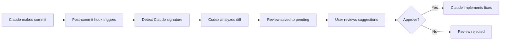

# Codex Review Workflow

> Automated code review using OpenAI Codex for Claude commits
>
> Version: 1.0.0
> Last Updated: 2025-12-25

## Overview

This workflow automatically reviews all commits made by Claude Code using OpenAI Codex CLI. When Claude makes a commit, a post-commit hook triggers Codex to analyze the changes and generate a comprehensive code review for your approval.

## How It Works



## Quick Start

### View Pending Reviews

```bash
./scripts/ai-review/review-manager.sh list
```

### Show Specific Review

```bash
./scripts/ai-review/review-manager.sh show <review_id>
```

### Approve a Review

```bash
./scripts/ai-review/review-manager.sh approve <review_id>
```

### Implement Approved Suggestions

```bash
./scripts/ai-review/review-manager.sh implement <review_id>
```

## Installation

The hooks are installed automatically across all 26 repositories. To reinstall or update:

```bash
./scripts/ai-review/install-codex-hooks.sh
```

## Review Aspects

Codex reviews each Claude commit for:

1. **Code Quality**
   - Code style and readability
   - Naming conventions
   - DRY and SOLID principles
   - Code organization

2. **Security**
   - Injection vulnerabilities (SQL, XSS, CSRF)
   - Hardcoded secrets or credentials
   - Input validation issues
   - Authentication/authorization gaps

3. **Performance**
   - Algorithmic efficiency
   - Memory usage concerns
   - Database query optimization
   - Caching opportunities

4. **Documentation**
   - Code comments adequacy
   - Function/class documentation
   - README updates if needed

5. **Test Coverage**
   - Are tests included for new code?
   - Test quality and coverage
   - Edge cases considered

## Review Files Location

Reviews are stored in `~/.codex-reviews/`:

```
~/.codex-reviews/
├── pending/      # Reviews awaiting approval
├── approved/     # Reviews approved for implementation
├── rejected/     # Reviews that were rejected
└── implemented/  # Reviews that have been implemented
```

## Review Report Format

Each review contains:

```markdown
# Codex Code Review Report

## Metadata
- Repository, Commit SHA, Author, Date
- Review Type (full/quick)

## Changes Summary
- Files changed, insertions, deletions

## Review Results
- Summary assessment
- Findings by severity (Critical, High, Medium, Low)
- Specific suggestions with code examples
- Verdict: APPROVE, REQUEST_CHANGES, or NEEDS_DISCUSSION

## Actions
- Commands to approve/reject/implement
```

## Scripts Reference

### codex-review.sh

Run a manual Codex review on any commit:

```bash
# Review HEAD commit in current repo
./scripts/ai-review/codex-review.sh

# Review specific commit
./scripts/ai-review/codex-review.sh abc123

# Review in specific repo
./scripts/ai-review/codex-review.sh -r /path/to/repo HEAD

# Quick review (code quality only)
./scripts/ai-review/codex-review.sh -q

# Full review (all aspects)
./scripts/ai-review/codex-review.sh -f
```

### review-manager.sh

Manage pending reviews:

```bash
# List all pending reviews
./scripts/ai-review/review-manager.sh list

# Show specific review
./scripts/ai-review/review-manager.sh show <review_id>

# Approve for implementation
./scripts/ai-review/review-manager.sh approve <review_id>

# Reject a review
./scripts/ai-review/review-manager.sh reject <review_id>

# Implement approved suggestions
./scripts/ai-review/review-manager.sh implement <review_id>

# View statistics
./scripts/ai-review/review-manager.sh stats

# Clean old reviews (>30 days)
./scripts/ai-review/review-manager.sh clean
```

### install-codex-hooks.sh

Install/reinstall hooks across repositories:

```bash
./scripts/ai-review/install-codex-hooks.sh
```

## Claude Commit Detection

The post-commit hook detects Claude commits by looking for:

- `Claude Code` or `claude.com/claude-code` in commit message
- `Co-Authored-By: Claude` in commit message
- `@anthropic` in commit author email
- `🤖 Generated with Claude` markers

## Integration with Claude

When you approve a review and run `implement`, an implementation file is created with all the suggestions. You can then:

1. Navigate to the repository
2. Open Claude Code
3. Paste the implementation prompt
4. Claude will implement the approved suggestions

## Configuration

### Environment Variables

```bash
# Custom reviews directory
export REVIEWS_DIR="$HOME/.my-codex-reviews"

# Set workspace hub location (default: /mnt/github/workspace-hub)
export WORKSPACE_HUB="/path/to/workspace-hub"
```

### Uninstalling Hooks

To remove the hook from a specific repository:

```bash
rm /path/to/repo/.git/hooks/post-commit
```

## Workflow Integration

This integrates with the existing workspace-hub workflow:

1. **Development**: Use Claude Code for coding tasks
2. **Commit**: Claude commits with standard signature
3. **Review**: Codex automatically reviews the commit
4. **Approval**: Review suggestions, approve what makes sense
5. **Implementation**: Claude implements approved improvements
6. **Iteration**: Repeat for continuous improvement

## Best Practices

1. **Review promptly**: Check pending reviews regularly
2. **Be selective**: Not all suggestions need implementation
3. **Use quick reviews**: For small changes, use `-q` flag
4. **Clean old reviews**: Run `clean` periodically
5. **Check stats**: Monitor approval rates for insights

## Troubleshooting

### Codex Not Found

```bash
# Install Codex CLI
npm install -g @openai/codex-cli

# Or with npm
npm install -g codex-cli
```

### Review Not Triggering

Check if the commit has Claude signature:

```bash
git log -1 --format="%B" HEAD | grep -i claude
```

### Hook Not Running

Verify hook is installed:

```bash
cat /path/to/repo/.git/hooks/post-commit
```

Make sure it's executable:

```bash
chmod +x /path/to/repo/.git/hooks/post-commit
```

## Related Documentation

- [AI Agent Guidelines](AI_AGENT_GUIDELINES.md)
- [AI Usage Guidelines](AI_USAGE_GUIDELINES.md)
- [Development Workflow](../workflow/DEVELOPMENT_WORKFLOW.md)

---

*Automated Claude-Codex review workflow for continuous code improvement*
