# Cross-Review Policy

> **MANDATORY FOR ALL AI AGENTS**
> All work performed by Claude Code or Google Gemini MUST be reviewed by OpenAI Codex
>
> Version: 1.0.0
> Priority: HIGHEST
> Last Updated: 2026-01-13

---

## Overview

This document defines the mandatory cross-review policy for all AI agent work across the workspace-hub ecosystem. The policy ensures quality control through independent review by a different AI provider.

## Core Rule

**ALL work performed by Claude Code or Google Gemini MUST be reviewed by OpenAI Codex before presenting to the user.**

```mermaid
flowchart TD
    subgraph WORK["🔧 AI Agent Work"]
        A[("🤖 Claude Code<br/>or Gemini<br/>performs task")]
        B["📝 Commit changes<br/>with AI signature"]
    end

    subgraph REVIEW["🔍 Cross-Review Loop"]
        C["📋 OpenAI Codex<br/>reviews commit"]
        D{{"💭 Feedback<br/>needed?"}}
        E["🔨 Implement<br/>fixes"]
        F{{"🔢 Iteration<br/>< 3?"}}
        G["📊 Increment<br/>iteration counter"]
    end

    subgraph OUTPUT["✅ Output to User"]
        H["👤 Present to user<br/>with review status"]
        I["📄 Final status:<br/>APPROVED"]
        J["📄 Final status:<br/>ITERATION_LIMIT"]
    end

    A --> B
    B --> C
    C --> D
    D -->|"Yes"| E
    D -->|"No - Approved ✓"| I
    E --> F
    F -->|"Yes"| G
    G --> C
    F -->|"No - Max reached"| J
    I --> H
    J --> H

    style A fill:#e1f5fe,stroke:#01579b
    style C fill:#fff3e0,stroke:#e65100
    style H fill:#e8f5e9,stroke:#2e7d32
    style I fill:#c8e6c9,stroke:#2e7d32
    style J fill:#ffecb3,stroke:#ff6f00
```



### Visual Summary

```mermaid
graph LR
    subgraph "Primary Agents"
        CL["🟣 Claude Code"]
        GM["🔵 Google Gemini"]
    end

    subgraph "Reviewer"
        CO["🟢 OpenAI Codex"]
    end

    subgraph "Output"
        US["👤 User"]
    end

    CL -->|"commits"| CO
    GM -->|"commits"| CO
    CO -->|"approved"| US

    style CL fill:#9c27b0,color:#fff
    style GM fill:#1976d2,color:#fff
    style CO fill:#388e3c,color:#fff
    style US fill:#f5f5f5,stroke:#333
```



## Workflow Requirements

### 1. Task Completion

When Claude Code or Gemini completes any task:
1. **Commit immediately** with descriptive message
2. **Trigger Codex review** automatically via post-commit hook
3. **Wait for review** before proceeding

### 2. Review Iteration Loop

```
MAX_ITERATIONS = 3

for iteration in 1..MAX_ITERATIONS:
    1. Codex reviews the commit
    2. If APPROVED → Present to user
    3. If REQUEST_CHANGES:
        a. Implement feedback
        b. Commit fixes
        c. Continue to next iteration

After MAX_ITERATIONS → Present to user (regardless of approval status)
```

### 3. Iteration Tracking

Each review cycle tracks:
- **iteration_count**: Current iteration number (1-3)
- **original_commit**: SHA of the original work
- **review_commits**: SHAs of fix commits
- **feedback_history**: All review feedback received
- **final_status**: APPROVED, PARTIAL, or ITERATION_LIMIT_REACHED

## Review Types Covered

This policy applies to ALL review types:

| Review Type | Description | Trigger |
|-------------|-------------|---------|
| **Code Reviews** | PR reviews, commit reviews | Every commit |
| **SPARC Gate-Pass** | Phase transition reviews | Phase completion |
| **QA Reviews** | Quality assurance checks | Feature completion |
| **Security Reviews** | Vulnerability scanning | Security-sensitive changes |
| **Architecture Reviews** | Design decisions | Architectural changes |

## Provider Mapping

| Primary Agent | Reviewer | Notes |
|--------------|----------|-------|
| Claude Code | OpenAI Codex | All Claude commits |
| Google Gemini | OpenAI Codex | All Gemini commits |
| OpenAI Codex | N/A | Codex is the reviewer, not reviewed |

## Implementation

### Post-Commit Hook

The cross-review is triggered automatically by post-commit hooks installed in all repositories.

```bash
# Automatic trigger after every commit
./scripts/ai-review/cross-review-loop.sh --max-iterations 3
```

### Manual Trigger

```bash
# Manually trigger cross-review with iteration loop
./scripts/ai-review/cross-review-loop.sh \
    --commit HEAD \
    --max-iterations 3 \
    --auto-implement
```

### Review Commands

```bash
# View pending cross-reviews
./scripts/ai-review/review-manager.sh list

# Check iteration status
./scripts/ai-review/review-manager.sh iteration-status <review_id>

# Force present to user (skip remaining iterations)
./scripts/ai-review/review-manager.sh force-complete <review_id>
```

## Iteration Feedback Implementation

### Automatic Implementation

When `--auto-implement` is enabled:
1. Codex feedback is parsed for actionable items
2. Fixes are applied automatically
3. New commit is created with reference to review
4. Next iteration begins

### Manual Implementation

When automatic implementation is disabled:
1. Review feedback is saved to pending
2. User or agent implements fixes manually
3. Manual commit triggers next iteration

## Exit Conditions

The review loop exits when ANY of these conditions are met:

1. **APPROVED**: Codex approves the changes
2. **MAX_ITERATIONS**: 3 iterations completed
3. **FORCE_COMPLETE**: User forces completion
4. **NO_CHANGES**: No actionable feedback in review

## Commit Message Format

### Original Work Commit
```
<type>: <description>

<body>

Co-Authored-By: Claude <noreply@anthropic.com>
```

### Review Fix Commit
```
fix(review): <description>

Addresses Codex review feedback (iteration N/3)
Review-ID: <review_id>
Original-Commit: <original_sha>

Co-Authored-By: Claude <noreply@anthropic.com>
```

## Configuration

### Environment Variables

```bash
# Maximum review iterations (default: 3)
export CROSS_REVIEW_MAX_ITERATIONS=3

# Auto-implement feedback (default: true)
export CROSS_REVIEW_AUTO_IMPLEMENT=true

# Review directory
export REVIEWS_DIR="$HOME/.codex-reviews"
```

### Config File

Create `~/.cross-review-config.json`:

```json
{
  "max_iterations": 3,
  "auto_implement": true,
  "reviewers": {
    "claude": "codex",
    "gemini": "codex"
  },
  "skip_patterns": [
    "*.md",
    "*.txt",
    "docs/*"
  ],
  "require_approval_for": [
    "src/*",
    "lib/*",
    "*.py",
    "*.js",
    "*.ts"
  ]
}
```

## Integration with Existing Workflows

### SPARC Methodology

Cross-review integrates with SPARC phases:

| Phase | Review Trigger | Review Focus |
|-------|----------------|--------------|
| Specification | Phase complete | Requirements accuracy |
| Pseudocode | Phase complete | Algorithm correctness |
| Architecture | Phase complete | Design quality |
| Refinement | Each commit | Code quality, tests |
| Completion | Final commit | Integration, polish |

### GitHub Integration

Cross-reviews integrate with GitHub workflows:

1. **PR Creation**: Automatic Codex review
2. **PR Updates**: Re-review on new commits
3. **PR Merge**: Final review verification

## Metrics and Tracking

### Review Metrics

Track across all repositories:
- **Approval rate**: % approved on first iteration
- **Average iterations**: Mean iterations to approval
- **Common feedback**: Most frequent issues
- **Time to approval**: Average review cycle time

### Dashboard Command

```bash
# View cross-review metrics
./scripts/ai-review/review-manager.sh stats --cross-review
```

## Compliance Verification

### Pre-Commit Check

Verify cross-review compliance:

```bash
# Check if last commit was reviewed
./scripts/ai-review/verify-review.sh HEAD

# Check repository compliance
./scripts/ai-review/verify-review.sh --repo-audit
```

### Audit Log

All cross-reviews are logged to:
```
~/.codex-reviews/audit/cross-review-audit.log
```

## Exceptions

### When Cross-Review is NOT Required

1. **Documentation-only changes**: Pure markdown/text updates
2. **Configuration files**: Non-code config changes
3. **Emergency hotfixes**: With explicit user override
4. **User-initiated commits**: Non-AI commits

### Override Flag

```bash
# Skip cross-review (requires explicit flag)
git commit -m "fix: emergency hotfix" --no-verify
```

**Warning**: Overriding cross-review is logged and should be rare.

## Related Documentation

- [Codex Review Workflow](CODEX_REVIEW_WORKFLOW.md)
- [Gemini Review Workflow](GEMINI_REVIEW_WORKFLOW.md)
- [AI Agent Guidelines](AI_AGENT_GUIDELINES.md)
- [Development Workflow](../workflow/DEVELOPMENT_WORKFLOW.md)

---

**This policy is MANDATORY for all AI agents in workspace-hub repositories.**

Any work by Claude Code or Gemini that is NOT reviewed by Codex is considered incomplete and must not be presented to the user without review.
