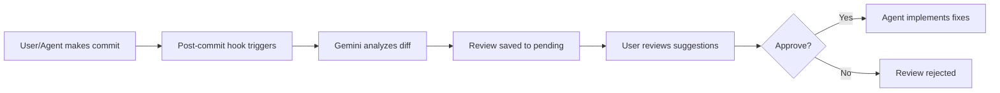

# Gemini Review Workflow

> Automated code review using Google Gemini for all commits
>
> Version: 2.0.0
> Last Updated: 2026-01-13

## ⚠️ CROSS-REVIEW POLICY REQUIREMENT

**IMPORTANT:** While Gemini can perform initial code reviews, ALL work performed by Google Gemini MUST also be reviewed by OpenAI Codex before presenting to the user. See @docs/modules/ai/CROSS_REVIEW_POLICY.md for the mandatory cross-review policy.

**Workflow:**
1. Gemini performs task and commits
2. **Codex reviews Gemini's commit** (MANDATORY)
3. Implement Codex feedback (max 3 iterations)
4. Present to user after Codex approval

## Overview

This workflow automatically reviews all commits using the Google Gemini CLI. When you make a commit, a post-commit hook triggers Gemini to analyze the changes and generate a comprehensive code review for your approval.

## How It Works



## Quick Start

### View Pending Reviews

```bash
./scripts/ai-review/gemini-review-manager.sh list
```

### Show Specific Review

```bash
./scripts/ai-review/gemini-review-manager.sh show <review_id>
```

### Approve a Review

```bash
./scripts/ai-review/gemini-review-manager.sh approve <review_id>
```

### Implement Approved Suggestions

```bash
./scripts/ai-review/gemini-review-manager.sh implement <review_id>
```

## Installation

The hooks are installed automatically across all repositories. To reinstall or update:

```bash
./scripts/ai-review/install-gemini-hooks.sh
```

## Review Aspects

Gemini reviews each commit for:

1. **Code Quality**
   - Code style and readability
   - Naming conventions
   - DRY and SOLID principles
   - Code organization

2. **Security**
   - Injection vulnerabilities (SQL, XSS, CSRF)
   - Hardcoded secrets or credentials
   - Input validation issues
   - Authentication/authorization gaps

3. **Performance**
   - Algorithmic efficiency
   - Memory usage concerns
   - Database query optimization
   - Caching opportunities

4. **Documentation**
   - Code comments adequacy
   - Function/class documentation
   - README updates if needed

5. **Test Coverage**
   - Are tests included for new code?
   - Test quality and coverage
   - Edge cases considered

## Review Files Location

Reviews are stored in `~/.gemini-reviews/`:

```
~/.gemini-reviews/
├── pending/      # Reviews awaiting approval
├── approved/     # Reviews approved for implementation
├── rejected/     # Reviews that were rejected
└── implemented/  # Reviews that have been implemented
```

## Review Report Format

Each review contains:

```markdown
# Gemini Code Review Report

## Metadata
- Repository, Commit SHA, Author, Date
- Review Type (full/quick)

## Changes Summary
- Files changed, insertions, deletions

## Review Results
- Summary assessment
- Findings by severity (Critical, High, Medium, Low)
- Specific suggestions with code examples
- Verdict: APPROVE, REQUEST_CHANGES, or NEEDS_DISCUSSION

## Actions
- Commands to approve/reject/implement
```

## Scripts Reference

### gemini-review.sh

Run a manual Gemini review on any commit:

```bash
# Review HEAD commit in current repo
./scripts/ai-review/gemini-review.sh

# Review specific commit
./scripts/ai-review/gemini-review.sh abc123

# Review in specific repo
./scripts/ai-review/gemini-review.sh -r /path/to/repo HEAD

# Quick review (code quality only)
./scripts/ai-review/gemini-review.sh -q

# Full review (all aspects)
./scripts/ai-review/gemini-review.sh -f
```

### gemini-review-manager.sh

Manage pending reviews:

```bash
# List all pending reviews
./scripts/ai-review/gemini-review-manager.sh list

# Show specific review
./scripts/ai-review/gemini-review-manager.sh show <review_id>

# Approve for implementation
./scripts/ai-review/gemini-review-manager.sh approve <review_id>

# Reject a review
./scripts/ai-review/gemini-review-manager.sh reject <review_id>

# Implement approved suggestions
./scripts/ai-review/gemini-review-manager.sh implement <review_id>

# View statistics
./scripts/ai-review/gemini-review-manager.sh stats

# Clean old reviews (>30 days)
./scripts/ai-review/gemini-review-manager.sh clean
```

### install-gemini-hooks.sh

Install/reinstall hooks across repositories:

```bash
./scripts/ai-review/install-gemini-hooks.sh
```

## Requirements

- **Gemini CLI**: Must be installed (`npm install -g gemini-chat-cli` or similar) and authenticated.
- **Environment**: No API key env var needed if CLI is authenticated.

## Integration with Agents

When you approve a review and run `implement`, an implementation file is created with all the suggestions. You can then:

1. Navigate to the repository
2. Open your AI agent (Claude, Gemini, etc.)
3. Paste the content of the implementation file
4. The agent will implement the approved suggestions

## Workflow Integration

1. **Development**: Work on your code using Gemini
2. **Commit**: Commit changes with Gemini signature
3. **Gemini Review**: Gemini can perform initial review (optional)
4. **Codex Review**: **MANDATORY** - Codex reviews Gemini's commit
5. **Iteration**: Implement Codex feedback (max 3 iterations)
6. **Present**: After Codex approval OR 3 iterations → present to user

## Cross-Review Integration

When Gemini performs work:

```bash
# After Gemini commits, trigger cross-review
./scripts/ai-review/cross-review-loop.sh --source gemini --max-iterations 3

# Check iteration status
./scripts/ai-review/review-manager.sh iteration-status <review_id>
```

## Related Documentation

- [Cross-Review Policy](CROSS_REVIEW_POLICY.md) - **MANDATORY**
- [Codex Review Workflow](CODEX_REVIEW_WORKFLOW.md)
- [AI Agent Guidelines](AI_AGENT_GUIDELINES.md)

---

*Automated Gemini review workflow with mandatory Codex cross-review for quality assurance*
