```mermaid
graph TB
    subgraph "Tier 1: Universal Agents"
        WH[workspace-hub<br/>.claude/agents/universal/]
        WH --> CORE[Core: coder, reviewer, tester]
        WH --> SPARC[SPARC: spec, pseudocode, arch]
        WH --> VIZ[Viz: plotly, bokeh, altair]
    end

    subgraph "Tier 2: Domain Hubs"
        DM[digitalmodel<br/>Engineering Hub]
        WED[worldenergydata<br/>Energy Hub]
        AU[assetutilities<br/>Finance Hub]

        DM --> ENG[aqwa, orcaflex, freecad, gmsh]
        WED --> ENERGY[drilling, oil-gas, financial]
        AU --> FIN[finance-analytics, workflow]
    end

    subgraph "Tier 3: Local Agents"
        R1[aceengineer-admin<br/>local agents]
        R2[aceengineercode<br/>local agents]
        R3[client_projects<br/>local agents]
    end

    WH -.symlinks.-> R1
    WH -.symlinks.-> R2
    WH -.symlinks.-> R3

    DM -.symlinks.-> R1
    WED -.symlinks.-> R2
    AU -.symlinks.-> R3

    style WH fill:#90EE90
    style DM fill:#87CEEB
    style WED fill:#87CEEB
    style AU fill:#87CEEB
    style R1 fill:#FFE4B5
    style R2 fill:#FFE4B5
    style R3 fill:#FFE4B5
```

# Agent Organization & Cross-Repository Referencing Guide

> **Version:** 2.0.0
> **Date:** 2025-10-29
> **Status:** Recommended Best Practices
> **Audience:** All developers, AI agents, and system administrators

---

## 📋 Executive Summary

This guide establishes the **Three-Tier Hub-and-Spoke Architecture** for organizing and referencing the 78+ AI agents across workspace-hub's 26 repositories.

**Key Principles:**
1. **Tier 1 (Universal)**: Common agents → workspace-hub
2. **Tier 2 (Domain Hubs)**: Specialized agents → domain repositories
3. **Tier 3 (Local)**: Project-specific agents → individual repositories
4. **Cross-Repo Access**: Symlinks + orchestrator routing
5. **Single Source of Truth**: Central registry + distributed ownership

---

## 🏗️ Three-Tier Architecture



---

## 📍 Where Should An Agent Live?

### Decision Matrix

| Question | Yes → | No → |
|----------|-------|------|
| **Used by all/most repos?** | Tier 1 (workspace-hub) | Continue |
| **Domain-specific expertise?** | Tier 2 (domain hub) | Continue |
| **Only one repo needs it?** | Tier 3 (local in repo) | Reconsider if needed |

### Examples

**Tier 1 (Universal):**
- `coder`, `reviewer`, `tester`, `planner`, `researcher` - Core development
- `specification`, `pseudocode`, `architecture`, `refinement` - SPARC
- `plotly-visualization-agent`, `bokeh-dashboard-agent` - Used everywhere
- `code-review-swarm`, `security-manager` - Quality gates

**Tier 2 (Domain Hubs):**
- `aqwa`, `orcaflex`, `freecad`, `gmsh` → **digitalmodel** (engineering)
- `drilling-expert`, `oil-and-gas-expert` → **worldenergydata** (energy)
- `finance-analytics`, `workflow-automation` → **assetutilities** (finance)

**Tier 3 (Local):**
- `aceengineer-custom-workflow` → Only aceengineer-admin
- `project-specific-tooling` → Single project
- `experimental-agents` → Testing before promotion

---

## 🗂️ Repository Structure

### Tier 1: workspace-hub (Universal Agents)

```
workspace-hub/
├── .claude/
│   └── agents/
│       ├── universal/                    # ← Tier 1 agents
│       │   ├── core/
│       │   │   ├── coder.yaml
│       │   │   ├── reviewer.yaml
│       │   │   ├── tester.yaml
│       │   │   ├── planner.yaml
│       │   │   └── researcher.yaml
│       │   ├── sparc/
│       │   │   ├── specification.yaml
│       │   │   ├── pseudocode.yaml
│       │   │   ├── architecture.yaml
│       │   │   └── refinement.yaml
│       │   ├── visualization/
│       │   │   ├── plotly.yaml
│       │   │   ├── bokeh.yaml
│       │   │   ├── altair.yaml
│       │   │   └── d3js.yaml
│       │   └── quality/
│       │       ├── code-review-swarm.yaml
│       │       └── security-manager.yaml
│       ├── registry.yaml                 # Master registry
│       └── BEST_PRACTICES.md
│
├── modules/
│   ├── config/
│   │   └── ai-agents-registry.json      # JSON format registry
│   └── automation/
│       ├── agent_orchestrator.sh        # Smart routing
│       ├── sync_agent_configs.sh        # Bi-directional sync
│       └── setup_agent_links.sh         # NEW: Symlink creation
│
└── .drcode/
    └── droids.yml                       # Factory AI config
```

### Tier 2: Domain Hubs

#### digitalmodel (Engineering Hub)

```
digitalmodel/
├── .claude/
│   └── agents/
│       ├── aqwa.yaml                    # Hydrodynamic analysis
│       ├── orcaflex.yaml                # Dynamic analysis
│       ├── freecad.yaml                 # Parametric CAD
│       ├── gmsh.yaml                    # FEM meshing
│       ├── cad-engineering-specialist.yaml
│       └── README.md                    # "Engineering simulation hub"
│
├── docs/
│   └── agents/
│       ├── AGENT_GUIDE.md               # How to use these agents
│       └── DEVELOPMENT.md               # How to develop agents
│
└── .agent-hub-config.yaml              # NEW: Hub configuration
```

#### worldenergydata (Energy Hub)

```
worldenergydata/
├── .claude/
│   └── agents/
│       ├── drilling-expert.yaml
│       ├── oil-and-gas-expert.yaml
│       └── financial-analysis.yaml
│
└── .agent-hub-config.yaml
```

#### assetutilities (Finance Hub)

```
assetutilities/
├── .claude/
│   └── agents/
│       ├── finance-analytics.yaml
│       └── workflow-automation/
│           ├── data-processing.yaml
│           └── reporting.yaml
│
└── .agent-hub-config.yaml
```

### Tier 3: Consumer Repositories

```
aceengineer-admin/                      # Standard consumer repo
├── .claude/
│   └── agents/
│       ├── universal/                  # Symlinks → workspace-hub
│       ├── external/                   # Symlinks → domain hubs
│       │   ├── engineering/            # → digitalmodel
│       │   ├── energy/                 # → worldenergydata
│       │   └── finance/                # → assetutilities
│       └── local/                      # Repo-specific agents
│           └── aceengineer-workflow.yaml
│
├── .agent-references.yaml             # NEW: Declares dependencies
│
└── scripts/
    └── sync_agents.sh                 # Calls workspace-hub sync
```

---

## 🔗 Cross-Repository Referencing

### Method 1: Agent References File (Recommended)

**Create `.agent-references.yaml` in each repository:**

```yaml
# .agent-references.yaml
# Declares external agent dependencies for this repository

meta:
  repository: aceengineer-admin
  last_updated: "2025-10-29"

universal_agents:
  # From workspace-hub (Tier 1)
  source: "@workspace-hub/.claude/agents/universal/"
  agents:
    - coder
    - reviewer
    - tester
    - plotly-visualization-agent
    - code-review-swarm

domain_agents:
  # Engineering agents from digitalmodel
  - source: "@digitalmodel/.claude/agents/"
    agents:
      - orcaflex
      - aqwa
      - freecad

  # Energy agents from worldenergydata
  - source: "@worldenergydata/.claude/agents/"
    agents:
      - drilling-expert
      - oil-and-gas-expert

local_agents:
  # Repository-specific agents
  - aceengineer-custom-workflow
  - project-specific-tooling

orchestration:
  method: "symlink"        # symlink | copy | api
  auto_sync: true
  sync_schedule: "daily"
```

### Method 2: Symbolic Links (Implementation)

**Setup symlinks for a repository:**

```bash
# Run this from workspace-hub
./modules/automation/setup_agent_links.sh aceengineer-admin

# This creates:
# aceengineer-admin/.claude/agents/universal/ → workspace-hub/...
# aceengineer-admin/.claude/agents/external/engineering/ → digitalmodel/...
# aceengineer-admin/.claude/agents/external/energy/ → worldenergydata/...
```

**Manual symlink creation:**

```bash
cd aceengineer-admin

# Link universal agents
mkdir -p .claude/agents/universal
ln -s /mnt/github/workspace-hub/.claude/agents/universal/* \
      .claude/agents/universal/

# Link domain agents
mkdir -p .claude/agents/external/engineering
ln -s /mnt/github/digitalmodel/.claude/agents/orcaflex.yaml \
      .claude/agents/external/engineering/
```

### Method 3: Orchestrator Routing (Automatic)

**The agent orchestrator automatically routes to correct repository:**

```bash
# From any repository, invoke any agent
./modules/automation/agent_orchestrator.sh \
  --agent orcaflex \
  --description "Analyze mooring lines for platform" \
  --repo aceengineer-admin

# Orchestrator:
# 1. Looks up "orcaflex" in central registry
# 2. Finds it's in digitalmodel
# 3. Routes execution to digitalmodel/.claude/agents/orcaflex.yaml
# 4. Returns results to aceengineer-admin
```

---

## 🎯 Usage Examples

### For Developers: Using Existing Agents

#### Example 1: Use Universal Agent (Tier 1)

```bash
# In any repository
cd aceengineer-admin

# Check available universal agents
ls .claude/agents/universal/core/

# Use via symlink (if setup)
claude-flow agent run coder --description "Create user auth API"

# Or use via orchestrator
/mnt/github/workspace-hub/modules/automation/agent_orchestrator.sh \
  code-generation "Create user authentication API" \
  --with-review
```

#### Example 2: Use Domain Agent (Tier 2)

```bash
# In consumer repository
cd aceengineer-admin

# Check available engineering agents
ls .claude/agents/external/engineering/

# Use orcaflex via symlink
claude-flow agent run orcaflex --config mooring-analysis.yaml

# Or use via orchestrator
/mnt/github/workspace-hub/modules/automation/agent_orchestrator.sh \
  --agent orcaflex \
  --description "Analyze mooring line tensions" \
  --domain engineering
```

#### Example 3: Add New Agent Dependency

```bash
# 1. Edit .agent-references.yaml
vim .agent-references.yaml

# Add to domain_agents section:
#  - source: "@digitalmodel/.claude/agents/"
#    agents:
#      - gmsh  # NEW

# 2. Run sync
/mnt/github/workspace-hub/modules/automation/sync_agent_configs.sh push

# 3. Verify symlink created
ls -la .claude/agents/external/engineering/gmsh.yaml

# 4. Use agent
claude-flow agent run gmsh --config mesh-generation.yaml
```

### For Agent Developers: Creating New Agents

#### Example 1: Create Universal Agent (Used Everywhere)

```bash
# 1. Decide it's universal (used by most repos)
#    → Tier 1: workspace-hub

# 2. Create agent file
cd /mnt/github/workspace-hub
vim .claude/agents/universal/core/api-generator.yaml

# Content:
cat << 'EOF' > .claude/agents/universal/core/api-generator.yaml
name: api-generator
version: "1.0.0"
type: specialist
domain: api-development
description: "Generates REST API endpoints with OpenAPI specs"

capabilities:
  api_design: 95
  openapi_generation: 93
  endpoint_implementation: 90

context: |
  Generate RESTful API endpoints following best practices:
  - OpenAPI 3.0 specifications
  - Request/response validation
  - Error handling patterns
  - Authentication/authorization
EOF

# 3. Update central registry
vim .claude/agents/registry.yaml
# Add api-generator under universal/core

# 4. Sync to all consumer repos
./modules/automation/sync_agent_configs.sh push

# 5. Test from consumer repo
cd /mnt/github/aceengineer-admin
ls .claude/agents/universal/core/api-generator.yaml
claude-flow agent run api-generator --description "Create user management API"
```

#### Example 2: Create Domain Agent (Specialized)

```bash
# 1. Decide it's domain-specific (marine engineering)
#    → Tier 2: digitalmodel (engineering hub)

# 2. Create agent in hub
cd /mnt/github/digitalmodel
vim .claude/agents/marine-structural-analysis.yaml

# Content:
cat << 'EOF' > .claude/agents/marine-structural-analysis.yaml
name: marine-structural-analysis
version: "1.0.0"
type: specialist
domain: marine-engineering
description: "Structural analysis for marine platforms and vessels"

capabilities:
  structural_analysis: 94
  fatigue_assessment: 92
  code_compliance: 90

context: |
  Perform structural analysis following:
  - API RP 2A (offshore platforms)
  - DNV-GL standards
  - Finite element analysis
  - Fatigue life assessment
EOF

# 3. Update hub config
vim .agent-hub-config.yaml
# Add marine-structural-analysis to agents.owned

# 4. Sync to central registry and consumers
/mnt/github/workspace-hub/modules/automation/sync_agent_configs.sh both

# 5. Verify in consumer repo
cd /mnt/github/aceengineer-admin
ls .claude/agents/external/engineering/marine-structural-analysis.yaml

# 6. Test
claude-flow agent run marine-structural-analysis \
  --config platform-analysis.yaml
```

#### Example 3: Create Local Agent (Project-Specific)

```bash
# 1. Decide it's project-specific
#    → Tier 3: local in aceengineer-admin

# 2. Create in repo
cd /mnt/github/aceengineer-admin
mkdir -p .claude/agents/local
vim .claude/agents/local/aceengineer-workflow.yaml

# Content:
cat << 'EOF' > .claude/agents/local/aceengineer-workflow.yaml
name: aceengineer-workflow
version: "1.0.0"
type: workflow
domain: project-specific
description: "Custom workflow for aceengineer projects"

context: |
  Project-specific workflow:
  - Load client requirements
  - Run engineering calculations
  - Generate compliance reports
  - Submit to review system
EOF

# 3. Update local .agent-references.yaml
vim .agent-references.yaml
# Add aceengineer-workflow to local_agents

# 4. Use immediately (no sync needed - local only)
claude-flow agent run aceengineer-workflow --config project.yaml
```

---

## 🔄 Hub Configuration

### Creating a Domain Hub

**If you want to make a repository a domain hub:**

#### Step 1: Create Hub Config

```bash
cd digitalmodel  # Your hub repository

cat << 'EOF' > .agent-hub-config.yaml
meta:
  repository: digitalmodel
  role: domain_hub
  domain: engineering_simulation
  last_updated: "2025-10-29"

hub_info:
  name: "Engineering Simulation Agent Hub"
  description: "Central hub for engineering simulation AI agents"
  maintainers:
    - "engineering-team"
  contact: "engineering@example.com"

agents:
  owned:
    - name: aqwa
      type: simulation
      status: production
      version: "2.1.0"
      specialization: "hydrodynamic analysis"

    - name: orcaflex
      type: simulation
      status: production
      version: "3.0.0"
      specialization: "dynamic analysis"

    - name: freecad
      type: cad
      status: production
      version: "1.5.0"
      specialization: "parametric 3D modeling"

  dependencies:
    universal:
      source: "@workspace-hub/.claude/agents/universal/"
      agents:
        - coder
        - reviewer
        - plotly-visualization-agent

integration:
  auto_sync_to_central: true
  sync_schedule: "daily"
  central_registry: "@workspace-hub/.claude/agents/registry.yaml"

discovery:
  discoverable: true
  categories:
    - engineering
    - simulation
    - cad
EOF
```

#### Step 2: Organize Agents

```bash
# Create agents directory
mkdir -p .claude/agents

# Move domain agents here
mv path/to/aqwa.yaml .claude/agents/
mv path/to/orcaflex.yaml .claude/agents/
# etc.

# Create documentation
mkdir -p docs/agents
vim docs/agents/AGENT_GUIDE.md
```

#### Step 3: Register with Central

```bash
# Run sync from workspace-hub
cd /mnt/github/workspace-hub
./modules/automation/sync_agent_configs.sh pull

# This discovers digitalmodel as a hub
# Copies agents to workspace-hub/.claude/agents/hubs/digitalmodel/
# Updates central registry.yaml
```

#### Step 4: Announce to Team

```markdown
# Update digitalmodel/README.md

## Domain Hub: Engineering Simulation

This repository serves as the **Engineering Simulation Agent Hub** for workspace-hub.

### Agents Provided

- **aqwa** - Hydrodynamic analysis
- **orcaflex** - Dynamic analysis of offshore systems
- **freecad** - Parametric 3D CAD modeling
- **gmsh** - Finite element mesh generation

### Using These Agents

From any repository in workspace-hub:

\`\`\`bash
# Via orchestrator
agent_orchestrator.sh --agent orcaflex --description "..."

# Or via symlink (after sync)
claude-flow agent run orcaflex --config my-config.yaml
\`\`\`

See `docs/agents/AGENT_GUIDE.md` for detailed usage.
```

---

## 🛠️ Synchronization System

### Auto-Discovery

The sync system automatically discovers hubs:

```bash
# workspace-hub/modules/automation/sync_agent_configs.sh

# Find all repositories with hub configs
find /mnt/github -name ".agent-hub-config.yaml" -type f

# Outputs:
# /mnt/github/digitalmodel/.agent-hub-config.yaml
# /mnt/github/worldenergydata/.agent-hub-config.yaml
# /mnt/github/assetutilities/.agent-hub-config.yaml
```

### Sync Operations

**Pull from hubs:**
```bash
# Update central registry from all hubs
./modules/automation/sync_agent_configs.sh pull
```

**Push to consumers:**
```bash
# Setup symlinks in all consumer repos
./modules/automation/sync_agent_configs.sh push
```

**Full sync:**
```bash
# Both pull and push
./modules/automation/sync_agent_configs.sh both
```

### Daily Automated Sync

**Setup cron job:**

```bash
# Edit crontab
crontab -e

# Add daily sync at 2 AM
0 2 * * * /mnt/github/workspace-hub/modules/automation/sync_agent_configs.sh both
```

---

## 📊 Benefits of This Organization

### ✅ Clear Ownership
- **Universal agents** → workspace-hub team maintains
- **Domain agents** → domain expert teams maintain
- **Local agents** → project teams maintain

### ✅ Easy Discovery
```bash
# Find universal agents
ls workspace-hub/.claude/agents/universal/

# Find domain hubs
find /mnt/github -name ".agent-hub-config.yaml"

# See what a repo uses
cat <repo>/.agent-references.yaml
```

### ✅ Reduced Duplication
- One copy of universal agents in workspace-hub
- One copy of domain agents in hubs
- Symlinks everywhere else (no duplication)

### ✅ Version Control
- Hub repos control agent versions
- Consumers reference specific versions
- Central registry tracks all versions
- Easy rollback if needed

### ✅ Performance
- Local symlinks = instant access (no network)
- Orchestrator caches agent locations
- No API calls needed for agent lookup

### ✅ Maintainability
- Clear separation of concerns
- Domain experts maintain domain agents
- Universal agents have clear ownership
- Easy to update and propagate changes

---

## 🚀 Quick Reference

### Commands Cheatsheet

```bash
# DISCOVERY
# ----------
# List universal agents
ls workspace-hub/.claude/agents/universal/

# Find all hubs
find /mnt/github -name ".agent-hub-config.yaml"

# Check repo dependencies
cat <repo>/.agent-references.yaml


# SYNC
# -----
# Setup agent links for a repo
workspace-hub/modules/automation/setup_agent_links.sh <repo>

# Sync from hubs to central
workspace-hub/modules/automation/sync_agent_configs.sh pull

# Sync from central to consumers
workspace-hub/modules/automation/sync_agent_configs.sh push

# Full bidirectional sync
workspace-hub/modules/automation/sync_agent_configs.sh both


# USAGE
# ------
# Use via orchestrator (recommended)
workspace-hub/modules/automation/agent_orchestrator.sh \
  --agent <name> \
  --description "..." \
  [--with-review]

# Use via symlink
claude-flow agent run <name> --config <config.yaml>

# Use via direct path
claude-flow agent run \
  --agent-file /mnt/github/digitalmodel/.claude/agents/orcaflex.yaml \
  --config my-config.yaml


# DEVELOPMENT
# ------------
# Create universal agent
vim workspace-hub/.claude/agents/universal/<category>/<name>.yaml

# Create domain agent
vim <hub-repo>/.claude/agents/<name>.yaml

# Create local agent
vim <repo>/.claude/agents/local/<name>.yaml

# Update central registry
workspace-hub/modules/automation/sync_agent_configs.sh pull


# VALIDATION
# -----------
# Verify symlinks
ls -la <repo>/.claude/agents/universal/
ls -la <repo>/.claude/agents/external/

# Check agent availability
claude-flow agent list

# Test agent
claude-flow agent run <name> --test
```

---

## 📚 Related Documentation

- **AI Agent Guidelines:** `docs/AI_AGENT_GUIDELINES.md`
- **Agent Orchestration:** `docs/modules/automation/AI_AGENT_ORCHESTRATION.md`
- **Agent Centralization Report:** `docs/modules/automation/AGENT_CENTRALIZATION_COMPLETE.md`
- **Best Practices:** `workspace-hub/.claude/agents/BEST_PRACTICES.md`
- **Development Workflow:** `docs/DEVELOPMENT_WORKFLOW.md`

---

## 🎓 Training & Onboarding

### For New Team Members

1. **Read this guide** (you are here!)
2. **Check your repo's `.agent-references.yaml`** to see what agents are available
3. **Browse universal agents:** `ls workspace-hub/.claude/agents/universal/`
4. **Try using an agent:** `agent_orchestrator.sh --agent coder --description "test"`
5. **Ask questions** in team chat or engineering@example.com

### For Agent Developers

1. **Determine tier** using the decision matrix above
2. **Follow examples** in "For Agent Developers" section
3. **Test locally** before syncing
4. **Update documentation** in agent YAML file
5. **Sync to central** using sync scripts

---

## 📞 Support & Questions

- **Agent issues:** Open issue in workspace-hub repository
- **Hub questions:** Contact hub maintainers (see `.agent-hub-config.yaml`)
- **Orchestrator bugs:** Open issue with "agent-orchestration" label
- **Documentation:** PRs welcome to improve this guide

---

**Last Updated:** 2025-10-29
**Version:** 2.0.0
**Maintained by:** workspace-hub team
