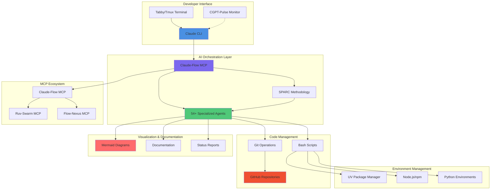
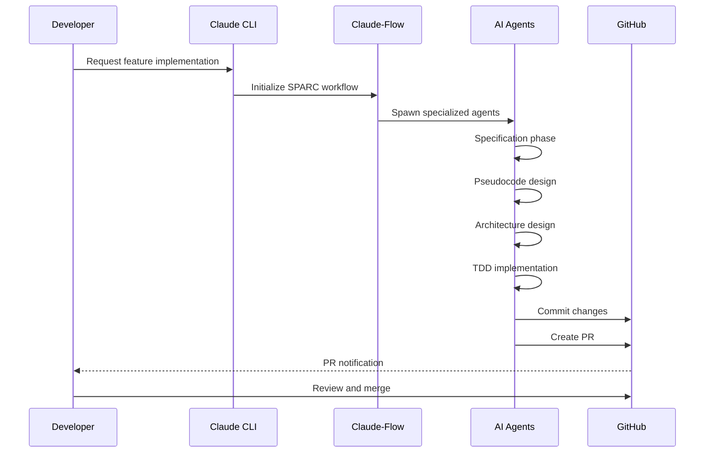
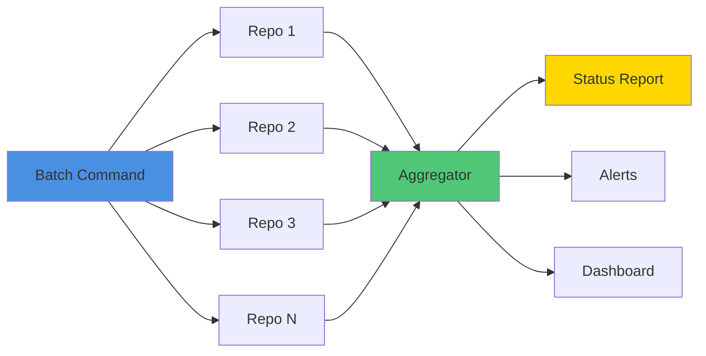

# AI Development Ecosystem

> Last Updated: 2025-09-29
> Version: 1.0.0

## Overview

This document outlines the comprehensive AI-powered development ecosystem used in workspace-hub for team collaboration, repository management, and intelligent automation.

## Ecosystem Architecture



## Component Details

### 1. Developer Interface Layer

#### Claude CLI
- **Purpose:** Primary interface for AI-assisted development
- **Features:**
  - Natural language command execution
  - Context-aware code generation
  - Multi-file operations
  - Git integration
- **Usage:** `claude [command]` or interactive mode

#### Tabby/Tmux Terminal
- **Purpose:** Terminal multiplexer for session management
- **Features:**
  - Multiple terminal sessions
  - Session persistence
  - Split panes for parallel workflows
  - Easy context switching
- **Integration:** Works seamlessly with Claude CLI

#### CGPT-Pulse Monitor
- **Purpose:** Real-time monitoring and health checking
- **Features:**
  - Repository health metrics
  - Build status monitoring
  - Performance tracking
  - Alert notifications
- **Integration:** Passive monitoring of Claude Flow operations

### 2. AI Orchestration Layer

#### Claude-Flow MCP
- **Purpose:** Central orchestration for AI agents and workflows
- **Version:** @alpha
- **Features:**
  - Swarm coordination
  - Task orchestration
  - Memory management
  - Neural pattern learning
- **Setup:** `claude mcp add claude-flow npx claude-flow@alpha mcp start`

#### 54+ Specialized Agents
Categorized by function:

**Core Development (5 agents):**
- `coder` - Code implementation
- `reviewer` - Code review and quality
- `tester` - Test creation and execution
- `planner` - Project planning
- `researcher` - Research and analysis

**Swarm Coordination (5 agents):**
- `hierarchical-coordinator` - Queen-led coordination
- `mesh-coordinator` - Peer-to-peer coordination
- `adaptive-coordinator` - Dynamic topology switching
- `collective-intelligence-coordinator` - Distributed cognition
- `swarm-memory-manager` - Shared memory management

**Consensus & Distributed (7 agents):**
- `byzantine-coordinator` - Byzantine fault tolerance
- `raft-manager` - Raft consensus
- `gossip-coordinator` - Gossip protocols
- `crdt-synchronizer` - Conflict-free replication
- `quorum-manager` - Quorum management
- `security-manager` - Security coordination
- `performance-benchmarker` - Performance testing

**GitHub Integration (9 agents):**
- `github-modes` - GitHub workflow orchestration
- `pr-manager` - Pull request lifecycle
- `code-review-swarm` - AI code reviews
- `issue-tracker` - Issue management
- `release-manager` - Release coordination
- `workflow-automation` - CI/CD automation
- `project-board-sync` - Project board integration
- `repo-architect` - Repository structure
- `multi-repo-swarm` - Cross-repo coordination

**SPARC Methodology (6 agents):**
- `sparc-coord` - SPARC orchestration
- `sparc-coder` - TDD implementation
- `specification` - Requirements analysis
- `pseudocode` - Algorithm design
- `architecture` - System design
- `refinement` - Iterative improvement

**Specialized Development (8 agents):**
- `backend-dev` - Backend API development
- `mobile-dev` - Mobile app development
- `ml-developer` - Machine learning
- `cicd-engineer` - CI/CD pipelines
- `api-docs` - API documentation
- `system-architect` - System architecture
- `code-analyzer` - Code analysis
- `base-template-generator` - Template generation

#### SPARC Methodology
**Systematic Development Framework:**

1. **S**pecification - Requirements analysis
2. **P**seudocode - Algorithm design
3. **A**rchitecture - System design
4. **R**efinement - TDD implementation
5. **C**ompletion - Integration and deployment

**Commands:**
```bash
npx claude-flow sparc modes              # List modes
npx claude-flow sparc tdd "feature"      # TDD workflow
npx claude-flow sparc pipeline "task"    # Full pipeline
```

### 3. MCP Ecosystem

#### Claude-Flow MCP (Required)
- **Tools:** Coordination, monitoring, memory, neural
- **Installation:** `claude mcp add claude-flow npx claude-flow@alpha mcp start`
- **Features:**
  - Swarm initialization and coordination
  - Agent spawning and management
  - Task orchestration
  - Memory persistence
  - Neural pattern training
  - Performance tracking

#### Ruv-Swarm MCP (Optional)
- **Purpose:** Enhanced swarm coordination
- **Installation:** `claude mcp add ruv-swarm npx ruv-swarm mcp start`
- **Features:**
  - Advanced topology patterns
  - Self-organizing swarms
  - Fault tolerance
  - Load balancing

#### Flow-Nexus MCP (Optional)
- **Purpose:** Cloud-based orchestration
- **Installation:** `claude mcp add flow-nexus npx flow-nexus@latest mcp start`
- **Requires:** Registration at flow-nexus.ruv.io
- **Features:**
  - 70+ cloud orchestration tools
  - Distributed sandboxes
  - Neural network training
  - Template marketplace
  - Real-time monitoring
  - GitHub deep integration

### 4. Code Management Layer

#### GitHub Repositories
- **Count:** 26+ independent repositories
- **Management:** Centralized tooling, independent histories
- **Access Control:** Per-repository permissions
- **Integration:** Deep GitHub integration via agents

#### Git Operations
- **Batch Operations:** Multi-repo sync, pull, push, status
- **Conflict Detection:** Automated conflict detection
- **Branch Management:** Standardized strategies
- **Hooks:** Pre-commit validation, auto-formatting

#### Bash Scripts
**Module Structure:**
```
modules/
├── git-management/     # Git synchronization tools
├── automation/         # Command propagation
├── ci-cd/             # Pipeline templates
├── monitoring/        # Health checks
├── utilities/         # Helper scripts
├── documentation/     # Doc generation
├── config/            # Shared configs
└── development/       # Dev tools
```

### 5. Visualization & Documentation

#### Mermaid Diagrams
- **Purpose:** Visual system documentation
- **Types:**
  - Architecture diagrams
  - Workflow flowcharts
  - Dependency graphs
  - State diagrams
- **Integration:** Embedded in markdown documentation

#### Documentation
- **Format:** Markdown with mermaid support
- **Organization:**
  - Product mission and roadmap
  - Technical specifications
  - API documentation
  - Decision logs
- **Auto-Generation:** Agent-driven documentation

#### Status Reports
- **Real-time:** Repository health dashboards
- **Automated:** Build and test status
- **Aggregated:** Cross-repository metrics
- **Alerting:** Failure notifications

### 6. Environment Management

#### UV Package Manager
- **Purpose:** Python environment management
- **Features:**
  - Fast dependency resolution (10-100x faster than pip)
  - Lock file management
  - Virtual environment isolation
  - Upgrade automation
  - Tool installation from Git repositories
- **Commands:**
  ```bash
  uv venv                           # Create environment
  uv pip install package            # Install package
  uv pip sync requirements          # Sync dependencies
  uv tool install specify-cli \
    --from git+https://github.com/github/spec-kit.git  # Install spec-kit
  ```

#### Node.js/npm
- **Purpose:** JavaScript tooling and dependencies
- **Version:** 18+ LTS
- **Features:**
  - Package management
  - Script execution
  - Build tooling
- **Integration:** Claude Flow npm package

#### Python Environments
- **Management:** UV-based virtual environments
- **Isolation:** Per-repository environments
- **Configuration:** pyproject.toml + uv.lock
- **Upgrade:** Automated dependency updates

## Workflow Integration

### Standard Development Flow



### Multi-Repository Coordination



## Best Practices

### 1. Concurrent Execution
- Batch all related operations in single messages
- Use TodoWrite for comprehensive task tracking (8-10 todos)
- Spawn multiple agents in parallel via Task tool
- Execute git operations concurrently

### 2. Agent Coordination
- Use MCP tools for topology setup (optional)
- Use Claude Code Task tool for actual work
- Agents communicate via hooks and memory
- Session management for context persistence

### 3. Repository Management
- Maintain repository independence
- Use centralized tooling for consistency
- Automate synchronization and status checks
- Tag-based filtering for selective operations

### 4. Documentation
- Generate mermaid diagrams for complex systems
- Maintain decision logs for architectural choices
- Auto-generate API documentation from code
- Keep roadmap updated with progress

### 5. Environment Safety
- Use UV for reproducible environments
- Never commit secrets or credentials
- Validate commands before execution
- Use pre-commit hooks for safety checks

## Performance Metrics

### Claude Flow Benefits
- **84.8%** SWE-Bench solve rate
- **32.3%** token reduction
- **2.8-4.4x** speed improvement
- **27+** neural models for learning

### Workspace Hub Benefits
- **50%** reduction in sync time (projected Phase 1)
- **40%** reduction in coordination overhead (projected Phase 4)
- **30%** faster CI/CD (projected Phase 5)
- **26+** repositories managed centrally

## Getting Started

### Initial Setup

```bash
# 1. Install Claude CLI (if not installed)
# Visit: https://claude.ai/download

# 2. Add Claude-Flow MCP (Required)
claude mcp add claude-flow npx claude-flow@alpha mcp start

# 3. Add optional MCP servers
claude mcp add ruv-swarm npx ruv-swarm mcp start          # Optional
claude mcp add flow-nexus npx flow-nexus@latest mcp start # Optional

# 4. Clone workspace-hub
git clone <your-repo-url>
cd workspace-hub

# 5. Check repository status
./modules/git-management/check_all_repos_status.sh

# 6. Start development with Claude
claude
# Then: "Let's implement [feature] using SPARC methodology"
```

### Common Workflows

#### Feature Development
```bash
# Use SPARC methodology for systematic development
npx claude-flow sparc tdd "new feature description"
```

#### Multi-Repository Sync
```bash
# Sync all repositories
./modules/git-management/git_sync_all.sh

# Pull all repositories
./modules/git-management/pull_all_repos.sh
```

#### Agent-Assisted Development
```
# In Claude CLI
"Spawn agents to:
1. Analyze requirements for [feature]
2. Design architecture
3. Implement with tests
4. Review code quality
5. Create PR"
```

## Troubleshooting

### MCP Connection Issues
```bash
# Check MCP status
claude mcp list

# Restart MCP server
claude mcp restart claude-flow
```

### Repository Sync Conflicts
```bash
# Check status of all repos
./modules/git-management/check_all_repos_status.sh

# Manual conflict resolution
cd <conflicting-repo>
git status
# Resolve conflicts manually
```

### Agent Coordination Issues
```bash
# Check swarm status
npx claude-flow@alpha swarm status

# Clear memory and restart
npx claude-flow@alpha memory clear
npx claude-flow@alpha hooks session-end
```

## Resources

### Documentation
- **Claude Flow:** https://github.com/ruvnet/claude-flow
- **Agent OS:** https://buildermethods.com/agent-os
- **Flow-Nexus:** https://flow-nexus.ruv.io
- **Factory AI:** https://factory.ai/ ✅ **INSTALLED** - v0.18.2 Enhanced (see `/docs/FACTORY_AI_ENHANCED_GUIDE.md`)
- **Spec-Kit:** https://github.com/github/spec-kit

### Support
- **Issues:** https://github.com/ruvnet/claude-flow/issues
- **Workspace Hub:** [Your GitHub URL]

### Learning Resources
- **SPARC Methodology:** See `modules/documentation/`
- **Agent Guides:** See `.claude/agents/`
- **MCP Tools:** Run `npx claude-flow@alpha help`
- **Spec-Kit Guide:** Run `specify --help`
- **Factory AI Platform:** https://factory.ai/docs ✅ **ACTIVE** (Enhanced droids.yml config in all 26 repos)
  - **Configuration:** Workspace-level + repository-specific droids.yml
  - **Repository Types:** 12 Python Analysis, 7 Engineering, 7 Web App
  - **Specialized Droids:** refactor, feature, bugfix, docs, testing, migration
  - **Integration:** AI orchestration, gate-pass reviews, SPARC methodology
- **Agent OS Workflows:** https://buildermethods.com/agent-os/docs

---

**Remember:** Claude Flow coordinates the strategy, Claude Code executes the work!