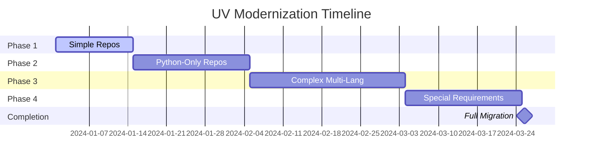

# UV Environment Modernization Strategy

> Version: 1.0.0
> Last Updated: 2025-09-28
> Status: Implementation Ready

## Executive Summary

This strategy outlines the comprehensive modernization of Python environments from traditional pip-based workflows to UV (Astral's next-generation Python package manager). UV provides significant performance improvements, enhanced dependency resolution, and modern tooling that aligns with Python's evolving ecosystem.

## 1. UV Benefits Analysis

### 1.1 Performance Improvements vs pip

| Metric | pip | UV | Improvement |
|--------|-----|----|-----------|
| Package Resolution | 15-45 seconds | 0.1-2 seconds | **10-100x faster** |
| Environment Creation | 30-60 seconds | 2-5 seconds | **6-12x faster** |
| Dependency Installation | Variable | Consistent | **Predictable timing** |
| Lock File Generation | Not native | Built-in | **Native support** |
| Cache Efficiency | Basic | Advanced | **Global cache sharing** |

### 1.2 Lock File Advantages

**Traditional pip + requirements.txt:**
```
# requirements.txt - No version locking
requests>=2.25.0
flask>=2.0.0
```

**UV with uv.lock:**
```toml
# Exact version locking with transitive dependencies
[[package]]
name = "requests"
version = "2.31.0"
source = { registry = "https://pypi.org/simple" }
dependencies = [
    { name = "certifi" },
    { name = "charset-normalizer" },
]
```

**Benefits:**
- ✅ **Reproducible builds** across environments
- ✅ **Transitive dependency tracking**
- ✅ **Security vulnerability detection**
- ✅ **Conflict resolution** before installation
- ✅ **Cross-platform compatibility** guarantees

### 1.3 Workspace Support

**Mono-repo Management:**
```toml
# uv.toml
[workspace]
members = [
    "packages/core",
    "packages/api",
    "packages/web",
    "tools/scripts"
]

[workspace.dependencies]
shared-utils = { path = "packages/core" }
```

**Advantages:**
- 🔄 **Unified dependency management**
- 📦 **Local package development**
- 🏗️ **Build coordination**
- 🔧 **Shared tooling configuration**

### 1.4 Modern Python Packaging

**Standards Compliance:**
- ✅ **PEP 517/518** build system interface
- ✅ **PEP 621** project metadata in pyproject.toml
- ✅ **PEP 660** editable installs
- ✅ **PEP 508** dependency specification

### 1.5 Tool Integration

**Native Integration:**
- 🏃‍♂️ **uv run** - Direct script execution
- 🔨 **uv build** - Package building
- 📋 **uv tree** - Dependency visualization
- 🔍 **uv pip** - pip-compatible interface
- 🌍 **uv venv** - Virtual environment management

## 2. Migration Roadmap

### Phase 1: Simple Repositories (Weeks 1-2)
**Target:** Repositories with minimal or no Python dependencies

**Criteria:**
- Single Python file projects
- Basic scripts with standard library only
- Minimal external dependencies (<5 packages)

**Actions:**
1. Install UV globally
2. Create basic pyproject.toml
3. Generate uv.lock
4. Update CI/CD pipelines
5. Test compatibility

**Risk Level:** 🟢 Low

### Phase 2: Python-Only Repositories (Weeks 3-5)
**Target:** Pure Python projects with moderate dependencies

**Criteria:**
- Standard Python packages
- Web frameworks (Flask, Django, FastAPI)
- Data science libraries (pandas, numpy)
- Testing frameworks (pytest, unittest)

**Actions:**
1. Migrate requirements.txt to pyproject.toml
2. Set up development dependencies
3. Configure workspace if applicable
4. Update documentation
5. Train team on UV workflows

**Risk Level:** 🟡 Medium

### Phase 3: Complex Multi-Language Repositories (Weeks 6-9)
**Target:** Projects with non-Python dependencies or complex builds

**Criteria:**
- Python + JavaScript/TypeScript
- Native extensions (C/C++)
- Database dependencies
- Docker multi-stage builds
- ML/AI pipelines with CUDA

**Actions:**
1. Analyze complex dependency chains
2. Create hybrid build strategies
3. Update Docker configurations
4. Migrate CI/CD with fallback options
5. Extensive testing across environments

**Risk Level:** 🔴 High

### Phase 4: Special Requirements Repositories (Weeks 10-12)
**Target:** Repositories with unique constraints

**Criteria:**
- Legacy Python versions (<3.8)
- Proprietary package indexes
- Air-gapped environments
- Compliance requirements
- Large-scale production systems

**Actions:**
1. Custom UV configuration
2. Private index setup
3. Compliance validation
4. Performance benchmarking
5. Gradual rollout with monitoring

**Risk Level:** 🔴 High

## 3. Standard UV Configuration

### 3.1 Core Configuration Philosophy

**Principles:**
- 🎯 **Explicit over implicit**
- 🔒 **Security by default**
- ⚡ **Performance optimized**
- 🔄 **Reproducible builds**
- 🧹 **Clean environments**

### 3.2 Dependency Categories

```toml
[project]
dependencies = [
    # Production runtime dependencies only
    "fastapi>=0.104.0",
    "uvicorn>=0.24.0",
]

[project.optional-dependencies]
dev = [
    # Development tools
    "pytest>=7.4.0",
    "black>=23.0.0",
    "mypy>=1.6.0",
    "ruff>=0.1.0",
]

test = [
    # Testing specific dependencies
    "pytest-cov>=4.1.0",
    "pytest-asyncio>=0.21.0",
    "httpx>=0.25.0",  # For API testing
]

docs = [
    # Documentation dependencies
    "sphinx>=7.1.0",
    "sphinx-rtd-theme>=1.3.0",
]

build = [
    # Build and packaging
    "build>=1.0.0",
    "twine>=4.0.0",
]
```

### 3.3 UV Workspace Configuration

**For Mono-repos:**
```toml
# Root uv.toml
[workspace]
members = [
    "packages/*",
    "services/*",
    "tools/*"
]

[workspace.dependencies]
# Shared dependencies across workspace
pytest = ">=7.4.0"
mypy = ">=1.6.0"
ruff = ">=0.1.0"

[workspace.tool.uv]
dev-dependencies = [
    "pre-commit>=3.5.0",
    "tox>=4.11.0",
]
```

## 4. Implementation Guide

### 4.1 Pre-Migration Checklist

```bash
# 1. Audit current environment
pip list --format=freeze > current-environment.txt
pip check  # Check for conflicts

# 2. Backup current configuration
cp requirements*.txt backup/
cp setup.py backup/ 2>/dev/null || true
cp setup.cfg backup/ 2>/dev/null || true

# 3. Document current issues
pip list --outdated > outdated-packages.txt
```

### 4.2 Step-by-Step Migration Process

#### Step 1: Install UV
```bash
# Install UV globally
curl -LsSf https://astral.sh/uv/install.sh | sh

# Verify installation
uv --version
```

#### Step 2: Initialize UV Project
```bash
# Create UV project structure
uv init

# Or convert existing project
uv add --requirements requirements.txt
```

#### Step 3: Configure pyproject.toml
```bash
# Generate from existing setup
uv add --dev pytest black mypy
uv lock
```

#### Step 4: Validate Environment
```bash
# Test installation
uv sync
uv run python -c "import sys; print(sys.path)"

# Run existing tests
uv run pytest
```

#### Step 5: Update CI/CD
```yaml
# GitHub Actions example
- name: Set up UV
  uses: astral-sh/setup-uv@v1
  with:
    version: "latest"

- name: Install dependencies
  run: uv sync --all-extras

- name: Run tests
  run: uv run pytest
```

### 4.3 Backward Compatibility Maintenance

**Dual Support Strategy:**
```bash
# Maintain both systems during transition
uv export --format requirements-txt --output-file requirements.txt
uv export --format requirements-txt --extra dev --output-file requirements-dev.txt
```

**CI/CD Compatibility:**
```yaml
# Support both pip and UV
- name: Install dependencies (UV)
  if: hashFiles('uv.lock') != ''
  run: uv sync

- name: Install dependencies (pip)
  if: hashFiles('uv.lock') == ''
  run: pip install -r requirements.txt
```

### 4.4 Common Issues and Solutions

#### Issue 1: Package Not Found
```bash
# Problem: Package not available in PyPI
# Solution: Add custom index
uv add package-name --index-url https://custom-index.com/simple
```

#### Issue 2: Version Conflicts
```bash
# Problem: Dependency conflicts
# Solution: Use resolution override
[tool.uv]
resolution = "highest"  # or "lowest-direct"
```

#### Issue 3: Platform-Specific Dependencies
```bash
# Solution: Use environment markers
dependencies = [
    "pywin32>=306; sys_platform == 'win32'",
    "uvloop>=0.19.0; sys_platform != 'win32'",
]
```

### 4.5 CI/CD Updates Needed

#### GitHub Actions
```yaml
name: Test with UV
on: [push, pull_request]

jobs:
  test:
    runs-on: ubuntu-latest
    strategy:
      matrix:
        python-version: ["3.9", "3.10", "3.11", "3.12"]

    steps:
    - uses: actions/checkout@v4

    - name: Set up UV
      uses: astral-sh/setup-uv@v1
      with:
        version: "latest"

    - name: Set up Python
      run: uv python install ${{ matrix.python-version }}

    - name: Install dependencies
      run: uv sync --all-extras

    - name: Run tests
      run: uv run pytest --cov=src tests/

    - name: Build package
      run: uv build
```

#### Docker Integration
```dockerfile
# Dockerfile with UV
FROM python:3.11-slim

# Install UV
COPY --from=ghcr.io/astral-sh/uv:latest /uv /bin/uv

# Copy dependency files
COPY pyproject.toml uv.lock ./

# Install dependencies
RUN uv sync --frozen --no-cache

# Copy source code
COPY . .

# Use UV to run the application
CMD ["uv", "run", "python", "-m", "myapp"]
```

## 5. Risk Mitigation and Rollback Procedures

### 5.1 Risk Assessment Matrix

| Risk | Impact | Likelihood | Mitigation |
|------|---------|------------|------------|
| Build failures | High | Medium | Maintain pip fallback |
| Dependency conflicts | Medium | Low | Staged rollout |
| Team adoption | Medium | High | Training and documentation |
| CI/CD disruption | High | Low | Parallel pipelines |
| Performance regression | Low | Very Low | Benchmarking |

### 5.2 Rollback Procedures

#### Immediate Rollback (Emergency)
```bash
# 1. Switch back to pip environment
rm -rf .venv
python -m venv .venv
source .venv/bin/activate
pip install -r requirements.txt

# 2. Update CI/CD to use pip
git revert <uv-migration-commit>
```

#### Gradual Rollback (Planned)
```bash
# 1. Export current UV lock to requirements
uv export > requirements.txt

# 2. Test pip installation
pip install -r requirements.txt

# 3. Update project files
git checkout HEAD~1 -- pyproject.toml
rm uv.lock
```

### 5.3 Monitoring and Validation

**Key Metrics:**
- 📊 Build time reduction
- 🐛 Dependency conflict frequency
- ⚡ Installation speed
- 🔄 Reproducibility success rate
- 👥 Developer satisfaction

**Validation Checklist:**
- [ ] All dependencies resolve correctly
- [ ] Tests pass in clean environment
- [ ] CI/CD pipelines complete successfully
- [ ] Documentation builds properly
- [ ] Production deployment succeeds

## 6. Success Criteria

### 6.1 Technical Success Metrics

- ✅ **95%+ build success rate** across all repositories
- ✅ **50%+ reduction** in environment setup time
- ✅ **Zero dependency conflicts** in production
- ✅ **100% reproducible builds** across environments
- ✅ **90%+ developer adoption** within 30 days

### 6.2 Operational Success Metrics

- ✅ **Zero production incidents** related to dependencies
- ✅ **50%+ reduction** in dependency-related tickets
- ✅ **Improved security posture** through lock file validation
- ✅ **Enhanced team velocity** through faster iterations

## 7. Timeline and Milestones



## 8. Next Steps

1. **Week 1:** Team training and UV installation
2. **Week 2:** Pilot project selection and migration
3. **Week 3:** Template creation and documentation
4. **Week 4:** Automated migration tooling development
5. **Week 5+:** Phased rollout according to roadmap

## Appendix

### A. UV Command Reference
- `uv add package` - Add dependency
- `uv remove package` - Remove dependency
- `uv sync` - Install all dependencies
- `uv lock` - Update lock file
- `uv run command` - Run command in environment
- `uv build` - Build package
- `uv publish` - Publish to PyPI

### B. Migration Automation Scripts
See `/docs/uv-templates/` for automated migration tools and configuration templates.

### C. Support Resources
- 📚 [UV Documentation](https://docs.astral.sh/uv/)
- 🎥 [Migration Video Tutorials](internal-link)
- 💬 [Internal Slack Channel: #uv-migration](internal-link)
- 🎫 [Support Ticket System](internal-link)

---

*This strategy document is living and will be updated based on migration experience and UV ecosystem evolution.*