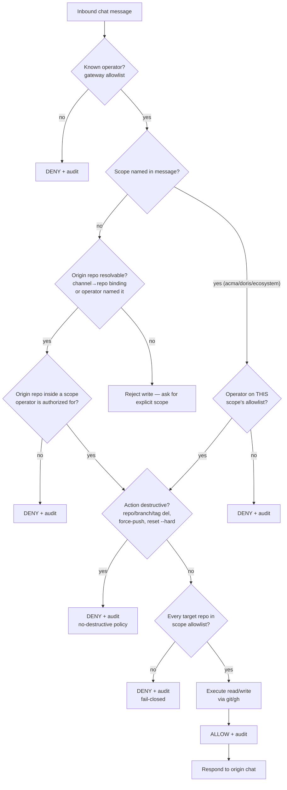
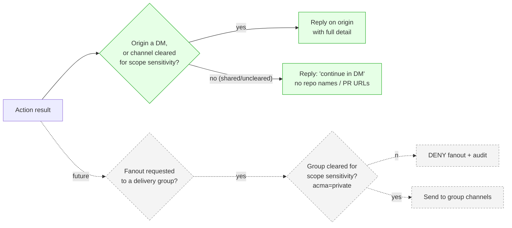

# Deckhand message-lifecycle flowcharts (POC) — [#2931](https://github.com/vamseeachanta/workspace-hub/issues/2931)

> **Status:** proposed — POC scope only; NOT plan-approved. Gate: plan → adversarial review → **user approval** → implement.
> **Date:** 2026-06-01
> **Scope:** the minimum end-to-end path for one chat message that targets a repository **scope** (`acma`, `doris`, `ecosystem`) and returns a response. Deliberately omits multi-platform fanout, media, and live mirroring (those are #2900/#2902/#2904).
> **Decisions encoded here:** [`docs/governance/2026-06-01-deckhand-scope-routing-orthogonality-decision.md`](../governance/2026-06-01-deckhand-scope-routing-orthogonality-decision.md), [`docs/governance/2026-06-01-deckhand-scope-enforcement-below-model-decision.md`](../governance/2026-06-01-deckhand-scope-enforcement-below-model-decision.md)
> **Glossary:** [`CONTEXT.md`](../../CONTEXT.md) (scope, channel, delivery group, operator, permission level, destructive operation, sensitivity/clearance)
> **Format note:** Markdown+Mermaid chosen over the HTML-default artifact rule on purpose — these diagrams must render inline in GitHub issue/kanban comments and diff cleanly in review. POC simplicity over the HTML default.

---

## POC boundary (what's in / out)

| In scope (POC) | Out of scope (later issues) |
|---|---|
| One inbound chat message, one platform (Telegram) | Multi-platform fanout — [#2900](https://github.com/vamseeachanta/workspace-hub/issues/2900)/[#2902](https://github.com/vamseeachanta/workspace-hub/issues/2902) |
| Operator auth + per-scope authorization | WhatsApp/Teams/Signal parity — [#2901](https://github.com/vamseeachanta/workspace-hub/issues/2901) |
| Scope resolution (`acma`/`doris`/`ecosystem` or origin-bound default) | Live conversation mirroring — [#2903](https://github.com/vamseeachanta/workspace-hub/issues/2903) |
| Enforcement: repo allowlist + no-destructive + **per-scope fine-grained PAT (Layer 3)** | Rich audit summary HTML — follow-on |
| Audit of allow/deny (PENDING+FINAL) | Internal `ecosystem` write grant for external operators — never |
| Text response back to **origin chat** (DM/cleared only) | Sensitivity-cleared fanout to delivery groups — #2902 |

---

## Diagram 1 — End-to-end lifecycle (happy path)

```mermaid
sequenceDiagram
    actor Op as Operator (Telegram)
    participant GW as Hermes gateway
    participant DK as Deckhand control layer
    participant EN as Scope enforcement (Layer 2 hook)
    participant GIT as git / gh on acma|doris repos
    participant AUD as Audit log (private, append-only)

    Op->>GW: chat message ("in acma, bump version & open PR")
    GW->>GW: gateway allowlist — known operator?
    GW->>DK: authenticated message + operator id
    DK->>DK: resolve active scope (named=acma | else origin-bound)
    DK->>DK: operator allowed THIS scope?
    DK->>EN: requested action(s) + active scope
    EN->>EN: repo in scope allowlist? action destructive?
    EN->>GIT: execute allowed git/gh (read/write, no destructive)
    GIT-->>EN: result (commit/PR url, or transport error)
    EN->>AUD: record decision (ALLOW, operator, scope, repos, action)
    DK-->>Op: text response on the ORIGIN chat only
    Note over DK,Op: no fanout in POC; reply stays where the request came from (#2903)
```

---

## Diagram 2 — Scope authorization & enforcement decision (fail-closed)

This is the gate. Every branch that is not an explicit ALLOW is a DENY, and every
decision (allow or deny) is audited.



---

## Diagram 3 — Response routing & sensitivity clearance (POC = origin only)

In the POC the response goes back to the origin chat. The diagram shows where the
sensitivity-clearance rule (decision 9) plugs in *when fanout is added later* — so
the POC doesn't paint us into a corner.



> **Revised per codex BLOCKER 2:** "origin always allowed" is unsafe — a private `acma`
> command issued from a shared Telegram group would leak repo names / PR URLs / branch
> names / denial reasons to everyone in it. Full-detail replies go to DMs or
> clearance-matched channels only; otherwise the bot replies "continue in DM" with no
> sensitive identifiers.

---

## Worked example (concrete, POC)

1. Operator DMs the Deckhand Telegram bot: *"in `acma`, update the changelog in `llm-wiki-acma` and open a PR."*
2. Gateway allowlist confirms the sender is a known operator → pass.
3. Scope `acma` is named; operator is on `acma.operators` → pass.
4. Action = commit + open PR (write, **not** destructive) → pass.
5. `llm-wiki-acma` is in the `acma` allowlist → pass.
6. Execute via git/gh; PR URL returned.
7. Audit record written (ALLOW; operator; scope=acma; repo=llm-wiki-acma; action=write/PR).
8. Bot replies on the same Telegram DM with the PR URL. No fanout.

**Denied variant:** operator DMs *"in `acma`, delete the `old-spec` branch everywhere."* → step 4 sees a destructive op (branch deletion) → **DENY + audit**, bot replies that destructive ops are not permitted for the scope.

---

## Post-review revisions (codex CHANGES-REQUESTED, 2026-06-01)

Adversarial review: [`scripts/review/results/2026-06-01-poc-2931-codex.md`](../../scripts/review/results/2026-06-01-poc-2931-codex.md) (codex, defect-hunting, default non-APPROVE). Verdict **CHANGES-REQUESTED**, 3 BLOCKERs + 6 MAJORs. Resolutions:

- **BLOCKER 1 (write POC on Layer-2 hook alone is unsafe).** Resolved by the go-live guardrail floor below: per-scope fine-grained PAT (server-side, bypass-proof) is mandatory before any real write. The recon (below) found 7 local-hook bypass paths, confirming the hook cannot be the containment boundary.
- **BLOCKER 2 (origin-reply leak to shared groups).** Resolved in Diagram 3 — full-detail replies to DM/cleared channels only.
- **BLOCKER 3 (origin-bound default from prose-named repo).** Resolved: the origin-bound default resolves the repo **only** from a registered channel→repo binding. A repo merely named in message prose does **not** establish a default write scope; prose-only → require an explicit named scope.
- **MAJOR (TOCTOU).** A command runs against an immutable manifest (operator id, scope id+version, repo node id, canonical worktree, action class, token id), revalidated immediately before each git/gh call.
- **MAJOR (destructive-vs-write too narrow — a commit can delete every file / strip CI / leak secrets).** POC adds a **diff-risk gate**: PR-only, no direct/protected-branch pushes, deny mass-deletion and edits to CI/workflow/secret-bearing paths without elevated approval.
- **MAJOR (audit gaps).** Audit is written **PENDING before** execution and **FINAL after**; every deny node audits (including "reject — ask for explicit scope").
- **MINOR (identity).** Operators are canonical, stable platform IDs (Telegram numeric user id, Teams AAD oid), never display names; fail-closed normalization.

## Go-live guardrail floor (approved envelope — real repos, today, ace-linux-2)

| Layer | Control | Neutralizes |
|---|---|---|
| Token (server) | Per-scope fine-grained PAT: `contents:write` + `pull_requests:write`, **no** delete/admin, repository-restricted to the scope allowlist | BLOCKER 1; all 7 hook bypasses (token can't delete/force-protected even if hook bypassed) |
| Action | PR-only; no force-push; no direct push to default/protected branches; diff-risk gate | MAJOR destructive-vs-write |
| Scope | External testers limited to `acma` / `doris` only — **`ecosystem` off** for external operators | blast radius |
| Reply | Private-scope full detail to DM / cleared channel only | BLOCKER 2 |
| Audit | PENDING-before + FINAL-after, every decision incl. denies; raw private, redacted summary public | MAJOR audit |
| Process | `pre_tool_call` hook on `terminal` + gate on `execute_code` + PATH-level `git`/`gh` shim | MAJOR Layer-2 bypass (defense-in-depth above the token) |

## Resource intelligence (codex recon, 2026-06-01)

**Scope membership** (evidence: `config/client-wikis.yml`, `config/repos.conf`, `gh repo list vamseeachanta`):

| Scope | Repositories (explicit, fail-closed) | Notes |
|---|---|---|
| `acma` | `vamseeachanta/llm-wiki-acma`, `vamseeachanta/acma-projects` | `acma-projects` is archived — confirm read-only inclusion |
| `doris` | `vamseeachanta/doris`, `vamseeachanta/llm-wiki-doris` | `llm-wiki-doris` is `status: planned` — confirm inclusion |

Proposed source-of-truth: externalized YAML under `config/deckhand/` (`policy.yml` global + `scopes.yml` one self-contained section per client + `platforms.yml`), fail-closed: unknown scope / repo absent / file unparseable → deny. No config in code (industry multi-tenant). See `config/deckhand/README.md`.

**git/gh choke point** (evidence: `~/.hermes/hermes-agent`): model shell → `tools/terminal_tool.py` `terminal_tool()` with existing `pre_tool_call` plugin hook that can `{"action":"block"}`. **7 bypass paths** (not contained by the hook): `execute_code` arbitrary Python subprocess, MCP stdio tools, `gateway/platforms/webhook.py` direct `gh pr comment`, `checkpoint_manager.py` direct git, `cli.py` destructive git (branch/worktree delete), internal read-only git probes, `scripts/release.py`. → the scoped PAT is the real boundary; the hook + PATH shim are defense-in-depth. No runtime-core edits required (plugin hook + PATH shim + GitHub-side token).

## Build sequence on ace-linux-2 (TDD — after you apply `status:plan-approved`)

1. Resolve repo-membership OPENs (archived `acma-projects`, planned `llm-wiki-doris`) — required before tokens are repo-restricted.
2. **Provision per-scope fine-grained PATs first** (acma, doris) — no delete/admin, repo-restricted to the resolved allowlist; bind via `pat_env` in `config/deckhand/scopes.yml`. (Codex: PAT must precede any real-repo test, else tests pass under ambient credentials.)
3. Externalized config wired: `config/deckhand/{policy,scopes,platforms}.yml` (per-client sections) + operator IDs.
4. Tests-first (TDD): scope resolution, allowlist fail-closed, destructive deny **per bypass path** (incl. `execute_code`), operator authZ, diff-risk gate, reply-clearance, audit PENDING+FINAL, kill-switch, rate-limit.
5. `pre_tool_call` hook + PATH-level `git`/`gh` shim (no Hermes-core edits).
6. Wire the #2741 destructive-action canary against the live guard; verify a destructive command is DENIED + audited, exercised via a non-shell bypass path.
7. Rollback/kill-switch drill: prove `disable_all_writes`, scope/operator/platform disable all fail closed and audit.
8. Add external operator IDs to `acma`/`doris` operator groups; hand testers the worked-example script.

## Still needs your input

- `*.operators` lists per scope — which external member IDs go on `acma` / `doris` (and confirm `ecosystem` stays off for them).
- Archived `acma-projects` and planned `llm-wiki-doris`: include now or hold?
- channel→repo bindings for the origin-bound default (which chat ↔ which repo).
- **The gate:** apply `status:plan-approved` on [#2931](https://github.com/vamseeachanta/workspace-hub/issues/2931) to authorize the live cutover — I cannot self-apply it.
