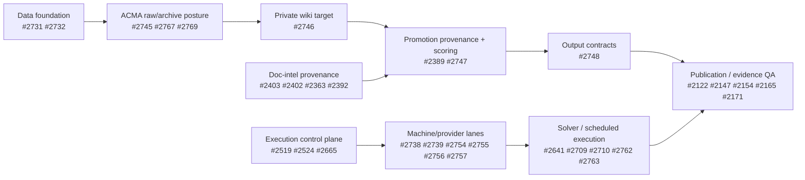

# Data → Execution → Results Kanban

**Repo:** `vamseeachanta/workspace-hub`  
**Prepared:** 2026-05-20  
**Scope:** Open GitHub issues relevant to the data layer, execution layer, and result/output layer flow.  
**Method:** Read-only GitHub issue triage + 3 delegated lane reviews. No status labels were changed and no issues were closed.

## Operating rules

- This board is a routing artifact, not implementation approval.
- Implementation still requires the hard gate: issue → plan → adversarial review → `status:plan-review` → user approval → `status:plan-approved` → TDD implementation → code review/closeout.
- Do **not** self-apply `status:plan-approved`.
- Use existing labels where possible: `status:*`, `agent:*`, `priority:*`, `cat:*`, `domain:*`.
- Preferred routing:
  - **Claude:** architecture, governance, orchestration, multi-machine coordination, plan-heavy work.
  - **Codex:** bounded implementation, test writing, CLI/refactor/pipeline work after plan approval.
  - **Gemini:** broad inventory, large-corpus research, dedup/disposition analysis, gap scans.

## Board lanes

1. **Needs plan** — issue belongs in the flow but cannot execute yet.
2. **Plan review / governance drift** — plan/review exists or is underway, but labels/comments/artifacts need reconciliation.
3. **Execution-ready** — `status:plan-approved`; ready for TDD execution if dependencies are clear.
4. **Running** — active `status:working` or confirmed active worker lane.
5. **Blocked / needs data** — blocked by upstream data, machine access, unresolved decision, or external repo dependency.
6. **QA / closeout** — result validation, evidence publication, smoke checks, closeout.

---

## Dependency spine

---

## Layer 1 — Data layer

### Needs plan

| Issue | Title | Current gate | Why it matters | Dependencies / blockers | Route |
|---:|---|---|---|---|---|
| [#2731](https://github.com/vamseeachanta/workspace-hub/issues/2731) | Inventory and normalize canonical data/repo locations for llm-wiki promotion | `status:needs-plan` | Core location contract for raw data, repo placement, promotion routing | Foundation for #2732, #2745/#2746/#2747 | **Claude** |
| [#2767](https://github.com/vamseeachanta/workspace-hub/issues/2767) | Unionise preexisting data folders with content dedup | `status:needs-plan` | Generalized dedup/data-layout cleanup across preexisting folders | Should follow #2731/#2732 taxonomy | **Gemini** |
| [#2769](https://github.com/vamseeachanta/workspace-hub/issues/2769) | Plan disposition of `/mnt/ace/acma-projects.preexisting-*` 1.8 TB backup | `status:needs-plan` | ACMA-specific raw storage pressure issue | Adjacent to #2745; may be subsumed by #2767 | **Gemini** |

### Planning / missing explicit status

| Issue | Title | Current gate | Why it matters | Dependencies / blockers | Route |
|---:|---|---|---|---|---|
| [#2744](https://github.com/vamseeachanta/workspace-hub/issues/2744) | ACMA client project data-cycle readiness and private llm-wiki launch | none | Parent epic for current ACMA data→execution→results flow | Child issues need gate/state alignment | **Claude** |
| [#2732](https://github.com/vamseeachanta/workspace-hub/issues/2732) | Canonical first/second-level mount and folder taxonomy | none | Makes data locations searchable/routable by agents | Depends on #2731 contract | **Claude** |
| [#2747](https://github.com/vamseeachanta/workspace-hub/issues/2747) | Raw-to-private-wiki promotion ledger with completion confidence scoring | none | Promotion ledger and confidence scoring for raw→wiki step | Depends on #2746, #2389 | **Codex after plan**, Claude for contract |
| [#2748](https://github.com/vamseeachanta/workspace-hub/issues/2748) | Client output scaffolding for reports, chatbots, evidence packs | none | Bridges data products into result/output layer | Depends on #2747 scoring and #2389 provenance | **Codex after plan** |
| [#2389](https://github.com/vamseeachanta/workspace-hub/issues/2389) | Thread `source_doc_key` through promotion pipeline and promoted artifacts | none | Provenance identity needed by promotion and result artifacts | Feeds #2392/#2747/#2748 | **Codex** |
| [#2392](https://github.com/vamseeachanta/workspace-hub/issues/2392) | Wiki coverage-gap detector — inventory × wiki diff per discipline | none | Coverage reporting for what data made it into wiki/output | Soft-depends on #2389; plan review had MAJOR concerns | **Gemini** |

### Execution-ready / running / blocked

| Issue | Title | Current gate | Why it matters | Dependencies / blockers | Route |
|---:|---|---|---|---|---|
| [#2745](https://github.com/vamseeachanta/workspace-hub/issues/2745) | Freeze `acma-projects` and move to local-only archive posture | `status:plan-approved` | Immediate source archive/freeze guardrail | Coordinate with #2769 storage disposition | **Codex** |
| [#2746](https://github.com/vamseeachanta/workspace-hub/issues/2746) | Create private llm-wiki repo target | `status:plan-approved` | Establishes private wiki target for ACMA | Naming mismatch: title says `llm-wiki-acma`, body says `acma-llm-wiki` | **Claude** |
| [#2403](https://github.com/vamseeachanta/workspace-hub/issues/2403) | Embeddings model-selection spike | `status:working`, `status:plan-approved`, `agent:codex` | Selects model for doc-intel retrieval | Blocks #2402 | **Codex** |
| [#2402](https://github.com/vamseeachanta/workspace-hub/issues/2402) | Build embeddings index L2+L3 + query CLI | `status:blocked`, `status:plan-approved`, `agent:codex` | Retrieval/index layer over document corpus | Hard-blocked by #2403 | **Codex** |

---

## Layer 2 — Execution layer

### Control plane / orchestration backbone

| Issue | Title | Current gate | Board lane | Dependencies / blockers | Route |
|---:|---|---|---|---|---|
| [#2519](https://github.com/vamseeachanta/workspace-hub/issues/2519) | Orchestrate AI provider usage and workstation dispatch | none | Blocked / parent epic | Parent for #2524/#2665/#2754-#2757 | **Claude** |
| [#2524](https://github.com/vamseeachanta/workspace-hub/issues/2524) | Machine-aware dispatch ledger and reconciler | none | Needs plan | Depends on #2519 | **Claude** |
| [#2665](https://github.com/vamseeachanta/workspace-hub/issues/2665) | Provider-credit approval dashboard and dispatch gates | `status:plan-approved` | Execution-ready | Coupled to #2524 ledger | **Claude** |
| [#2718](https://github.com/vamseeachanta/workspace-hub/issues/2718) | Kanban-worker dispatch hazards | none | Blocked / risk | Coupled to #2715 and #2696 hazards | **Claude** |
| [#2762](https://github.com/vamseeachanta/workspace-hub/issues/2762) | Hermes-vs-system cron scheduler routing contract | `status:needs-plan` | Needs plan | Parent/precursor for #2763 | **Claude** |
| [#2763](https://github.com/vamseeachanta/workspace-hub/issues/2763) | Migrate `gsd-researcher` scheduled AI work through Hermes | `status:needs-plan` | Blocked by plan | Depends on #2762 | **Claude** |

### Machine/provider lanes

| Issue | Title | Current gate | Board lane | Dependencies / blockers | Route |
|---:|---|---|---|---|---|
| [#2737](https://github.com/vamseeachanta/workspace-hub/issues/2737) | Telegram/Hermes dispatch across approved machines | `status:needs-plan` | Needs plan | Parent of #2738/#2739/#2741/#2742 | **Claude** |
| [#2738](https://github.com/vamseeachanta/workspace-hub/issues/2738) | Harden ace-linux-1 dispatch coordinator | `status:plan-approved` | Execution-ready | Supports #2754 | **Claude** |
| [#2739](https://github.com/vamseeachanta/workspace-hub/issues/2739) | Promote ace-linux-2 first dispatch worker | `status:plan-approved` | Execution-ready | Supports #2755 | **Claude** |
| [#2754](https://github.com/vamseeachanta/workspace-hub/issues/2754) | Activate ace-linux-1 provider/machine lane | `status:plan-approved` | Execution-ready | Operationally depends on #2738 | **Claude** |
| [#2755](https://github.com/vamseeachanta/workspace-hub/issues/2755) | Activate ace-linux-2 provider/machine lane | `status:plan-approved`, `status:working` | Running | Operationally depends on #2739 | **Claude** |
| [#2756](https://github.com/vamseeachanta/workspace-hub/issues/2756) | Activate licensed-win-1 provider/machine lane | `status:needs-plan` | Needs plan | Needed for licensed solver execution | **Claude** |
| [#2757](https://github.com/vamseeachanta/workspace-hub/issues/2757) | Activate licensed-win-2 provider/machine lane | `status:needs-plan` | Needs plan / blocked | Blocked in practice by repo-placement/AQWA lane uncertainty | **Claude** |

### Solver / hands-off execution flow

| Issue | Title | Current gate | Board lane | Dependencies / blockers | Route |
|---:|---|---|---|---|---|
| [#1586](https://github.com/vamseeachanta/workspace-hub/issues/1586) | Harden solver queue | none | Blocked / parent | Queue backbone for #2641/#2709 | **Claude** |
| [#2641](https://github.com/vamseeachanta/workspace-hub/issues/2641) | Hands-off multi-machine inbox ingestion for OrcaWave/OrcaFlex/AQWA | none | Blocked / parent epic | Depends on #2756/#2757, #2709/#2717, #1586 | **Claude** |
| [#2709](https://github.com/vamseeachanta/workspace-hub/issues/2709) | AQWA runner adapter and schema extension | none | Blocked | Explicitly blocked by #2717 | **Claude** |
| [#2717](https://github.com/vamseeachanta/workspace-hub/issues/2717) | Live AQWA env access on licensed Windows host | none | Blocked / needs data | Prerequisite for #2709 | **Claude** |
| [#2710](https://github.com/vamseeachanta/workspace-hub/issues/2710) | Conversational submit UX — `/solver-submit` + interactive CLI | `status:plan-approved` | Execution-ready | Related to #2641; AQWA path trails #2709 | **Codex** |

### Reference / governance only

| Issue | Title | Current gate | Use on board | Route |
|---:|---|---|---|---|
| [#2695](https://github.com/vamseeachanta/workspace-hub/issues/2695) | `/goal` use-case catalog for repo ecosystem | `status:plan-approved` | Reference for routing decisions; not a primary execution-lane card | **Codex/Claude as scoped** |
| [#1838](https://github.com/vamseeachanta/workspace-hub/issues/1838) | AI credit utilization governance | none | Strategic context only unless governance swimlane is added | **Claude** |
| [#1839](https://github.com/vamseeachanta/workspace-hub/issues/1839) | Workflow hard-stops and session governance | `agent:claude` | Governance/risk context for lifecycle gates | **Claude** |

---

## Layer 3 — Results / output layer

### Core output/results contracts

| Issue | Title | Current gate | Board lane | Dependencies / blockers | Route |
|---:|---|---|---|---|---|
| [#2748](https://github.com/vamseeachanta/workspace-hub/issues/2748) | Client output scaffolding for reports, chatbots, evidence packs | none | Needs plan | Depends on #2747 and #2389 | **Codex** |
| [#2747](https://github.com/vamseeachanta/workspace-hub/issues/2747) | Raw-to-private-wiki promotion ledger with completion confidence scoring | none | Needs plan | Depends on #2746; should use #2389 provenance | **Codex** |
| [#2389](https://github.com/vamseeachanta/workspace-hub/issues/2389) | Thread `source_doc_key` through promotion pipeline | none | Needs plan | Enables traceable promoted artifacts | **Codex** |
| [#2363](https://github.com/vamseeachanta/workspace-hub/issues/2363) | `wiki_refs` reverse lookup (`doc_key` → citing wiki pages) | none | Plan review / drift | Local plan/review history exists; blocked by canonical `doc_key` rollout | **Codex** |
| [#2392](https://github.com/vamseeachanta/workspace-hub/issues/2392) | Wiki coverage-gap detector | none | Plan review / blocked | Soft deps: llm-wiki doc_key and #2389; prior MAJOR findings | **Gemini** |

### Knowledge promotion / output curation

| Issue | Title | Current gate | Board lane | Dependencies / blockers | Route |
|---:|---|---|---|---|---|
| [#2370](https://github.com/vamseeachanta/workspace-hub/issues/2370) | Closed-issue promotion ledger | none | Planning draft / pre-review | Depends on #2236/#2238 workflow guardrails | **Gemini** |
| [#2374](https://github.com/vamseeachanta/workspace-hub/issues/2374) | Transient-promotion candidate queue | none | Planning draft / pre-review | Related to #2370; depends on #2236/#2238 | **Gemini** |

### Reporting / publication pipeline

| Issue | Title | Current gate | Board lane | Dependencies / blockers | Route |
|---:|---|---|---|---|---|
| [#2122](https://github.com/vamseeachanta/workspace-hub/issues/2122) | Weekly ecosystem scorecard with trend deltas and regression flags | none | Needs plan | Parent #2089; depends conceptually on artifact model #2106 | **Codex** |
| [#2147](https://github.com/vamseeachanta/workspace-hub/issues/2147) | Validator CLI and CI checks for weekly review artifacts | none | Needs plan | Blocked on schema/layout definition | **Codex** |
| [#2154](https://github.com/vamseeachanta/workspace-hub/issues/2154) | Markdown/HTML publication layout renderer | none | Needs plan | Should follow schema + scorecard contract | **Codex** |
| [#2165](https://github.com/vamseeachanta/workspace-hub/issues/2165) | Publication asset/path integrity tests | none | Needs plan / QA | Requires assembler/navigation surfaces | **Codex** |
| [#2171](https://github.com/vamseeachanta/workspace-hub/issues/2171) | End-to-end weekly publication smoke scenarios | none | Needs plan / QA | Logically after #2154/#2165 | **Codex** |

### Evidence / citation publication closeout

| Issue | Title | Current gate | Board lane | Dependencies / blockers | Route |
|---:|---|---|---|---|---|
| [#2284](https://github.com/vamseeachanta/workspace-hub/issues/2284) | OCIMF MEG3/MEG4 wiki promotion | none | Near-close but blocked | Waiting on workspace-hub `knowledge/wikis/` mirror/resolver decision, tracked via #2768 | **Gemini** |
| [#2768](https://github.com/vamseeachanta/workspace-hub/issues/2768) | OCIMF closeout epic | `status:plan-approved` | Approved but blocked epic | Cross-repo digitalmodel dependencies + #2284 mirror decision | **Codex** |

---

## Recommended assignment waves

### Wave 0 — board/gate reconciliation only

Purpose: clean routing metadata without starting implementation.

| Agent | Work |
|---|---|
| Claude | Reconcile labels/status for #2744, #2732, #2747, #2748, #2519, #2524, #2641, #2709, #2717, #2718. Do not approve plans. |
| Gemini | Inventory whether #2767 and #2769 overlap; produce disposition decision matrix. |
| Codex | Inspect #2389/#2747/#2748 for shared provenance fields and draft testable acceptance criteria. |

### Wave 1 — data foundation

| Agent | Issues | Gate |
|---|---|---|
| Claude | #2731, #2732 | Draft plan → adversarial review → user approval |
| Codex | #2745 | Execute only because `status:plan-approved`; use TDD and verify storage/archive guardrails |
| Claude | #2746 | Resolve naming mismatch first, then execute approved plan |
| Gemini | #2767, #2769 | Planning/inventory only; no destructive deletion/move |

### Wave 2 — execution backbone

| Agent | Issues | Gate |
|---|---|---|
| Claude | #2738, #2739, #2754, #2755 | Execute approved lane activation/verification in isolated worktrees or machine-specific sessions |
| Claude | #2756, #2757 | Plan only until `status:plan-approved` |
| Codex | #2710 | Execute approved bounded CLI/UX work with tests |
| Claude | #2762/#2763 | Plan routing contract first; migration trails contract approval |

### Wave 3 — results/provenance/output

| Agent | Issues | Gate |
|---|---|---|
| Codex | #2389 | Bounded implementation after plan; add tests for `source_doc_key` propagation |
| Codex | #2747, #2748 | Draft/execute only after #2746/#2389 contract is stable |
| Gemini | #2392, #2370, #2374 | Gap analysis and planning; avoid implementation until review findings resolved |
| Codex | #2122, #2147, #2154, #2165, #2171 | Build reporting pipeline in order: scorecard → renderer/validator → asset tests → E2E smoke |

---

## Immediate next checkpoints

1. **Approve board scope:** Use this as the working Kanban for data→execution→results.
2. **Metadata reconciliation:** Add missing status/agent labels where agreed. Do not add `status:plan-approved` without explicit user approval.
3. **Start approved work only:** #2745, #2746, #2738, #2739, #2754, #2755, #2710, #2665, #2768 are currently the approved/running execution pool.
4. **Draft plans for blockers:** #2731, #2732, #2767, #2769, #2756, #2757, #2762, #2763, #2389, #2747, #2748.
5. **Run provider dispatch:** Claude gets architecture/orchestration lanes; Codex gets bounded TDD implementation; Gemini gets inventory/gap/disposition lanes.

## Verification notes

- Three delegated lane reviews completed: data layer, execution layer, results layer.
- GitHub Project board: [`WRK Lifecycle`](https://github.com/users/vamseeachanta/projects/1).
- The 44 scoped issues in this report were added to `WRK Lifecycle` and assigned project fields:
  - `Status`: `Todo` except #2755 set to `In Progress`.
  - `Stage Group`: `1-Plan (1-4)`, `2-Review Plan (5-7)`, `3-Execute (8-16)`, `4-Close (17-20)`, or `Backlog` per the board lane mapping above.
- GitHub issue status labels were **not** changed. No issue was closed. No `status:plan-approved` label was added.
- Comment posted on #2744 with the board link and routing summary: https://github.com/vamseeachanta/workspace-hub/issues/2744#issuecomment-4504177065
- Local worktree was already dirty before this artifact was created; unrelated changes were not touched.
