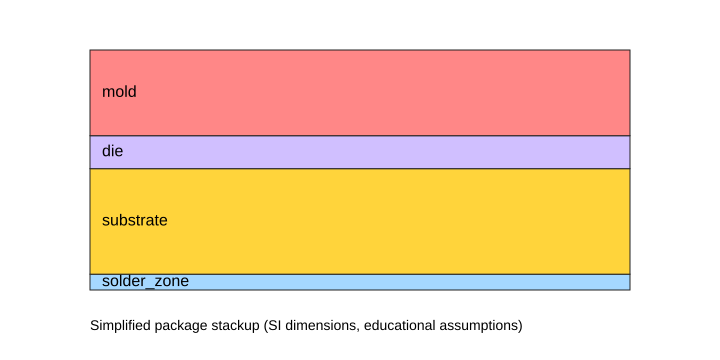
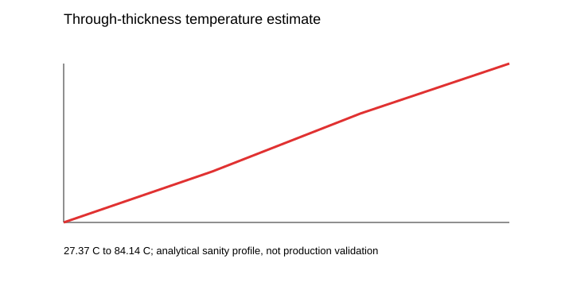
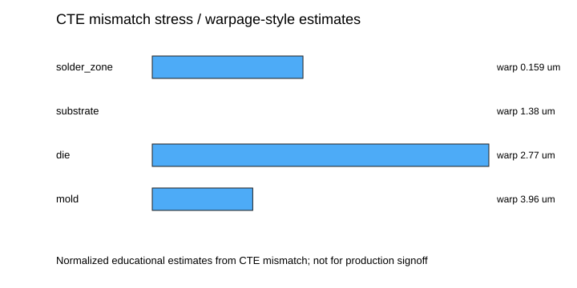

# Semiconductor Package FEM Benchmark

## Executive Summary
This portfolio benchmark builds a simplified semiconductor package stackup, emits CalculiX input decks, and generates deterministic temperature/stress/warpage-style plots. It is not production-certified and is not for production signoff.

## Boundary Conditions
- Bottom package surface is the reference/support surface.
- Top package surface represents the junction-side thermal boundary.
- Thermo-mechanical deck uses simplified bottom constraints and thermal expansion material data.

## Loads
- Ambient temperature: 25.0 C
- Junction temperature: 85.0 C
- Representative package power: 2 W

## Materials and Provenance
- `fr4`: E=2.2e+10 Pa, nu=0.28, CTE=1.6e-05 1/K, k=0.3 W/m/K. Source: Representative open engineering handbook value; note: Educational FR-4 approximation; not a vendor datasheet or IPC requirement.
- `silicon`: E=1.3e+11 Pa, nu=0.28, CTE=2.6e-06 1/K, k=130 W/m/K. Source: Representative open engineering handbook value; note: Educational silicon approximation for portfolio benchmark only.
- `mold`: E=1.8e+10 Pa, nu=0.35, CTE=1.2e-05 1/K, k=0.7 W/m/K. Source: Representative open engineering handbook value; note: Educational mold-compound approximation; not proprietary package data.
- `solder`: E=3.5e+10 Pa, nu=0.36, CTE=2.2e-05 1/K, k=50 W/m/K. Source: Representative open engineering handbook value; note: Lumped interconnect/support layer for benchmark simplification.

## Mesh and Convergence Notes
- Nodes: 175
- Elements: 96
- Structured mesh is intentionally small for CI transparency; a production package model would require formal mesh refinement.

## Convergence and Smoke Checks
| Check | Result |
|---|---|
| Aspect-ratio proxy | 20.8333 |
| Analytical delta-T positive | 71.9912 K |
| Solver aggregate status | skipped |
| Solver versions | not run in committed no-solver artifact |
| Solver decks covered | thermal, thermomechanical |

## Solver Status
- Status: `skipped`
- Reason/command: `no_solver_requested`
- `thermal`: `skipped` — `no_solver_requested`
- `thermomechanical`: `skipped` — `no_solver_requested`

## Result Plots
- Stackup schematic: `package_stackup.svg`
- Temperature profile: `temperature_profile.svg`
- Stress/warpage-style estimate: `stress_warpage_estimates.svg`
- Source profile data: `result_profiles.csv`





## Sanity Checks
- Thermal resistance: 35.9956 K/W
- Delta-T estimate: 71.9912 K
- Max free strain: 0.000964682
- Warpage-style estimate: 4.82341 um

## Standards and Use Limitations
This benchmark is not JEDEC-compliant, not IPC-compliant, not validated to JEDEC, not production-certified, and not for production signoff. It does not extract or claim proprietary JEDEC/IPC requirements; terminology is used only for portfolio-safe engineering communication.

## Regeneration
```bash
uv run python scripts/semiconductor/package_fem_benchmark.py --output data/semiconductor/package_fem_benchmark --report docs/reports/semiconductor-package-fem-benchmark.md --no-solver
```
