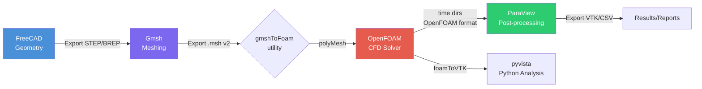
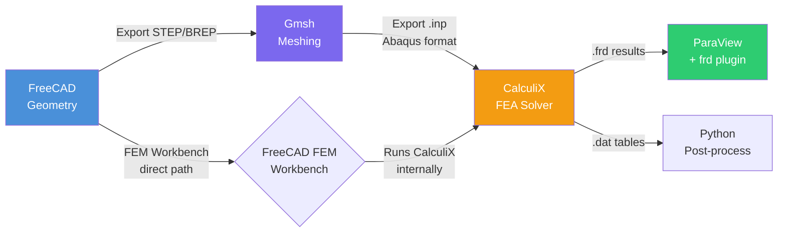
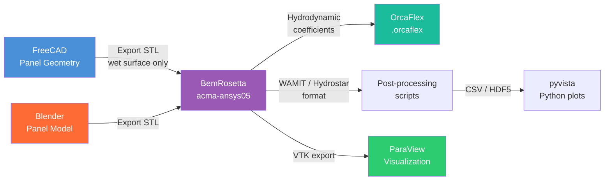
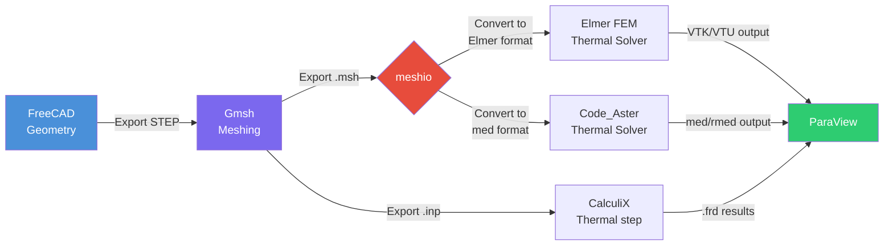
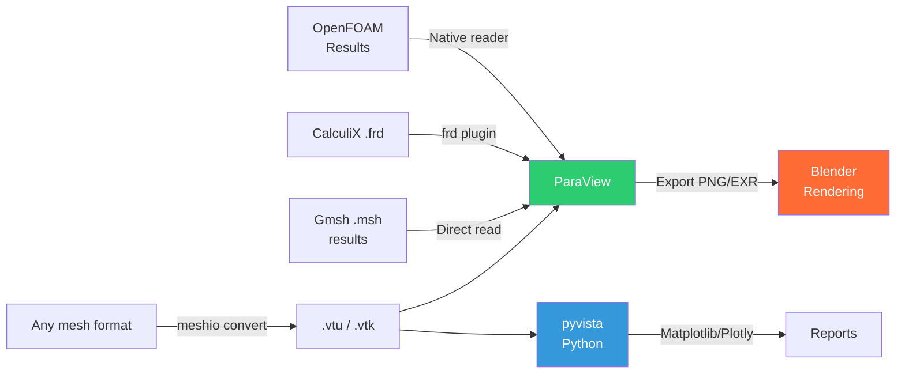

# Engineering Capability Map
## File Formats, Workflow Pipelines, and Interoperability Matrix

**Status**: Active reference document
**Created**: 2026-02-24
**Scope**: Open-source engineering tools installed on ace-linux-2 (and acma-ansys05 for BemRosetta)
**Related WRK**: WRK-292 (depends on WRK-290, WRK-291)

---

## Table of Contents

1. [Tool Inventory](#1-tool-inventory)
2. [File Format Compatibility Matrix](#2-file-format-compatibility-matrix)
3. [Workflow Pipeline Diagrams](#3-workflow-pipeline-diagrams)
4. [Integration Gap Analysis](#4-integration-gap-analysis)
5. [Python Automation Map](#5-python-automation-map)
6. [Quick Reference: Format Bridges](#6-quick-reference-format-bridges)

---

## 1. Tool Inventory

| Tool | Role | Host | Version Notes |
|------|------|------|---------------|
| FreeCAD | CAD / Geometry | ace-linux-2 | 0.21+; Python 3 scripting built-in |
| Gmsh | Meshing | ace-linux-2 | 4.x; full Python API |
| OpenFOAM | CFD Solver | ace-linux-2 | v2312 (ESI) or 11 (Foundation) |
| ParaView | Post-processing / Vis | ace-linux-2 | 5.x; pvpython scripting |
| CalculiX | FEA Solver | ace-linux-2 | 2.21; Abaqus-compatible INP format |
| Blender | 3D Modeling / Vis | ace-linux-2 | 3.x/4.x; Python bpy API |
| meshio | Format Converter | ace-linux-2 | Python library, 40+ formats |
| PyFoam | OpenFOAM Python Interface | ace-linux-2 | pip package |
| pyvista | VTK Python Visualization | ace-linux-2 | pip package, wraps VTK |
| BemRosetta | Hydrodynamic BEM | acma-ansys05 | U++ based; NOT on ace-linux-2 |

---

## 2. File Format Compatibility Matrix

Legend: **R** = Read, **W** = Write, **RW** = Read+Write, **-** = Not supported, **ext** = via extension/addon

### 2.1 Geometry Formats

```
Format:     | STEP      | IGES      | BREP      | OBJ       | STL       | DXF       | IGES
------------|-----------|-----------|-----------|-----------|-----------|-----------|--------
FreeCAD     | RW        | RW        | RW        | RW        | RW        | RW        | RW
Gmsh        | R         | R         | R         | -         | RW        | -         | R
OpenFOAM    | -         | -         | -         | -         | R (surf)  | -         | -
ParaView    | -         | -         | -         | R         | R         | -         | -
CalculiX    | -         | -         | -         | -         | -         | -         | -
Blender     | ext       | -         | -         | RW        | RW        | -         | -
meshio      | -         | -         | -         | -         | RW        | -         | -
BemRosetta  | -         | -         | -         | -         | RW        | -         | -
```

Notes:
- FreeCAD STEP/IGES uses OpenCASCADE kernel (full NURBS support)
- Gmsh reads STEP/IGES/BREP via OpenCASCADE; these are geometry inputs for meshing
- Blender STEP import requires the "CAD Sketcher" or "ImportCAD" add-on; native support added in 4.x via io_scene_step
- OpenFOAM reads STL for surface patches (snappyHexMesh, surfaceFeatureExtract)

### 2.2 Mesh Formats

```
Format:     | Gmsh.msh  | INP       | VTK/vtu   | OpenFOAM  | CGNS      | Exodus    | UNV
            | (v2/v4)   | (Abaqus)  | (.vtk/.vtu)| polyMesh  |           |           |
------------|-----------|-----------|-----------|-----------|-----------|-----------|--------
FreeCAD     | R(ext)    | R(ext)    | -         | -         | -         | -         | -
Gmsh        | RW        | RW        | RW        | W (conv)  | RW        | RW        | RW
OpenFOAM    | R(conv)   | -         | -         | RW        | R(conv)   | -         | -
ParaView    | R         | -         | RW        | R         | R         | R         | R
CalculiX    | -         | RW        | -         | -         | -         | -         | -
Blender     | -         | -         | -         | -         | -         | -         | -
meshio      | RW        | RW        | RW        | RW        | RW        | RW        | RW
BemRosetta  | -         | -         | -         | -         | -         | -         | -
pyvista     | -         | -         | RW        | R         | -         | -         | -
```

Notes:
- OpenFOAM uses `gmshToFoam` utility to convert Gmsh .msh to polyMesh
- OpenFOAM uses `foamMeshToFluent`, `foamToVTK` for export conversions
- meshio is the universal adapter: converts between virtually all formats above
- CalculiX reads INP (its native format, compatible with Abaqus INP subset)
- Gmsh can export directly to INP (Abaqus/CalculiX) for FEA workflows
- ParaView reads OpenFOAM format natively via the built-in OpenFOAM reader

### 2.3 Results / Post-processing Formats

```
Format:     | VTK/vtu   | OpenFOAM  | CGNS      | HDF5/XDMF | EnSight   | CSV       | Nastran
            |           | (time dirs)|           |           |           |           |
------------|-----------|-----------|-----------|-----------|-----------|-----------|--------
ParaView    | RW        | R         | R         | R         | R         | R         | R
pyvista     | RW        | R         | -         | R(XDMF)   | -         | -         | -
Blender     | -         | ext       | -         | -         | -         | -         | -
meshio      | RW        | RW        | RW        | RW        | -         | -         | -
CalculiX    | W(frd)    | -         | -         | -         | -         | -         | -
OpenFOAM    | W(conv)   | RW        | W(conv)   | -         | W(conv)   | -         | -
```

Notes:
- CalculiX produces .frd (native) and .dat results files; ParaView reads .frd via plugin
- OpenFOAM time directories are directly readable by ParaView without conversion
- Blender can import OpenFOAM results via the "Blender-OpenFOAM" community plugin

---

## 3. Workflow Pipeline Diagrams

### 3.1 CFD Pipeline: FreeCAD → Gmsh → OpenFOAM → ParaView



**Step-by-step**:

1. **FreeCAD** — Create or import geometry, apply boolean operations, export as `geometry.step` or `geometry.brep`
2. **Gmsh** — Open STEP file, define physical groups (volumes, boundary surfaces), mesh with appropriate algorithm (Delaunay/Frontal/HXT), export as `mesh.msh` (format v2 for compatibility)
3. **gmshToFoam** — Run `gmshToFoam mesh.msh` inside the OpenFOAM case directory to generate `constant/polyMesh/`
4. **OpenFOAM** — Set boundary conditions, turbulence models, solver settings; run `simpleFoam`, `icoFoam`, or appropriate solver
5. **ParaView** — Open the OpenFOAM `.foam` control file; visualize velocity/pressure fields, streamlines, surface plots
6. **Optional pyvista/PyFoam** — Automate result extraction, generate plots programmatically

**Key file transitions**:
```
.step → Gmsh .geo/.msh → OpenFOAM polyMesh → OpenFOAM time dirs → ParaView .foam
```

**Format conversion needed**: Gmsh .msh → OpenFOAM via `gmshToFoam` (built-in utility, not meshio)

---

### 3.2 Structural FEA Pipeline: FreeCAD → Gmsh → CalculiX → ParaView



**Step-by-step**:

1. **FreeCAD** — Model part; use FEM Workbench for direct CalculiX integration (mesh + solve + view in one tool), OR export STEP for external Gmsh meshing
2. **Gmsh** — Import STEP, create 3D tetrahedral mesh, export as `.inp` (Abaqus/CalculiX input format) with physical groups mapped to element sets and node sets
3. **CalculiX** — Edit INP file to add boundary conditions (`*BOUNDARY`), loads (`*CLOAD`, `*DLOAD`), material (`*MATERIAL`, `*ELASTIC`), analysis step (`*STEP`, `*STATIC`); run `ccx -i job_name`
4. **ParaView** — Load `.frd` file (requires CalculiX reader plugin, often bundled in newer ParaView), visualize displacement, stress (von Mises), strain fields
5. **meshio** — If format conversion needed between Gmsh and INP formats, or to convert results to VTK

**Key file transitions**:
```
.step → Gmsh .msh/.inp → CalculiX .frd/.dat → ParaView visualization
```

**Alternative path**: FreeCAD FEM Workbench handles the full chain internally (geometry → mesh → CalculiX setup → results view) without leaving FreeCAD.

---

### 3.3 Hydrodynamic BEM Pipeline: FreeCAD/Blender → BemRosetta → ParaView



**Step-by-step**:

1. **FreeCAD or Blender** — Create hull/platform geometry; model only the wetted surface (below waterline); export as STL panel mesh
2. **BemRosetta (on acma-ansys05)** — Import STL or proprietary BEM formats (WAMIT, Hydrostar, NEMOH); compute added mass, damping, excitation force RAOs; convert between BEM formats; export to OrcaFlex or AQWA
3. **ParaView** — Visualize pressure distributions, panel geometry
4. **pyvista / Python** — Post-process hydrodynamic coefficients, generate RAO plots, feed into fatigue or operability workflows

**Host constraint**: BemRosetta is only available on **acma-ansys05**. For BEM workflows, geometry preparation runs on ace-linux-2, then STL transfer to acma-ansys05 for BemRosetta, then results transfer back.

**Key file transitions**:
```
.step/.brep → STL (wetted surface) → BemRosetta → WAMIT/.hyd/.aqwa → OrcaFlex/ParaView
```

---

### 3.4 Thermal Analysis Pipeline: FreeCAD → Gmsh → Elmer/Code_Aster → ParaView



**Notes**:
- Elmer FEM (open source, by CSC Finland) reads Gmsh .msh via `ElmerGrid` converter
- Code_Aster (open source, by EDF) uses MED format; meshio converts Gmsh .msh to MED
- CalculiX also supports thermal steps (`*HEAT TRANSFER`), providing a simpler path if CalculiX is already in use for structural analysis

**Key file transitions**:
```
.step → Gmsh .msh → meshio → Elmer/med → solver results → ParaView .vtu
```

---

### 3.5 Visualization Pipeline: Any Solver → VTK/OpenFOAM → ParaView/Blender



**ParaView as universal hub**: ParaView reads nearly every solver output format and serves as the primary post-processing tool for all pipelines above.

---

## 4. Integration Gap Analysis

### 4.1 Direct Connections (no conversion needed)

| From | To | Bridge | Notes |
|------|----|--------|-------|
| FreeCAD | Gmsh | STEP/BREP file | Gmsh reads STEP via OpenCASCADE |
| Gmsh | OpenFOAM | `gmshToFoam` utility | Built into OpenFOAM; v2 .msh preferred |
| Gmsh | CalculiX | .inp export | Gmsh exports Abaqus-format INP directly |
| OpenFOAM | ParaView | Native reader | ParaView has built-in OpenFOAM reader |
| FreeCAD FEM | CalculiX | Internal workbench | FreeCAD FEM Workbench automates this |
| pyvista | ParaView | Shared VTK format | Both read/write .vtu natively |

### 4.2 Connections Requiring meshio as Bridge

| From | To | meshio role | Command example |
|------|----|-------------|-----------------|
| Gmsh .msh | Elmer | Convert .msh → Elmer format | `meshio convert mesh.msh mesh.e` |
| Gmsh .msh | Code_Aster | Convert .msh → .med | `meshio convert mesh.msh mesh.med` |
| CalculiX .inp | VTK | Convert for pyvista | `meshio convert job.inp job.vtu` |
| Any FEA mesh | OpenFOAM | Convert to polyMesh via intermediate | meshio → VTK → `foamToVTK` reverse |
| Abaqus .inp | Gmsh .msh | Round-trip conversion | `meshio convert abaqus.inp out.msh` |
| STL surface | VTK | Convert for visualization | `meshio convert surface.stl surface.vtu` |

### 4.3 Weak Links and Dead-ends

**Blender isolation**:
- Blender does not natively read engineering mesh formats (.msh, .inp, polyMesh)
- Use case is primarily: (a) artistic rendering of results exported from ParaView, (b) creating panel geometry for BEM (export STL)
- OpenFOAM-Blender plugin exists but is a community add-on with limited maintenance
- Blender is a dead-end for analysis; use it only for geometry creation or final rendering

**BemRosetta host constraint**:
- Only on acma-ansys05; this breaks the otherwise ace-linux-2-centric workflow
- Workaround: prepare geometry on ace-linux-2, `scp` STL to acma-ansys05, run BemRosetta, `scp` results back
- No Python API for BemRosetta; it is GUI-only (U++ framework)

**CalculiX results format**:
- Native .frd format is not universally supported; requires ParaView plugin
- Workaround: use `cgx` (CalculiX GraphX post-processor) to convert .frd → VTK, or meshio for mesh files
- meshio does NOT read .frd results files (only INP mesh files); this is a genuine gap

**CGNS in practice**:
- CGNS is theoretically well-supported (Gmsh, ParaView, OpenFOAM via conversion)
- In practice, OpenFOAM CGNS support requires the `cgnsToFoam` utility and correct CGNS library linking at compile time
- Safer to use Gmsh .msh + `gmshToFoam` for the OpenFOAM path

**Thermal solvers (Elmer, Code_Aster)**:
- Neither Elmer nor Code_Aster are confirmed installed on ace-linux-2 per WRK-290/291 notes
- The thermal pipeline above uses meshio as a bridge but depends on Elmer/Code_Aster being available
- CalculiX with `*HEAT TRANSFER` is the installed fallback for thermal analysis

### 4.4 Format Conversion Decision Tree

```
Need to go FROM → TO?

Gmsh .msh → OpenFOAM polyMesh   : use gmshToFoam (built-in)
Gmsh .msh → CalculiX INP        : Gmsh native export
Gmsh .msh → any other format    : use meshio
OpenFOAM → VTK                  : use foamToVTK (built-in)
OpenFOAM → ParaView             : native reader (no conversion)
CalculiX INP → any format       : use meshio
CalculiX .frd → VTK             : use cgx OR manual scripting
Any mesh → any mesh             : try meshio first
Geometry .step → mesh           : FreeCAD export → Gmsh import
```

---

## 5. Python Automation Map

### 5.1 Native Python Support per Tool

| Tool | Python API | API Quality | Notes |
|------|-----------|-------------|-------|
| FreeCAD | Yes — built-in | Good | FreeCAD Python console; `import FreeCAD, Part, Mesh` |
| Gmsh | Yes — `gmsh` package | Excellent | Full geometry + meshing API; `import gmsh` |
| OpenFOAM | Partial — via PyFoam | Moderate | PyFoam parses cases; no direct C++ API |
| ParaView | Yes — `pvpython` | Good | Server-side scripting; `import paraview.simple` |
| CalculiX | No | N/A | Script-only via input file generation |
| Blender | Yes — `bpy` | Excellent | Full scene API; `import bpy` |
| meshio | Yes — core library | Excellent | Pure Python; `import meshio` |
| PyFoam | Yes — is Python | Excellent | Purpose-built OpenFOAM automation |
| pyvista | Yes — is Python | Excellent | Wraps VTK; `import pyvista as pv` |
| BemRosetta | No | N/A | GUI-only; no scripting interface |

### 5.2 Python Libraries and Their Roles

```
meshio      — Format conversion hub. Read any mesh format, write any other.
              pip install meshio
              Use: mesh = meshio.read("file.msh"); meshio.write("file.inp", mesh)

PyFoam      — OpenFOAM case management from Python.
              pip install PyFoam
              Use: parse blockMeshDict, run cases, extract residuals, manipulate boundary conditions

pyvista     — VTK-based visualization and analysis.
              pip install pyvista
              Use: load .vtu/.vtk, extract slices, compute statistics, create plots without ParaView GUI

gmsh (API)  — Full mesh generation from Python scripts.
              pip install gmsh  (or use system gmsh Python bindings)
              Use: gmsh.initialize(); gmsh.model.occ.importShapes("geo.step"); gmsh.mesh.generate(3)

FreeCAD     — Geometry creation/manipulation in headless mode.
              import FreeCAD  (requires FreeCAD in PYTHONPATH)
              Use: create parts, apply boolean ops, export STEP/BREP/STL programmatically

paraview    — Batch post-processing via pvpython.
              pvpython script.py  (uses ParaView's bundled Python)
              Use: load results, apply filters, render to PNG/EXR, export data tables
```

### 5.3 End-to-End Python Automation Potential

**CFD Pipeline — Fully Automatable**:

```python
# Pseudocode for a fully automated CFD pipeline

import gmsh
import subprocess
import meshio
import pyvista as pv
from PyFoam.RunDictionary.ParsedParameterFile import ParsedParameterFile

# Step 1: Mesh generation (Gmsh Python API)
gmsh.initialize()
gmsh.model.occ.importShapes("geometry.step")
gmsh.model.mesh.generate(3)
gmsh.write("mesh.msh")
gmsh.finalize()

# Step 2: Convert to OpenFOAM (subprocess)
subprocess.run(["gmshToFoam", "mesh.msh"], cwd="case_dir", check=True)

# Step 3: Configure and run OpenFOAM (PyFoam)
bc = ParsedParameterFile("case_dir/0/U")
bc["boundaryField"]["inlet"]["value"] = "uniform (1 0 0)"
bc.writeFile()
subprocess.run(["simpleFoam"], cwd="case_dir", check=True)

# Step 4: Post-process (pyvista)
reader = pv.OpenFOAMReader("case_dir/case.foam")
reader.set_active_time_value(reader.time_values[-1])
mesh = reader.read()
plotter = pv.Plotter(off_screen=True)
plotter.add_mesh(mesh, scalars="U", component=0)
plotter.screenshot("velocity.png")
```

**Structural FEA Pipeline — Largely Automatable**:

```python
# INP file generation is scriptable; CalculiX run is subprocess
import gmsh
import meshio
import subprocess

# Mesh with Gmsh
gmsh.initialize()
gmsh.model.occ.importShapes("part.step")
gmsh.model.mesh.generate(3)
gmsh.write("part.msh")
gmsh.finalize()

# Convert to INP via meshio
mesh = meshio.read("part.msh")
meshio.write("part.inp", mesh, file_format="abaqus")

# Append CalculiX analysis cards (Python string manipulation)
with open("part.inp", "a") as f:
    f.write("*MATERIAL, NAME=STEEL\n*ELASTIC\n210000., 0.3\n")
    f.write("*SOLID SECTION, ELSET=Volume1, MATERIAL=STEEL\n")
    f.write("*STEP\n*STATIC\n*BOUNDARY\nfixed_nodes, 1, 6, 0.0\n*END STEP\n")

# Run CalculiX
subprocess.run(["ccx", "-i", "part"], check=True)

# Post-process with pyvista (after converting .frd to VTK via cgx)
subprocess.run(["cgx", "-b", "convert_to_vtk.fbd"], check=True)
mesh_result = pv.read("part.vtu")
```

**BEM Pipeline — Partially Automatable**:
- Geometry preparation (FreeCAD → STL) is fully scriptable
- BemRosetta has no Python API; this step remains manual or GUI-driven
- Post-processing of BemRosetta outputs (WAMIT format, CSV) is scriptable with NumPy/pandas

### 5.4 Automation Readiness Assessment

| Pipeline | Automation Level | Bottleneck |
|----------|-----------------|------------|
| CFD (FreeCAD → OpenFOAM → ParaView) | High (80-90%) | Mesh quality review often needs human judgment |
| Structural FEA (FreeCAD → CalculiX → ParaView) | High (80%) | BC setup and .frd conversion |
| Hydrodynamic BEM | Low (30%) | BemRosetta GUI-only; no Python API |
| Thermal FEA | High (70%) | Depends on Elmer/Code_Aster availability |
| Visualization only | Very High (95%) | Fully scriptable via pyvista/pvpython |
| Format conversion | Complete (100%) | meshio handles all cases |

---

## 6. Quick Reference: Format Bridges

### 6.1 The meshio Universal Adapter

meshio reads and writes 40+ formats. Key pairs relevant to this toolset:

| Input Format | Output Format | Command |
|-------------|---------------|---------|
| Gmsh .msh (v2/v4) | Abaqus .inp | `meshio convert in.msh out.inp` |
| Gmsh .msh | VTK .vtu | `meshio convert in.msh out.vtu` |
| Abaqus .inp | Gmsh .msh | `meshio convert in.inp out.msh` |
| Abaqus .inp | VTK .vtu | `meshio convert in.inp out.vtu` |
| OpenFOAM | VTK .vtu | `meshio convert foam:case/ out.vtu` |
| STL | VTK .vtu | `meshio convert in.stl out.vtu` |
| Any | MED (Code_Aster) | `meshio convert in.msh out.med` |
| Any | Exodus | `meshio convert in.msh out.exo` |

### 6.2 OpenFOAM Built-in Conversion Utilities

| Utility | Purpose |
|---------|---------|
| `gmshToFoam` | Gmsh .msh → OpenFOAM polyMesh |
| `foamToVTK` | OpenFOAM time dirs → VTK |
| `foamMeshToFluent` | OpenFOAM → Fluent .msh |
| `cgnsToFoam` | CGNS → OpenFOAM polyMesh |
| `fluentMeshToFoam` | Fluent .msh → OpenFOAM |
| `ideasUnvToFoam` | IDEAS UNV → OpenFOAM |
| `surfaceConvert` | STL/OBJ/OFF surface format conversion |
| `surfaceFeatureExtract` | Extract feature edges from STL |

### 6.3 Tool Connection Summary

```
FreeCAD ──STEP/BREP──► Gmsh ──.msh──► gmshToFoam ──► OpenFOAM ──► ParaView
                         │                                              ▲
                         └──.inp──► CalculiX ──.frd──► (plugin) ──────┘
                         │
                         └──.msh──► meshio ──► any format

Blender ──STL──► BemRosetta (acma-ansys05) ──WAMIT/AQWA──► OrcaFlex
FreeCAD ──STL──►       (same)

pyvista ◄── .vtu/vtk ◄── meshio ◄── all mesh formats
pvpython ◄── OpenFOAM / VTK ◄── ParaView server

PyFoam ◄──────────────────────────────── OpenFOAM cases
```

---

## Appendix: File Format Reference

| Format | Extension | Type | Primary Use |
|--------|-----------|------|-------------|
| STEP | .step, .stp | Geometry | CAD exchange standard (ISO 10303) |
| IGES | .iges, .igs | Geometry | Legacy CAD exchange |
| BREP | .brep | Geometry | OpenCASCADE boundary representation |
| STL | .stl | Surface mesh | 3D printing, BEM panel models, CFD surfaces |
| OBJ | .obj | Surface mesh | Blender-native, visualization |
| Gmsh mesh | .msh | Volume/surface mesh | Gmsh native; v2 broadest compatibility |
| OpenFOAM | (directory) | Volume mesh + fields | CFD solver native format |
| VTK | .vtk, .vtu | Volume mesh + fields | ParaView/pyvista native, universal |
| CGNS | .cgns | Volume mesh + fields | CFD standard, HDF5-based |
| INP (Abaqus) | .inp | Volume mesh + FEA setup | CalculiX/Abaqus native |
| FRD | .frd | FEA results | CalculiX results, binary |
| MED | .med, .rmed | Volume mesh + fields | Code_Aster/Salome native |
| WAMIT | .1, .3 | Hydrodynamic coefficients | BEM results format |

---

*Document generated for WRK-292. Verified against tool documentation as of 2026-02-24.*
*For FreeCAD-specific scripting, see also: `workspace-hub` skill `freecad-automation`.*
*For Gmsh meshing details, see: `workspace-hub` skill `gmsh-meshing`.*
