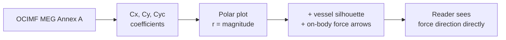

# Hand-off — Transfer OCIMF coefficient results from digitalmodel#616 to llm-wiki

> **Type**: agent-to-agent hand-off prompt
> **Date filed**: 2026-05-20
> **Filed by**: claude main session (vamsee)
> **Target executor**: any provider (Claude / Codex / Hermes / Gemini) — prompt is self-contained
> **Source work**: [digitalmodel#616](https://github.com/vamseeachanta/digitalmodel/issues/616) (CLOSED, status:plan-approved)
> **Downstream consumer**: [workspace-hub#2760](https://github.com/vamseeachanta/workspace-hub/issues/2760) (OPEN, B1528 SIROCCO review)

---

## Goal

Promote the OCIMF coefficient methodology + reusable polar-plot capability
delivered by [digitalmodel#616](https://github.com/vamseeachanta/digitalmodel/issues/616)
into the llm-wiki ecosystem, so future projects (SIROCCO and beyond) can
retrieve the canonical OCIMF reference and convention authority from the
wiki instead of re-discovering them per project.

This hand-off does NOT cover SIROCCO project-specific calc results — those
stay in the client-private surface and are governed by
[workspace-hub#2760](https://github.com/vamseeachanta/workspace-hub/issues/2760).
This hand-off is the **methodology and reference-data promotion** only.

---

## What was delivered in digitalmodel#616

**Module**: `src/digitalmodel/marine_ops/marine_engineering/visualization/polar_force_overlay.py`
- Reusable polar-plot function accepting `(theta_deg, fx, fy, fz, mx, my, mz)` DataFrames
- Vessel silhouette overlay (tanker / gas-carrier / generic-hull, bow-up convention)
- On-body force-vector arrows in vessel-body frame
- `OCIMF_CONVENTION_AUTHORITY` constant in `_convention.py` citing OCIMF MEG3/MEG4 Annex A

**Refactored consumer**: `scripts/python/digitalmodel/ocimf/build_coefficient_explorer.py`
- Now delegates to `polar_force_overlay()` instead of inline rendering
- Output HTML: `docs/domains/charts/phase2/ocimf/ocimf_coefficient_explorer.html`

**Tests**: `tests/marine_ops/marine_engineering/environmental_loading/test_ocimf.py`,
`test_ocimf_mooring_integration.py`

**Reused**: `src/digitalmodel/hydrodynamics/hull_library/profile_schema.py` (`HullProfile`)

**Explicit no-client-identifier constraint** (acceptance criterion #9):
The module code and tests carry NO B1528 / SIROCCO / acma-projects references.
Client-side application stays caller-side. Verified by legal-sanity scan.

---

## Routing decision — public vs private wiki

| Artifact | Target wiki | Rationale |
|---|---|---|
| OCIMF MEG3/MEG4 Annex A convention citations | **public** `llm-wiki/wikis/naval-architecture/standards/ocimf-meg.md` | OCIMF MEG is a publicly-purchasable industry standard; the convention text is referenced (not reproduced) |
| OCIMF coefficient methodology (polar-plot interpretation, sign convention) | **public** `llm-wiki/wikis/naval-architecture/methodology/ocimf-coefficient-interpretation.md` | Generic methodology, no client data |
| Reusable polar-plot capability (algorithm + parameter shape) | **public** `llm-wiki/wikis/naval-architecture/methodology/polar-force-overlay-visualization.md` | Module is open in digitalmodel; methodology is reusable |
| Generic vessel-silhouette convention (tanker / gas-carrier / generic-hull, bow-up) | **public** `llm-wiki/wikis/naval-architecture/concepts/vessel-silhouette-convention.md` | No client tie |
| B1528 SIROCCO-specific calc results (rudder angle ±5° X/Y/Z/K/M/N envelopes) | **PRIVATE** llm-wiki-sirocco (or whichever private wiki is the SIROCCO target) | Client + project specific |
| OCIMF coefficient explorer HTML (no client overlay) | **public** as a screenshot reference in the methodology page; do NOT promote the live HTML | Avoid bundling generated artifacts in wiki |

### Abstraction gate decision

Per `research/llm-wiki-public-private-routing` skill (Skill D):

- **OCIMF MEG3/MEG4** is a public standard — no abstraction needed.
- **SIROCCO** is a client project name. Per the latest user rule (2026-05-20):
  > "Only client project names are to be abstracted. If project name is
  > available public, can be used in the llm-wiki public repo provided
  > all key data is publicly available."

  → SIROCCO must be ABSTRACTED for public-wiki content unless verified
  publicly available with all key data also public. **Verify before
  promoting any SIROCCO-referenced content to public wiki**. If unclear,
  file as candidate per [workspace-hub#2374](https://github.com/vamseeachanta/workspace-hub/issues/2374)
  and defer to user.

- **B1528** is a client project code — abstract by default in public content.

If you encounter a SIROCCO / B1528 / acma reference in source material
during this hand-off, STOP and confirm routing with the user. Do not
guess.

---

## Skills to apply (all four on disk in `.claude/skills/research/`)

1. **`llm-wiki-public-private-routing`** (Skill D) — clear the abstraction gate before any public commit.
   - Walk the decision tree in `references/abstraction-decision-tree.md` for SIROCCO / B1528 references
   - For OCIMF / MEG content: gate clears as `not-applicable-public-standard-only`
   - Record verdict in commit message: `abstraction: <verdict>`

2. **`llm-wiki-page-shape-contract`** (Skill A) — the binding contract on page shape.
   - Length ceilings: concept 400–1200; standards 300–1200; methodology 400–1200; entity 200–500; summary 150–400
   - Mermaid for any diagram (banned: ASCII art); KaTeX for formulas
   - Divide-and-conquer split at 1200 words
   - Rule 7: input/output split — `sources/` holds raw, compiled pages live in `concepts/ entities/ summaries/ standards/ methodology/`
   - Rule 8: abstraction gate for public wiki — defer to Skill D logic above
   - Required frontmatter (with standards-page extras: `code_id`, `publisher`, `revision`)
   - Cascade-update rule: one source touches 5–15 pages — scan adjacent domain pages

3. **`llm-wiki-source-extraction-coverage`** (Skill C) — extraction with measurable yield.
   - For OCIMF MEG3/MEG4 source (PDF): compute `extraction_estimate` BEFORE extracting (`pdfinfo` + `pdffonts`)
   - Run `pdftotext -layout`; fallback to PyMuPDF where pdftotext returns 0 chars; OCR via tesseract `--psm 6` for scanned pages
   - Record `extraction_yield`, `extraction_yield_method`, `extraction_yield_lost`
   - Anchor format for citations: `[[sources/ocimf-meg3]]:p<page>:¶<paragraph>`
   - If yield < 0.50: defer ingest; note in domain `CLAUDE.md` Open Questions
   - For the polar-plot capability content (already in digitalmodel as code): yield = 1.0 implicit; extract from `polar_force_overlay.py` docstring + module docstring

4. **`llm-wiki-audit-feedback-loop`** (Skill B) — file an audit if anything looks wrong.
   - When promoting OCIMF MEG citations, if the section/edition/revision
     differs from what `digitalmodel/src/digitalmodel/marine_ops/.../visualization/_convention.py:OCIMF_CONVENTION_AUTHORITY`
     says: file an audit, do NOT silently overwrite
   - Audit path: `wikis/naval-architecture/audit/<YYYYMMDD-HHMMSS-slug>.md`

---

## Step-by-step execution plan

### Step 1 — Verify environment and parallel work (must-fire rules)

```bash
# Parallel-work scan (per feedback_check_parallel_work)
ls ~/.hermes/sessions 2>/dev/null | head
ps aux | grep -iE "llm-wiki|ocimf|sirocco" | grep -v grep

# Confirm llm-wiki repo location and dirty state
cd /mnt/local-analysis/llm-wiki
git status --short
git log --oneline -5

# Confirm naval-architecture domain exists
ls wikis/naval-architecture/
```

Abort and re-plan if another session is touching naval-architecture or
OCIMF content.

### Step 2 — Extract OCIMF MEG references from digitalmodel#616 deliverables

The polar-plot module cites a specific OCIMF MEG section in
`_convention.py:OCIMF_CONVENTION_AUTHORITY`. Read this constant exactly
as-is and use it as the source-of-truth for the standards page.

```bash
# From digitalmodel checkout
cd /mnt/local-analysis/digitalmodel  # path may vary; confirm via `find /mnt/local-analysis -maxdepth 2 -name digitalmodel`

# Extract the convention authority constant
grep -rA 20 "OCIMF_CONVENTION_AUTHORITY" src/digitalmodel/marine_ops/marine_engineering/visualization/

# Extract the module-level docstring of polar_force_overlay
sed -n '1,80p' src/digitalmodel/marine_ops/marine_engineering/visualization/polar_force_overlay.py

# Check what OCIMF MEG section is cited (MEG3 / MEG4 / Annex A specifics)
grep -rn "MEG3\|MEG4\|Annex A" src/digitalmodel/marine_ops/marine_engineering/visualization/ | head -20
```

**Do NOT** reproduce OCIMF MEG text in the wiki. Cite section + edition.
Per `feedback_silent_verdict_flip_defect_class`, the standards-page
frontmatter MUST include both `code_id` and `revision` (which MEG edition).

### Step 3 — Decide whether OCIMF MEG3 vs MEG4 is the canonical citation

If `OCIMF_CONVENTION_AUTHORITY` cites both MEG3 and MEG4: write the
standards page for the latest edition (MEG4) and include an
`## Edition history` section documenting the MEG3 → MEG4 change. If
unclear: file an audit per Skill B and defer to user.

### Step 4 — Create the standards page (PUBLIC llm-wiki)

Target: `wikis/naval-architecture/standards/ocimf-meg.md`

Frontmatter (per `references/page-templates.md` standards template):

```yaml
---
title: OCIMF MEG — Mooring Equipment Guidelines
type: standards
code_id: OCIMF-MEG
publisher: OCIMF
revision: <MEG3-2008 or MEG4-2018 — confirm via digitalmodel _convention.py>
created: 2026-05-20
updated: 2026-05-20
sources: [sources/ocimf-meg-annex-a]    # if extracting from MEG PDF
tags: [standard, ocimf, mooring, environmental-loading, naval-architecture]
---
```

Body sections (per `references/page-templates.md`):

- **Scope** — what OCIMF MEG covers (mooring equipment design, environmental loading coefficient framework)
- **Key requirements → Annex A** — convention for incidence heading vs force direction; sign convention for `Cx, Cy, Cyc, Cxw, Cyw`
- **Edition history** — MEG3 (2008) → MEG4 (2018) deltas if known
- **Citing this standard** — link back to `digitalmodel/.../_convention.py:OCIMF_CONVENTION_AUTHORITY`
- **Sources** — wikilink to `sources/ocimf-meg-annex-a` (if MEG PDF is ingestable) OR a ref pointer if too large

Length budget: 300–1200 words. If you bump 1200, split per Rule 1.

### Step 5 — Create the methodology page for OCIMF coefficient interpretation

Target: `wikis/naval-architecture/methodology/ocimf-coefficient-interpretation.md`

Covers:
- How to read OCIMF coefficient values from the explorer (`r = |C|`, sign as line style)
- Why polar-plot with on-body force arrows resolves the cognitive-inversion problem
- Sign convention chained back to `[[standards/ocimf-meg]]:Annex-A`
- Reference to the polar-plot visualization methodology

Mermaid diagram showing the coefficient → force-arrow data flow:



### Step 6 — Create the polar-plot visualization methodology page

Target: `wikis/naval-architecture/methodology/polar-force-overlay-visualization.md`

Covers:
- Generic algorithm (parameters, frame conventions, force-arrow rendering)
- When to use `LATERAL_ONLY` vs `LONGITUDINAL_ONLY` vs `RESULTANT_2D`
- `MAGNITUDE` vs `SIGNED` radial-axis modes
- Reference implementation: `digitalmodel/.../polar_force_overlay.py`

This page is NOT OCIMF-specific. It's the reusable methodology that
SIROCCO and future consumers also use.

### Step 7 — Create the vessel silhouette concept page

Target: `wikis/naval-architecture/concepts/vessel-silhouette-convention.md`

Covers: bow-up convention, three default silhouettes, transparent
alpha ≤ 0.3, radial-axis scaling. Cross-link to `[[methodology/polar-force-overlay-visualization]]`.

### Step 8 — Cascade-update domain index and log

```bash
# Update wikis/naval-architecture/index.md to list the four new pages
# Update wikis/naval-architecture/log/$(date +%Y%m%d).md:

cat >> wikis/naval-architecture/log/$(date +%Y%m%d).md <<EOF
## [$(date +%H:%M)] ingest | ocimf-meg + polar-force-overlay methodology
- New: standards/ocimf-meg.md
- New: methodology/ocimf-coefficient-interpretation.md
- New: methodology/polar-force-overlay-visualization.md
- New: concepts/vessel-silhouette-convention.md
- Source: digitalmodel#616 (CLOSED, plan-approved)
EOF
```

### Step 9 — Lint pass

```bash
cd /mnt/local-analysis/workspace-hub
uv run scripts/knowledge/llm_wiki.py lint --wiki naval-architecture
```

Fix any reported issues. Re-run until clean.

### Step 10 — Verify legal sanity (must-fire rule)

```bash
cd /mnt/local-analysis/llm-wiki
# Spot-check: no B1528 / SIROCCO / acma references in the new public-wiki pages
grep -riE "b1528|sirocco|acma" wikis/naval-architecture/standards/ocimf-meg.md \
    wikis/naval-architecture/methodology/ocimf-coefficient-interpretation.md \
    wikis/naval-architecture/methodology/polar-force-overlay-visualization.md \
    wikis/naval-architecture/concepts/vessel-silhouette-convention.md

# Expected output: empty. If any match: STOP, route to private wiki instead.
```

### Step 11 — Commit (pathspec form per `feedback_multi_agent_commit_serialization`)

```bash
git add wikis/naval-architecture/standards/ocimf-meg.md \
        wikis/naval-architecture/methodology/ocimf-coefficient-interpretation.md \
        wikis/naval-architecture/methodology/polar-force-overlay-visualization.md \
        wikis/naval-architecture/concepts/vessel-silhouette-convention.md \
        wikis/naval-architecture/index.md \
        wikis/naval-architecture/log/$(date +%Y%m%d).md

git commit -m "$(cat <<'EOF'
wiki(naval-architecture): OCIMF MEG + polar-force-overlay methodology

Promotes the methodology and standards reference delivered by
digitalmodel#616 (CLOSED). Public-domain content only — no client/project
identifiers per Rule 8 abstraction gate. SIROCCO-specific calc results
stay in private surface per workspace-hub#2760.

abstraction: not-applicable-public-standard-only

Refs:
- digitalmodel#616 (source)
- workspace-hub#2760 (downstream consumer, stays private)
EOF
)" -- wikis/naval-architecture/standards/ocimf-meg.md \
     wikis/naval-architecture/methodology/ocimf-coefficient-interpretation.md \
     wikis/naval-architecture/methodology/polar-force-overlay-visualization.md \
     wikis/naval-architecture/concepts/vessel-silhouette-convention.md \
     wikis/naval-architecture/index.md \
     wikis/naval-architecture/log/$(date +%Y%m%d).md
```

### Step 12 — Post a closeout comment on digitalmodel#616 (must-fire rule)

```bash
gh issue comment 616 --repo vamseeachanta/digitalmodel --body "$(cat <<'EOF'
**Wiki promotion landed** — OCIMF MEG methodology + polar-force-overlay visualization promoted to public llm-wiki under `wikis/naval-architecture/`:

- [standards/ocimf-meg.md](https://github.com/vamseeachanta/llm-wiki/blob/main/wikis/naval-architecture/standards/ocimf-meg.md)
- [methodology/ocimf-coefficient-interpretation.md](https://github.com/vamseeachanta/llm-wiki/blob/main/wikis/naval-architecture/methodology/ocimf-coefficient-interpretation.md)
- [methodology/polar-force-overlay-visualization.md](https://github.com/vamseeachanta/llm-wiki/blob/main/wikis/naval-architecture/methodology/polar-force-overlay-visualization.md)
- [concepts/vessel-silhouette-convention.md](https://github.com/vamseeachanta/llm-wiki/blob/main/wikis/naval-architecture/concepts/vessel-silhouette-convention.md)

Client/project-specific content (B1528 SIROCCO) stays in private surface per [workspace-hub#2760](https://github.com/vamseeachanta/workspace-hub/issues/2760).

Skills applied:
- `research/llm-wiki-page-shape-contract` (Rules 1–8)
- `research/llm-wiki-source-extraction-coverage`
- `research/llm-wiki-audit-feedback-loop` (no audits filed)
EOF
)"
```

---

## Acceptance criteria

- [ ] Four new pages exist under `wikis/naval-architecture/` (standards, two methodology, one concept)
- [ ] Each page passes Skill A page-shape rules: length, Mermaid-only diagrams, KaTeX-only formulas, complete frontmatter
- [ ] Standards page carries `code_id: OCIMF-MEG` + `publisher: OCIMF` + `revision: <edition>` (per [#2471](https://github.com/vamseeachanta/workspace-hub/issues/2471))
- [ ] OCIMF MEG section/edition matches `digitalmodel/.../_convention.py:OCIMF_CONVENTION_AUTHORITY` verbatim
- [ ] `wikis/naval-architecture/index.md` lists the four new pages
- [ ] `wikis/naval-architecture/log/YYYYMMDD.md` has the ingest entry
- [ ] `llm_wiki.py lint --wiki naval-architecture` passes
- [ ] No `B1528` / `SIROCCO` / `acma` substring in any new public-wiki page
- [ ] Commit message uses pathspec form (per `feedback_multi_agent_commit_serialization`)
- [ ] Closeout comment posted on [digitalmodel#616](https://github.com/vamseeachanta/digitalmodel/issues/616)

---

## Open questions for user (do NOT proceed without resolution)

1. **MEG3 vs MEG4 canonical edition**: which revision does
   `_convention.py:OCIMF_CONVENTION_AUTHORITY` actually cite? Confirm
   before writing the `revision:` frontmatter field.
2. **SIROCCO public-status**: is the SIROCCO project name publicly
   disclosed (e.g., in operator press releases or regulatory filings)?
   If yes AND all key data referenced is public, SIROCCO can be named
   in public wiki per Rule 8 exception. If unclear: abstract.
3. **Private wiki target for SIROCCO follow-up**: which private repo —
   `llm-wiki-acma`, `llm-wiki-sirocco-operator`, or another? Required
   before any SIROCCO-specific content gets promoted.
4. **OCIMF MEG PDF ingestion**: do we hold an authoritative copy of MEG3
   or MEG4? If yes: ingest into `wikis/naval-architecture/sources/refs/`
   per Skill C ref-pointer pattern. If no: cite the standard without
   ingesting the source PDF.

---

## What this hand-off does NOT cover

- SIROCCO-specific calc results (governed by [workspace-hub#2760](https://github.com/vamseeachanta/workspace-hub/issues/2760))
- The companion fix concerning CYw=-3.56 out-of-envelope ([digitalmodel#556](https://github.com/vamseeachanta/digitalmodel/issues/556))
- OCIMFExcelAdapter ingestion ([digitalmodel#563](https://github.com/vamseeachanta/digitalmodel/issues/563))
- Resolving `marine_engineering/ocimf.py` vs `marine_analysis/ocimf.py` duplication ([workspace-hub#2768](https://github.com/vamseeachanta/workspace-hub/issues/2768))
- The B1528 SIROCCO downstream consumer hook (gated by [#2760](https://github.com/vamseeachanta/workspace-hub/issues/2760) approval)
- Per-claim cross-walk of every SIROCCO/B1528 reference in any source under acma-projects/ — out of scope; only the methodology promotion is covered here

---

## Provenance

- digitalmodel#616 body: title, scope, deliverables, acceptance criteria (CLOSED, status:plan-approved)
- workspace-hub#2760: SIROCCO downstream consumer (OPEN)
- Skills applied: see "Skills to apply" section above
- Routing rule: latest user directive 2026-05-20 — "only client project names are to be abstracted; if project name is available public AND all key data is publicly available, name can be used as-is"
- Hand-off prompt template basis: `feedback_hermes_active_preflight_check`, `feedback_check_parallel_work`, `feedback_multi_agent_commit_serialization`, `feedback_gh_issue_comment`, `feedback_inline_gh_issue_url`
