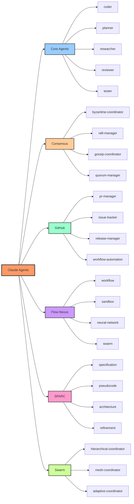
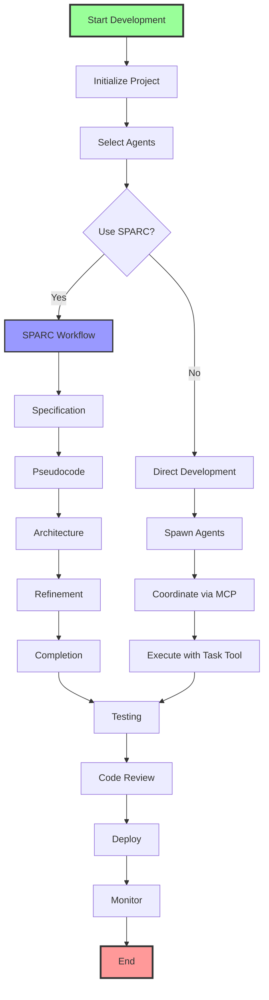
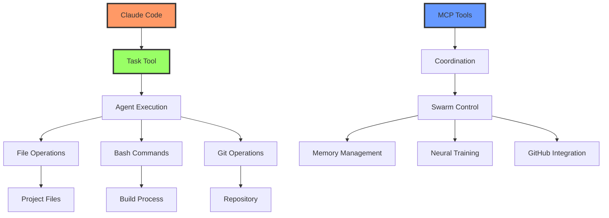

# Workspace Hub File Structure

## Overview
This document provides a visual representation of the workspace-hub directory structure using Mermaid diagrams.

## Directory Structure Diagram

```mermaid
graph TB
    WH[workspace-hub/]

    WH --> CONF["📁 Configuration<br/>────────────<br/>.agent-os/<br/>.claude/<br/>.claude-flow/<br/>CLAUDE.md"]

    WH --> PROJ["🚀 Projects<br/>────────────<br/>aceengineer-admin/<br/>aceengineercode/<br/>aceengineer-website/<br/>achantas-data/<br/>achantas-media/<br/>acma-projects/<br/>client_projects/<br/>frontierdeepwater/<br/>OGManufacturing/"]

    WH --> UTIL["🛠️ Utilities<br/>────────────<br/>assethold/<br/>assetutilities/<br/>coordination/<br/>monitoring-dashboard/<br/>pyproject-starter/"]

    WH --> AIML["🤖 AI/ML<br/>────────────<br/>ai-native-traditional-eng/<br/>digitalmodel/<br/>doris/<br/>energy/<br/>investments/"]

    WH --> BUILD["📦 Build/System<br/>────────────<br/>dist/<br/>docker/<br/>docs/<br/>examples/<br/>node_modules/<br/>coverage/<br/>memory/<br/>modules/<br/>src/<br/>tests/"]

    style WH fill:#f9f,stroke:#333,stroke-width:4px
    style CONF fill:#bbf,stroke:#333,stroke-width:2px
    style PROJ fill:#bfb,stroke:#333,stroke-width:2px
    style UTIL fill:#fbf,stroke:#333,stroke-width:2px
    style AIML fill:#ffb,stroke:#333,stroke-width:2px
    style BUILD fill:#bff,stroke:#333,stroke-width:2px
```

## Expanded Directory Tree

```mermaid
graph TB
    ROOT["/"]

    ROOT --> C1[📁 .agent-os/]
    C1 --> C1A["• commands/<br/>• resources/<br/>• specs/"]

    ROOT --> C2[📁 .claude/]
    C2 --> C2A["• agents/<br/>• checkpoints/<br/>• commands/<br/>• helpers/"]

    ROOT --> P1[🚀 ACE Engineer]
    P1 --> P1A["• aceengineer-admin/<br/>• aceengineercode/<br/>• aceengineer-website/"]

    ROOT --> P2[🚀 Achantas]
    P2 --> P2A["• achantas-data/<br/>• achantas-media/"]

    ROOT --> P3[🚀 Other Projects]
    P3 --> P3A["• acma-projects/<br/>• client_projects/<br/>• frontierdeepwater/<br/>• OGManufacturing/"]

    ROOT --> U1[🛠️ Assets]
    U1 --> U1A["• assethold/<br/>• assetutilities/"]

    ROOT --> U2[🛠️ Dev Tools]
    U2 --> U2A["• coordination/<br/>• monitoring-dashboard/<br/>• pyproject-starter/"]

    ROOT --> A1[🤖 AI Projects]
    A1 --> A1A["• ai-native-traditional-eng/<br/>• digitalmodel/<br/>• doris/"]

    ROOT --> A2[📊 Domain]
    A2 --> A2A["• energy/<br/>• investments/<br/>• hobbies/"]

    ROOT --> B1[📦 Build]
    B1 --> B1A["• dist/<br/>• node_modules/<br/>• coverage/"]

    ROOT --> B2[📄 Docs/Support]
    B2 --> B2A["• docs/<br/>• examples/<br/>• docker/<br/>• memory/<br/>• modules/<br/>• src/<br/>• tests/"]

    style ROOT fill:#f96,stroke:#333,stroke-width:3px
```

## Detailed Configuration Structure

```mermaid
graph TB
    CONFIG[📁 Configuration Files]

    CONFIG --> AGOS[.agent-os/]
    CONFIG --> CLAUDE[.claude/]

    AGOS --> AOSUB[Agent OS]
    AOSUB --> AOCMD[commands/]
    AOSUB --> AORES[resources/]
    AOSUB --> AOSPEC[specs/]

    CLAUDE --> CLSUB[Claude Structure]
    CLSUB --> AGENTS[agents/]
    CLSUB --> CHECK[checkpoints/]
    CLSUB --> CLCMD[commands/]
    CLSUB --> HELP[helpers/]

    AGENTS --> AGTYPES[Agent Types]
    AGTYPES --> AGCORE["✅ core/<br/>• coder<br/>• planner<br/>• researcher<br/>• reviewer<br/>• tester"]
    AGTYPES --> AGCON["🔗 consensus/<br/>• byzantine<br/>• raft<br/>• gossip<br/>• quorum"]
    AGTYPES --> AGGH["📦 github/<br/>• pr-manager<br/>• issue-tracker<br/>• release-manager"]
    AGTYPES --> AGFN["☁️ flow-nexus/<br/>• workflow<br/>• sandbox<br/>• neural<br/>• swarm"]
    AGTYPES --> AGSPARC["📐 sparc/<br/>• specification<br/>• pseudocode<br/>• architecture<br/>• refinement"]

    style CONFIG fill:#f96,stroke:#333,stroke-width:3px
    style AGTYPES fill:#9cf,stroke:#333,stroke-width:2px
```

## Key Directory Purposes

### 📁 Configuration Directories
- **`.agent-os/`**: Agent OS configuration and specifications
- **`.claude/`**: Claude Code agent definitions and helpers
- **`.claude-flow/`**: Claude Flow orchestration settings
- **`CLAUDE.md`**: Main Claude configuration file

### 🚀 Project Directories
- **`aceengineer-*`**: ACE Engineer related projects (admin, code, website)
- **`achantas-*`**: Achantas data and media projects
- **`acma-projects/`**: ACMA project collection
- **`client_projects/`**: Client-specific projects
- **`frontierdeepwater/`**: Frontier deepwater project
- **`OGManufacturing/`**: Oil & Gas manufacturing

### 🛠️ Utility Directories
- **`assethold/`, `assetutilities/`**: Asset management utilities
- **`coordination/`**: Project coordination tools
- **`monitoring-dashboard/`**: System monitoring
- **`pyproject-starter/`**: Python project templates

### 🤖 AI/ML Directories
- **`ai-native-traditional-eng/`**: AI native engineering
- **`digitalmodel/`**: Digital modeling projects
- **`doris/`**: Doris AI system

### 📊 Domain-Specific
- **`energy/`**: Energy sector projects
- **`investments/`**: Investment tracking
- **`hobbies/`**: Personal hobby projects

### 📦 Build/System
- **`dist/`**: Distribution builds
- **`docker/`**: Docker configurations
- **`docs/`**: Documentation
- **`examples/`**: Code examples
- **`node_modules/`**: Node dependencies
- **`coverage/`**: Test coverage reports
- **`memory/`**: Memory storage
- **`modules/`**: Project modules

## Agent Hierarchy

## Development Workflow

## Key Integration Points

## Notes

- **Workspace Hub** serves as a centralized development environment
- **Agent OS** provides the framework for agent-based development
- **Claude Flow** handles orchestration and coordination
- **SPARC methodology** ensures systematic development
- Projects are organized by domain and purpose
- Configuration files control agent behavior and workflows

This structure enables:
1. **Parallel Development**: Multiple projects can be worked on simultaneously
2. **Agent Coordination**: Different agents handle specific aspects
3. **Systematic Approach**: SPARC ensures thorough planning and execution
4. **Scalability**: Easy to add new projects and agents
5. **Maintainability**: Clear organization and separation of concerns