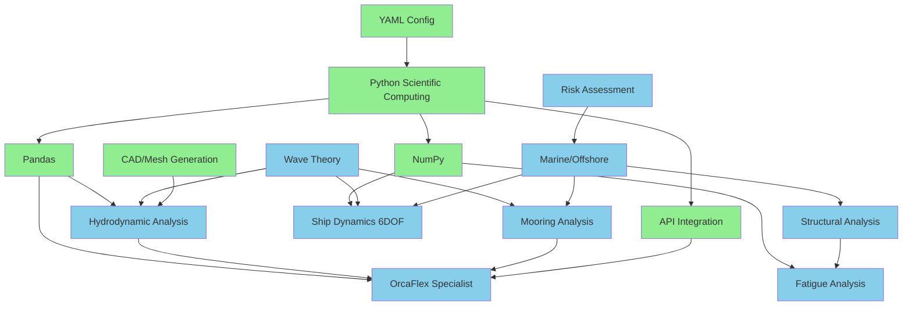

# Digitalmodel Skills Library

> Comprehensive skill library for marine and offshore engineering with digitalmodel repository

**Version:** 1.0.0
**Created:** 2026-01-06
**Total Skills:** 16 (7 Programming + 9 SME)

## Overview

This skills library provides expert knowledge and code examples for the digitalmodel repository, covering:

- **Programming Skills** (7): Python, data analysis, API integration, CAD/mesh generation
- **Subject Matter Expert (SME) Skills** (9): Marine engineering, structural analysis, hydrodynamics, offshore operations

Each skill follows the Anthropic skills format with:
- YAML frontmatter metadata
- When to use guidelines
- Core knowledge areas with code examples
- Complete working examples
- Best practices
- Resources and references

## Quick Reference

### Skill Selection Matrix

| Task | Recommended Skills | Priority |
|------|-------------------|----------|
| **Mooring analysis** | Mooring Analysis, OrcaFlex Specialist | 🔴 Critical |
| **Vessel dynamics** | Ship Dynamics (6DOF), Hydrodynamic Analysis | 🔴 Critical |
| **Fatigue calculations** | Fatigue Analysis, Wave Theory | 🔴 Critical |
| **Structural design** | Structural Analysis, Marine/Offshore Engineering | 🔴 Critical |
| **Wave analysis** | Wave Theory, Hydrodynamic Analysis | 🟠 High |
| **Production Optimization** | Production Engineering, Data Processing | 🟠 High |
| **Standards Compliance** | API/DNV/ISO/NORSOK Specialists | 🟠 High |
| **Risk assessment** | Risk Assessment | 🟠 High |
| **Simulation automation** | OrcaFlex Specialist, API Integration | 🟠 High |
| **Geometry creation** | CAD/Mesh Generation | 🟡 Medium |
| **Data processing** | Pandas, NumPy, Python Scientific Computing | 🟡 Medium |
| **Configuration** | YAML Configuration | 🟢 Low |

### Skill Dependencies



## Programming Skills

### 1. Python Scientific Computing
**Location:** `skills/programming/python-scientific-computing/SKILL.md`

**Core Capabilities:**
- NumPy array operations and vectorization
- SciPy scientific computing (optimization, integration, interpolation)
- Data visualization with Matplotlib
- File I/O and data formats
- Performance optimization

**When to Use:**
- Setting up analysis environment
- Scientific calculations and numerical methods
- Data visualization
- Performance-critical computations

**Key Functions:**
- `setup_scientific_environment()` - Environment setup
- `optimize_hydrodynamic_coefficients()` - Optimization example
- `integrate_motion_equations()` - Numerical integration

---

### 2. YAML Configuration Management
**Location:** `skills/programming/yaml-configuration/SKILL.md`

**Core Capabilities:**
- YAML file creation and parsing
- Schema validation with Pydantic
- Environment-specific configurations
- Complex data structures
- Configuration inheritance

**When to Use:**
- Managing analysis configurations
- Parameter sweeps and batch runs
- Environment-specific settings
- Configuration validation

**Key Functions:**
- `load_config()` - Load and validate YAML
- `ConfigModel` - Pydantic validation models
- `merge_configs()` - Configuration inheritance

---

### 3. Pandas Data Processing
**Location:** `skills/programming/pandas-data-processing/SKILL.md`

**Core Capabilities:**
- Time series analysis
- OrcaFlex results processing
- Data transformation and aggregation
- Statistical analysis
- Export to various formats

**When to Use:**
- Processing simulation results
- Time history analysis
- Data cleaning and transformation
- Statistical calculations

**Key Functions:**
- `load_orcaflex_time_series()` - Load OrcaFlex CSV
- `calculate_statistics()` - Statistical analysis
- `resample_time_series()` - Time series resampling

---

### 4. NumPy Numerical Analysis
**Location:** `skills/programming/numpy-numerical-analysis/SKILL.md`

**Core Capabilities:**
- Matrix operations and linear algebra
- FFT and spectral analysis
- 6DOF dynamics calculations
- Numerical methods
- Array broadcasting

**When to Use:**
- Matrix computations
- Frequency domain analysis
- 6DOF equation of motion
- Numerical algorithms

**Key Functions:**
- `solve_6dof_equation_of_motion()` - 6DOF dynamics
- `calculate_fft()` - Spectral analysis
- `newmark_beta_integration()` - Time integration

---

### 5. API Integration
**Location:** `skills/programming/api-integration/SKILL.md`

**Core Capabilities:**
- OrcaFlex Python API integration
- AQWA/WAMIT integration
- Mock testing without licenses
- Error handling and retry logic
- Batch processing automation

**When to Use:**
- Automating OrcaFlex/AQWA workflows
- Batch simulations
- Testing without software licenses
- API abstraction layers

**Key Functions:**
- `OrcaFlexWrapper` - OrcaFlex automation
- `MarineAnalysisAPI` - Abstract interface
- `retry_on_failure()` - Error handling decorator

---

### 6. CAD/Mesh Generation
**Location:** `skills/programming/cad-mesh-generation/SKILL.md`

**Core Capabilities:**
- FreeCAD Python scripting
- GMSH mesh generation
- Panel meshes for BEM
- Tetrahedral meshes for FEA
- Export to WAMIT, ANSYS, AQWA

**When to Use:**
- Creating parametric geometries
- Generating meshes for hydrodynamics
- FEA pre-processing
- Geometry export workflows

**Key Functions:**
- `create_cylinder_vessel()` - Vessel geometry
- `create_panel_mesh_cylinder()` - BEM mesh
- `convert_mesh_to_wamit_gdf()` - WAMIT export

---

## SME (Subject Matter Expert) Skills

### 7. Marine/Offshore Engineering
**Location:** `skills/sme/marine-offshore-engineering/SKILL.md`

**Core Capabilities:**
- Hydrostatic calculations
- Stability analysis (GZ curves, damaged stability)
- Marine coordinate systems
- Seakeeping fundamentals
- DNV/ABS/API standards

**When to Use:**
- Basic marine calculations
- Stability assessments
- Understanding marine principles
- Standards compliance

**Key Functions:**
- `calculate_hydrostatic_properties()` - Hydrostatics
- `calculate_gz_curve()` - Righting arm
- `assess_damaged_stability()` - Damage stability

---

### 8. Hydrodynamic Analysis
**Location:** `skills/sme/hydrodynamic-analysis/SKILL.md`

**Core Capabilities:**
- BEM (Boundary Element Method)
- RAO (Response Amplitude Operator) calculations
- Added mass and damping matrices
- Wave excitation forces
- Frequency domain analysis

**When to Use:**
- Vessel motion analysis
- RAO calculations
- Hydrodynamic coefficient processing
- Wave load predictions

**Key Functions:**
- `calculate_rao_from_hydrodynamic_coefficients()` - RAO
- `froude_krylov_force()` - FK forces
- `calculate_quadratic_transfer_function()` - QTF

---

### 9. Mooring Analysis
**Location:** `skills/sme/mooring-analysis/SKILL.md`

**Core Capabilities:**
- Catenary equations
- Quasi-static mooring analysis
- Mooring line stiffness
- Pretension optimization
- DNV-OS-E301 compliance

**When to Use:**
- Mooring system design
- Offset calculations
- Line tension analysis
- Mooring optimization

**Key Functions:**
- `catenary_solution()` - Catenary analysis
- `mooring_stiffness_matrix()` - System stiffness
- `optimize_mooring_pretension()` - Pretension optimization

---

### 10. Ship Dynamics (6DOF)
**Location:** `skills/sme/ship-dynamics-6dof/SKILL.md`

**Core Capabilities:**
- 6DOF equations of motion
- Mass and stiffness matrices
- Natural frequencies and damping
- Coupled motion analysis
- Seakeeping performance

**When to Use:**
- Vessel motion predictions
- Natural frequency calculations
- Coupled dynamics analysis
- Seakeeping assessments

**Key Functions:**
- `create_mass_matrix()` - 6x6 mass matrix
- `calculate_natural_frequencies()` - Modal analysis
- `solve_6dof_frequency_domain()` - Frequency response

---

### 11. Fatigue Analysis
**Location:** `skills/sme/fatigue-analysis/SKILL.md`

**Core Capabilities:**
- S-N curves (DNV standards)
- Rainflow cycle counting
- Palmgren-Miner damage rule
- Spectral fatigue methods
- Weld classifications

**When to Use:**
- Fatigue life calculations
- Cycle counting from time series
- Cumulative damage assessment
- Design verification

**Key Functions:**
- `rainflow_counting()` - Cycle counting
- `calculate_fatigue_damage()` - Damage calculation
- `spectral_fatigue_analysis()` - Frequency domain fatigue

---

### 12. Wave Theory
**Location:** `skills/sme/wave-theory/SKILL.md`

**Core Capabilities:**
- JONSWAP and PM spectra
- Airy wave theory
- Wave statistics (Rayleigh distribution)
- Irregular wave generation
- Extreme value analysis

**When to Use:**
- Wave environment modeling
- Spectral analysis
- Irregular sea generation
- Extreme wave predictions

**Key Functions:**
- `jonswap_spectrum()` - JONSWAP spectrum
- `airy_wave_properties()` - Linear wave theory
- `generate_irregular_wave_time_series()` - Wave generation

---

### 13. Structural Analysis
**Location:** `skills/sme/structural-analysis/SKILL.md`

**Core Capabilities:**
- Beam theory and section properties
- Stress analysis (combined loading)
- Column buckling (Euler, DNV)
- ULS/ALS limit state checks
- Tubular joint design

**When to Use:**
- Structural member design
- Stress calculations
- Buckling analysis
- Code compliance checks (DNV/API)

**Key Functions:**
- `circular_tube_properties()` - Section properties
- `calculate_stresses()` - Stress analysis
- `dnv_column_buckling_check()` - Buckling check

---

### 14. OrcaFlex Specialist
**Location:** `skills/sme/orcaflex-specialist/SKILL.md`

**Core Capabilities:**
- OrcaFlex Python API workflows
- Programmatic model creation
- Results extraction and post-processing
- Batch simulations
- Model validation

**When to Use:**
- OrcaFlex automation
- Parametric studies
- Batch analysis runs
- Custom post-processing

**Key Functions:**
- `create_vessel_model()` - Build models via API
- `extract_time_series()` - Extract results
- `batch_simulation()` - Automated batch runs

---

### 15. Risk Assessment
**Location:** `skills/sme/risk-assessment/SKILL.md`

**Core Capabilities:**
- Monte Carlo simulations
- Reliability analysis (FORM/SORM)
- Sensitivity analysis
- Risk matrices
- Extreme value analysis

**When to Use:**
- Probabilistic design
- Reliability calculations
- Uncertainty quantification
- Decision making under risk

**Key Functions:**
- `monte_carlo_simulation()` - MC simulation
- `calculate_reliability()` - Reliability index
- `sensitivity_analysis_correlation()` - Sensitivity

---

### 16. Production Engineering
**Location:** `skills/sme/production-engineering/SKILL.md`

**Core Capabilities:**
- Production surveillance & workshops
- EOR evaluations (Waterflood, CO2)
- Artificial lift (ESP, Jet Pump)
- Well integrity & "Lessons Learnt"

**When to Use:**
- Optimizing well performance
- Managing EOR projects
- Brownfield asset management
- Troubleshooting production issues

**Key Functions:**
- `calculate_vrr()` - Voidage Replacement Ratio
- `check_well_performance()` - Nodal analysis check

---

## Codes & Standards Skills

### 17. API Standards Specialist
**Location:** `skills/sme/standards/api/SKILL.md`
**Focus:** Oil & Gas equipment (Valves, Wellheads), Fixed Platforms.
**Key Docs:** API 6A, 17D, 2RD.

### 18. DNV Standards Specialist
**Location:** `skills/sme/standards/dnv/SKILL.md`
**Focus:** Marine classification, Offshore structures, Pipelines, Fatigue.
**Key Docs:** DNV-OS-C101, DNV-RP-C203 (Fatigue).

### 19. ISO Standards Specialist
**Location:** `skills/sme/standards/iso/SKILL.md`
**Focus:** International harmonization, Sour Service (Materials), Quality.
**Key Docs:** ISO 15156 (NACE), ISO 9001.

### 20. ASTM Standards Specialist
**Location:** `skills/sme/standards/astm/SKILL.md`
**Focus:** Material testing, steel grades, bolting.
**Key Docs:** ASTM A370, A193 B7.

### 21. NORSOK Standards Specialist
**Location:** `skills/sme/standards/norsok/SKILL.md`
**Focus:** North Sea safety, Well barriers, Coatings.
**Key Docs:** D-010 (Well Integrity), M-501 (Coatings).

---

## Integration Examples

### Example 1: Complete Mooring Analysis Workflow

```python
# Uses multiple skills together

from skills.programming.yaml_configuration import load_config
from skills.sme.wave_theory import jonswap_spectrum
from skills.sme.mooring_analysis import catenary_solution
from skills.sme.orcaflex_specialist import OrcaFlexWrapper
from skills.programming.pandas_data_processing import calculate_statistics

# 1. Load configuration (YAML skill)
config = load_config('mooring_analysis_config.yaml')

# 2. Generate wave spectrum (Wave Theory skill)
frequencies = np.linspace(0.05, 0.5, 100)
spectrum = jonswap_spectrum(
    frequencies,
    config['environment']['Hs'],
    config['environment']['Tp']
)

# 3. Initial mooring design (Mooring Analysis skill)
mooring = catenary_solution(
    water_depth=config['site']['water_depth'],
    line_length=config['mooring']['line_length'],
    weight_per_meter=config['mooring']['weight_per_meter'],
    horizontal_force=config['loads']['horizontal_force']
)

# 4. Run OrcaFlex simulation (OrcaFlex Specialist skill)
orcaflex = OrcaFlexWrapper(config['orcaflex'])
orcaflex.load_model()
orcaflex.run_dynamic_analysis()

# 5. Extract and analyze results (Pandas skill)
time, tension = orcaflex.extract_time_series('Mooring_1', 'Effective Tension')
stats = calculate_statistics(time, tension)

print(f"Max tension: {stats['max']:.1f} kN")
print(f"Mean tension: {stats['mean']:.1f} kN")
```

### Example 2: Fatigue Assessment with Risk Analysis

```python
# Combines Fatigue, Wave Theory, and Risk Assessment

from skills.sme.wave_theory import jonswap_spectrum
from skills.sme.fatigue_analysis import rainflow_counting, calculate_fatigue_damage
from skills.sme.risk_assessment import monte_carlo_simulation

# 1. Generate wave time series (Wave Theory)
wave_elevation = generate_irregular_wave_time_series(spectrum, frequencies, 3600, 0.1)

# 2. Calculate stress time series (would use OrcaFlex or analytical model)
stress_time_series = calculate_stress_from_wave(wave_elevation)

# 3. Rainflow counting (Fatigue Analysis)
cycles = rainflow_counting(stress_time_series)

# 4. Calculate fatigue damage (Fatigue Analysis)
damage = calculate_fatigue_damage(cycles['range'], cycles['counts'], sn_params)

# 5. Probabilistic fatigue life (Risk Assessment)
# Monte Carlo over wave statistics
def fatigue_model(samples):
    Hs = samples['Hs']
    Tp = samples['Tp']
    # Calculate damage for each sea state
    # (simplified)
    damage_rate = 0.001 * (Hs / 5.0)**3
    return damage_rate

mc_results = monte_carlo_simulation(
    model=fatigue_model,
    random_variables=[rv_Hs, rv_Tp],
    n_samples=10000
)

reliability = calculate_reliability(mc_results['output'], limit_state=1.0, mode='less_than')
print(f"Fatigue reliability: {reliability['reliability']:.6f}")
```

### Example 3: Complete Design Workflow

```python
# Full design workflow using most skills

# 1. Create geometry (CAD/Mesh Generation)
from skills.programming.cad_mesh_generation import create_cylinder_vessel, export_geometry

vessel_geometry = create_cylinder_vessel(
    diameter=20.0,
    length=150.0,
    wall_thickness=0.05
)
export_geometry(vessel_geometry, 'vessel.step')

# 2. Hydrodynamic analysis (Hydrodynamic Analysis + AQWA API)
from skills.sme.hydrodynamic_analysis import calculate_rao_from_hydrodynamic_coefficients

# Run AQWA (via API Integration skill)
# Extract hydrodynamic coefficients
rao = calculate_rao_from_hydrodynamic_coefficients(
    omega, mass_matrix, added_mass, damping, stiffness, wave_excitation
)

# 3. Mooring design (Mooring Analysis)
from skills.sme.mooring_analysis import design_mooring_system

mooring_config = design_mooring_system(
    vessel_displacement=150000,
    water_depth=1200,
    design_offset=50
)

# 4. Structural checks (Structural Analysis)
from skills.sme.structural_analysis import uls_combined_loading_check

uls_result = uls_combined_loading_check(
    axial_force, bending_moment_y, bending_moment_z, fy, section
)

# 5. Dynamic simulation (OrcaFlex Specialist)
from skills.sme.orcaflex_specialist import complete_mooring_analysis_workflow

simulation_results = complete_mooring_analysis_workflow(
    vessel_params, mooring_config, environment, design_criteria, output_dir
)

# 6. Risk assessment (Risk Assessment)
from skills.sme.risk_assessment import complete_mooring_risk_assessment

risk_results = complete_mooring_risk_assessment(
    design_parameters, environmental_parameters, n_simulations=10000
)

# 7. Fatigue life (Fatigue Analysis)
from skills.sme.fatigue_analysis import calculate_fatigue_life

fatigue_life = calculate_fatigue_life(
    stress_range_distribution, sn_params, design_life=25
)

print(f"Design complete!")
print(f"  Structural: {uls_result['status']}")
print(f"  Reliability: {risk_results['reliability']['reliability']:.6f}")
print(f"  Fatigue life: {fatigue_life:.1f} years")
```

## Skill Selection Guide

### By Analysis Type

**Static Analysis:**
- Marine/Offshore Engineering (hydrostatics, stability)
- Structural Analysis (strength checks)

**Dynamic Analysis:**
- Ship Dynamics (6DOF motion)
- Hydrodynamic Analysis (RAO, wave loads)
- Wave Theory (environment modeling)
- Mooring Analysis (mooring dynamics)

**Fatigue & Life:**
- Fatigue Analysis (S-N curves, damage)
- Wave Theory (long-term statistics)
- Risk Assessment (probabilistic life)

**Design & Optimization:**
- Mooring Analysis (optimization)
- Structural Analysis (sizing)
- Risk Assessment (reliability-based design)

**Automation:**
- OrcaFlex Specialist (simulation automation)
- API Integration (multi-tool workflows)
- YAML Configuration (parameter management)

### By Complexity Level

**Beginner:**
1. Python Scientific Computing
2. YAML Configuration
3. Marine/Offshore Engineering

**Intermediate:**
4. Pandas Data Processing
5. NumPy Numerical Analysis
6. Wave Theory
7. Mooring Analysis
8. Structural Analysis

**Advanced:**
9. Hydrodynamic Analysis
10. Ship Dynamics (6DOF)
11. Fatigue Analysis
12. OrcaFlex Specialist
13. API Integration
14. CAD/Mesh Generation
15. Risk Assessment

## Usage Tips

### 1. Start with Configuration
Always begin with YAML Configuration skill to set up analysis parameters properly.

### 2. Use Mock APIs for Development
API Integration skill provides mock APIs so you can develop without OrcaFlex/AQWA licenses.

### 3. Validate with Multiple Skills
Cross-check results using multiple skills (e.g., analytical mooring vs OrcaFlex).

### 4. Leverage Complete Examples
Each skill has 6+ complete examples - use these as templates for your analyses.

### 5. Follow Best Practices Sections
Every skill includes a "Best Practices" section with standards, conventions, and tips.

## Contributing

To add new skills:

1. Follow Anthropic skills format (see existing skills)
2. Include YAML frontmatter
3. Provide 6+ complete code examples
4. Add best practices section
5. Include resources and references
6. Update this README with new skill

## Version History

| Version | Date | Changes |
|---------|------|---------|
| 1.0.0 | 2026-01-06 | Initial release with 16 skills |

## License

Skills are part of the digitalmodel repository. Use in accordance with repository license.

---

**Ready to use all 16 skills for comprehensive marine and offshore engineering analysis! 🚀**
