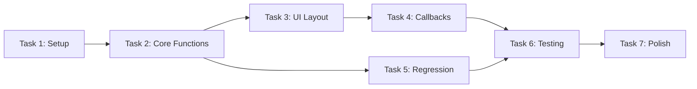

# Spec Tasks

These are the tasks to be completed for the spec detailed in @specs/modules/analysis/dca-interactive-dashboard/spec.md

> Created: 2025-08-14
> Status: Ready for Implementation
> Total Estimated Effort: 16 hours (2 days)

## Tasks

- [ ] 1. **Set up project structure and dependencies** `[2 hours]`
  - [ ] 1.1 Create dca_dashboard.py file in src/worldenergydata/dashboards/ `[15 min]`
  - [ ] 1.2 Add required dependencies to pyproject.toml (dash, plotly, scipy) `[15 min]`
  - [ ] 1.3 Create __init__.py for dashboards module `[10 min]`
  - [ ] 1.4 Write initial imports and app initialization code `[30 min]`
  - [ ] 1.5 Verify UV installs all dependencies correctly `[20 min]`
  - [ ] 1.6 Create basic test file structure `[30 min]`

- [ ] 2. **Implement core Arps equation functions** `[3 hours]`
  - [ ] 2.1 Write tests for Arps equation calculations `[45 min]`
  - [ ] 2.2 Implement arps_equation function for hyperbolic and exponential cases `[45 min]`
  - [ ] 2.3 Implement cumulative_production calculation function `[30 min]`
  - [ ] 2.4 Add parameter validation and bounds checking `[30 min]`
  - [ ] 2.5 Create sample data generation function `[20 min]`
  - [ ] 2.6 Verify all mathematical tests pass `[10 min]`

- [ ] 3. **Build Dash application layout** `[3 hours]`
  - [ ] 3.1 Create app layout with dark theme `[30 min]`
  - [ ] 3.2 Add file upload component with drag-and-drop `[30 min]`
  - [ ] 3.3 Create parameter sliders (qi, Di, b, forecast_years) `[45 min]`
  - [ ] 3.4 Add regression button and sample data button `[20 min]`
  - [ ] 3.5 Create plot area with proper styling `[30 min]`
  - [ ] 3.6 Add cumulative production display area `[15 min]`
  - [ ] 3.7 Implement responsive layout CSS `[30 min]`

- [ ] 4. **Implement interactive callbacks** `[3 hours]`
  - [ ] 4.1 Write callback for file upload and data parsing `[45 min]`
  - [ ] 4.2 Create callback for parameter slider updates `[45 min]`
  - [ ] 4.3 Implement plot generation and update logic `[45 min]`
  - [ ] 4.4 Add cumulative production calculation callback `[30 min]`
  - [ ] 4.5 Test real-time interactivity and performance `[15 min]`

- [ ] 5. **Add regression fitting functionality** `[2.5 hours]`
  - [ ] 5.1 Write tests for regression fitting `[30 min]`
  - [ ] 5.2 Implement scipy.optimize.curve_fit integration `[45 min]`
  - [ ] 5.3 Create callback for regression button `[20 min]`
  - [ ] 5.4 Add logic to update sliders with fitted values `[20 min]`
  - [ ] 5.5 Implement error handling for non-convergence `[20 min]`
  - [ ] 5.6 Verify regression tests pass `[15 min]`

- [ ] 6. **Testing and documentation** `[2 hours]`
  - [ ] 6.1 Run full test suite and fix any failures `[20 min]`
  - [ ] 6.2 Manual testing of all UI interactions `[30 min]`
  - [ ] 6.3 Performance testing with various data sizes `[20 min]`
  - [ ] 6.4 Create usage documentation in module docstring `[20 min]`
  - [ ] 6.5 Add example CSV file in data/examples/ `[10 min]`
  - [ ] 6.6 Update main README with dashboard feature `[10 min]`
  - [ ] 6.7 Verify all tests pass `[10 min]`

- [ ] 7. **Polish and finalization** `[1.5 hours]`
  - [ ] 7.1 Optimize callback performance if needed `[20 min]`
  - [ ] 7.2 Improve error messages and user feedback `[20 min]`
  - [ ] 7.3 Add input validation and sanitization `[20 min]`
  - [ ] 7.4 Review code style with black and ruff `[10 min]`
  - [ ] 7.5 Create standalone script for easy execution `[10 min]`
  - [ ] 7.6 Final testing of complete workflow `[10 min]`

## Task Dependencies

## Effort Summary

| Task | Estimated Time | Priority |
|------|---------------|----------|
| 1. Project Setup | 2.0 hours | High |
| 2. Core Functions | 3.0 hours | Critical |
| 3. UI Layout | 3.0 hours | High |
| 4. Callbacks | 3.0 hours | Critical |
| 5. Regression | 2.5 hours | High |
| 6. Testing | 2.0 hours | High |
| 7. Polish | 1.5 hours | Medium |
| **Total** | **17.0 hours** | - |

## Implementation Notes

### Development Strategy
- Focus on single-file implementation for ease of use
- Prioritize real-time interactivity over complex features
- Ensure the "13 seconds to create" philosophy is demonstrated
- Keep the interface intuitive for non-technical users
- Test with real production data formats from BSEE

### Critical Path
1. Core mathematical functions (Task 2) - Foundation for everything
2. Interactive callbacks (Task 4) - Defines user experience
3. Regression fitting (Task 5) - Key differentiator feature

## Success Metrics

| Metric | Target | Validation Method |
|--------|--------|------------------|
| Application launch time | &lt; 3 seconds | Stopwatch test |
| Slider update latency | &lt; 100ms | Performance profiler |
| Regression convergence | &gt; 95% success | Test suite |
| Cumulative accuracy | ± 0.1% | Manual calculation |
| CSV compatibility | 100% | BSEE sample data |

## Risk Mitigation

| Risk | Impact | Mitigation Strategy |
|------|--------|--------------------|
| Performance issues | High | Implement data decimation |
| Regression failures | Medium | Provide manual overrides |
| Data format issues | Low | Flexible CSV parser |
| Browser compatibility | Low | Test multiple browsers |