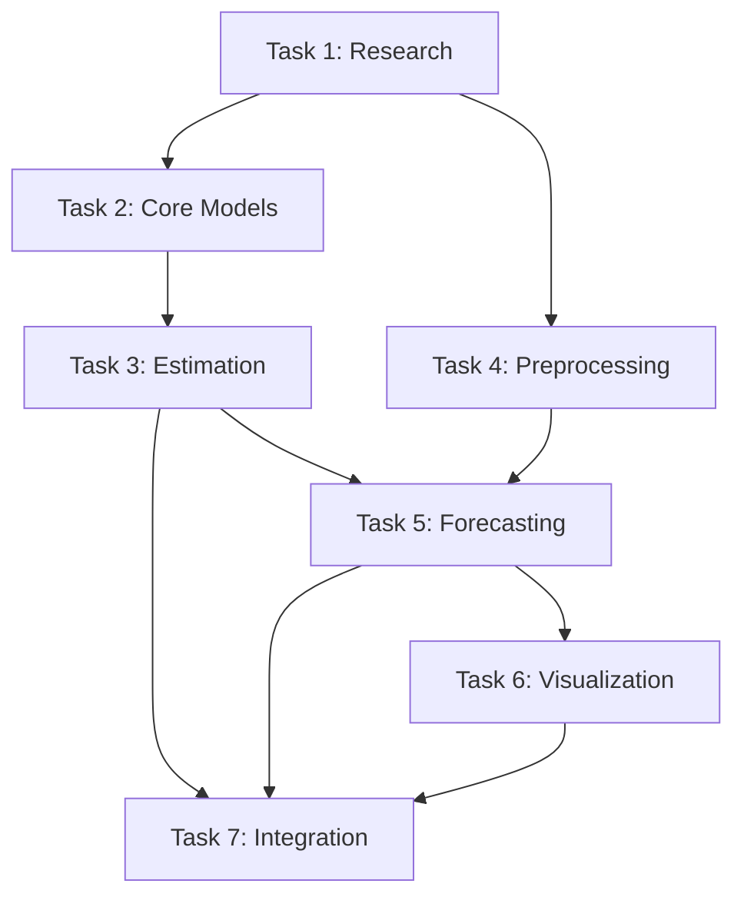

# Spec Tasks

These are the tasks to be completed for the spec detailed in @specs/modules/analysis/decline-curve-analysis/spec.md

> Created: 2025-07-25
> Status: Ready for Implementation
> Total Estimated Effort: 24 hours (3 days)

## Tasks

- [ ] 1. **Research and Design Decline Curve Models** `[3 hours]`
  - [ ] 1.1 Research Arps' decline equations and implementation best practices `[45 min]`
  - [ ] 1.2 Design DeclineCurveAnalyzer class structure and interfaces `[45 min]`
  - [ ] 1.3 Define parameter constraints and validation rules `[30 min]`
  - [ ] 1.4 Document mathematical formulations and assumptions `[30 min]`
  - [ ] 1.5 Review SPE benchmark problems for validation `[30 min]`

- [ ] 2. **Implement Core Decline Curve Models** `[4 hours]`
  - [ ] 2.1 Write tests for exponential decline model `[30 min]`
  - [ ] 2.2 Implement exponential decline equation and fitting `[40 min]`
  - [ ] 2.3 Write tests for hyperbolic decline model `[30 min]`
  - [ ] 2.4 Implement hyperbolic decline equation and fitting `[40 min]`
  - [ ] 2.5 Write tests for harmonic decline model `[30 min]`
  - [ ] 2.6 Implement harmonic decline equation and fitting `[40 min]`
  - [ ] 2.7 Verify all model tests pass `[30 min]`

- [ ] 3. **Build Parameter Estimation Engine** `[5 hours]`
  - [ ] 3.1 Write tests for parameter estimation with synthetic data `[45 min]`
  - [ ] 3.2 Implement initial parameter guess algorithms `[60 min]`
  - [ ] 3.3 Create optimization wrapper using scipy.optimize `[45 min]`
  - [ ] 3.4 Add parameter bounds and constraints handling `[30 min]`
  - [ ] 3.5 Implement goodness-of-fit metrics (R², RMSE, AIC) `[45 min]`
  - [ ] 3.6 Add model selection logic based on statistical criteria `[45 min]`
  - [ ] 3.7 Verify all parameter estimation tests pass `[30 min]`

- [ ] 4. **Develop Data Preprocessing Module** `[4 hours]`
  - [ ] 4.1 Write tests for outlier detection `[30 min]`
  - [ ] 4.2 Implement outlier detection using IQR method `[40 min]`
  - [ ] 4.3 Write tests for missing data handling `[30 min]`
  - [ ] 4.4 Implement data interpolation for gaps `[40 min]`
  - [ ] 4.5 Add workover/intervention period detection `[45 min]`
  - [ ] 4.6 Create data validation and quality checks `[30 min]`
  - [ ] 4.7 Verify all preprocessing tests pass `[25 min]`

- [ ] 5. **Create Production Forecasting Module** `[4 hours]`
  - [ ] 5.1 Write tests for production forecasting `[30 min]`
  - [ ] 5.2 Implement forward production projection `[45 min]`
  - [ ] 5.3 Add cumulative production calculations `[30 min]`
  - [ ] 5.4 Implement EUR estimation with economic limits `[45 min]`
  - [ ] 5.5 Add uncertainty quantification for forecasts `[40 min]`
  - [ ] 5.6 Create forecast validation against actuals `[30 min]`
  - [ ] 5.7 Verify all forecasting tests pass `[20 min]`

- [ ] 6. **Build Visualization Components** `[3 hours]`
  - [ ] 6.1 Write tests for plot generation `[20 min]`
  - [ ] 6.2 Create decline curve plots (rate vs time) `[40 min]`
  - [ ] 6.3 Implement diagnostic plots (log-rate, rate-cumulative) `[40 min]`
  - [ ] 6.4 Add forecast visualization with uncertainty bands `[30 min]`
  - [ ] 6.5 Create comparison plots for multiple models `[30 min]`
  - [ ] 6.6 Verify all visualization tests pass `[20 min]`

- [ ] 7. **Integration and Documentation** `[3 hours]`
  - [ ] 7.1 Write integration tests for complete workflow `[30 min]`
  - [ ] 7.2 Integrate perform_decline_analysis_api12 in ProductionAPI12Analysis `[40 min]`
  - [ ] 7.3 Add configuration parameters to YAML schema `[20 min]`
  - [ ] 7.4 Create user documentation with examples `[30 min]`
  - [ ] 7.5 Add API documentation for all public methods `[30 min]`
  - [ ] 7.6 Verify all integration tests pass `[15 min]`
  - [ ] 7.7 Perform end-to-end testing with real BSEE data `[15 min]`

## Task Dependencies

## Effort Summary

| Task | Estimated Time | Priority |
|------|---------------|----------|
| 1. Research &amp; Design | 3.0 hours | Critical |
| 2. Core Models | 4.0 hours | Critical |
| 3. Parameter Estimation | 5.0 hours | Critical |
| 4. Data Preprocessing | 4.0 hours | High |
| 5. Production Forecasting | 4.0 hours | High |
| 6. Visualization | 3.0 hours | Medium |
| 7. Integration | 3.0 hours | High |
| **Total** | **26.0 hours** | - |

## Implementation Strategy

### Development Approach
- **Test-Driven Development**: Write tests before implementation
- **Modular Design**: Separate concerns for maintainability
- **Performance Focus**: Optimize for large datasets
- **Documentation First**: Clear API documentation

### Critical Path
1. Mathematical models (Task 2) - Foundation for everything
2. Parameter estimation (Task 3) - Core value proposition
3. Production forecasting (Task 5) - Key deliverable
4. Integration (Task 7) - User-facing functionality

## Success Metrics

| Metric | Target | Validation Method |
|--------|--------|------------------|
| Model Accuracy | R² &gt; 0.95 | Synthetic data tests |
| Convergence Rate | &gt; 95% | Parameter estimation tests |
| Processing Speed | &lt; 1 sec | Performance benchmarks |
| EUR Accuracy | ± 10% | Commercial software comparison |
| Test Coverage | &gt; 90% | Coverage report |

## Risk Mitigation

| Risk | Impact | Mitigation Strategy |
|------|--------|--------------------|
| Non-convergence | High | Smart initial guesses |
| Poor data quality | High | Robust preprocessing |
| Performance issues | Medium | Caching and optimization |
| Integration complexity | Low | Clear interfaces |

## Quality Assurance

### Testing Strategy
- **Unit Tests**: Each mathematical function
- **Integration Tests**: Complete workflows
- **Performance Tests**: Large dataset handling
- **Validation Tests**: SPE benchmarks

### Documentation Requirements
- **API Documentation**: All public methods
- **User Guide**: Step-by-step examples
- **Mathematical Reference**: Equation derivations
- **Integration Guide**: YAML configuration