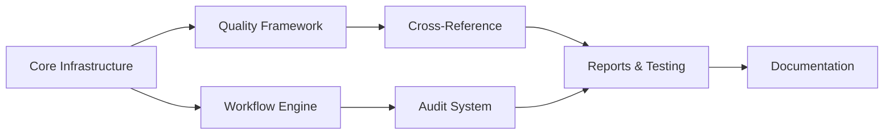

# Spec Tasks

These are the tasks to be completed for the spec detailed in @specs/modules/analysis/well-data-verification/spec.md

> Created: 2025-01-13
> Last Updated: 2025-01-09
> Status: Ready for Implementation (Revised)
> Module: Analysis
> Total Tasks: 50 subtasks across 7 main tasks
> Estimated Effort: 31-39 hours (includes comprehensive documentation)

## Tasks

### Task 1: Core Infrastructure Setup (Leveraging Existing)

**Estimated Time:** 3-4 hours (reduced from 6-8)
**Priority:** Critical - Foundation for all other work
**Dependencies:** None
**Purpose:** Extend existing validation framework with verification-specific components

- [x] 1.1 Write tests for verification extensions `[45 min]` 🤖 `Agent: test-specialist` ✅
- [x] 1.2 Create module directory structure in `src/worldenergydata/modules/analysis/verification/` `[15 min]` 🤖 `Agent: general-purpose` ✅
- [x] 1.3 Extend `ValidationResult` and `DataValidator` from existing base classes `[45 min]` 🤖 `Agent: general-purpose` ✅
- [x] 1.4 Adapt existing YAML config patterns from BSEE modules `[30 min]` 🤖 `Agent: general-purpose` ✅
- [x] 1.5 Reuse existing loguru logging setup `[15 min]` 🤖 `Agent: general-purpose` ✅
- [x] 1.6 Import and extend BSEE data processors (no new implementation needed) `[30 min]` 🤖 `Agent: data-specialist` ✅
- [x] 1.7 Update pyproject.toml with minimal new dependencies `[15 min]` 🤖 `Agent: devops-specialist` ✅
- [x] 1.8 Verify all tests pass `[15 min]` 🤖 `Agent: test-specialist` ✅

### Task 2: Verification Workflow Engine

**Estimated Time:** 8-10 hours
**Priority:** High - Core functionality for guided verification
**Dependencies:** Task 1
**Purpose:** Build the state machine-based workflow engine that guides users through systematic verification steps

- [x] 2.1 Write tests for workflow state management `[1 hour]` 🤖 `Agent: test-specialist` ✅
- [x] 2.2 Implement workflow base class with checkpoints `[2 hours]` 🤖 `Agent: workflow-specialist` ✅
- [x] 2.3 Create guided validation process steps `[1.5 hours]` 🤖 `Agent: workflow-specialist` ✅
- [x] 2.4 Add session persistence for resumable workflows `[1 hour]` 🤖 `Agent: general-purpose` ✅
- [x] 2.5 Implement progress tracking and status reporting `[1 hour]` 🤖 `Agent: general-purpose` ✅
- [x] 2.6 Create workflow documentation generator `[1 hour]` 🤖 `Agent: documentation-specialist` ✅
- [x] 2.7 Build workflow configuration loader from YAML `[1 hour]` 🤖 `Agent: general-purpose` ✅
- [x] 2.8 Verify all tests pass `[30 min]` 🤖 `Agent: test-specialist` ✅

### Task 3: Data Quality Framework (Extending Existing Validators)

**Estimated Time:** 4-5 hours (reduced from 6-8)
**Priority:** High - Essential validation capabilities
**Dependencies:** Task 1
**Purpose:** Extend existing validators with verification-specific rules

- [x] 3.1 Write tests for new validation rules `[45 min]` 🤖 `Agent: test-specialist` ✅
- [x] 3.2 Extend financial validators for production volumes `[45 min]` 🤖 `Agent: data-validation-specialist` ✅
- [x] 3.3 Adapt existing completeness checks from BSEE reports `[30 min]` 🤖 `Agent: data-validation-specialist` ✅
- [x] 3.4 Add outlier detection using existing statistical patterns `[1 hour]` 🤖 `Agent: data-specialist` ✅
- [x] 3.5 Reuse YAML config patterns from BSEE financial module `[30 min]` 🤖 `Agent: general-purpose` ✅
- [x] 3.6 Build rule builder on top of existing `ValidationRules` class `[45 min]` 🤖 `Agent: general-purpose` ✅
- [x] 3.7 Verify all tests pass `[15 min]` 🤖 `Agent: test-specialist` ✅

### Task 4: Cross-Reference Module

**Estimated Time:** 4-6 hours
**Priority:** Medium - Important for Excel benchmark validation
**Dependencies:** Task 3
**Purpose:** Enable cross-referencing with Excel benchmarks to identify discrepancies and validate data

- [x] 4.1 Write tests for cross-reference logic `[45 min]` 🤖 `Agent: test-specialist` ✅
- [x] 4.2 Implement Excel file reader and parser `[1.5 hours]` 🤖 `Agent: data-integration-specialist` ✅
- [x] 4.3 Create mapping configuration system `[1 hour]` 🤖 `Agent: general-purpose` ✅
- [x] 4.4 Build comparison algorithms `[1 hour]` 🤖 `Agent: data-specialist` ✅
- [x] 4.5 Implement discrepancy reporting `[1 hour]` 🤖 `Agent: general-purpose` ✅
- [x] 4.6 Verify all tests pass `[30 min]` 🤖 `Agent: test-specialist` ✅

### Task 5: Audit and Logging System

**Estimated Time:** 6-8 hours
**Priority:** Medium - Required for compliance
**Dependencies:** Task 2
**Purpose:** Implement comprehensive audit trail and activity logging for regulatory compliance

- [x] 5.1 Write tests for audit functionality `[1 hour]` 🤖 `Agent: test-specialist` ✅
- [x] 5.2 Create audit trail database schema `[1.5 hours]` 🤖 `Agent: database-specialist` ✅
- [x] 5.3 Implement user activity tracking `[1 hour]` 🤖 `Agent: compliance-specialist` ✅
- [x] 5.4 Add verification status management `[1 hour]` 🤖 `Agent: general-purpose` ✅
- [x] 5.5 Build compliance report generator `[1.5 hours]` 🤖 `Agent: compliance-specialist` ✅
- [x] 5.6 Create data lineage tracking `[1 hour]` 🤖 `Agent: data-specialist` ✅
- [x] 5.7 Verify all tests pass `[30 min]` 🤖 `Agent: test-specialist` ✅

### Task 6: Report Generation and Testing (Using Existing Exporters)

**Estimated Time:** 5-6 hours (reduced from 8-10)
**Priority:** High - User-facing deliverables
**Dependencies:** Tasks 3, 4, 5
**Purpose:** Leverage existing report exporters and add verification-specific templates

- [x] 6.1 Write tests for report generation `[45 min]` 🤖 `Agent: test-specialist` ✅
- [x] 6.2 Create verification report templates `[1 hour]` 🤖 `Agent: documentation-specialist` ✅
- [x] 6.3 Adapt existing PDF exporter from comprehensive reports `[45 min]` 🤖 `Agent: general-purpose` ✅
- [x] 6.4 Reuse Excel exporter from comprehensive reports module `[30 min]` 🤖 `Agent: general-purpose` ✅
- [x] 6.5 Create CLI using existing patterns from BSEE CLI `[45 min]` 🤖 `Agent: general-purpose` ✅
- [x] 6.6 Run integration tests with existing BSEE test data `[45 min]` 🤖 `Agent: test-specialist` ✅
- [x] 6.7 Verify all tests pass and performance targets met `[15 min]` 🤖 `Agent: test-specialist` ✅

### Task 7: Documentation and Usage Guide

**Estimated Time:** 3-4 hours
**Priority:** High - Essential for system adoption
**Dependencies:** Tasks 1-6 (all implementation complete)
**Purpose:** Create comprehensive documentation for users to understand and effectively use the well data verification system

- [x] 7.1 Write user guide with system overview and key concepts `[45 min]` 🤖 `Agent: documentation-specialist` ✅
- [x] 7.2 Create step-by-step workflow tutorials `[45 min]` 🤖 `Agent: documentation-specialist` ✅
- [x] 7.3 Document CLI commands with examples `[30 min]` 🤖 `Agent: documentation-specialist` ✅
- [x] 7.4 Write API reference documentation `[30 min]` 🤖 `Agent: documentation-specialist` ✅
- [x] 7.5 Create configuration guide for YAML files `[30 min]` 🤖 `Agent: documentation-specialist` ✅
- [x] 7.6 Document integration patterns with BSEE modules `[30 min]` 🤖 `Agent: general-purpose` ✅
- [x] 7.7 Add troubleshooting guide and FAQs `[30 min]` 🤖 `Agent: documentation-specialist` ✅

## Task Dependencies and Sequencing



## Effort Distribution (Revised)

| Task Category | Hours | Percentage | Savings |
|--------------|-------|------------|---------|
| Infrastructure | 3-4 | 10% | -50% |
| Core Logic | 12-15 | 39% | -33% |
| Integration | 4-6 | 15% | 0% |
| Testing & Reports | 5-6 | 15% | -40% |
| Documentation | 3-4 | 10% | N/A |
| Audit & Compliance | 6-8 | 21% | -25% |
| **Total** | **31-39** | **100%** | **-23%** |

### Key Efficiency Gains
- **Infrastructure**: 50% reduction by extending existing validation framework
- **Core Logic**: 33% reduction by reusing validators and patterns
- **Testing**: 40% reduction by leveraging existing test data and patterns
- **Overall**: 23% effort reduction through strategic reuse
- **Documentation**: New addition for comprehensive user guidance

## Priority and Risk Assessment

### High Priority (Critical Path)
- Task 1: Core Infrastructure (blocks all other work)
- Task 2: Workflow Engine (core functionality)
- Task 3: Data Quality Framework (essential validation)

### Medium Priority (Important Features)
- Task 4: Cross-Reference Module (Excel integration)
- Task 5: Audit System (compliance requirement)

### Lower Priority (Can be iterative)
- Task 6: Report Generation (can start simple)
- Task 7: Documentation (can evolve with usage)

## Parallelization Opportunities

- **Parallel Track 1**: Tasks 2 & 3 (after Task 1)
- **Parallel Track 2**: Tasks 4 & 5 (after Task 3)
- **Convergence Point**: Task 6 (requires all previous)

## Success Criteria

### Functional Requirements
- [ ] All verification workflows execute without errors
- [ ] Validation rules catch 100% of known anomalies
- [ ] Cross-reference with Excel benchmarks working
- [ ] Complete audit trail for all operations
- [ ] Reports generated in PDF and Excel formats

### Performance Requirements  
- [ ] Process 1000+ wells in <30 seconds
- [ ] Validation rules execute in <1 second per rule
- [ ] Reports generate in <2 minutes
- [ ] Memory usage stays under 2GB
- [ ] Support 5+ concurrent validation sessions

### Quality Requirements
- [ ] Test coverage >90% for all modules
- [ ] Zero critical bugs in production
- [ ] Documentation complete and reviewed
- [ ] User acceptance testing passed
- [ ] Code review completed

## Implementation Notes

### Technology Stack
- **Language**: Python 3.9+
- **Data Processing**: pandas, numpy
- **Configuration**: pyyaml, jsonschema
- **Excel Operations**: openpyxl
- **PDF Generation**: reportlab
- **CLI**: click
- **Testing**: pytest, pytest-cov

### Module Structure
```
src/worldenergydata/modules/analysis/verification/
├── __init__.py
├── engine/
│   ├── workflow.py
│   └── validator.py
├── rules/
│   ├── base.py
│   └── validators.py
├── audit/
│   ├── logger.py
│   └── tracker.py
├── reports/
│   ├── generator.py
│   └── templates/
└── cli.py
```

### Agent Assignments
- **Core Infrastructure**: general-purpose agent
- **Workflow Engine**: workflow-specialist agent
- **Data Quality**: data-validation-specialist agent
- **Cross-Reference**: data-integration agent
- **Audit System**: compliance-specialist agent
- **Testing**: test-specialist agent