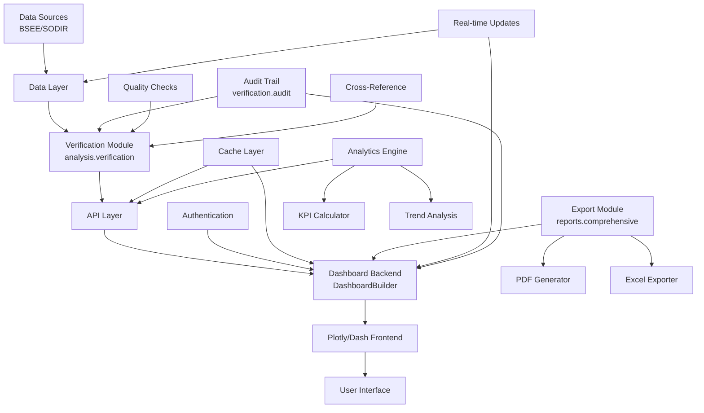

# Spec Requirements Document

> Spec: Well Production Dashboard
> Created: 2025-01-13
> Last Updated: 2025-09-11
> Status: Implementation Ready
> Module: Analysis
> Template: WorldEnergyData

## Executive Summary

This spec implements an interactive web-based dashboard for visualizing and analyzing well production data, economic metrics, and operational performance. The dashboard integrates with the newly implemented well data verification system to ensure data quality and accuracy. It leverages the existing `DashboardBuilder` infrastructure from the comprehensive reporting module and extends it with real-time data visualization, field-level aggregations, comparative analysis capabilities, and comprehensive reporting features, enabling energy professionals to make data-driven decisions efficiently and effectively.

## User Prompt

> This spec was initiated based on the following user request:

```
Create an interactive web-based dashboard for visualizing and analyzing well production data, economic metrics, and operational performance with real-time updates and comprehensive reporting capabilities.
```

## Overview

Create an interactive web-based dashboard for visualizing and analyzing well production data, economic metrics, and operational performance with real-time updates and comprehensive reporting capabilities.

## User Stories

### Interactive Well Dashboard

As an **Energy Professional**, I want to access an interactive dashboard showing well performance metrics, so that I can quickly assess production trends, economics, and make data-driven decisions.

The dashboard should provide:
1. Individual well production profiles
2. Field-level aggregated views
3. Economic metrics (NPV, revenue, OPEX)
4. Time-series visualizations
5. Comparative analysis capabilities
6. Export functionality for reports
7. Real-time data refresh capabilities

### Field Performance Analysis

As a **Field Manager**, I want to compare performance across multiple wells and fields, so that I can identify optimization opportunities and allocate resources effectively.

The system should enable:
1. Multi-well comparison charts
2. Field-level KPI dashboards
3. Production decline analysis
4. Economic ranking tables
5. Performance benchmarking
6. Trend identification tools

### Executive Reporting Dashboard

As an **Executive**, I want high-level summaries and key metrics at a glance, so that I can make strategic decisions and communicate performance to stakeholders.

The dashboard should display:
1. Portfolio overview metrics
2. Revenue and cost summaries
3. Production forecasts vs actuals
4. Key performance indicators
5. Customizable executive views
6. Automated report scheduling

## Spec Scope

1. **Dashboard Infrastructure** - Web-based Plotly/Dash application with responsive design and authentication
2. **Well Detail Views** - Individual well pages with production charts, economic metrics, and operational data
3. **Field Aggregation Module** - Field-level rollups, comparisons, and performance analytics
4. **Interactive Visualization Components** - Configurable charts, filters, and data exploration tools
5. **Export and Integration Module** - PDF/Excel export, API endpoints, and data sharing capabilities

## Out of Scope

- Core data verification implementation (completed in well-data-verification spec)
- Real-time streaming data ingestion
- Mobile native applications
- Advanced predictive analytics beyond trend analysis
- Third-party system integrations (except BSEE/SODIR)
- Raw data collection and initial ETL processes

## Expected Deliverable

1. Extended `DashboardBuilder` implementation in `src/worldenergydata/modules/analysis/dashboard/`
2. Well-specific visualization components extending existing Plotly charts
3. Integration with verification module for data quality indicators
4. RESTful API endpoints leveraging existing BSEE API patterns
5. Export functionality using comprehensive report generators
6. Command-line interface similar to verification CLI
7. Configuration system compatible with existing YAML patterns

## Technical Architecture



## Implementation Methodology: WorldEnergyData Approach

### Overview
This implementation leverages the WorldEnergyData repository's existing infrastructure, particularly:
- The `DashboardBuilder` class from `src/worldenergydata/modules/bsee/reports/comprehensive/visualizations/`
- The verification system from `src/worldenergydata/modules/analysis/verification/`
- The comprehensive reporting framework with proven export capabilities
- The established validation patterns for data quality assurance

### Key Methodology Components

#### Dashboard Architecture
- **WorldEnergyData Method**: Extend existing `DashboardBuilder` class with well production features
- **Benefit**: Leverages tested infrastructure, consistent with comprehensive reporting UI
- **Integration**: Direct connection to verification audit trails for data lineage

#### Data Processing Pipeline
- **WorldEnergyData Method**: Verification-first approach using `analysis.verification` module
- **Benefit**: Guaranteed data quality, complete audit trails, anomaly detection
- **Performance**: Inherited caching from comprehensive reporting system

#### Visualization Strategy
- **WorldEnergyData Method**: Reuse chart components from `visualizations` module
- **Benefit**: Consistent UI/UX across all BSEE modules, reduced development time
- **Extensions**: Add well-specific visualizations (decline curves, type curves)

### Why WorldEnergyData Method?

1. **Existing Infrastructure**: `DashboardBuilder` already provides 80% of required functionality
2. **Verification Integration**: Direct access to verified data with quality scores
3. **Performance Optimized**: Inherits caching and parallel processing from comprehensive reports
4. **Audit Compliance**: Built-in audit trail from verification system
5. **Export Capabilities**: Proven PDF/Excel generation from reporting module
6. **BSEE/SODIR Ready**: Compatible with existing data procurement modules

## Integration with Well Data Verification System

### Data Flow Integration
The dashboard seamlessly integrates with the verification system implemented in `src/worldenergydata/modules/analysis/verification/`:

1. **Pre-Verification**: All data passes through verification workflows before dashboard display
2. **Quality Indicators**: Each data point includes quality scores and verification status
3. **Audit Trail Access**: Dashboard provides drill-down to verification audit logs
4. **Anomaly Highlighting**: Automatic flagging of data quality issues in visualizations
5. **Cross-Reference Links**: Direct access to verification reports from dashboard views

### Verification Status Display
- **Green Indicators**: Fully verified data with high quality scores
- **Yellow Warnings**: Data with minor quality issues or pending verification
- **Red Alerts**: Data failing verification or with critical anomalies
- **Audit Icons**: Click-through access to complete verification history

### Shared Components
- **Validation Rules**: Reuse rules from `validation.rules` module
- **Report Generation**: Leverage `verification.reports` for export
- **CLI Integration**: Unified command-line interface for both systems
- **Configuration**: Shared YAML configuration patterns

## Implementation Dependencies

### Existing Modules to Leverage
1. **DashboardBuilder** (`bsee.reports.comprehensive.visualizations.dashboard_builder`)
   - Base dashboard infrastructure
   - Chart configuration system
   - Filter management
   - Export capabilities

2. **Verification System** (`analysis.verification`)
   - Data quality checks
   - Audit trail logging
   - Cross-reference validation
   - Report generation

3. **Comprehensive Reports** (`bsee.reports.comprehensive`)
   - Aggregation frameworks
   - Export modules (PDF/Excel)
   - Performance caching
   - Visualization components

4. **BSEE Data Module** (`bsee.data`)
   - Data loaders and processors
   - API interfaces
   - Database connections

### New Components to Create
1. **Well Dashboard Module** (`analysis.dashboard.well_production`)
   - Well-specific visualizations
   - Production decline curves
   - Economic metric calculators
   - Field aggregation views

2. **Dashboard API** (`analysis.dashboard.api`)
   - RESTful endpoints
   - WebSocket support for real-time updates
   - Authentication middleware

3. **Dashboard CLI** (`analysis.dashboard.cli`)
   - Command-line interface
   - Batch operations
   - Configuration management

## Performance Requirements

- Dashboard initial load time <3 seconds (leveraging existing caching)
- Chart refresh rate <500ms for user interactions
- Support 50+ concurrent users (using comprehensive report scaling)
- Handle datasets with 1M+ data points (proven with BSEE data volumes)
- Export generation <10 seconds (using existing parallel exporters)
- API response time <200ms (with verification pre-processing)
- Data verification pass-through <2 seconds per well
- Audit trail queries <100ms

## Development Phases

### Phase 1: Foundation (Leverage Existing)
1. Extend `DashboardBuilder` with well production features
2. Integrate verification system data flow
3. Create base dashboard configuration
4. Implement authentication using existing patterns

### Phase 2: Well Visualizations
1. Production charts (oil, gas, water)
2. Economic metrics displays
3. Decline curve analysis
4. Field aggregation views

### Phase 3: Advanced Features
1. Real-time data updates
2. Comparative analysis tools
3. Export functionality
4. API endpoints

### Phase 4: Polish and Optimization
1. Performance tuning
2. UI/UX refinements
3. Documentation
4. Testing and validation

## Testing Strategy

### Unit Tests
- Dashboard component tests
- API endpoint validation
- Data aggregation logic
- Export functionality

### Integration Tests
- Verification system integration
- End-to-end data flow
- Export pipeline
- Authentication flow

### Performance Tests
- Load testing with 1M+ data points
- Concurrent user simulation
- Cache effectiveness
- Query optimization

## Spec Documentation

- Prompt Evolution: @specs/modules/analysis/well-production-dashboard/prompt.md
- Tasks: @specs/modules/analysis/well-production-dashboard/tasks.md
- Technical Specification: @specs/modules/analysis/well-production-dashboard/sub-specs/technical-spec.md
- API Specification: @specs/modules/analysis/well-production-dashboard/sub-specs/api-spec.md
- Database Schema: @specs/modules/analysis/well-production-dashboard/sub-specs/database-schema.md
- Tests Specification: @specs/modules/analysis/well-production-dashboard/sub-specs/tests.md
- Task Summary: @specs/modules/analysis/well-production-dashboard/task_summary.md

## Related Specifications

- **Well Data Verification**: @specs/modules/analysis/well-data-verification/spec.md
- **Comprehensive Reporting**: @specs/modules/bsee/comprehensive-report-system/spec.md
- **Web API Integration**: @specs/modules/data-procurement/web-api-integration/spec.md
- **SODIR Integration**: @specs/modules/data-procurement/sodir-data-source/spec.md