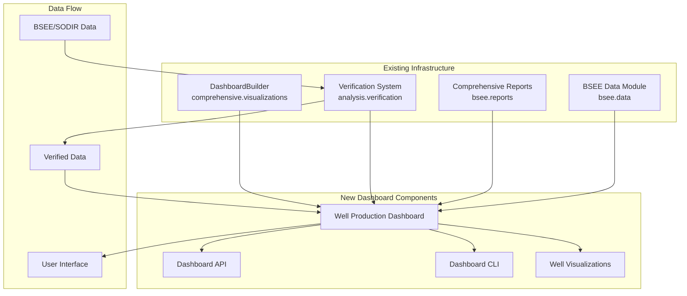

# Technical Specification

This is the technical specification for the spec detailed in @specs/modules/analysis/well-production-dashboard/spec.md

> Created: 2025-01-13
> Last Updated: 2025-09-11
> Version: 2.0.0
> Module: Analysis

## Technical Requirements

### Core Functionality
- **Dashboard Infrastructure**: Extend existing `DashboardBuilder` from comprehensive reports module
- **Well Visualization**: Individual well production charts with verification status indicators
- **Field Aggregation**: Multi-well comparisons leveraging BSEE aggregation frameworks
- **Interactive Components**: Dynamic filtering with verification quality filters
- **Export Module**: Reuse comprehensive report PDF/Excel generators
- **Real-Time Updates**: WebSocket-based live data with verification pass-through
- **Data Verification Integration**: Seamless connection with `analysis.verification` module

### Performance Requirements
- Dashboard initial load <3 seconds (with caching)
- Chart refresh <500ms for user interactions
- Support 50+ concurrent users
- Handle 1M+ data points efficiently (proven with BSEE data)
- API response time <200ms
- Export generation <10 seconds (parallel processing)
- Verification pass-through <2 seconds per well
- Audit trail queries <100ms

### Browser Compatibility
- Chrome 90+
- Firefox 88+
- Safari 14+
- Edge 90+
- Mobile browsers (responsive design)

## Architecture Design

### Integration with Existing Infrastructure



### Application Structure

```python
# Dashboard module structure (extending existing)
worldenergydata/
└── modules/
    ├── analysis/
    │   ├── verification/          # EXISTING - Data verification
    │   │   ├── audit/            # Audit trail system
    │   │   ├── cli.py           # CLI interface
    │   │   └── reports.py        # Report generation
    │   └── dashboard/            # NEW - Dashboard module
    │       ├── __init__.py
    │       ├── well_production.py    # Well dashboard extension
    │       ├── config.py             # Configuration management
    │       ├── components/
    │       │   ├── well_charts.py   # Well-specific charts
    │       │   ├── decline_curves.py # Decline analysis
    │       │   ├── economics.py     # Economic visualizations
    │       │   └── quality_indicators.py # Data quality display
    │       ├── integration/
    │       │   ├── verification.py  # Verification integration
    │       │   ├── comprehensive.py # Comprehensive reports integration
    │       │   └── bsee_data.py    # BSEE data integration
    │       ├── api/
    │       │   ├── endpoints.py    # REST API endpoints
    │       │   ├── websocket.py    # Real-time updates
    │       │   └── auth.py         # Authentication
    │       └── cli.py              # Command-line interface
    └── bsee/
        └── reports/
            └── comprehensive/
                └── visualizations/
                    └── dashboard_builder.py  # EXISTING - Base class
```

### Component Integration Strategy

```python
# well_production.py - Extending DashboardBuilder
from worldenergydata.bsee.reports.comprehensive.visualizations.dashboard_builder import (
    DashboardBuilder,
    DashboardConfig,
    ChartConfig
)
from worldenergydata.analysis.verification import (
    VerificationWorkflow,
    DataQualityChecker,
    AuditLogger
)

class WellProductionDashboard(DashboardBuilder):
    """
    Extends DashboardBuilder with well production features.
    Integrates verification system for data quality.
    """
    
    def __init__(self, config: DashboardConfig):
        super().__init__(config)
        self.verification = VerificationWorkflow()
        self.quality_checker = DataQualityChecker()
        self.audit_logger = AuditLogger()
    
    def add_well_chart(self, well_id: str, chart_type: str):
        """Add well-specific chart with verification status."""
        # Verify data first
        verification_result = self.verification.verify_well(well_id)
        
        # Create chart with quality indicators
        chart_config = ChartConfig(
            chart_id=f"well_{well_id}_{chart_type}",
            chart_type=chart_type,
            title=f"Well {well_id} - {chart_type}",
            data_source=f"verified_well_{well_id}"
        )
        
        # Add verification metadata
        chart_config.metadata = {
            'quality_score': verification_result.quality_score,
            'verification_status': verification_result.status,
            'audit_trail': self.audit_logger.get_trail(well_id)
        }
        
        self.add_chart(chart_config)
```

## Implementation Approach

### Phase 1: Foundation - Leverage Existing (Week 1)
1. **Extend DashboardBuilder**
   - Create `WellProductionDashboard` class
   - Inherit chart management and export capabilities
   - Add well-specific configuration options

2. **Integrate Verification System**
   - Connect to `analysis.verification` module
   - Add quality score displays
   - Link audit trail access

3. **Setup Configuration**
   - Extend existing YAML patterns
   - Add dashboard-specific settings
   - Configure verification thresholds

### Phase 2: Well Visualizations (Week 2)
1. **Production Charts**
   - Oil/Gas/Water time series
   - Cumulative production curves
   - Rate vs time analysis

2. **Economic Metrics**
   - NPV calculations using BSEE financial validators
   - Revenue tracking
   - OPEX analysis

3. **Decline Curves**
   - Exponential decline analysis
   - Hyperbolic decline fitting
   - Forecast vs actual comparison

### Phase 3: Advanced Features (Week 3)
1. **Real-time Updates**
   - WebSocket implementation
   - Incremental data loading
   - Live verification status

2. **Comparative Analysis**
   - Multi-well overlays
   - Field performance ranking
   - Benchmark comparisons

3. **Export Integration**
   - Leverage comprehensive report exporters
   - Custom well report templates
   - Scheduled report generation

### Phase 4: Polish and Optimization (Week 4)
1. **Performance Tuning**
   - Implement caching strategy
   - Optimize queries
   - Lazy loading

2. **UI/UX Refinements**
   - Responsive design
   - Mobile optimization
   - Accessibility features

## Technology Stack

### Core Dependencies (Existing)
```python
# Already available in the repository
plotly>=5.0.0              # From comprehensive reports
dash>=2.0.0                # From DashboardBuilder
pandas>=1.3.0              # Core data processing
numpy>=1.21.0              # Numerical operations
pyyaml>=5.4.0             # Configuration
sqlalchemy>=1.4.0         # Database ORM
```

### Additional Dependencies
```python
# New dependencies for dashboard
dash-bootstrap-components>=1.0.0  # UI components
dash-ag-grid>=2.0.0              # Advanced tables
redis>=4.0.0                     # Caching layer
fastapi>=0.70.0                  # API framework
websockets>=10.0.0               # Real-time updates
```

## Data Management

### Verification-First Data Pipeline

```python
class VerifiedDataLoader:
    """
    Data loader with automatic verification.
    """
    def __init__(self):
        self.verification = VerificationWorkflow()
        self.cache = CacheManager()
    
    def load_well_data(self, well_id: str, force_verify: bool = False):
        # Check cache first
        cache_key = f"verified_well_{well_id}"
        if not force_verify and self.cache.exists(cache_key):
            return self.cache.get(cache_key)
        
        # Load raw data
        raw_data = self.load_raw_data(well_id)
        
        # Verify data
        verification_result = self.verification.verify(raw_data)
        
        # Add quality metadata
        verified_data = {
            'data': verification_result.cleaned_data,
            'quality_score': verification_result.quality_score,
            'issues': verification_result.issues,
            'audit_id': verification_result.audit_id
        }
        
        # Cache verified data
        self.cache.set(cache_key, verified_data, ttl=3600)
        
        return verified_data
```

### Quality Indicators Display

```python
class QualityIndicator:
    """
    Visual quality indicators for dashboard.
    """
    
    @staticmethod
    def get_quality_badge(score: float) -> dict:
        """Get visual badge based on quality score."""
        if score >= 0.95:
            return {
                'color': 'green',
                'icon': '✓',
                'text': 'Verified',
                'tooltip': 'Data fully verified'
            }
        elif score >= 0.80:
            return {
                'color': 'yellow',
                'icon': '⚠',
                'text': 'Warning',
                'tooltip': 'Minor quality issues'
            }
        else:
            return {
                'color': 'red',
                'icon': '✗',
                'text': 'Alert',
                'tooltip': 'Critical quality issues'
            }
```

## API Specification

### RESTful Endpoints

```python
# API endpoints leveraging existing patterns
from fastapi import FastAPI, Depends
from worldenergydata.analysis.verification import verify_data

app = FastAPI()

@app.get("/api/v1/wells/{well_id}/production")
async def get_well_production(
    well_id: str,
    include_verification: bool = True
):
    """Get well production data with verification status."""
    data = load_well_data(well_id)
    if include_verification:
        data['verification'] = verify_data(data)
    return data

@app.get("/api/v1/wells/{well_id}/dashboard")
async def get_well_dashboard(well_id: str):
    """Get complete dashboard data for a well."""
    return {
        'production': get_well_production(well_id),
        'economics': calculate_economics(well_id),
        'decline': analyze_decline(well_id),
        'quality': get_quality_metrics(well_id)
    }

@app.ws("/ws/wells/{well_id}")
async def websocket_endpoint(websocket: WebSocket, well_id: str):
    """WebSocket for real-time well updates."""
    await websocket.accept()
    while True:
        data = await get_real_time_data(well_id)
        await websocket.send_json(data)
```

## Security Considerations

### Authentication Integration
- Reuse existing authentication patterns from BSEE modules
- JWT token validation
- Role-based access control
- Session management

### Data Access Control
```python
# Role-based data access
ROLE_PERMISSIONS = {
    'viewer': ['read_well', 'read_field'],
    'analyst': ['read_well', 'read_field', 'export_data'],
    'manager': ['read_well', 'read_field', 'export_data', 'modify_data'],
    'admin': ['all']
}
```

## Testing Strategy

### Unit Tests
```python
# tests/modules/analysis/dashboard/test_well_production.py
import pytest
from worldenergydata.analysis.dashboard import WellProductionDashboard

def test_dashboard_initialization():
    """Test dashboard initialization with verification."""
    dashboard = WellProductionDashboard(config)
    assert dashboard.verification is not None
    assert dashboard.quality_checker is not None

def test_well_chart_with_verification():
    """Test adding well chart with verification."""
    dashboard = WellProductionDashboard(config)
    dashboard.add_well_chart("TEST_WELL_001", "production")
    chart = dashboard.charts[0]
    assert 'quality_score' in chart.metadata
    assert 'verification_status' in chart.metadata
```

### Integration Tests
```python
def test_verification_integration():
    """Test integration with verification system."""
    dashboard = WellProductionDashboard(config)
    result = dashboard.load_verified_data("WELL_001")
    assert result['quality_score'] > 0
    assert 'audit_id' in result

def test_export_integration():
    """Test integration with export module."""
    dashboard = WellProductionDashboard(config)
    export_result = dashboard.export_to_pdf()
    assert export_result.success
```

## Deployment Configuration

### Docker Configuration (Updated)
```dockerfile
# Dockerfile leveraging existing image
FROM worldenergydata:base
WORKDIR /app
COPY requirements-dashboard.txt .
RUN pip install -r requirements-dashboard.txt
COPY src/worldenergydata/modules/analysis/dashboard /app/dashboard
EXPOSE 8050
CMD ["python", "-m", "worldenergydata.analysis.dashboard.cli", "serve"]
```

### CLI Commands
```bash
# Dashboard CLI commands
python -m worldenergydata.analysis.dashboard.cli serve --port 8050
python -m worldenergydata.analysis.dashboard.cli export --well WELL_001
python -m worldenergydata.analysis.dashboard.cli verify --check-quality
```

## Performance Optimization

### Caching Strategy (Leveraging Existing)
```python
# Reuse comprehensive report caching
from worldenergydata.bsee.reports.comprehensive import CacheManager

cache = CacheManager()
cache.set_verified_data(well_id, data, ttl=3600)
```

### Query Optimization
- Use existing BSEE data loaders with built-in optimization
- Leverage materialized views from comprehensive reports
- Implement incremental data loading

## Monitoring and Logging

### Integrated Monitoring
```python
# Extend existing monitoring
from worldenergydata.analysis.verification.audit import AuditLogger

audit = AuditLogger()
audit.log_dashboard_access(user_id, well_id, action)
audit.log_export(user_id, export_type, wells)
audit.log_verification_check(well_id, quality_score)
```

### Performance Metrics
- Dashboard load time tracking
- Verification processing time
- Export generation duration
- User interaction metrics