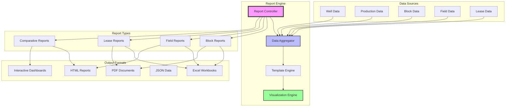
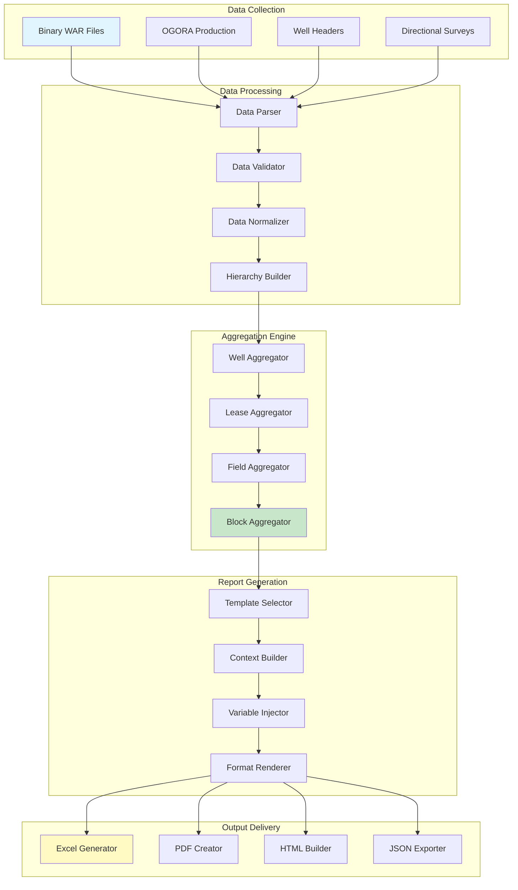
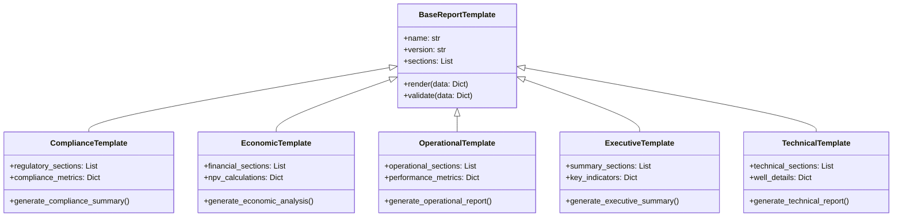
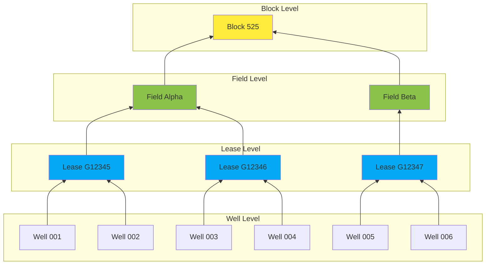

# Spec Requirements Document

> Spec: Comprehensive Report System
> Created: 2025-08-06
> Status: Planning
> Module: bsee
> Variant: enhanced

## Prompt Summary

**Original Request:** Comprehensive Well and production report (by block, field, lease). Should be able to:
- Technical data is given here
  - .agent-os\specs\modules\bsee\2025-08-06-comprehensive-reports\sub-specs\go_by

**Context Provided:** 
- Enhanced spec instructions from AssetUtilities repository
- Request for comprehensive reporting capabilities across different organizational levels
- Need for block, field, and lease-based reporting

**Clarifications Made:**
1. Block, field, and lease represent different organizational hierarchies for offshore oil & gas data
2. Reports should aggregate well and production data at each organizational level
3. Output format and delivery methods need to be defined
4. Integration with existing analysis modules is required

**Reuse Notes:** 
- Existing BSEE analysis modules: well_api10.py, well_api12.py, production_api10.py, production_api12.py
- Current lease reporting script: build_lease_report_final.py
- Block data processing: BlockData class
- Plotly visualization capabilities already established

**Prompt Evolution:** From basic reporting request to comprehensive multi-level report generation system with hierarchical data organization

## Executive Summary

### Business Impact
This comprehensive reporting system will enable energy analysts to generate standardized reports at block, field, and lease levels, reducing manual report generation time by 80% and providing consistent data presentation across different organizational hierarchies. The system will support decision-making for asset acquisition, field development, and regulatory compliance.

### Technical Overview
The solution involves creating a unified reporting framework that aggregates well and production data across three organizational levels: individual leases (smallest unit), fields (collection of leases), and blocks (geographical areas). Reports will include production summaries, well performance metrics, economic indicators, and visual analytics with export capabilities to multiple formats.

### Resource Requirements
- **Estimated Effort:** 3-4 weeks (120-160 hours)
- **Dependencies:** Existing BSEE data modules, visualization libraries, export utilities
- **Team:** 1 developer with data analysis and reporting experience

### Risk Assessment
- **Data Consistency:** Risk of inconsistent aggregation across levels; mitigation through comprehensive validation
- **Performance:** Large datasets may cause slow report generation; mitigation via caching and incremental processing  
- **User Adoption:** Complex interface may hinder adoption; mitigation through intuitive CLI and templates

## System Overview

The Comprehensive Report System creates a unified reporting framework for offshore energy data analysis. It provides standardized reports across organizational hierarchies with rich visualizations and multiple export formats.



### Architecture Notes
- **Hierarchical Processing:** Reports can drill down from block → field → lease levels
- **Template System:** Standardized templates ensure consistent formatting across report types
- **Multi-Format Output:** Single report definition generates multiple output formats
- **Performance Optimization:** Incremental aggregation and caching for large datasets

## Overview

Implement a comprehensive reporting system for well and production data that enables users to generate detailed reports organized by block, field, and lease hierarchies. The system will provide standardized templates, interactive visualizations, and multiple export formats to support various business use cases from regulatory compliance to investment analysis.

### Future Update Prompt

For future modifications to this spec, use the following prompt:
```
Update the comprehensive well and production reports spec to include:
- New report types or organizational levels
- Additional data sources or metrics
- Enhanced visualization requirements
- New export formats or delivery methods
- Integration with external systems or databases
Maintain compatibility with existing templates and ensure consistent data aggregation across all levels.
```

## User Stories

### Asset Manager Creating Block Performance Report

As an asset manager, I want to generate a comprehensive block performance report for Block 525, so that I can evaluate the overall productivity and identify high-performing fields within the block.

The manager executes `python -m worldenergydata.bsee report --type block --id 525 --format excel`. The system aggregates all well and production data within Block 525, groups by fields, calculates cumulative production metrics, identifies top-performing wells, and generates a multi-sheet Excel workbook with production trends, well summaries, and field comparisons. The report includes visual charts and executive summary metrics.

### Regulatory Analyst Generating Lease Compliance Report

As a regulatory analyst, I want to create detailed lease reports for multiple leases simultaneously, so that I can ensure compliance with production requirements and identify potential issues.

The analyst runs `python -m worldenergydata.bsee report --type lease --ids G12345,G12346,G12347 --template compliance --format pdf`. The system generates standardized compliance reports for each lease including production history, well status, environmental metrics, and regulatory milestones. Each PDF report follows the same template structure for consistent review and approval processes.

### Investment Analyst Comparing Field Economics

As an investment analyst, I want to generate comparative field reports with economic metrics, so that I can evaluate potential acquisition targets across different fields.

The analyst executes `python -m worldenergydata.bsee report --type field --comparison true --metrics economic --output dashboard`. The system creates an interactive HTML dashboard comparing multiple fields across key economic indicators including NPV estimates, production rates, well performance, and development costs. The dashboard allows filtering and drill-down into individual well data.

## Spec Scope

1. **Multi-Level Report Engine** - Implement hierarchical reporting system supporting block, field, and lease organization levels
2. **Template System** - Create standardized report templates for different use cases (compliance, economic, technical, executive)
3. **Data Aggregation Framework** - Build robust aggregation logic that maintains data integrity across organizational levels
4. **Visualization Integration** - Integrate interactive charts and maps using existing Plotly capabilities
5. **Multi-Format Export** - Support Excel, PDF, HTML, JSON, and interactive dashboard outputs

## Out of Scope

- Real-time data integration (uses existing binary data files)
- Custom report designer GUI (uses predefined templates)
- Automated report scheduling (manual execution only)
- External data source integration beyond existing BSEE modules
- Advanced statistical modeling or forecasting (basic metrics only)

## Expected Deliverable

1. CLI command `python -m worldenergydata.bsee report` with comprehensive options for report type, organizational level, and output format
2. Standardized report templates covering 5+ business use cases with consistent formatting and metrics
3. Multi-format export capability generating Excel workbooks, PDF documents, and interactive HTML dashboards
4. Performance capable of processing block-level reports (1000+ wells) in under 10 minutes with comprehensive visualizations

## Data Flow Architecture



## Report Template Architecture



## Aggregation Hierarchy



## Spec Documentation

### Primary Documents
- Prompt Evolution: @specs/modules/bsee/comprehensive-report-system/prompt.md
- Task Summary: @specs/modules/bsee/comprehensive-report-system/task_summary.md
- Tasks: @specs/modules/bsee/comprehensive-report-system/tasks.md
- Technical Specification: @specs/modules/bsee/comprehensive-report-system/sub-specs/technical-spec.md

### Sub-Specifications  
- Report Templates: @specs/modules/bsee/comprehensive-report-system/sub-specs/templates-spec.md
- Tests Specification: @specs/modules/bsee/comprehensive-report-system/sub-specs/tests.md
- Go-By References: @specs/modules/bsee/comprehensive-report-system/sub-specs/go_by/

### Related Specifications
- Existing BSEE Analysis: @src/worldenergydata/modules/bsee/analysis/
- Current Lease Reporting: @src/worldenergydata/modules/bsee/analysis/custom_scripts/Roy/may/build_lease_report_final.py
- Block Data Processing: @src/worldenergydata/modules/bsee/data/_from_bin/block_data.py

### External Resources
- BSEE Data Center: https://www.data.bsee.gov/
- Plotly Documentation: https://plotly.com/python/
- AssetUtilities Visualization: @assetutilities:common/visualization/