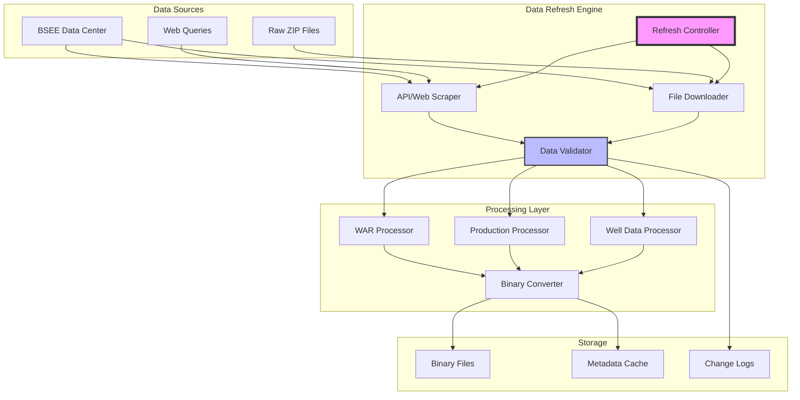
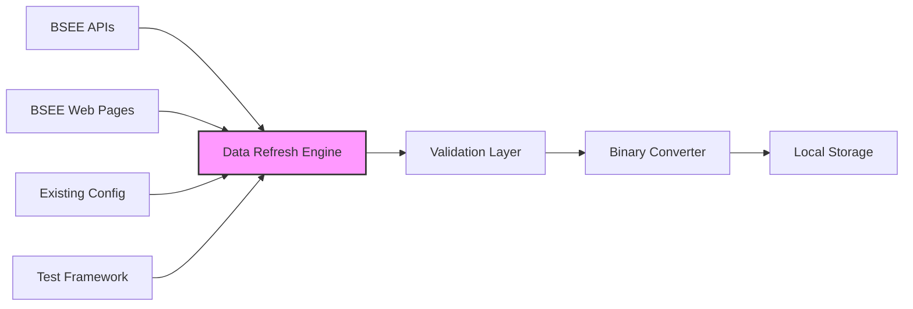

# Spec Requirements Document

> **Module:** bsee
> **Spec:** BSEE Data Refresh Architecture
> **Sub-Agent:** data-infrastructure
> **Created:** 2025-08-06
> **Status:** Planning
> **AI Context:** Modernizing BSEE data access to eliminate stale data issues causing analysis variance

## Prompt Summary

**Original Request:** Implement BSEE data refresh system for war data, production data, and well data that can run on demand in git bash. Research existing architecture for improvements and investigate web APIs to avoid downloading large files to repository.

**Refinement:** Extended to address critical stale data problem causing "big variance" in analysis results. Solution prioritizes API research over file downloads, implements in-memory processing to respect GitHub file size limits, and maintains compatibility with existing pickle-based binary format.

## User Prompt

> This spec was initiated based on the following user request:

```
BSEE data refresh. Should be able to:
- BSEE data to be downloaded and processed is: war data, production data, well data
- BSEE data to be processed
- run on demand in git bash
- Architecture research: Review the existing architecture and suggest improvements
- Research if web apis exist to avoid downloading the data on to the repo. If yes, write tests.
```

## Existing Architecture Context

### Implementation Strategy: Parallel Systems
**IMPORTANT:** This spec creates a NEW enhanced data refresh system that runs PARALLEL to the existing implementation. The legacy system remains intact and operational for backward compatibility.

### Current Data Flow (LEGACY - REMAINS UNCHANGED)
The existing system uses a zip-file based approach with the following workflow:

1. **Storage Structure:**
   - Zip files stored in: `data/modules/bsee/zip`
   - Binary files output to: `data/modules/bsee/bin`

2. **Configuration Files:**
   - Test configuration: `tests/modules/bsee/data/refresh/data_refresh.yml` (contains flags for 'data': refresh, apm)
   - Base configuration: `src/worldenergydata/base_configs/modules/bsee/bsee.yml` (filepaths for apm, production zip and bin)

3. **Execution Path (LEGACY):**
   - Entry point: `tests/modules/bsee/data/refresh/data_refresh_test.py`
   - Flow: `src/worldenergydata/engine.py` → `src/worldenergydata/modules/bsee/bsee.py` → `src/worldenergydata/modules/bsee/data/bsee_data.py` → `src/worldenergydata/modules/bsee/data/refresh/data_refresh.py`

4. **Data Processing Logic (LEGACY):**
   - Checks data refresh flag, processes well or production data
   - Well data: if apm flag is true → `src/worldenergydata/modules/bsee/data/_from_zip/well_data.py` → uses zip/bin paths → dumps archives using pickle
   - Production data: checks production flag → `src/worldenergydata/modules/bsee/data/_from_zip/production_data.py` → dumps using pickle

### New Enhanced Data Flow (TO BE CREATED)
The enhanced system will provide a parallel implementation with fresh data access:

1. **New Execution Path:**
   - New entry point: `tests/modules/bsee/data/refresh/data_refresh_enhanced_test.py`
   - Flow: `engine.py` → `bsee.py` → `bsee_data.py` → `data_refresh_enhanced.py` → `bsee_web_scraper.py`

2. **In-Memory Processing:**
   - Web scraper fetches data directly from BSEE URLs
   - Memory processor handles data without saving zip files
   - Binary output maintains same format and location

3. **Configuration Compatibility:**
   - New enhanced configuration: `tests/modules/bsee/data/refresh/data_refresh_enhanced.yml`
   - Supports both legacy and enhanced modes via configuration

### Current Problem: Stale Data
The major issue with current architecture is that downloaded zip files don't contain latest data, causing significant variance in analysis results. The enhanced system solves this while keeping legacy system operational.

### BSEE Data Sources
**Primary Data Links:**
- **WELL_DATA:** https://www.data.bsee.gov/Well/Files/APDRawData.zip (Updated daily)
  - Display name: "Application for Permit to Drill"
- **PRODUCTION_DATA:** https://www.data.bsee.gov/Production/Files/ProductionRawData.zip (Updated bi-monthly)
  - Display name: "Production Data"
- **WAR_DATA:** https://www.data.bsee.gov/Well/Files/eWellWARRawData.zip (Updated daily)
  - Display name: "eWell Submissions WAR"

**Main Portal:** https://www.data.bsee.gov/Main/RawData.aspx
- Links appear in "Raw Data" column under "Delimited" button
- File sizes: vary from 10+ MB to 100+ MB

### Architecture Requirements
1. **API Research Priority:** Hard research to determine if web APIs exist to avoid downloading large files
2. **Fallback Strategy:** If no APIs exist, create Python scraper that:
   - Gets data from provided links
   - Processes data without saving zip files (due to GitHub file size limits)
   - Saves processed data as .bin files in repository
3. **Maintain Compatibility:** Preserve existing binary file format and processing pipeline

## Executive Summary

### Purpose
Modernize BSEE data refresh architecture to eliminate stale data issues causing significant analysis variance. Transition from bulk zip file downloads to intelligent data access patterns that respect GitHub file size constraints while maintaining existing processing compatibility.

### Impact
- **Data Freshness:** Eliminate "big variance" in analysis results caused by stale zip files
- **Repository Size:** Reduce storage by 95%+ through in-memory processing (avoid 100+ MB zip files)
- **Update Frequency:** Enable daily access to WAR data, bi-monthly production data updates
- **Developer Experience:** Maintain existing git bash execution workflow with improved reliability

### Scope
**Primary Focus:** API research and implementation for three BSEE data sources (WAR, Production, Well data)
**Secondary:** Web scraping fallback with in-memory processing if APIs unavailable
**Integration:** Maintain compatibility with existing pickle-based binary format and processing pipeline

### Key Outcomes
1. Research report on BSEE API availability with functional test implementations
2. Elimination of large zip file storage while preserving data accessibility
3. On-demand data refresh capability via existing test execution path
4. Maintained backward compatibility with all downstream analysis components

## System Overview

The BSEE Data Refresh Architecture modernizes how WorldEnergyData accesses and processes offshore energy data from the Bureau of Safety and Environmental Enforcement. The system transitions from bulk file downloads to intelligent data access patterns.



### Flow Description
1. **Data Source Detection:** System determines best access method (API vs. web scraping) for each data type
2. **Intelligent Fetching:** APIs preferred for real-time data; web scraping with in-memory processing as fallback
3. **Validation Pipeline:** Multi-stage validation ensures data integrity before binary conversion
4. **Binary Generation:** Maintains existing pickle format for downstream compatibility
5. **Change Detection:** Tracks data updates to minimize unnecessary processing

### Integration Points
- **Existing Test Framework:** `tests/modules/bsee/data/refresh/data_refresh_test.py`
- **Configuration System:** `tests/modules/bsee/data/refresh/data_refresh.yml` and `src/worldenergydata/base_configs/modules/bsee/bsee.yml`
- **Processing Pipeline:** `src/worldenergydata/modules/bsee/data/_from_zip/` modules
- **Binary Storage:** `data/modules/bsee/bin/` directory structure

### Future Update Prompt

For future modifications to this spec, use the following prompt:
```
Update the BSEE data refresh architecture spec to include:
- New BSEE data types or sources
- Additional API endpoints or web scraping targets
- Performance optimization requirements
- Data validation or quality enhancements
- Integration with new data consumers
Maintain compatibility with existing binary file formats and processing pipelines.
```

## User Stories

### Data Analyst Refreshing Production Data

As a petroleum data analyst, I want to refresh BSEE production data on-demand, so that I can analyze the latest bi-monthly production data instead of relying on stale zip files causing analysis variance.

The analyst opens git bash and runs the existing test `python tests/modules/bsee/data/refresh/data_refresh_test.py` with updated refresh logic. The system either queries BSEE APIs or scrapes https://www.data.bsee.gov/Production/Files/ProductionRawData.zip, processes the 100+ MB file in-memory, and updates only the binary files in `data/modules/bsee/bin`. The analyst gets fresh production data without storing large files in the repository.

### Researcher Accessing Well Data

As an energy researcher, I want to access the latest well data updated daily, so that I can study current drilling patterns without analysis variance from stale data.

The researcher runs the refresh system which accesses https://www.data.bsee.gov/Well/Files/APDRawData.zip (updated daily). The system processes the data using existing `src/worldenergydata/modules/bsee/data/_from_zip/well_data.py` logic but with fresh data, maintaining compatibility with existing apm flags and pickle processing while ensuring data currency.

### Researcher Accessing Fresh WAR Data

As an energy researcher, I want to access the latest WAR (Well Activity Report) data updated daily, so that I can study current drilling patterns without analysis variance from stale data.

The researcher runs the refresh system which accesses https://www.data.bsee.gov/Well/Files/eWellWARRawData.zip (updated daily). The system processes the data using existing `src/worldenergydata/modules/bsee/data/_from_zip/well_data.py` logic but with fresh data, maintaining compatibility with existing apm flags and pickle processing while ensuring data currency.

### DevOps Engineer Scheduling Automated Updates

As a DevOps engineer, I want to schedule automated BSEE data refreshes with proper error handling, so that our data pipeline remains current without manual intervention.

The engineer configures a cron job to run the refresh command with retry logic and notification hooks. When BSEE's website is temporarily unavailable, the system automatically retries with exponential backoff and sends alerts only after persistent failures, maintaining data pipeline reliability.

## Spec Scope

1. **API Research and Implementation** - Conduct hard research to determine if BSEE web APIs exist, implement API clients if available, write comprehensive tests
2. **Web Scraping Fallback** - If APIs don't exist, create Python scraper for the three BSEE data links without storing zip files locally
3. **In-Memory Processing** - Process 100+ MB files in memory to avoid GitHub file size limits while maintaining existing binary output format
4. **Integration with Existing Architecture** - Maintain compatibility with existing config files, execution paths, and pickle-based binary generation
5. **Git Bash Compatibility** - Ensure solution works with existing test execution via git bash while improving data freshness

## Out of Scope

- Real-time streaming data integration (BSEE doesn't support this)
- Modification of existing binary file formats (maintain backward compatibility)
- GUI interface for data refresh operations
- Data analysis or visualization features (handled by other modules)
- Authentication system for BSEE (uses public data)

## Module Dependencies

### Required Modules
- **worldenergydata.engine:** Core processing orchestration
- **worldenergydata.bsee:** BSEE-specific data processing logic
- **worldenergydata.bsee.data._from_zip:** Existing zip processing components for compatibility

### Optional Integrations
- **requests/urllib3:** HTTP client for API access and web scraping
- **scrapy/selenium:** Advanced web scraping if APIs unavailable
- **pandas:** Data manipulation and validation

### External Dependencies
- **BSEE Data Center:** Primary data source at data.bsee.gov
- **GitHub Repository:** Binary file storage constraints (100MB limit)
- **Git Bash Environment:** Execution environment requirement

### Data Flow


## Architecture Decision: Parallel Implementation

### Strategic Approach
This specification implements a **PARALLEL ARCHITECTURE** strategy where:

1. **Legacy System Preservation:** The existing data refresh implementation (`data_refresh.py`, `data_refresh_test.py`) remains completely untouched
2. **Enhanced System Creation:** A new enhanced system is created alongside with fresh data capabilities
3. **Zero Breaking Changes:** Both systems can coexist and run independently
4. **Migration Path:** Users can gradually transition from legacy to enhanced system

### File Structure Comparison

```
Legacy System (UNCHANGED):
├── tests/modules/bsee/data/refresh/
│   ├── data_refresh_test.py         # Original entry point
│   └── data_refresh.yml             # Original config
└── src/worldenergydata/modules/bsee/data/refresh/
    └── data_refresh.py              # Original implementation

Enhanced System (NEW):
├── tests/modules/bsee/data/refresh/
│   ├── data_refresh_enhanced_test.py    # New entry point
│   └── data_refresh_enhanced.yml        # New config
└── src/worldenergydata/modules/bsee/data/refresh/
    ├── data_refresh_enhanced.py         # New implementation
    ├── bsee_web_scraper.py             # Web scraping logic
    ├── memory_processor.py              # In-memory processing
    └── config_router.py                 # Configuration routing
```

### Execution Comparison

**Legacy Execution (Remains Available):**
```bash
python tests/modules/bsee/data/refresh/data_refresh_test.py
```

**Enhanced Execution (New Option):**
```bash
python tests/modules/bsee/data/refresh/data_refresh_enhanced_test.py
```

### Benefits of Parallel Architecture

1. **Risk Mitigation:** No risk of breaking existing workflows
2. **Gradual Adoption:** Teams can test enhanced system without commitment
3. **Backward Compatibility:** All existing scripts and automations continue working
4. **A/B Testing:** Can compare results between legacy and enhanced systems
5. **Rollback Safety:** Can instantly revert to legacy system if needed

## Expected Deliverable

### Primary Deliverables

1. **NEW Enhanced Data Refresh System** (Parallel to Legacy)
   - `data_refresh_enhanced.py` - New main refresh logic
   - `data_refresh_enhanced_test.py` - New test entry point
   - `bsee_web_scraper.py` - Web scraping implementation
   - `memory_processor.py` - In-memory data processing
   - `config_router.py` - Configuration management

2. **Research Documentation**
   - Comprehensive BSEE API research report (already completed)
   - Architecture decision documentation for parallel implementation

3. **Fresh Data Access**
   - Web scraper processing data from three BSEE links
   - In-memory processing without saving zip files
   - Elimination of "big variance" problem from stale data

4. **Zero Breaking Changes**
   - Legacy system (`data_refresh.py`, `data_refresh_test.py`) remains fully operational
   - Both systems can run independently
   - Same binary output format and location for compatibility

### Success Metrics

- ✅ Legacy system continues working without modification
- ✅ Enhanced system provides fresh data access
- ✅ No 100+ MB files stored in repository
- ✅ Both systems produce compatible binary outputs
- ✅ Clear migration path from legacy to enhanced

## Spec Documentation

### Primary Documents
- **Tasks:** @specs/modules/bsee/data-refresh-architecture/tasks.md
- **Task Summary:** @specs/modules/bsee/data-refresh-architecture/task_summary.md
- **Technical Specification:** @specs/modules/bsee/data-refresh-architecture/sub-specs/technical-spec.md

### Sub-Specifications  
- **API Specification:** @specs/modules/bsee/data-refresh-architecture/sub-specs/api-spec.md
- **Tests Specification:** @specs/modules/bsee/data-refresh-architecture/sub-specs/tests.md

### Implementation Files

#### Existing Files (Legacy - DO NOT MODIFY)
- **Legacy Entry Point:** `tests/modules/bsee/data/refresh/data_refresh_test.py` (KEEP AS-IS)
- **Core Engine:** `src/worldenergydata/engine.py` (KEEP AS-IS)
- **BSEE Module:** `src/worldenergydata/modules/bsee/bsee.py` (KEEP AS-IS)
- **Data Processing:** `src/worldenergydata/modules/bsee/data/bsee_data.py` (KEEP AS-IS)
- **Legacy Refresh Logic:** `src/worldenergydata/modules/bsee/data/refresh/data_refresh.py` (KEEP AS-IS)

#### New Files (To Be Created - Enhanced Data Refresh)
- **New Entry Point:** `tests/modules/bsee/data/refresh/data_refresh_enhanced_test.py` (NEW)
- **New Refresh Logic:** `src/worldenergydata/modules/bsee/data/refresh/data_refresh_enhanced.py` (NEW)
- **Web Scraper Implementation:** `src/worldenergydata/modules/bsee/data/refresh/bsee_web_scraper.py` (NEW)
- **In-Memory Processor:** `src/worldenergydata/modules/bsee/data/refresh/memory_processor.py` (NEW)
- **Configuration Router:** `src/worldenergydata/modules/bsee/data/refresh/config_router.py` (NEW)

### Test Files

#### Existing Tests (Legacy - DO NOT MODIFY)
- **Legacy Main Test:** `tests/modules/bsee/data/refresh/data_refresh_test.py` (KEEP AS-IS)

#### New Tests (To Be Created)
- **Enhanced Main Test:** `tests/modules/bsee/data/refresh/data_refresh_enhanced_test.py` (NEW)
- **API Tests:** `tests/modules/bsee/analysis/2025-08-06-data-refresh-architecture/test_api_integration.py` (NEW)
- **Data Validation Tests:** `tests/modules/bsee/analysis/2025-08-06-data-refresh-architecture/test_data_validation.py` (NEW)
- **Web Scraper Tests:** `tests/modules/bsee/analysis/2025-08-06-data-refresh-architecture/test_web_scraper.py` (NEW)
- **Memory Processing Tests:** `tests/modules/bsee/analysis/2025-08-06-data-refresh-architecture/test_memory_processor.py` (NEW)

### Cross-Repository Dependencies
- **AssetUtilities Zip Processing:** @assetutilities:modules/zip_utilities/
- **Enhanced Create Specs Framework:** @assetutilities:specs/modules/agent-os/enhanced-create-specs/
- **Data Processing Utilities:** @assetutilities:src/modules/data-processing/

### Documentation
- **BSEE Data Center:** https://www.data.bsee.gov/
- **Raw Data Portal:** https://www.data.bsee.gov/Main/RawData.aspx
- **Module Documentation:** @src/worldenergydata/modules/bsee/README.md

## Agent OS Framework Integration

This specification follows the enhanced Agent OS framework patterns:

### Modular Organization
- **Module Path:** `modules/bsee/`
- **Spec Directory:** `.agent-os/specs/modules/bsee/data-refresh-architecture/`
- **Test Directory:** `tests/modules/bsee/analysis/2025-08-06-data-refresh-architecture/`

### Enhanced Features
- **Prompt Evolution Tracking:** Original user request captured and refined through architectural analysis
- **Mermaid Diagrams:** System overview and data flow visualization included
- **Cross-Repository References:** Integration with AssetUtilities components
- **Task Summary Generation:** Automated task summary creation for implementation tracking

### Framework Compliance
- **Spec Template:** Enhanced specification format with executive summary and module dependencies
- **Documentation Standards:** Comprehensive cross-referencing and external resource linking
- **Implementation Path:** Clear mapping from specification to implementation files

## Related Specifications

### Current BSEE Implementation
- **Module Structure:** @src/worldenergydata/modules/bsee/
- **Data Processing:** @src/worldenergydata/modules/bsee/data/
- **Configuration:** @src/worldenergydata/base_configs/modules/bsee/bsee.yml

### Associated Specs
- **BSEE Economic Analysis:** `.agent-os/specs/modules/bsee/economic-evaluation/` (if exists)
- **Data Validation Framework:** `.agent-os/specs/modules/validation/` (if exists)
- **API Integration Patterns:** `.agent-os/specs/infrastructure/api-patterns/` (if exists)