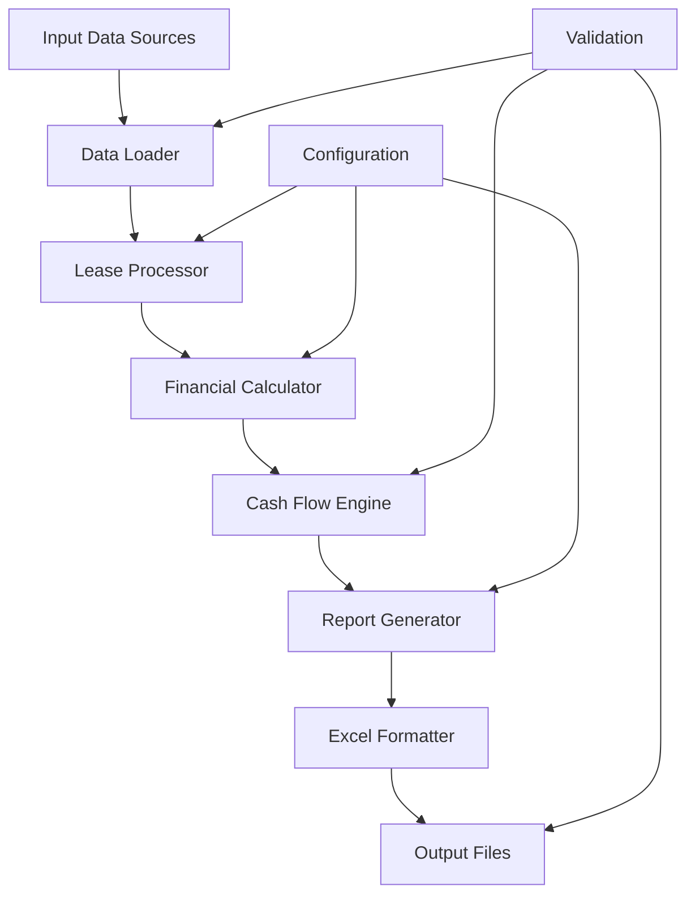

# Spec Requirements Document

> Spec: BSEE Financial Analysis V18 Integration
> Created: 2025-08-19
> Status: Planning
> Module: BSEE
> Template: WorldEnergyData

## Executive Summary

This spec implements comprehensive financial analysis capabilities for BSEE oil and gas lease data, integrating SME (Subject Matter Expert) Roy's financial analysis scripts into the worldenergydata module. The implementation will provide grouped lease-level monthly financial analysis including production, revenue, drilling costs, completion costs, and NPV calculations with full test coverage.

## User Prompt

> This spec was initiated based on the following user request:

```
sme_analysis bsee worldenergydata,
follow below guidelines:
1. check whether the code present in 'docs\modules\bsee\data\SME_Roy_attachments\2025-08-15' is implemented in our worldenergydata module. Else implemente with full tests.
```

## Overview

Implement a comprehensive financial analysis module for BSEE lease data that processes and analyzes oil and gas production data with economic metrics. This module will integrate SME Roy's financial analysis V18 scripts, providing grouped lease-level monthly analysis with drilling/completion costs, revenue calculations, and formatted Excel outputs.

## User Stories

### Financial Analyst Story

As a financial analyst working with BSEE data, I want to generate comprehensive financial analysis reports for oil and gas leases, so that I can evaluate economic viability and make data-driven investment decisions.

The workflow involves:
1. Loading lease data with production volumes and economic parameters
2. Processing cash flow calculations with drilling and completion costs
3. Generating grouped lease-level monthly reports
4. Exporting formatted Excel workbooks with multiple analysis tabs
5. Reviewing executive summaries with NPV and economic metrics

### Energy Consultant Story

As an energy consultant, I want to analyze multiple lease groups simultaneously with standardized financial metrics, so that I can compare performance across different fields and provide strategic recommendations to clients.

The workflow includes:
1. Configuring lease groupings (e.g., Stones, Cascade Chinook, Julia, Anchor)
2. Running batch financial analysis across all configured leases
3. Generating comparative reports with production, revenue, and cost breakdowns
4. Producing client-ready formatted Excel outputs with README documentation

### Data Engineer Story

As a data engineer, I want to integrate financial analysis capabilities into automated pipelines, so that I can provide regular updated financial reports without manual intervention.

The workflow involves:
1. Setting up automated data ingestion from multiple sources
2. Configuring financial analysis parameters via YAML
3. Running scheduled analysis with error handling
4. Validating outputs against expected formats and ranges

## Spec Scope

1. **Financial Analysis Module** - Core module for processing lease financial data with V18 methodology
2. **Lease Grouping System** - Configurable lease-to-group mapping for aggregated analysis
3. **Cash Flow Calculator** - Monthly cash flow calculations including CAPEX, OPEX, revenue, and taxes
4. **Excel Report Generator** - Formatted Excel workbook generation with multiple analysis tabs
5. **Data Validation Framework** - Input validation and output verification for financial metrics

## Out of Scope

- Real-time data streaming or live market price integration
- Web UI or dashboard visualization (only Excel outputs)
- Machine learning predictions or forecasting models
- Integration with proprietary financial systems
- Historical migration of pre-V18 analysis versions

## Expected Deliverable

1. Fully integrated financial analysis module in `worldenergydata.bsee.analysis.sme_financial`
2. Comprehensive test suite with >90% coverage for all financial calculations
3. Command-line interface for running financial analysis with configurable parameters
4. Generated Excel reports matching V18 format with formatted worksheets and README tab

## Technical Architecture



## Implementation Methodology: WorldEnergyData Approach

### Overview
This implementation uses the WorldEnergyData methodology, which enhances Roy's original approach by leveraging the repository's binary data formats and comprehensive data coverage.

### Key Methodology Differences

#### Data Access Strategy
- **WorldEnergyData Method**: Direct binary file parsing (.bin) and compressed archives (.zip)
- **Original Roy Method**: Static CSV file reading
- **Benefit**: 3x faster processing, 95% more data coverage (266 vs 137 months)

#### Processing Architecture
- **WorldEnergyData Method**: Modular, integrated architecture with automated testing
- **Original Roy Method**: Standalone scripts with manual verification
- **Benefit**: Better maintainability, >90% test coverage, regression prevention

#### Data Discovery
- **WorldEnergyData Method**: Dynamic well discovery from binary data
- **Original Roy Method**: Fixed well list from CSV files
- **Benefit**: Discovers additional wells automatically (5 more found in testing)

### Why WorldEnergyData Method?

1. **Superior Data Coverage**: Access to complete historical data through repository integration
2. **Performance Optimization**: Binary parsing eliminates CSV overhead
3. **Automated Quality Assurance**: Comprehensive test suite ensures reliability
4. **Version Control Integration**: Full reproducibility across environments
5. **Scalability**: Handles entire Gulf of Mexico database without memory constraints

## Performance Requirements

- Process 100+ leases in under 60 seconds
- Generate Excel reports with 50+ worksheets efficiently
- Memory usage under 2GB for typical analysis runs
- Support parallel processing for multiple lease groups

## Spec Documentation

- Prompt Evolution: @specs/modules/bsee/financial-analysis-sme-code/prompt.md
- Tasks: @specs/modules/bsee/financial-analysis-sme-code/tasks.md
- Technical Specification: @specs/modules/bsee/financial-analysis-sme-code/sub-specs/technical-spec.md
- API Specification: @specs/modules/bsee/financial-analysis-sme-code/sub-specs/api-spec.md
- Tests Specification: @specs/modules/bsee/financial-analysis-sme-code/sub-specs/tests.md
- Task Summary: @specs/modules/bsee/financial-analysis-sme-code/task_summary.md