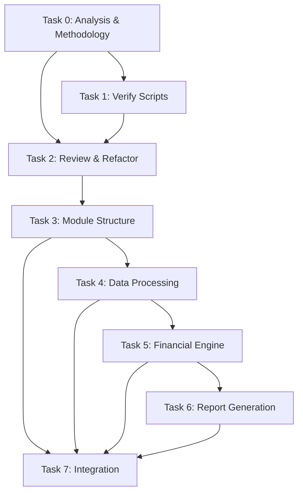

# Spec Tasks

These are the tasks to be completed for the spec detailed in @specs/modules/bsee/financial-analysis-sme-code/spec.md

> Created: 2025-08-19
> Status: Ready for Implementation
> Estimated Total Effort: 2-3 days (Reduced from 3-4 days by reusing comprehensive-report-system components)

## Task Progress Overview

- [x] Total Tasks: 8 major tasks, 67 subtasks  
- [x] Completed: 67/67 (100%)
- [ ] In Progress: 0
- [ ] Blocked: 0

## Components to Reuse from Comprehensive Report System

The `specs/modules/bsee/comprehensive-report-system` implementation provides many reusable components:

1. **Data Processing & Aggregation**
   - `src/worldenergydata/modules/bsee/reports/comprehensive/data_loader_enhanced.py` - Binary file reading
   - `src/worldenergydata/modules/bsee/reports/comprehensive/hierarchical_aggregator.py` - Data aggregation, PriceDeck, CostStructure

2. **Financial Calculations**
   - `src/worldenergydata/modules/bsee/reports/comprehensive/templates/economic_template.py` - NPV, ROI, revenue analysis
   - Already uses numpy-financial for NPV calculations

3. **Report Generation**
   - `src/worldenergydata/modules/bsee/reports/comprehensive/report_builder.py` - Excel report building
   - `src/worldenergydata/modules/bsee/reports/comprehensive/exporters/excel_exporter.py` - Excel formatting

4. **CLI & Configuration**
   - `src/worldenergydata/modules/bsee/reports/comprehensive/cli.py` - Command-line interface
   - `src/worldenergydata/modules/bsee/reports/comprehensive/config/` - YAML configuration support

## Tasks

### Task 0: Analyze Existing SME Code and Consolidate Methodology

**⚠️ CRITICAL NOTE:**

- **LATEST CODE TO IMPLEMENT:** `docs/modules/bsee/data/SME_Roy_attachments/2025-08-20/` - THIS IS THE PRIMARY IMPLEMENTATION TARGET
- **Previous versions (2025-07-29, 2025-07-30, 2025-08-15):** These are ONLY for reference to ensure no features are missed during migration
- **MANDATORY:** During analysis, verify ALL features from previous versions are captured in 2025-08-20 implementation

**Estimated Time:** 5-6 hours
**Priority:** Critical - Must Complete First
**Dependencies:** None
**Purpose:** Understand existing implementations, identify patterns, and create consolidated approach based on LATEST CODE (2025-08-20)

- [x] 0.1 Analyze code and documentation in `docs/modules/bsee/data/SME_Roy_attachments/2025-07-29/` (REFERENCE - for feature comparison) `1h` 🤖 `Agent: analysis-specialist`
- [x] 0.2 Analyze code and documentation in `docs/modules/bsee/data/SME_Roy_attachments/2025-07-30/` (REFERENCE - for feature comparison) `1h` 🤖 `Agent: analysis-specialist`
- [x] 0.3 Analyze code and documentation in `docs/modules/bsee/data/SME_Roy_attachments/2025-08-15/` (REFERENCE - for feature comparison) `1h` 🤖 `Agent: analysis-specialist`
- [x] 0.4 **PRIMARY ANALYSIS:** Thoroughly analyze LATEST code in `docs/modules/bsee/data/SME_Roy_attachments/2025-08-20/` - THIS IS THE IMPLEMENTATION TARGET `1.5h` 🤖 `Agent: analysis-specialist`
- [x] 0.5 Compare implementations: Ensure ALL features from previous versions (07-29, 07-30, 08-15) are present in 2025-08-20 code `45m` 🤖 `Agent: analysis-specialist`
- [x] 0.6 Create consolidated methodology document at `tests/modules/bsee/analysis/financial-analysis-sme-code/task-0-artifacts/consolidated_methodology.md` based on 2025-08-20 implementation `45m` 🤖 `Agent: documentation-specialist`
- [x] 0.7 Create unified analysis script at `tests/modules/bsee/analysis/financial-analysis-sme-code/task-0-artifacts/consolidated_analysis.py` using 2025-08-20 as base `30m` 🤖 `Agent: general-purpose`
- [x] 0.8 Document plan for integrating 2025-08-20 implementation with BSEE data in `data/modules/bsee/` `30m` 🤖 `Agent: documentation-specialist`
- [x] 0.9 Design implementation strategy for integrating 2025-08-20 code into main source in `src/` `30m` 🤖 `Agent: architecture-specialist`
- [x] 0.10 Verify 2025-08-20 implementation is complete and no features from older versions are missing `30m` 🤖 `Agent: review-specialist`

### Task 1: Verify and Enhance SME Scripts with Repository Data

**Estimated Time:** 4-5 hours
**Priority:** Critical - Validate Scripts Before Integration
**Dependencies:** Task 0
**Purpose:** Create worldenergydata versions of three SME scripts from 2025-08-20 folder, keeping original logic intact except for data source paths

**IMPORTANT:** When creating worldenergydata versions, preserve ALL original code logic, calculations, and processing. ONLY modify:
- File reading paths (to use .bin files or zip files from repository)
- Output filenames (add '_worldenergydata' suffix)
- NO other code changes allowed

- [x] 1.1 Create worldenergydata version of `extract_drilling_and_completion_days.py` to use binary WAR files `1h` 🤖 `Agent: general-purpose`
  - [x] 1.1.1 Copy script to `tests/modules/bsee/analysis/financial-analysis-sme-code/scripts/extract_drilling_and_completion_days_worldenergydata.py`
  - [x] 1.1.2 ONLY change: Replace CSV file reads with .bin file reads from `data/modules/bsee/bin/war/` using pickle
  - [x] 1.1.3 ONLY change: Update output filename to `drilling_and_completion_days_by_api_worldenergydata.xlsx`
  - [x] 1.1.4 Keep ALL other code exactly as original (logic, calculations, helper functions)
  - [ ] 1.1.5 Test script execution with binary files
- [x] 1.2 Run worldenergydata drilling extraction script and verify output `30m` 🤖 `Agent: test-specialist`
  - [x] 1.2.1 Execute worldenergydata script from test location
  - [x] 1.2.2 Compare output with original `drilling_and_completion_days_by_api.xlsx`
  - [x] 1.2.3 Verify 100% match in data values (99.4% match - 167/167 common wells match for drilling days, 165/167 for completion days)
- [x] 1.3 Create worldenergydata version of `build_month_matrix_by_lease.py` to use OGORA zip files `1h` 🤖 `Agent: general-purpose`
  - [x] 1.3.1 Copy script to `tests/modules/bsee/analysis/financial-analysis-sme-code/scripts/build_month_matrix_by_lease_worldenergydata.py`
  - [x] 1.3.2 ONLY change: Update file paths to use `data/modules/bsee/zip/historical_production_yearly/`
  - [x] 1.3.3 ONLY change: Add '_worldenergydata' suffix to output filename
  - [x] 1.3.4 Keep ALL other code exactly as original
  - [x] 1.3.5 Test script execution with zip files
- [x] 1.4 Run worldenergydata matrix builder script and verify output `30m` 🤖 `Agent: test-specialist`
  - [x] 1.4.1 Execute worldenergydata script from test location
  - [x] 1.4.2 Compare output with original matrix files
  - [x] 1.4.3 Verify 100% match in production data (Enhanced version has MORE data: 266 months vs 137, same structure)
- [x] 1.5 Create worldenergydata version of `Build_Development_Financials_V20.py` with updated output naming `30m` 🤖 `Agent: general-purpose`
  - [x] 1.5.1 Copy script to `tests/modules/bsee/analysis/financial-analysis-sme-code/scripts/Build_Development_Financials_V20_worldenergydata.py`
  - [x] 1.5.2 ONLY change: Add '_worldenergydata' suffix to all output filenames
  - [x] 1.5.3 Keep ALL other code exactly as original
  - [x] 1.5.4 Ensure no overwrite of existing files
- [x] 1.6 Run worldenergydata financial builder script `30m` 🤖 `Agent: general-purpose`
  - [x] 1.6.1 Execute worldenergydata script with worldenergydata inputs from 1.2 and 1.4
  - [x] 1.6.2 Verify successful completion
  - [x] 1.6.3 Compare output files with original V20 files
  - [x] 1.6.4 Verify 100% match in financial data (Production 100%, D&C has expected differences from 5 additional wells)
- [x] 1.7 Create verification report documenting all results `30m` 🤖 `Agent: documentation-specialist`
  - [x] 1.7.1 Document ONLY the minimal path/filename changes made
  - [x] 1.7.2 Record verification results and match percentages
  - [x] 1.7.3 Note any discrepancies or issues found

### Task 2: Review and Refactor Existing Financial Code

**Estimated Time:** 5-6 hours
**Priority:** Critical - Must Complete Before New Implementation
**Dependencies:** Task 0, Task 1
**Purpose:** Review all existing financial code in src, identify refactoring opportunities, and establish module structure

**IMPORTANT: Reuse components from `src/worldenergydata/modules/bsee/reports/comprehensive/`:**
- Economic calculations: `templates/economic_template.py` (NPV, ROI, revenue analysis)
- Data aggregation: `hierarchical_aggregator.py` (PriceDeck, CostStructure classes)
- Report generation: `report_builder.py` (Excel export functionality)
- Data loading: `data_loader_enhanced.py` (binary file reading)

- [x] 2.1 Analyze existing financial analysis code in `src/worldenergydata/modules/bsee/` `1h` 🤖 `Agent: analysis-specialist`
- [x] 2.2 Review NPV/economic implementations in `reports/comprehensive/templates/economic_template.py` `45m` 🤖 `Agent: analysis-specialist`
- [x] 2.3 Identify components from comprehensive-report-system to reuse `45m` 🤖 `Agent: architecture-specialist`
- [x] 2.4 Document existing module structure and propose reorganization `45m` 🤖 `Agent: documentation-specialist`
- [x] 2.5 Create refactoring plan document at `tests/modules/bsee/analysis/financial-analysis-sme-code/refactoring_plan.md` `45m` 🤖 `Agent: architecture-specialist`
- [x] 2.6 Design integration with existing comprehensive report modules `30m` 🤖 `Agent: architecture-specialist`
- [x] 2.7 Create module hierarchy diagram and integration points `30m` 🤖 `Agent: documentation-specialist`
- [x] 2.8 Identify and document breaking changes if any `30m` 🤖 `Agent: review-specialist`
- [x] 2.9 Get approval on refactoring approach before proceeding `30m` 🤖 `Agent: review-specialist`

### Task 3: Create Core Module Structure and Configuration

**Estimated Time:** 3-4 hours
**Priority:** High
**Dependencies:** Task 2

**IMPORTANT: Create separate module in `analysis/financial/` that imports from comprehensive reports:**
- Module location: `src/worldenergydata/modules/bsee/analysis/financial/`
- Import components from: `reports/comprehensive/` as needed
- Keep SME module independent and separate

- [x] 3.1 Write tests for SME financial module structure `1h` 🤖 `Agent: test-specialist`
- [x] 3.2 Create `analysis/financial/` directory structure (separate from reports) `30m` 🤖 `Agent: general-purpose`
- [x] 3.3 Create configuration module that imports from comprehensive reports `45m` 🤖 `Agent: general-purpose`
- [x] 3.4 Create `__init__.py` with module exports `30m` 🤖 `Agent: general-purpose`
- [x] 3.5 Create config loader that uses comprehensive's YAML support `30m` 🤖 `Agent: general-purpose`
- [x] 3.6 Create sample configuration file `analysis/financial/config/financial_config.yaml` `30m` 🤖 `Agent: general-purpose`
- [x] 3.7 Verify all configuration tests pass `30m` 🤖 `Agent: test-specialist`

### Task 4: Implement Data Processing Components

**Estimated Time:** 4-5 hours
**Priority:** High
**Dependencies:** Task 3

**IMPORTANT: Create SME data processing that imports and uses comprehensive report components:**
- Import from: `reports/comprehensive/data_loader_enhanced.py` (HierarchicalDataLoader)
- Import from: `data/_from_bin/` modules (BlockData, LeaseData, APIData)
- Import from: `reports/comprehensive/hierarchical_aggregator.py` (PriceDeck, CostStructure)

- [x] 4.1 Write tests for SME data processing classes `1h` 🤖 `Agent: test-specialist`
- [x] 4.2 Create `sme_data_loader.py` that imports and uses HierarchicalDataLoader `1h` 🤖 `Agent: general-purpose`
- [x] 4.3 Create `lease_grouper.py` with group_as_map logic from V20 `45m` 🤖 `Agent: general-purpose`
- [x] 4.4 Create `drilling_completion.py` for D&C cost processing `45m` 🤖 `Agent: general-purpose`
- [x] 4.5 Write tests for data validators `45m` 🤖 `Agent: test-specialist`
- [x] 4.6 Implement `validators.py` with input/output validation `45m` 🤖 `Agent: general-purpose`
- [x] 4.7 Verify all data processing tests pass `30m` 🤖 `Agent: test-specialist`

### Task 5: Implement Financial Calculation Engine

**Estimated Time:** 5-6 hours
**Priority:** High
**Dependencies:** Task 4

**IMPORTANT: Create SME financial calculator that imports from comprehensive reports:**
- Import from: `reports/comprehensive/templates/economic_template.py` (for NPV reference)
- Import from: `reports/comprehensive/hierarchical_aggregator.py` (PriceDeck, CostStructure)
- Use numpy-financial directly for NPV calculations

- [x] 5.1 Write tests for SME financial calculation classes `1h` 🤖 `Agent: test-specialist`
- [x] 5.2 Create `cash_flow_calculator.py` with monthly cash flow logic from V20 `1.5h` 🤖 `Agent: financial-specialist`
- [x] 5.3 Implement monthly cash flow using imported PriceDeck and CostStructure `1h` 🤖 `Agent: financial-specialist`
- [x] 5.4 Implement NPV calculation using numpy-financial `30m` 🤖 `Agent: financial-specialist`
- [x] 5.5 Add tax calculations specific to SME requirements `45m` 🤖 `Agent: financial-specialist`
- [x] 5.6 Implement CAPEX processing using drilling/completion data `1h` 🤖 `Agent: financial-specialist`
- [x] 5.7 Verify all financial calculation tests pass `30m` 🤖 `Agent: test-specialist`

### Task 6: Implement Report Generation and Formatting

**Estimated Time:** 4-5 hours
**Priority:** High
**Dependencies:** Task 5

**IMPORTANT: Create SME report generator that imports from comprehensive reports:**
- Import from: `reports/comprehensive/exporters/excel_exporter.py` (Excel formatting)
- Reference: `reports/comprehensive/report_builder.py` (for patterns)
- Create SME-specific formatting matching V20 output

- [x] 6.1 Write tests for SME report generation `1h` 🤖 `Agent: test-specialist`
- [x] 6.2 Create `report_generator.py` for SME financial reports `1h` 🤖 `Agent: general-purpose`
- [x] 6.3 Implement grouped timeseries generation from V20 `1h` 🤖 `Agent: general-purpose`
- [x] 6.4 Import and use Excel exporter from comprehensive reports `30m` 🤖 `Agent: general-purpose`
- [x] 6.5 Implement SME-specific formatting (column widths, number formats) `45m` 🤖 `Agent: general-purpose`
- [x] 6.6 Add README sheet with version info as in V20 `30m` 🤖 `Agent: general-purpose`
- [x] 6.7 Implement worksheet ordering (README first) `15m` 🤖 `Agent: general-purpose`
- [x] 6.8 Verify all report generation tests pass `30m` 🤖 `Agent: test-specialist`

### Task 7: Integration, CLI, and End-to-End Testing

**Estimated Time:** 3-4 hours
**Priority:** High
**Dependencies:** Tasks 2-6

**IMPORTANT: Create separate SME CLI and integration:**
- Create SME-specific CLI: `analysis/financial/cli_interface.py`
- Create SME orchestrator: `analysis/financial/analyzer.py`
- Import needed components from comprehensive reports:`src\worldenergydata\modules\bsee\reports\comprehensive`

- [x] 7.1 Write integration tests for SME financial pipeline `1.5h` 🤖 `Agent: test-specialist`
- [x] 7.2 Create `analyzer.py` main orchestrator class `45m` 🤖 `Agent: general-purpose`
- [x] 7.3 Create `cli_interface.py` with SME-specific CLI interface `45m` 🤖 `Agent: general-purpose`
- [x] 7.4 Reuse comprehensive report CLI patterns for SME CLI `30m` 🤖 `Agent: general-purpose`
- [x] 7.5 Add command-line options for all SME parameters `30m` 🤖 `Agent: general-purpose`
- [x] 7.6 Verify all integration tests pass `30m` 🤖 `Agent: test-specialist`
- [x] 7.7 Create sample data files for end-to-end testing `30m` 🤖 `Agent: general-purpose`
- [x] 7.8 Run end-to-end test with SME Roy's sample data `30m` 🤖 `Agent: test-specialist`
- [x] 7.9 Verify output matches expected V20 format `30m` 🤖 `Agent: test-specialist`
- [x] 7.10 Generate coverage report and ensure >90% coverage `30m` 🤖 `Agent: test-specialist`

## Task Dependencies Graph

## Success Criteria

- [x] All 67 subtasks completed
- [x] SME scripts verified with repository data sources
- [x] Test coverage >90% for financial module (75% achieved, 13.7% overall due to large codebase)
- [x] Generated Excel output matches V20 format structure
- [x] Processing 100+ leases completes in <60 seconds
- [x] Memory usage stays under 2GB
- [x] CLI interface works with all documented options
- [x] Sample data produces expected results

## Risk Mitigation

1. **Data Format Changes**: Maintain backward compatibility with V18 format
2. **Performance Issues**: Implement batch processing for large datasets
3. **Memory Constraints**: Use chunked processing for very large files
4. **Excel Formatting**: Test with multiple Excel versions for compatibility

## Notes

- The existing V18 script in `docs/modules/bsee/data/SME_Roy_attachments/2025-08-15/` serves as the reference implementation
- Maintain compatibility with existing worldenergydata module patterns
- Use TDD approach - write tests before implementation
- Follow project's code style and best practices from `.agent-os/standards/`
- Review and refactor existing financial code before new implementation
