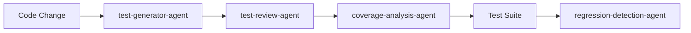

# AI Agent Configuration for Testing

This document defines the AI agents used in the comprehensive test plan for @specs/testing/comprehensive-test-plan/spec.md

> Created: 2025-08-19
> Version: 1.0.0

## Available Test Agents

### Core Testing Agents

#### test-generator-agent
**Purpose**: Generate comprehensive unit tests from code and specifications
**Capabilities**:
- Analyze function signatures and logic
- Create test cases for edge cases
- Generate parameterized tests
- Include proper assertions and mocks

**Usage**:
```bash
/ai-agent use test-generator-agent --file "src/modules/bsee/analysis.py"
```

**Prompt Template**:
```yaml
system: You are an expert test engineer specializing in Python pytest framework.
task: Generate comprehensive unit tests for the following function
context:
  - Use pytest framework
  - Include edge cases and error conditions
  - Add proper mocks for external dependencies
  - Follow AAA pattern (Arrange, Act, Assert)
  - Include docstrings and type hints
code: |
  {function_code}
output_format: Python pytest code with proper imports
```

#### integration-test-agent
**Purpose**: Create end-to-end integration test scenarios
**Capabilities**:
- Design test workflows spanning multiple modules
- Create realistic test data
- Validate data flow between components
- Test error propagation

**Usage**:
```bash
/ai-agent use integration-test-agent --workflow "data-pipeline"
```

#### performance-analysis-agent
**Purpose**: Analyze performance benchmarks and detect regressions
**Capabilities**:
- Compare benchmark results with baselines
- Identify performance bottlenecks
- Suggest optimization strategies
- Generate performance reports

**Usage**:
```bash
/ai-agent use performance-analysis-agent --benchmark-file "benchmarks.json"
```

### Specialized Testing Agents

#### coverage-analysis-agent
**Purpose**: Identify coverage gaps and suggest test improvements
**Capabilities**:
- Analyze coverage reports
- Identify untested code paths
- Prioritize critical gaps
- Suggest specific test cases

**Configuration**:
```python
class CoverageAnalysisAgent:
    def __init__(self):
        self.min_coverage = 90
        self.critical_modules = ['financial_analysis', 'data_processing']
        
    def analyze_coverage(self, coverage_report):
        gaps = self.identify_gaps(coverage_report)
        priorities = self.prioritize_gaps(gaps)
        suggestions = self.generate_suggestions(priorities)
        return suggestions
```

#### data-validation-agent
**Purpose**: Generate data quality and validation tests
**Capabilities**:
- Create schema validation tests
- Generate data range checks
- Test data transformations
- Validate output formats

**Prompt Template**:
```yaml
system: You are a data quality expert specializing in energy data validation.
task: Generate comprehensive data validation tests
data_schema: |
  {schema_definition}
validation_rules:
  - Check required fields
  - Validate data types
  - Test value ranges
  - Verify referential integrity
output_format: pytest test cases with pydantic models
```

#### regression-detection-agent
**Purpose**: Detect and analyze test regressions
**Capabilities**:
- Compare test results across commits
- Identify new failures
- Analyze performance degradation
- Generate regression reports

**Configuration**:
```yaml
regression_thresholds:
  performance: 10%  # Flag if > 10% slower
  memory: 20%       # Flag if > 20% more memory
  failure_rate: 0   # Flag any new failures
```

### Quality Assurance Agents

#### test-review-agent
**Purpose**: Review and validate AI-generated tests
**Capabilities**:
- Check test code quality
- Validate test logic
- Ensure proper assertions
- Verify test independence

**Review Criteria**:
```python
review_checklist = {
    "has_docstring": True,
    "uses_proper_assertions": True,
    "includes_edge_cases": True,
    "follows_naming_convention": True,
    "has_cleanup": True,
    "is_deterministic": True
}
```

#### test-optimization-agent
**Purpose**: Optimize test execution and reduce runtime
**Capabilities**:
- Identify slow tests
- Suggest parallelization strategies
- Optimize fixture usage
- Reduce test redundancy

**Optimization Strategies**:
```yaml
strategies:
  - parallel_execution:
      workers: auto
      scope: module
  - fixture_optimization:
      scope: session
      cache: true
  - mock_external_calls:
      apis: true
      databases: true
  - test_grouping:
      by: markers
      priority: critical
```

## Agent Orchestration

### Test Generation Pipeline


### Agent Coordination Configuration
```python
class TestAgentOrchestrator:
    """Coordinates multiple AI agents for comprehensive testing."""
    
    def __init__(self):
        self.agents = {
            'generator': TestGeneratorAgent(),
            'reviewer': TestReviewAgent(),
            'coverage': CoverageAnalysisAgent(),
            'performance': PerformanceAnalysisAgent(),
            'regression': RegressionDetectionAgent()
        }
        
    def generate_test_suite(self, module_path: str):
        """Orchestrate test generation for a module."""
        # 1. Generate tests
        tests = self.agents['generator'].create_tests(module_path)
        
        # 2. Review generated tests
        validated_tests = self.agents['reviewer'].validate(tests)
        
        # 3. Analyze coverage
        coverage_gaps = self.agents['coverage'].analyze(validated_tests)
        
        # 4. Generate additional tests for gaps
        gap_tests = self.agents['generator'].fill_gaps(coverage_gaps)
        
        return validated_tests + gap_tests
```

## Integration with /ai-agent Command

### Command Extensions
```bash
# List all testing agents
/ai-agent list --category testing

# Get recommendations for current context
/ai-agent recommend --context "unit testing BSEE module"

# Use specific agent with parameters
/ai-agent use test-generator-agent --module bsee --coverage-target 95

# Chain multiple agents
/ai-agent chain test-generator-agent,test-review-agent --module financial

# Analyze test results
/ai-agent analyze --test-results "./test-results.xml"
```

### Agent Response Format
```json
{
  "agent": "test-generator-agent",
  "status": "success",
  "generated_tests": 15,
  "coverage_improvement": "+12%",
  "files_created": [
    "tests/unit/test_npv_calculation.py",
    "tests/unit/test_data_validation.py"
  ],
  "recommendations": [
    "Add integration tests for data pipeline",
    "Include performance benchmarks for large datasets"
  ]
}
```

## Agent Learning and Improvement

### Feedback Loop
```yaml
feedback_system:
  collect:
    - test_execution_results
    - coverage_metrics
    - performance_benchmarks
    - developer_reviews
  
  analyze:
    - success_rate
    - false_positive_rate
    - generation_time
    - code_quality_score
  
  improve:
    - update_prompts
    - refine_patterns
    - adjust_thresholds
    - enhance_validation
```

### Continuous Learning
```python
class AgentLearningSystem:
    """Continuous improvement for test agents."""
    
    def learn_from_results(self, test_results):
        """Learn from test execution results."""
        patterns = self.extract_patterns(test_results)
        self.update_knowledge_base(patterns)
        self.refine_generation_strategy()
        
    def update_prompts(self, feedback):
        """Update agent prompts based on feedback."""
        successful_patterns = self.identify_success_patterns(feedback)
        self.incorporate_patterns_into_prompts(successful_patterns)
```

## Best Practices

### Agent Usage Guidelines
1. **Start with test-generator-agent** for initial test creation
2. **Always use test-review-agent** to validate AI-generated tests
3. **Run coverage-analysis-agent** after each test suite update
4. **Use performance-analysis-agent** before releases
5. **Deploy regression-detection-agent** in CI/CD pipeline

### Quality Assurance
- Review all AI-generated tests before committing
- Maintain human-written tests for critical paths
- Use agents to augment, not replace, human judgment
- Regular calibration of agent thresholds
- Document agent-generated test rationale

### Performance Optimization
- Cache agent responses for similar inputs
- Batch requests to reduce API calls
- Use lightweight agents for quick feedback
- Reserve complex agents for comprehensive analysis
- Implement agent response timeouts

## Monitoring and Metrics

### Agent Performance Metrics
```yaml
metrics:
  test_generation:
    success_rate: 85%
    average_time: 30s
    tests_per_module: 15
  
  coverage_analysis:
    accuracy: 95%
    gap_detection_rate: 90%
    false_positive_rate: < 5%
  
  regression_detection:
    detection_rate: 99%
    analysis_time: < 60s
    actionable_insights: 80%
```

### Dashboard Integration
```python
class AgentMetricsDashboard:
    """Track AI agent performance metrics."""
    
    def track_metrics(self):
        return {
            "total_tests_generated": 1250,
            "coverage_improvement": "+15%",
            "regressions_detected": 3,
            "performance_issues_found": 7,
            "agent_efficiency": "92%"
        }
```