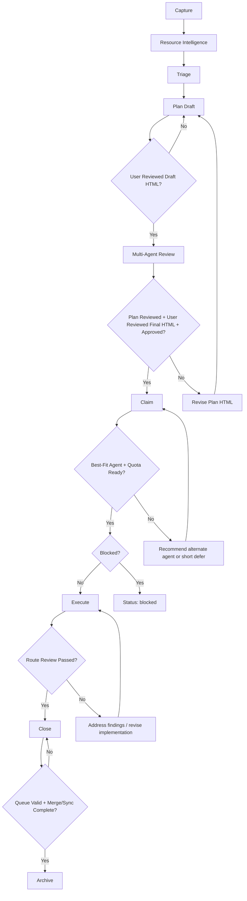

# WRK-624 Canonical Workflow Hardening

> **Module**: work-queue | **Status**: draft | **Priority**: high
> **Created**: 2026-02-27 | **Target**: 2026-03-06

## Executive Summary

This plan converts the work-queue process from a loose set of scripts and conventions into a canonical lifecycle contract. The contract starts with WRK-624 and then rolls forward to all new or touched WRKs, while older backlog items are normalized in phases instead of through a disruptive one-shot migration.

The new model adds a mandatory `Resource Intelligence` stage, standardized review evidence, an explicit orchestrator field, example- and variation-based quality validation, active session binding, and a strict close/archive gate. It also treats work items as learning units: each WRK must produce real examples, variation tests, review evidence, future-work capture, direct ecosystem learnings where appropriate, and compatibility with both fast session-memory capture and deeper scheduled learning synthesis.

## Canonical Lifecycle

## Stage Contract

### 1. Capture
- Create WRK in `.claude/work-queue/pending/`.
- Record basic problem statement, acceptance criteria, and repo scope.
- Assign `orchestrator`, `provider`, `provider_alt`, and initial route.

### 2. Resource Intelligence
- Mandatory for every WRK before planning is final.
- Create modular artifact set in `assets/WRK-<id>/`:
  - `resource-pack.md`
  - `sources.md`
  - `constraints.md`
  - `domain-notes.md`
  - `open-questions.md`
  - `resources.yaml`
- Required sections across the pack:
  - Problem Context
  - Relevant Documents/Data
  - Constraints
  - Assumptions
  - Open Questions
  - Domain Notes
  - Source Paths
- Legal scan must pass for all generated artifacts.
- Document-intelligence indexing is allowed and preferred when useful.

### 3. Triage
Minimum triage contract:
- `priority`
- `complexity`
- `route`
- `blocked_by`
- `computer`
- `provider`
- `provider_alt`
- `resource_needs`
- `orchestrator`

Field definitions:
- `computer`: the execution host or named workstation expected to own the primary work, using the workspace workstation registry naming (for example `ace-linux-1`). This is not a generic hardware class field.

### 4. Plan
- Route A/B plans may remain inline in the WRK body.
- Route C plans live under `specs/wrk/WRK-<id>/`.
- Planning must produce a WRK HTML review artifact that the user can inspect before execution approval is considered complete.
- Every plan HTML must place an `Executive Summary` section near the top for quick user review of scope, intent, and major gates.
- The user must review the draft WRK HTML artifact before the multi-agent review starts.
- `plan_reviewed` passes only when review evidence exists and no unresolved `MAJOR` findings remain.
- `plan_html_reviewed_draft` passes only when the user has reviewed the draft WRK HTML artifact before multi-agent review.
- `plan_html_reviewed_final` passes only when the user has reviewed the post-review WRK HTML artifact for the current plan revision.
- `plan_approved` requires explicit user approval of the current plan revision.

### 5. Claim
- Only unblocked items may move to `working/`.
- One live orchestrator session owns transitions to `working`, `done`, and `archived`.
- Subagents may execute under that session but may not independently close or archive the WRK.
- Claim must include an agent-capability check against the current task shape, domain, and review needs.
- Claim must check current AI weekly usage and available quota before execution starts.
- Claim should leverage the existing `agent-usage-optimizer` skill and the existing readiness/session-planner logic rather than inventing a separate routing stack.
- The primary quota source is `config/ai-tools/agent-quota-latest.json`, refreshed by `scripts/ai/assessment/query-quota.sh` and used by readiness hooks.
- Short waits are acceptable when they keep the best-fit agent in play; the workflow can tolerate a wait of up to 24 hours.
- Week-scale waits are not acceptable for claim readiness; any expected delay greater than 24 hours should trigger a recommendation for a better-available agent instead of stalling execution.
- If the preferred agent is near quota exhaustion or likely to hard-stop during execution or required review, claim should recommend a better-available agent or defer execution only within the short-wait tolerance.
- If another AI agent appears materially better suited to execute the WRK, the claim record should note that recommendation before execution proceeds.
- The orchestrator may still retain session ownership while reassigning primary execution to a better-fit agent.
- Claim evidence should be written in structured form so validators and future automation can read it.

### 6. Execute
- Perform implementation under the claimed session.
- Every WRK must define `5-10` real examples.
- Every WRK must include variation tests covering realistic problem variants.
- Every WRK must generate an HTML review artifact for user review before close.
- Where the WRK includes domain workflow calculations or analysis outputs, the HTML artifact must include those results in a reviewable form.

### 7. Close
Close requires evidence for:
- implementation commit(s)
- tests/checks run and result
- review artifact paths
- changed files
- follow-up WRKs
- queue-state validation result
- merge/sync readiness and status
- HTML review artifact path
- HTML output verification
- learning outputs propagated directly where small and as follow-up WRKs where broader

### 8. Archive
- `archive/` may contain only `status: archived`.
- Archive is blocked until merge-to-main and sync flow are complete.
- `done/` remains the holding area for completed but not yet archived items.

## Review Matrix

| Route | Review Level | Required Reviewers | Required Artifacts | Escalation |
|---|---|---|---|---|
| A | lightweight | 1 | `review-primary.md` | auto-escalate to 3-model review on defined risk signals |
| B | standard | Claude x2, Codex x2, Gemini x2 | per-seed reviewer artifacts + `review-synthesis.md` | n/a |
| C | full | Claude x3, Codex x3, Gemini x3 per plan, phase, and final close | per-seed reviewer artifacts + per-phase synthesis | n/a |

### Seed depth policy
- Provider diversity and seed depth are separate requirements.
- Provider diversity answers: which model families must review the item.
- Seed depth answers: how many independent runs are required per provider.
- Default seed depth:
  - Route A: 1 seed total
  - Route B: 2 seeds per provider
  - Route C: 3 seeds per provider
- Workflow, governance, legal, compliance, and agent-behavior items use the Route C seed depth by default even when they are being reviewed as documents rather than code changes.

### Route A lightweight review acceptance criteria
1. Reviewer artifact exists.
2. Verdict is `APPROVE` or `MINOR`.
3. Acceptance criteria were explicitly checked.
4. Relevant tests/checks were run and recorded.
5. No unresolved `MAJOR` finding remains.
6. Close evidence exists before move to `done`.

### Route B/C review rules
- Claude, Codex, and Gemini are all required.
- Route B requires 2 independent seeds from each provider.
- Route C requires 3 independent seeds from each provider for plan, per-phase, and final-close review.
- Gemini runs in deepest-thinking mode.
- `review-synthesis.md` is mandatory.
- All reviewer artifacts across all seeds must use the same interpretable review format so other agents and validators can consume them without provider-specific parsing.
- Per-provider seed results should be synthesized before final cross-provider synthesis when more than one seed is required.
- Claude review transport uses the patched temp-file `Read` path in `submit-to-claude.sh`.
- Claude review input may use either:
  - full bundle: default for all relevant substantive reviews
  - compact bundle: explicit fallback when full bundle is not the right operational choice
- Default Claude mode for all relevant reviews is full bundle, including:
  - Route B and Route C plan reviews
  - workflow, governance, legal, compliance, and agent-behavior reviews
  - final substantive reviews where complete context matters
- Default bounded wait for Claude review runs is 5 minutes (`300s`) before classifying the run as failed, timed out, or fallback-worthy.
- Compact bundle remains the fallback only when:
  - the user explicitly wants faster turnaround
  - a preliminary screening pass is sufficient and is clearly treated as non-final
  - repeated full-bundle retries are not operationally justified
- If compact mode is used and Claude flags missing context or truncation, rerun Claude on the full bundle before treating the review as final.
- Minimum required sections for every review artifact:
  - `Verdict`
  - `Summary`
  - `Issues Found`
  - `Suggestions`
  - `Questions for Author`
- Any unresolved `MAJOR` blocks progression unless explicitly waived by the user.
- Fallback consensus is allowed only for tool failure or `NO_OUTPUT`, not substantive disagreement.
- `INVALID_OUTPUT` is treated as a blocking reviewer failure state; it does not satisfy the review gate and requires a rerun, alternate mode, or explicit user waiver.

## Evidence and Metadata Contract

### New required WRK metadata
- `orchestrator:`
- `resource_needs:`
- `resource_pack_ref:`
- `plan_html_review_draft_ref:`
- `plan_html_review_final_ref:`
- `claim_routing_ref:`
- `claim_quota_snapshot_ref:`
- `claim_recommendation:`
- `example_pack_ref:`
- `variation_test_ref:`
- `learning_outputs:`
- `followup:`
- `html_output_ref:`
- `html_verification_ref:`

### Standard verdict set
- `APPROVE`
- `MINOR`
- `MAJOR`
- `NO_OUTPUT`
- `INVALID_OUTPUT`
- `ERROR`

Handling rules:
- `NO_OUTPUT`: reviewer transport failure or empty result; rerun or fallback policy may apply.
- `INVALID_OUTPUT`: reviewer returned unusable output that failed schema/structure validation; rerun or alternate mode is required before the review gate can pass.
- `ERROR`: invocation failure before a usable review artifact exists.

## Claude Review Input Policy
- Claude now supports two validated review input modes through the patched wrapper.

| Mode | Transport | Review quality | Latency | Recommended use |
|---|---|---|---|---|
| Full bundle | temp-file `Read` path via `submit-to-claude.sh` | highest | slower | default for all relevant substantive reviews |
| Compact bundle | temp-file `Read` path + `--compact-plan` | medium | faster | explicit fallback for non-final screening or user-requested faster turnaround |

Rules:
- Use full bundle by default for all relevant Claude reviews.
- Prefer full bundle for canonical workflow, governance, legal, compliance, or agent-behavior changes.
- Use a default `300s` timeout for Claude review runs unless a review explicitly justifies a different bound.
- Use compact bundle only as a fallback for fast intermediate review when the user explicitly wants speed over full-context analysis or when a non-final screening pass is sufficient.
- A compact-bundle Claude review that complains about missing or truncated context should be treated as a prompt to rerun in full-bundle mode, not as the final review state.
- Workflow tooling should preserve both paths because they solve different operational needs.

## Example and Test Policy
- Every WRK must include `5-10` real examples, even when the task appears small.
- Examples must reflect realistic domain or process variations, not only synthetic happy-path cases.
- Variation tests exist to validate quality now and to compound into future benchmark coverage.

## Requirement Class Model
- The workflow obligations are universal across all WRKs, but the depth and artifact richness scale by route and risk.
- No WRK is exempt from: resource intelligence, HTML review, user HTML review gates, review evidence, examples, variation testing intent, learning capture, and closure evidence.
- Route A satisfies the universal obligations with lightweight artifacts sized to the work item.
- Route B requires standard artifact depth and 3-model review.
- Route C requires full artifact depth, per-phase review, and the strongest validation set.
- Exploratory, diagnostic, retry, and synthesis sub-steps may remain inside one approved parent WRK when they are all in service of the same immediate objective.

| Requirement | Route A | Route B | Route C |
|---|---|---|---|
| Resource pack | concise but complete | standard | full |
| Examples | 5-10 small real examples | 5-10 representative examples | 5-10 representative examples with phase-level traceability |
| Variation tests | lightweight | standard | full/per-phase |
| Plan HTML reviews | draft + final | draft + final | draft + final |
| Reviewers | 1 seed by default, escalate on risk | 2 seeds/provider | 3 seeds/provider per plan/phase/close |
| HTML artifact | required | required | required |
| Learning outputs | required | required | required |

Defined Route A risk signals:
- workflow, governance, queue, hooks, CI, or agent-routing changes
- file moves, renames, or deletions
- legal, compliance, security, or permission-sensitive changes
- missing or inconclusive tests/checks
- reviewer uncertainty, `MAJOR`, `NO_OUTPUT`, or `INVALID_OUTPUT`
- cross-repo impact or external dependency changes

## Exploration Chain Policy
- A single approved parent WRK may contain a bounded chain of:
  - experiments
  - retries
  - transport diagnostics
  - review-mode comparisons
  - synthesis and interpretation
- These sub-steps should stay inside the parent WRK when:
  - they serve the same immediate objective
  - they are expected to be completed in the same active work stream
  - they do not introduce a new deliverable that stands on its own backlog value
  - ownership and approval scope do not materially change
- Create a new WRK only when one of these is true:
  - the work becomes a separate deliverable or reusable backlog item
  - the work is likely to be deferred independently
  - ownership changes
  - user approval needs to be narrowed to a materially different scope
  - the branch of work would be understandable and valuable on its own in the queue
- When new incoming work could reasonably be handled either by updating an existing active WRK or by creating a new WRK, the user should be given that choice explicitly.
- In that choice:
  - prefer updating the existing WRK when the objective, deliverable, and approval scope are still materially the same
  - prefer creating a new WRK when the branch of work has independent backlog value or should be reviewed/approved separately
- The decision must preserve traceability:
  - no acceptance criteria, review evidence, findings, or learnings may be discarded
  - if work is absorbed into an existing WRK, the new scope and history should be appended there
  - if work is split into a new WRK, the parent and child items should cross-reference each other
- For exploratory chains, prefer:
  - one parent WRK
  - explicit sub-step logging inside the WRK body or assets
  - one final synthesis artifact
- The queue should optimize for auditability without forcing one new WRK per experiment.

## Learning Loop Policy
- Small learnings must update the relevant repo ecosystem directly.
- Broader learnings must be captured as new WRKs.
- Both paths may be required for the same WRK.
- Auto-memory is the fast path: opportunistic session-time capture during agent work, intended to write useful notes into memory in near real time.
- Comprehensive-learning is the deep path: scheduled, multi-agent, cross-machine synthesis that mines session outputs and writes back richer learnings on a slower cadence.
- Both paths are complementary, not duplicates, and should write into a compatible memory and learning surface.
- Engineering and ecosystem learnings should remain compatible with native agent-learning workflows, including comprehensive-learning automation and future memory pipeline extensions.

### Comprehensive-learning contract
- Owner: comprehensive-learning automation on the designated scheduled-learning host.
- Trigger: scheduled synthesis runs and explicitly requested deep-learning passes for significant WRKs.
- Minimum artifact set:
  - `learning-summary.md`
  - `learning-actions.md`
  - `learning-metadata.yaml`
- Minimum required metadata fields:
  - `wrk_id`
  - `source_artifacts`
  - `run_timestamp`
  - `owner`
  - `derived_learnings`
  - `followup_candidates`
  - `propagated_to`
- Verification contract:
  - close may rely on direct propagation evidence for small learnings
  - archive must confirm either direct propagation evidence or a comprehensive-learning handoff artifact
  - when deep-learning handoff is required for the WRK, missing metadata or missing handoff evidence fails the archive gate

## HTML Review Policy
- Every WRK must produce an HTML review artifact for easy user review.
- The HTML artifact is part of the standard close evidence, not an optional add-on.
- The current plan revision must also expose a WRK HTML artifact for user review during the planning stage.
- Every plan-stage HTML artifact must begin with an executive summary section for quick review before deeper details.
- The user must review the draft plan HTML before multi-agent review begins.
- The user must review the updated final plan HTML after multi-agent review and before execution approval.
- Execution may not proceed until both planning-stage HTML reviews have occurred for the current plan revision.
- User-review gate SLA:
  - under 48 hours pending: remain gated in place
  - 48 hours or more pending: record one of `user_deferred`, named delegate review, or rollback to the prior actionable stage
- Delegation rule:
  - delegate review is allowed only when the delegate is explicitly designated in WRK metadata or the review artifact
  - delegated review evidence must name the delegate and timestamp
- For domain workflows and calculations, the HTML artifact must include the relevant outputs, checks, and review context in a form the user can inspect directly.
- The agent must verify the HTML output.
- The user must review the HTML output before closure.
- Close is blocked until HTML verification passes.

## Status Model
Allowed statuses only:
- `pending`
- `working`
- `done`
- `archived`
- `blocked`
- `failed`

Rules:
- `done/` contains only `status: done`
- `archive/` contains only `status: archived`
- Legacy values (`complete`, `completed`, `closed`) are migrated in Phase 1 and hard-fail after cutoff.

## Validation Rules
Validator blocks on any mismatch and still regenerates the index for visibility.

Checks include:
- folder/status mismatch
- invalid status values
- missing required artifacts
- missing review artifacts
- missing planning-stage HTML review evidence
- missing draft-plan HTML review evidence before multi-agent review
- missing final-plan HTML review evidence before execution
- missing claim routing/quota evidence
- blocked items claimed to `working`
- `done/` items not marked `done`
- `archive/` items not marked `archived`
- missing active session binding on lifecycle transitions

## Dependency Contract

| Dependency | Source of truth | Owner / producer | Blocking? | Fallback |
|---|---|---|---|---|
| Quota snapshot | `config/ai-tools/agent-quota-latest.json` | `scripts/ai/assessment/query-quota.sh` via readiness/cron | blocking for claim routing | short defer or alternate agent; stale snapshot is advisory only if age is within accepted threshold |
| Claim routing recommendation | `agent-usage-optimizer` output + claim metadata | orchestrator session | blocking for claim | manual orchestrator decision recorded in `claim_recommendation` |
| Workstation registry | workspace workstation registry | workstation registry owner / workstation tooling | blocking for `computer` field validation | manual remediation with explicitly recorded host alias |
| Document-intelligence indexing | document-intelligence artifact or job status | document-intelligence pipeline | advisory by default, blocking only when the WRK explicitly requires indexed artifacts before close/archive | defer indexing with recorded follow-up or explicit waiver |
| Comprehensive-learning handoff | comprehensive-learning handoff artifact | comprehensive-learning automation | blocking for archive when the WRK requires deep-learning handoff | direct propagation evidence or explicit deferred follow-up WRK |
| Session ownership | active orchestrator session state | orchestrator session wrappers | blocking for claim/close/archive | admin repair path recorded as manual remediation |
| Legal scan | legal scan artifact/result | legal-scan workflow | blocking for generated WRK artifacts | manual waiver by user only if explicitly recorded |
| Queue validation | queue validator output | queue validator script | blocking for close/archive | none |
| Review evidence | review artifact files | reviewer scripts + synthesis | blocking for plan/execute progression | fallback only for `NO_OUTPUT` per review policy |
| Merge status | main-branch merge state | git workflow | blocking for archive | none |
| Sync status | sync workflow status | repo sync tooling | blocking for archive | none |
| HTML verification | html verification artifact | agent + user review | blocking for plan/close | none |

Rules:
- When two sources disagree, the explicit source-of-truth artifact above wins.
- Freshness matters: stale advisory data may inform routing, but stale blocking data cannot satisfy a gate.
- Manual overrides require user-visible evidence in the WRK metadata or review artifacts.
- Review artifacts that do not conform to the shared interpretable schema are classified as `INVALID_OUTPUT` and do not satisfy the review gate.

### Script location policy
- Queue operation scripts live under `scripts/work-queue/`.
- Queue index and queue-local helper scripts live under `.claude/work-queue/scripts/`.
- In this workflow:
  - use `scripts/work-queue/close-item.sh` and `scripts/work-queue/validate-queue-state.sh` for lifecycle operations
  - use `.claude/work-queue/scripts/generate-index.py` for queue index regeneration
- Documentation should reference the specific script path for the specific responsibility instead of implying a single universal script root.

## Merge and Sync Rules
- Merge-to-main is required before archive.
- Sync flow completion is required before archive.
- Close must record merge/sync status so archive can enforce it deterministically.

## Phased Rollout

### Phase 1: Normalize and report
- start: February 27, 2026
- target completion: March 7, 2026
- owner: workspace-hub orchestrator / WRK-624 execution owner
- migrate legacy statuses
- add reporting validator
- reconcile folder/status drift
- rename malformed WRK filenames
- repair queue/index/session-state inconsistencies
- auto-fix mismatches that are mechanically unambiguous
- emit manual-remediation list for stale, blocked, or ambiguous legacy WRKs
- rollback path: restore queue metadata from git before enabling hard-fail enforcement
- success metrics:
  - zero invalid legacy status values remain
  - zero folder/status mismatches remain in `done/` and `archive/`
  - all ambiguous cases are listed in a manual-remediation report

### Phase 2: Require new artifacts
- start: March 8, 2026
- target completion: March 21, 2026
- require resource packs for all new WRKs and any legacy WRK when touched
- require close evidence and reviewer artifact normalization
- require legal scan on generated artifacts
- require HTML review artifacts for every WRK
- require draft-plan HTML review evidence before multi-agent review
- require final-plan HTML review evidence before execution
- require structured claim routing and quota evidence for every WRK
- rollback path: revert enforcement of newly required artifacts to report-only mode, preserve generated artifacts for audit, and restore prior non-blocking validation while remediation is completed
- success metrics:
  - all new or touched WRKs have resource-pack references and plan HTML review evidence
  - zero WRKs close without HTML verification evidence or structured claim evidence
  - zero generated-artifact legal-scan failures remain unresolved at close time
  - all enforcement exceptions are recorded with explicit user-visible waiver or defer evidence

### Phase 3: Enforce hard gates
- start: March 22, 2026
- hard-fail cutoff for legacy statuses: March 22, 2026
- enforce active session binding
- hard-block invalid transitions
- hard-fail legacy statuses after cutoff
- enforce merge/sync-before-archive
- rollback path: temporarily downgrade hard-fail gates to blocking warnings only via validator/config switch, document the exception window in the WRK, and require a dated remediation plan before re-enabling hard fail
- success metrics:
  - zero lifecycle transitions bypass active session binding without recorded admin remediation
  - zero folder/status mismatches pass validation into archive
  - zero archive transitions occur without merge/sync completion evidence
  - zero hard-fail gate overrides occur without dated remediation evidence

## Testing Strategy
- transition tests:
  - capture -> plan draft -> multi-agent review -> claim -> execute -> close -> archive
- validator tests:
  - folder/status mismatch detection
  - missing artifact detection
  - legacy status migration detection
- idempotency tests:
  - rerun close/archive/validator operations safely
- concurrency tests:
  - conflicting claim attempts
  - stale session ownership recovery
- outage tests:
  - reviewer `NO_OUTPUT`
  - reviewer `INVALID_OUTPUT`
  - quota snapshot unavailable
  - legal/doc-index/html verification tool failure
- user-availability tests:
  - pending user HTML review under 48 hours
  - pending user HTML review over 48 hours with `user_deferred`
  - delegated HTML review with explicit delegate evidence
- migration tests:
  - malformed historical filenames
  - `complete/completed/closed` status migration
  - dormant vs touched legacy WRKs
- HTML gate tests:
  - draft-plan review required before multi-agent review
  - final-plan review required before execution
  - close blocked on missing final HTML verification
- rollback tests:
  - Phase 1 rollback restores a validator-passing queue snapshot
  - Phase 2 rollback restores report-only mode without losing generated evidence
  - Phase 3 rollback downgrades hard-fail enforcement while preserving dated remediation evidence

## Implementation Backlog
1. Expand WRK frontmatter and templates to support orchestrator, examples, learning, and HTML refs.
2. Add claim-routing scaffolding using existing quota and readiness data sources.
3. Add resource-pack scaffolding and validator support.
4. Add close/archive scripts and active session binding checks.
5. Add review artifact scaffolding and synthesis validation.
6. Add backlog normalization and migration tooling.
7. Add merge/sync archive gate integration.
8. Add legal-scan and document-intelligence hooks for WRK artifacts.
9. Add HTML verification and user signoff hooks where applicable.

## Acceptance Criteria
- 3 review artifacts exist for the current plan revision, or fallback policy is explicitly invoked for `NO_OUTPUT`.
- Each review artifact conforms to the shared interpretable schema with the required sections.
- One synthesis artifact records final verdict and unresolved findings count.
- Mermaid renders the planning HTML review gates, claim routing gate, and archive gate.
- WRK metadata schema includes:
  - `plan_html_review_draft_ref`
  - `plan_html_review_final_ref`
  - `claim_routing_ref`
  - `claim_quota_snapshot_ref`
  - `claim_recommendation`
- Migration matrix is documented with:
  - start date
  - target completion
  - hard-fail cutoff
  - rollback path
  - success metrics
- Dependency contract table exists and names the source of truth and blocking behavior for each gate input.
- Testing strategy covers transitions, idempotency, concurrency, outages, migration, and HTML gates.
- HTML review artifact exists for this WRK and includes an executive summary near the top.
