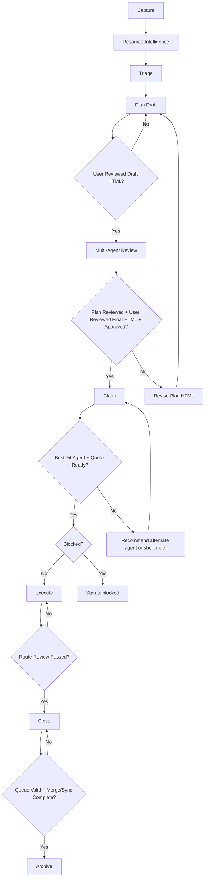

# WRK-624 Canonical Workflow Hardening

> **Module**: work-queue | **Status**: draft | **Priority**: high
> **Created**: 2026-02-27 | **Target**: 2026-03-06

## Executive Summary

This plan converts the work-queue process from a loose set of scripts and conventions into a canonical lifecycle contract. The contract starts with WRK-624 and then rolls forward to all new or touched WRKs, while older backlog items are normalized in phases instead of through a disruptive one-shot migration.

The new model adds a mandatory `Resource Intelligence` stage, standardized review evidence, an explicit orchestrator field, example- and variation-based quality validation, active session binding, and a strict close/archive gate. It also treats work items as learning units: each WRK must produce real examples, variation tests, review evidence, future-work capture, direct ecosystem learnings where appropriate, and compatibility with both fast session-memory capture and deeper scheduled learning synthesis.

## Canonical Lifecycle

## Stage Contract

### 1. Capture
- Create WRK in `.claude/work-queue/pending/`.
- Record basic problem statement, acceptance criteria, and repo scope.
- Assign `orchestrator`, `provider`, `provider_alt`, and initial route.

### 2. Resource Intelligence
- Mandatory for every WRK before planning is final.
- Create modular artifact set in `assets/WRK-<id>/`:
  - `resource-pack.md`
  - `sources.md`
  - `constraints.md`
  - `domain-notes.md`
  - `open-questions.md`
  - `resources.yaml`
- Required sections across the pack:
  - Problem Context
  - Relevant Documents/Data
  - Constraints
  - Assumptions
  - Open Questions
  - Domain Notes
  - Source Paths
- Legal scan must pass for all generated artifacts.
- Document-intelligence indexing is allowed and preferred when useful.

### 3. Triage
Minimum triage contract:
- `priority`
- `complexity`
- `route`
- `blocked_by`
- `computer`
- `provider`
- `provider_alt`
- `resource_needs`
- `orchestrator`

### 4. Plan
- Route A/B plans may remain inline in the WRK body.
- Route C plans live under `specs/wrk/WRK-<id>/`.
- Planning must produce a WRK HTML review artifact that the user can inspect before execution approval is considered complete.
- Every plan HTML must place an `Executive Summary` section near the top for quick user review of scope, intent, and major gates.
- The user must review the draft WRK HTML artifact before the multi-agent review starts.
- `plan_reviewed` passes only when review evidence exists and no unresolved `MAJOR` findings remain.
- `plan_html_reviewed_draft` passes only when the user has reviewed the draft WRK HTML artifact before multi-agent review.
- `plan_html_reviewed_final` passes only when the user has reviewed the post-review WRK HTML artifact for the current plan revision.
- `plan_approved` requires explicit user approval of the current plan revision.

### 5. Claim
- Only unblocked items may move to `working/`.
- One live orchestrator session owns transitions to `working`, `done`, and `archived`.
- Subagents may execute under that session but may not independently close or archive the WRK.
- Claim must include an agent-capability check against the current task shape, domain, and review needs.
- Claim must check current AI weekly usage and available quota before execution starts.
- Claim should leverage the existing `agent-usage-optimizer` skill and the existing readiness/session-planner logic rather than inventing a separate routing stack.
- The primary quota source is `config/ai-tools/agent-quota-latest.json`, refreshed by `scripts/ai/assessment/query-quota.sh` and used by readiness hooks.
- Short waits are acceptable when they keep the best-fit agent in play; the workflow can tolerate a wait on the order of hours.
- Week-scale waits are not acceptable for claim readiness; if the preferred agent would be unavailable for that long, claim should recommend a better-available agent instead of stalling execution.
- If the preferred agent is near quota exhaustion or likely to hard-stop during execution or required review, claim should recommend a better-available agent or defer execution only within the short-wait tolerance.
- If another AI agent appears materially better suited to execute the WRK, the claim record should note that recommendation before execution proceeds.
- The orchestrator may still retain session ownership while reassigning primary execution to a better-fit agent.
- Claim evidence should be written in structured form so validators and future automation can read it.

### 6. Execute
- Perform implementation under the claimed session.
- Every WRK must define `5-10` real examples.
- Every WRK must include variation tests covering realistic problem variants.
- Every WRK must generate an HTML review artifact for user review before close.
- Where the WRK includes domain workflow calculations or analysis outputs, the HTML artifact must include those results in a reviewable form.

### 7. Close
Close requires evidence for:
- implementation commit(s)
- tests/checks run and result
- review artifact paths
- changed files
- follow-up WRKs
- queue-state validation result
- merge/sync readiness and status
- HTML review artifact path
- HTML output verification
- learning outputs propagated directly where small and as follow-up WRKs where broader

### 8. Archive
- `archive/` may contain only `status: archived`.
- Archive is blocked until merge-to-main and sync flow are complete.
- `done/` remains the holding area for completed but not yet archived items.

## Review Matrix

| Route | Review Level | Required Reviewers | Required Artifacts | Escalation |
|---|---|---|---|---|
| A | lightweight | 1 | `review-primary.md` | auto-escalate to 3-model review on risk signals |
| B | standard | 3 | `review-claude.md`, `review-codex.md`, `review-gemini.md`, `review-synthesis.md` | n/a |
| C | full | 3 per plan, phase, and final close | same as Route B per phase | n/a |

### Route A lightweight review acceptance criteria
1. Reviewer artifact exists.
2. Verdict is `APPROVE` or `MINOR`.
3. Acceptance criteria were explicitly checked.
4. Relevant tests/checks were run and recorded.
5. No unresolved `MAJOR` finding remains.
6. Close evidence exists before move to `done`.

### Route B/C review rules
- Claude, Codex, and Gemini are all required.
- Gemini runs in deepest-thinking mode.
- `review-synthesis.md` is mandatory.
- Any unresolved `MAJOR` blocks progression unless explicitly waived by the user.
- Fallback consensus is allowed only for tool failure or `NO_OUTPUT`, not substantive disagreement.

## Evidence and Metadata Contract

### New required WRK metadata
- `orchestrator:`
- `resource_needs:`
- `resource_pack_ref:`
- `plan_html_review_draft_ref:`
- `plan_html_review_final_ref:`
- `claim_routing_ref:`
- `claim_quota_snapshot_ref:`
- `claim_recommendation:`
- `example_pack_ref:`
- `variation_test_ref:`
- `learning_outputs:`
- `followup:`
- `html_output_ref:`
- `html_verification_ref:`

### Standard verdict set
- `APPROVE`
- `MINOR`
- `MAJOR`
- `NO_OUTPUT`
- `ERROR`

## Example and Test Policy
- Every WRK must include `5-10` real examples, even when the task appears small.
- Examples must reflect realistic domain or process variations, not only synthetic happy-path cases.
- Variation tests exist to validate quality now and to compound into future benchmark coverage.

## Learning Loop Policy
- Small learnings must update the relevant repo ecosystem directly.
- Broader learnings must be captured as new WRKs.
- Both paths may be required for the same WRK.
- Auto-memory is the fast path: opportunistic session-time capture during agent work, intended to write useful notes into memory in near real time.
- Comprehensive-learning is the deep path: scheduled, multi-agent, cross-machine synthesis that mines session outputs and writes back richer learnings on a slower cadence.
- Both paths are complementary, not duplicates, and should write into a compatible memory and learning surface.
- Engineering and ecosystem learnings should remain compatible with native agent-learning workflows, including comprehensive-learning automation and future memory pipeline extensions.

## HTML Review Policy
- Every WRK must produce an HTML review artifact for easy user review.
- The HTML artifact is part of the standard close evidence, not an optional add-on.
- The current plan revision must also expose a WRK HTML artifact for user review during the planning stage.
- Every plan-stage HTML artifact must begin with an executive summary section for quick review before deeper details.
- The user must review the draft plan HTML before multi-agent review begins.
- The user must review the updated final plan HTML after multi-agent review and before execution approval.
- Execution may not proceed until both planning-stage HTML reviews have occurred for the current plan revision.
- For domain workflows and calculations, the HTML artifact must include the relevant outputs, checks, and review context in a form the user can inspect directly.
- The agent must verify the HTML output.
- The user must review the HTML output before closure.
- Close is blocked until HTML verification passes.

## Status Model
Allowed statuses only:
- `pending`
- `working`
- `done`
- `archived`
- `blocked`
- `failed`

Rules:
- `done/` contains only `status: done`
- `archive/` contains only `status: archived`
- Legacy values (`complete`, `completed`, `closed`) are migrated in Phase 1 and hard-fail after cutoff.

## Validation Rules
Validator blocks on any mismatch and still regenerates the index for visibility.

Checks include:
- folder/status mismatch
- invalid status values
- missing required artifacts
- missing review artifacts
- missing planning-stage HTML review evidence
- missing draft-plan HTML review evidence before multi-agent review
- missing final-plan HTML review evidence before execution
- missing claim routing/quota evidence
- blocked items claimed to `working`
- `done/` items not marked `done`
- `archive/` items not marked `archived`
- missing active session binding on lifecycle transitions

## Merge and Sync Rules
- Merge-to-main is required before archive.
- Sync flow completion is required before archive.
- Close must record merge/sync status so archive can enforce it deterministically.

## Phased Rollout

### Phase 1: Normalize and report
- migrate legacy statuses
- add reporting validator
- reconcile folder/status drift
- rename malformed WRK filenames
- repair queue/index/session-state inconsistencies

### Phase 2: Require new artifacts
- require resource packs for all new WRKs and any legacy WRK when touched
- require close evidence and reviewer artifact normalization
- require legal scan on generated artifacts
- require HTML review artifacts for every WRK
- require draft-plan HTML review evidence before multi-agent review
- require final-plan HTML review evidence before execution
- require structured claim routing and quota evidence for every WRK

### Phase 3: Enforce hard gates
- enforce active session binding
- hard-block invalid transitions
- hard-fail legacy statuses after cutoff
- enforce merge/sync-before-archive

## Implementation Backlog
1. Expand WRK frontmatter and templates to support orchestrator, examples, learning, and HTML refs.
2. Add claim-routing scaffolding using existing quota and readiness data sources.
3. Add resource-pack scaffolding and validator support.
4. Add close/archive scripts and active session binding checks.
5. Add review artifact scaffolding and synthesis validation.
6. Add backlog normalization and migration tooling.
7. Add merge/sync archive gate integration.
8. Add legal-scan and document-intelligence hooks for WRK artifacts.
9. Add HTML verification and user signoff hooks where applicable.

## Acceptance Criteria
- Canonical workflow spec approved via 3-seed review.
- Mermaid schematic clearly communicates the main happy path and blocking paths.
- WRK-624 becomes the first WRK operated under the new lifecycle contract.
- New/touched WRKs can carry orchestrator, resource pack, example pack, learning outputs, and HTML refs.
- Review matrix is enforceable for Routes A/B/C.
- Migration plan and phased rollout are documented.
- HTML review artifact exists for user review of this work item.
